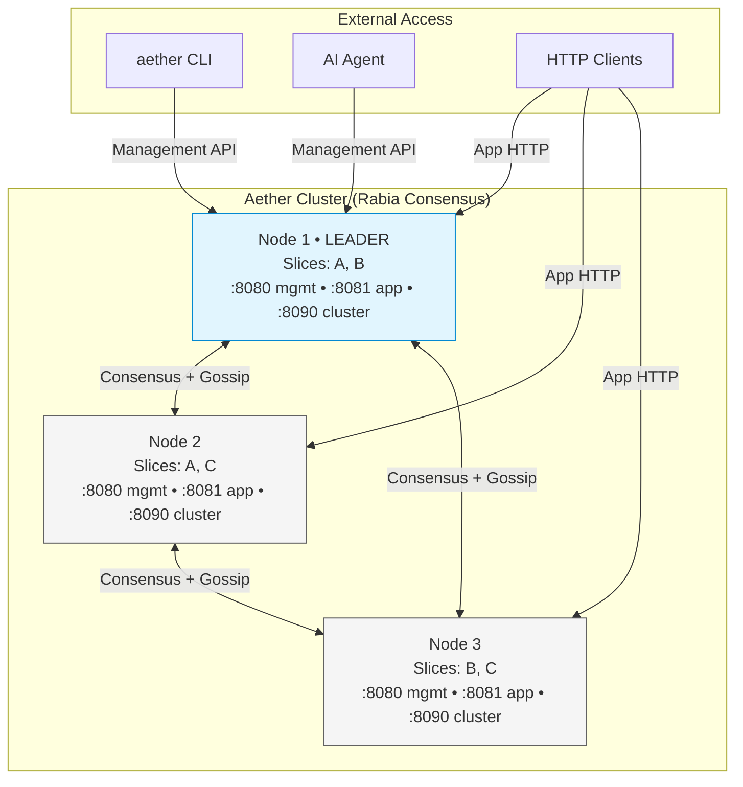
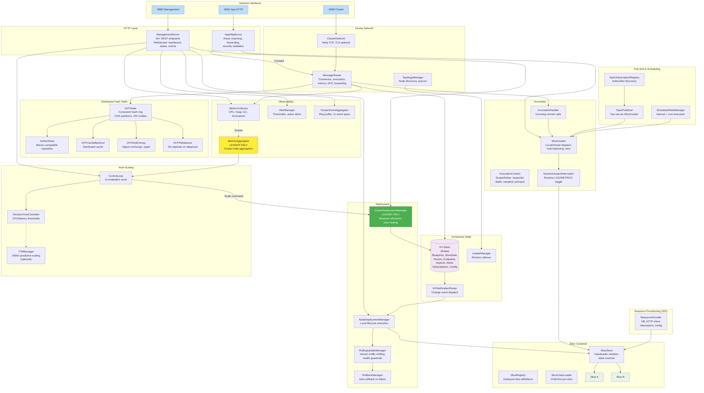
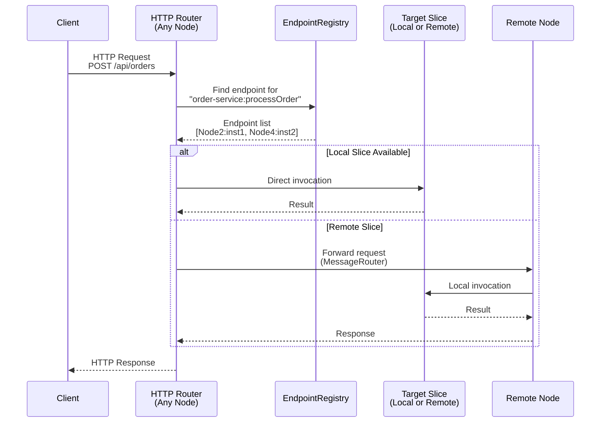
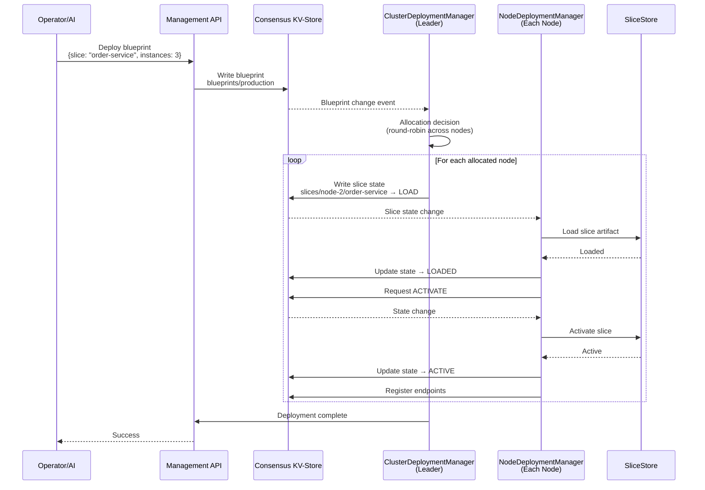
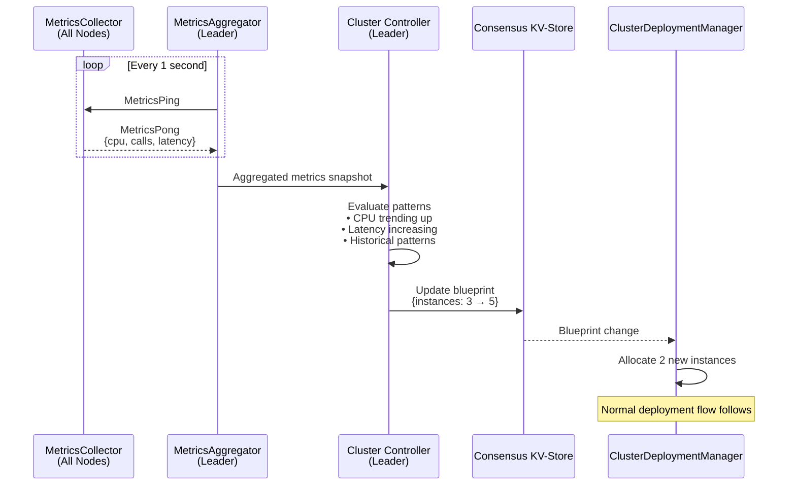
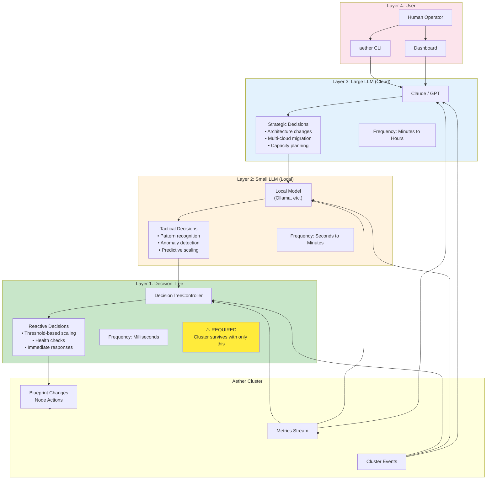
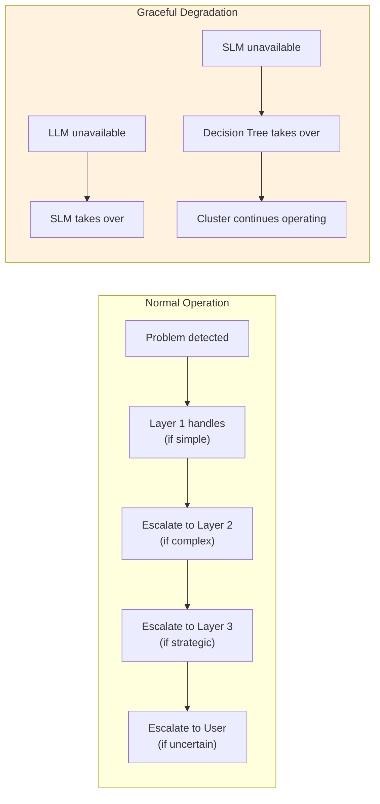
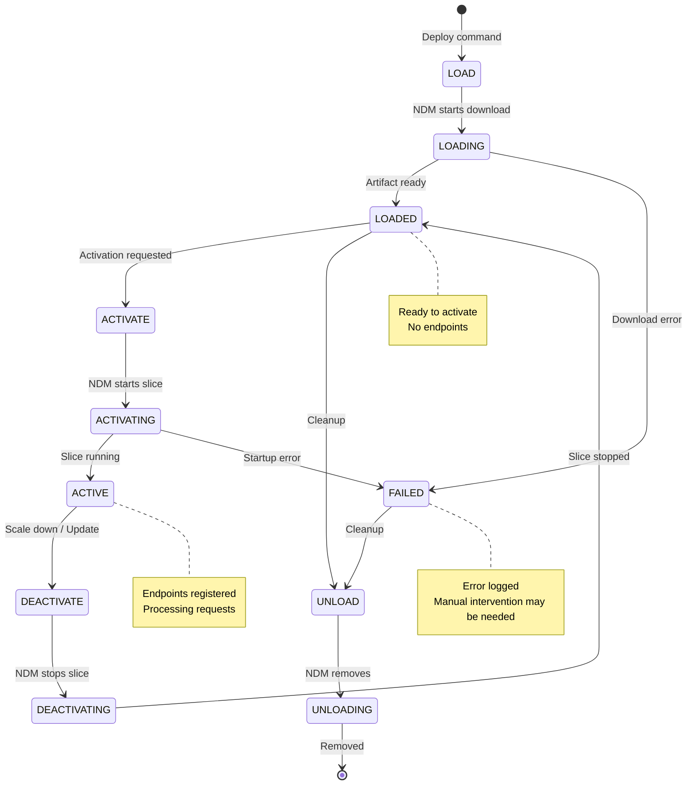

# Aether Architecture Diagrams

Visual diagrams for understanding Aether's distributed runtime architecture.

---

## 1. Cluster Topology

**Key points:**
- Every node runs the same components; **leader** additionally activates ClusterDeploymentManager, MetricsAggregator, and ControlLoop
- Consensus (Rabia) replicates KV-Store state across all nodes
- Metrics flow via gossip (push-based, 1s interval) -- zero consensus I/O
- Any node can receive HTTP traffic; requests are routed or forwarded to the node hosting the target slice
- Leader re-election is instant on departure

---

## 2. Node Components

**Component categories:**

| Category | Leader-only | Every node |
|----------|------------|------------|
| **Deployment** | ClusterDeploymentManager | NodeDeploymentManager, RollingUpdateManager, RollbackManager |
| **Metrics** | MetricsAggregator | MetricsCollector, AlertManager, ClusterEventAggregator |
| **Scaling** | ControlLoop (executes) | ControlLoop (evaluates), DecisionTreeController, TTMManager |
| **State** | -- | KV-Store (Rabia), LeaderManager, KVNotificationRouter |
| **Network** | -- | ClusterNetwork, TopologyManager, MessageRouter |
| **HTTP** | -- | AppHttpServer, ManagementServer |
| **Invocation** | -- | SliceInvoker, InvocationHandler, DynamicAspectInterceptor |
| **Storage** | -- | DHTNode, ArtifactStore, DHTCacheBackend, AntiEntropy, Rebalancer |
| **Messaging** | -- | TopicSubscriptionRegistry, TopicPublisher, ScheduledTaskManager |
| **Container** | -- | SliceStore, SliceRegistry, per-slice ClassLoaders |
| **Resources** | -- | SPI-based: DB, HTTP client, interceptors, config |

**Communication paths:**
- **Consensus** (Rabia via ClusterNetwork) -- KV-Store replication, strong consistency
- **Gossip** (MetricsPing/Pong via MessageRouter) -- metrics collection, no consensus overhead
- **HTTP forwarding** (via MessageRouter) -- cross-node request routing
- **DHT** (via MessageRouter) -- artifact storage and cache, quorum R/W
- **KV notifications** (local, via KVNotificationRouter) -- state change reactions

---

## 2. Request Flow

**Key Points:**
- **Any node** can receive external HTTP requests
- **EndpointRegistry** provides service discovery with load balancing
- **Local preference** - route to local slice if available
- **Transparent remoting** - caller doesn't know if slice is local or remote

---

## 3. Deployment & Scaling Flow

**Scaling Flow (AI-Driven):**

**Key Points:**
- **Blueprint** is the desired state, **KV-Store** is the source of truth
- **ClusterDeploymentManager** (leader) allocates instances to nodes
- **NodeDeploymentManager** (each node) executes local slice lifecycle
- **Metrics flow continuously** without touching consensus
- **Controller evaluates** and can modify blueprints automatically

---

## 4. AI Autonomy Layers

**Escalation & Degradation:**

**Key Points:**
- **Layer 1 is mandatory** - cluster operates with decision tree alone
- **Higher layers are optional** - add intelligence, not dependency
- **Problems escalate up** - simple → complex → strategic → human
- **Decisions flow down** - strategic guidance → tactical execution → immediate action
- **Graceful degradation** - if any layer fails, lower layers continue

---

## 5. Slice Lifecycle State Machine

---

## Rendering These Diagrams

These Mermaid diagrams can be rendered using:

1. **GitHub** - Native Mermaid support in markdown files
2. **Mermaid Live Editor** - https://mermaid.live
3. **VS Code** - Mermaid preview extensions
4. **Export to PNG/SVG** - Via Mermaid CLI or live editor

For the architect call, recommend using Mermaid Live Editor to export high-quality PNGs.
