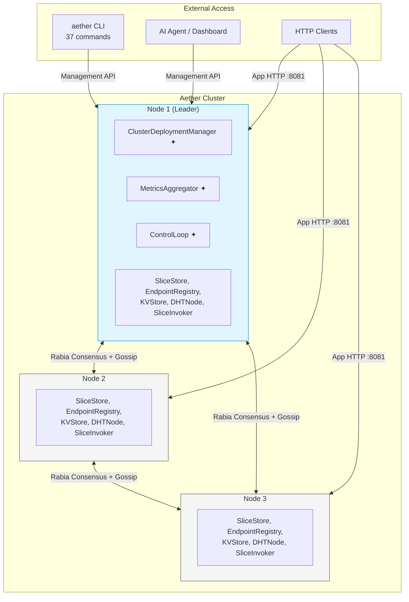
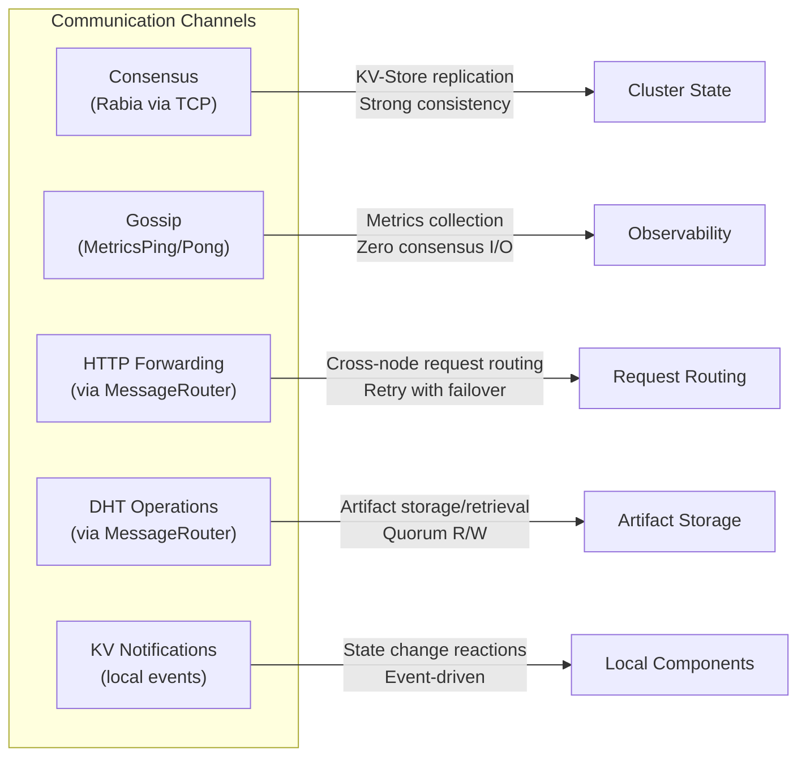
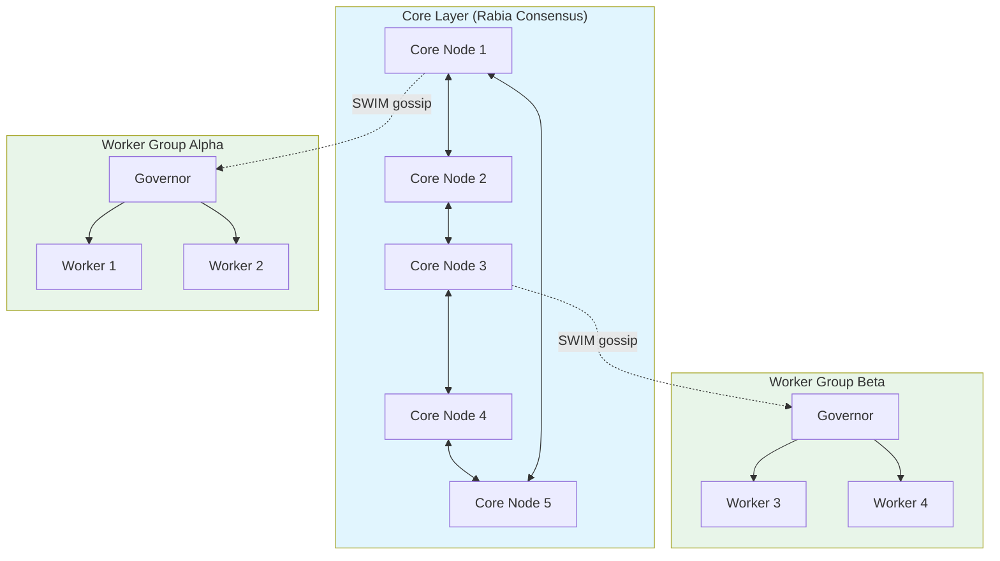

# Aether Architecture Overview

This document is the entry point for the Aether architecture documentation. It describes the system at a high level and links to detailed documents for each subsystem.

## What is Aether?

Aether is a distributed application platform for Java. Business logic is packaged as **slices** - Java interfaces annotated with `@Slice` - and the runtime handles distribution, replication, routing, failure recovery, and scaling transparently.

Aether occupies the space between a monolith and microservices. You write code as if it's a monolith - direct method calls, no network boilerplate. The runtime distributes it across a cluster of nodes.

## System Architecture

**✦ Leader-only components** - activated on the leader node, dormant on others. Leadership is deterministic (first node in sorted topology) and re-election is near-instant.

## Core Concepts

| Concept | Description |
|---------|-------------|
| **Slice** | Deployable unit - a Java interface annotated with `@Slice`. Two types: Service (multiple entry points) and Lean (single entry point). Identical at runtime. |
| **Blueprint** | Desired configuration - which slices to deploy, how many instances. TOML format, applied via CLI or API. |
| **KV-Store** | Consensus-replicated state machine. Single source of truth for all persistent cluster state. |
| **Consensus** | Rabia protocol - leaderless CFT. Any node can propose, agreement via two-round voting with fast path. |
| **DHT** | Distributed hash table for artifact storage. Consistent hashing, quorum R/W, anti-entropy repair. |

## Component Map

Every node runs the same components. Leader-only components activate when a node becomes leader.

| Category | Components | Leader-only |
|----------|-----------|-------------|
| **State** | KVStore (Rabia), LeaderManager, KVNotificationRouter | - |
| **Deployment** | NodeDeploymentManager, RollingUpdateManager, RollbackManager | ClusterDeploymentManager |
| **Invocation** | SliceInvoker, InvocationHandler, DynamicAspectInterceptor | - |
| **HTTP** | AppHttpServer, HttpRouteRegistry, ManagementServer | - |
| **Slices** | SliceStore, SliceRegistry, per-slice ClassLoaders | - |
| **Network** | ClusterNetwork (Netty), TopologyManager, MessageRouter | - |
| **Storage** | DHTNode, ArtifactStore, DHTCacheBackend, AntiEntropy, Rebalancer | - |
| **Observability** | MetricsCollector, AlertManager, ClusterEventAggregator | MetricsAggregator |
| **Scaling** | DecisionTreeController, TTMManager | ControlLoop |
| **Messaging** | TopicSubscriptionRegistry, TopicPublisher, ScheduledTaskManager | - |
| **Resources** | ResourceProvider (SPI: DB, HTTP client, config) | - |

## Communication Paths

## Network Interfaces

Each node exposes three ports:

| Port | Purpose | Protocol |
|------|---------|----------|
| `:8081` | Application HTTP | HTTP/1.1 - serves slice endpoints, forwards to remote nodes |
| `:8080` | Management API | HTTP/1.1 - 30+ REST endpoints, WebSocket dashboard |
| `:8090` | Cluster | TCP (Netty) - consensus, gossip, DHT, invocation forwarding |

## Key Design Principles

1. **Event-driven state management** - KV-Store changes emit notifications. No polling, no periodic reconciliation for core state.
2. **Local-first routing** - requests served by local slice when available, forwarded only when necessary.
3. **Consensus for state, gossip for metrics** - persistent state goes through Rabia; metrics bypass consensus entirely.
4. **Deterministic leadership** - leader is first node in sorted topology. No election protocol overhead.
5. **Layered autonomy** - Layer 1 (decision tree) is mandatory, Layers 2-3 (ML/LLM) are optional enhancements.

## Two-Layer Topology (v0.20.0+)

- **Core nodes** (5-9): Run Rabia consensus, manage cluster state, host infrastructure slices
- **Worker groups**: SWIM-based gossip, deterministic governor (lowest NodeId), execute application slices
- **Scaling**: Core handles control plane; workers scale horizontally to 10K+ nodes

See [05-worker-pools.md](05-worker-pools.md) for details.

## Architecture Documents

| Document | Description |
|----------|-------------|
| [01-consensus.md](01-consensus.md) | Rabia protocol, KV-Store state machine, leader election |
| [02-deployment.md](02-deployment.md) | Blueprint lifecycle, CDM allocation, slice state machine |
| [03-invocation.md](03-invocation.md) | Slice invocation, routing, retry, pub/sub, scheduled tasks |
| [04-networking.md](04-networking.md) | Cluster transport, mTLS, gossip encryption, SWIM |
| [05-worker-pools.md](05-worker-pools.md) | Two-layer topology, governors, SWIM protocol, scaling |
| [06-http-routing.md](06-http-routing.md) | HTTP request routing, forwarding, route self-registration |
| [07-observability.md](07-observability.md) | Metrics pipeline, alerting, dynamic aspects, Prometheus |
| [08-scaling.md](08-scaling.md) | Decision tree controller, TTM predictor, control loop |
| [09-storage.md](09-storage.md) | DHT, artifact repository, consistent hashing, anti-entropy |
| [10-security.md](10-security.md) | mTLS, gossip encryption, RBAC, API keys |
| [11-slice-container.md](11-slice-container.md) | ClassLoader isolation, dependency materialization, lifecycle hooks |
| [12-management.md](12-management.md) | CLI, Management API, Forge simulator, dashboard |

## Performance Characteristics (v0.20.0)

Measured on URL Shortener demo, 5-node Forge on single laptop:

| Metric | Value |
|--------|-------|
| Cold start to serving traffic | ~9.7 seconds |
| Leader re-election | ~2ms |
| Node replacement to routes available | ~150ms |
| Request failures during chaos | 0.039% (124 / 314,758) |
| Steady-state latency at 5,000 req/s | 0.5ms |
| Throughput (full distributed simulation) | 10K req/s |
