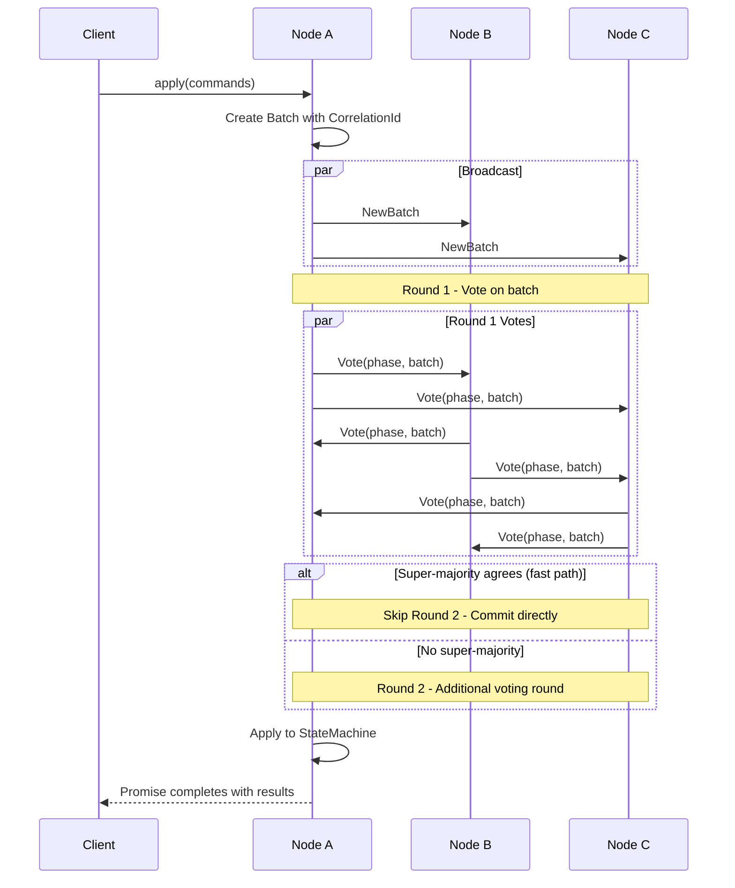
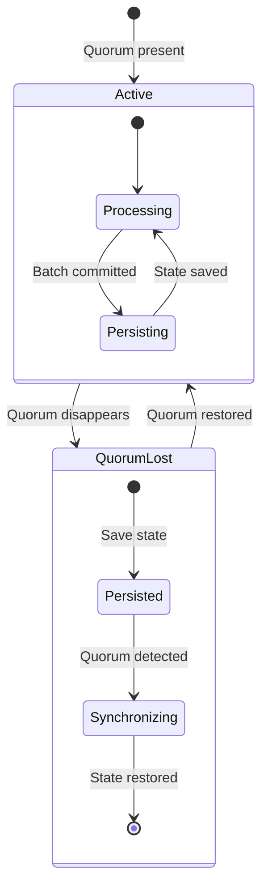
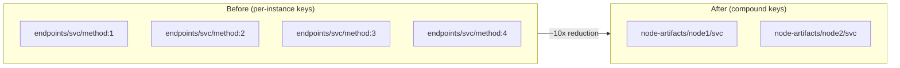
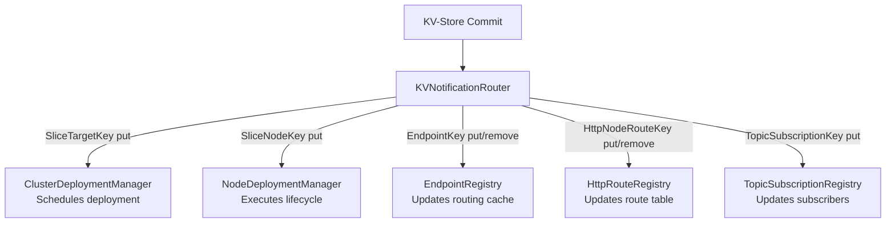
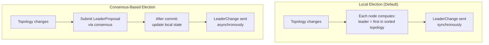
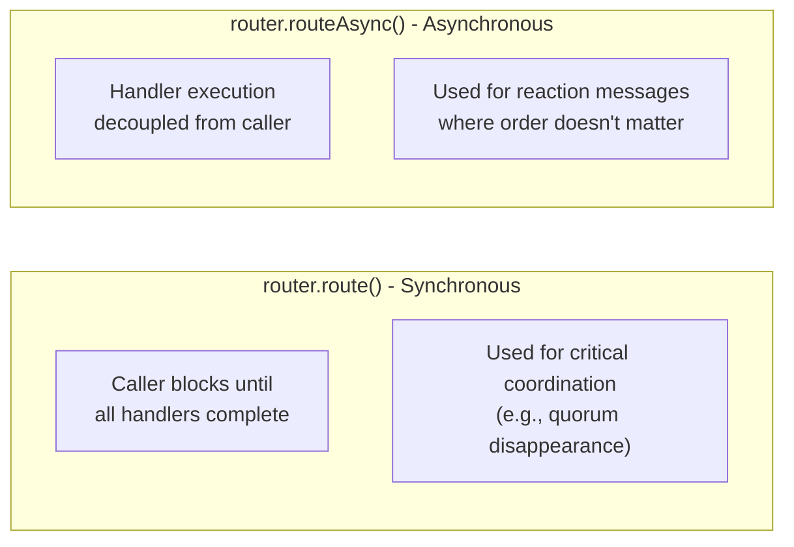

# Consensus and KV-Store

This document describes the Rabia consensus protocol implementation, the KV-Store state machine, and leader election.

## Rabia Protocol

Aether uses [Rabia](https://dl.acm.org/doi/10.1145/3477132.3483582) (SOSP 2021) - a leaderless crash-fault-tolerant consensus algorithm. Unlike Raft or Paxos, Rabia has no designated leader for consensus. Any node can propose, and agreement is reached through a two-round voting protocol.

### Key Properties

| Property | Value |
|----------|-------|
| Fault model | Crash-fault tolerant (CFT) |
| Leader | None (leaderless) |
| Quorum | `(N/2) + 1` |
| Fast path | Super-majority in round 1 skips round 2 |
| Persistence | Pluggable (currently in-memory) |
| State machine | Pluggable (KV-Store for Aether) |

### Protocol Flow



### Command Batching

Commands are grouped into batches with a correlation ID for tracking:

1. Client submits commands via `ConsensusEngine.apply()`
2. Engine creates a batch, tracks the promise
3. Batch broadcast to all nodes
4. After consensus, batch applied to state machine
5. Results returned to the originating client

### Failure Handling



- Node detects quorum disappearance -> stops operations, persists state
- Node detects quorum appearance -> requests state snapshot from peers
- Majority of responses received -> selects most recent, restores, resumes
- Same algorithm used for initial bootstrapping and rejoining

### State Synchronization

New or rejoining nodes:
1. Request state snapshot from all reachable peers
2. Wait for majority responses
3. Select the most recent snapshot
4. Restore local state
5. Join consensus message exchange

Nodes can share saved state even while dormant (not yet active).

## KV-Store State Machine

The KV-Store is the consensus-replicated state machine. All persistent cluster state lives here.

### Operations

| Operation | Description |
|-----------|-------------|
| `Put(key, value)` | Insert or update a key-value pair |
| `Remove(key)` | Delete a key |
| `Batch(commands)` | Atomic batch of put/remove operations |

### Key Types (AetherKey)

All keys implement the `AetherKey` sealed interface. Each key type represents a specific domain:

| Key Type | Pattern | Description |
|----------|---------|-------------|
| `SliceTargetKey` | `slice-target/{artifact}` | Desired deployment state (instance count, blueprint) |
| `SliceNodeKey` | `slices/{nodeId}/{artifact}` | Per-node slice state (LOADING, ACTIVE, etc.) |
| `EndpointKey` | `endpoints/{artifact}/{method}:{instance}` | Service discovery - which node hosts which method |
| `HttpNodeRouteKey` | `http-node-routes/{method}:{path}:{nodeId}` | HTTP route-to-node mapping (one entry per node per route) |
| `AppBlueprintKey` | `app-blueprint/{name}:{version}` | Application blueprints |
| `NodeArtifactKey` | `node-artifact/{nodeId}/{artifact}` | Compound - deployment + endpoints per node-artifact |
| `NodeRoutesKey` | `node-routes/{nodeId}/{artifact}` | Compound - HTTP routes grouped by artifact per node |
| `VersionRoutingKey` | `version-routing/{artifact}` | Traffic splitting during rolling updates |
| `RollingUpdateKey` | `rolling-update/{updateId}` | Rolling update state and configuration |
| `PreviousVersionKey` | `previous-version/{artifact}` | Previous version for rollback support |
| `AlertThresholdKey` | `alert-threshold/{metric}` | Per-metric alert thresholds |
| `ObservabilityDepthKey` | `obs-depth/{artifact}/{method}` | Per-method observability configuration |
| `TopicSubscriptionKey` | `topic-sub/{topic}/{artifact}/{method}` | Pub/sub topic subscriptions |
| `ScheduledTaskKey` | `scheduled-task/{section}/{artifact}/{method}` | Scheduled task definitions |
| `ScheduledTaskStateKey` | `scheduled-task-state/{section}/{artifact}/{method}` | Task execution state |
| `NodeLifecycleKey` | `node-lifecycle/{nodeId}` | Node lifecycle state (ON_DUTY, DRAINING, etc.) |
| `ConfigKey` | `config/{key}` or `config/node/{nodeId}/{key}` | Dynamic cluster configuration (scoped) |
| `WorkerSliceDirectiveKey` | `worker-directive/{artifact}` | CDM directives for worker pools |
| `ActivationDirectiveKey` | `activation/{nodeId}` | Joining node role assignment (CORE/WORKER) |
| `GossipKeyRotationKey` | `gossip-key-rotation` | Gossip encryption key rotation state |
| `GovernorAnnouncementKey` | `governor-announcement/{communityId}` | Worker community governor discovery |
| `LogLevelKey` | `log-level/{loggerName}` | Runtime log level overrides |

### Compound Keys

v0.20.0 introduced compound keys that reduce KV-Store entry count by ~10x:



- `NodeArtifactKey` bundles all artifact state for a node into one entry
- `NodeRoutesKey` bundles all routes for a node into one entry
- Fewer consensus rounds, less KV-Store churn during deployment

### Event Notifications

KV-Store changes emit local events via `KVNotificationRouter`:



No polling. Components react to state changes as they are committed.

## Timestamps

KV-Store uses two timestamp sources:

| Context | Source | Precision |
|---------|--------|-----------|
| Batch ordering (within proposals) | `System.nanoTime()` | Nanoseconds (JVM-relative) |
| State mutations (value records) | `System.currentTimeMillis()` | Milliseconds (epoch) |

Batch timestamps order proposals within a consensus phase. Value timestamps (`updatedAt` fields) order state mutations and determine which snapshot is most recent during sync.

### Deterministic Coin Flip

When round 2 produces no majority, Rabia uses a deterministic coin flip seeded by `phase.value & 1`. All nodes compute the same result, ensuring progress without additional communication.

## Leader Election

Although Rabia is leaderless for consensus, Aether needs a "leader" for coordination tasks (ClusterDeploymentManager, MetricsAggregator, ControlLoop). The `LeaderManager` provides this.

### Two Election Modes



| Mode | Latency | Consistency | Use When |
|------|---------|-------------|----------|
| Local | Immediate | Eventual (brief disagreement possible) | Low latency critical |
| Consensus | After commit | Strong (all nodes agree) | Strict consistency required |

### Race Condition Prevention

The `viewSequence` (monotonic counter) prevents stale proposals:
- Each proposal increments `viewSequence`
- `onLeaderCommitted()` rejects if `committedViewSequence < currentViewSequence`
- Ensures leadership follows consensus order, not arrival order

### Leader Key

```
LeaderKey (singleton)
LeaderValue {
    leader: NodeId        - Elected leader
    viewSequence: long    - Monotonic counter
    electedAt: long       - Timestamp
}
```

## Message Patterns

### Synchronous vs Asynchronous



**Reaction message rule**: When a handler needs to trigger additional messages, always use `routeAsync()` to prevent deep call stacks and hidden coupling.

## Related Documents

- [02-deployment.md](02-deployment.md) - How KV-Store state drives deployment
- [05-worker-pools.md](05-worker-pools.md) - SWIM gossip for worker group membership
- [04-networking.md](04-networking.md) - Transport layer for consensus messages
