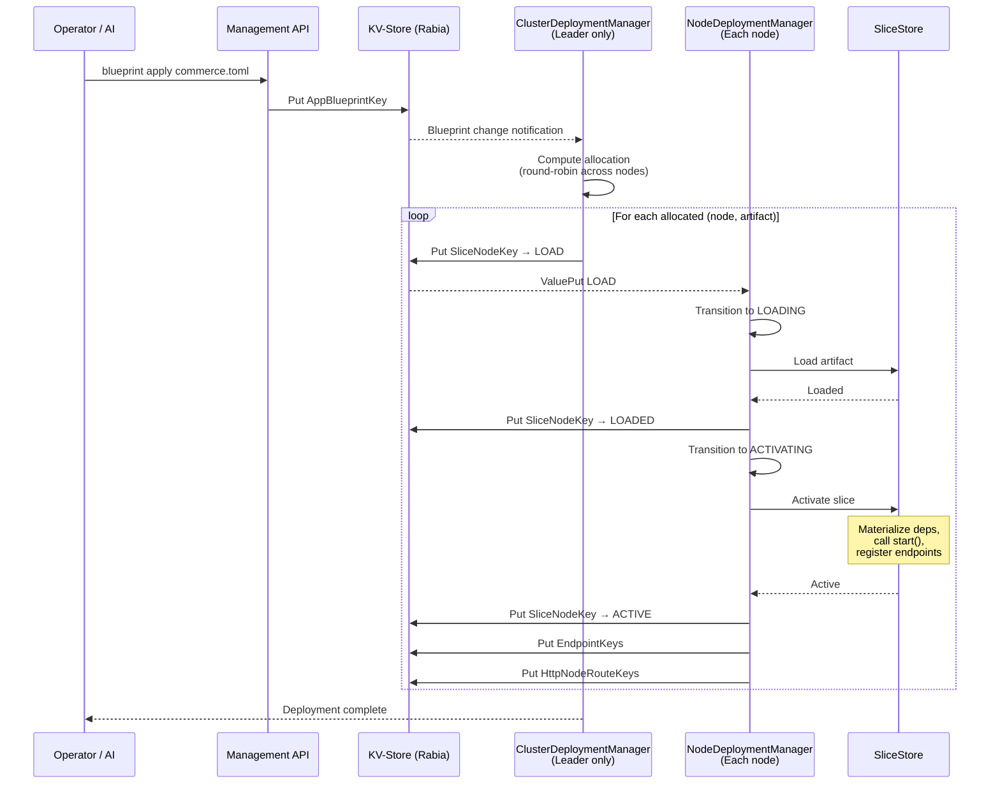
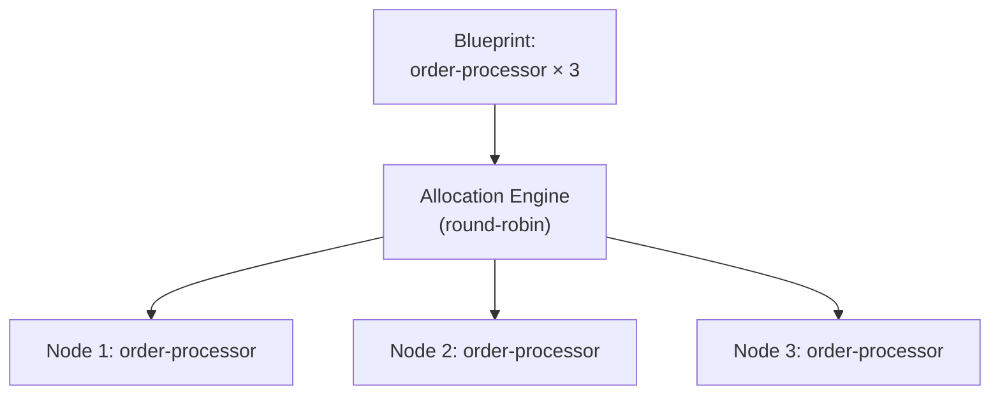
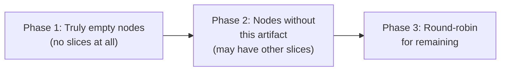
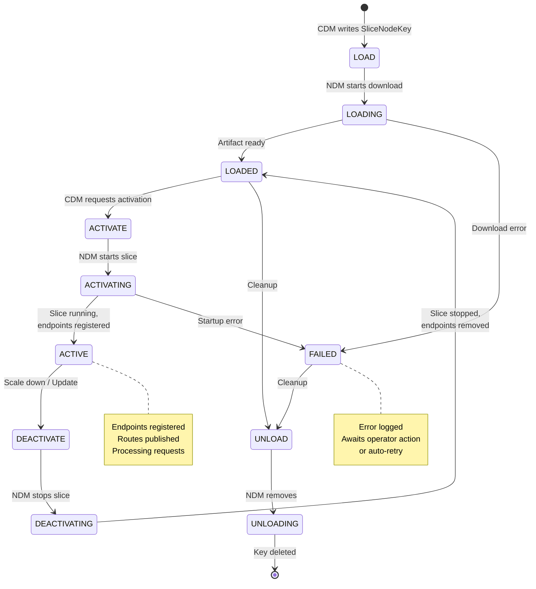
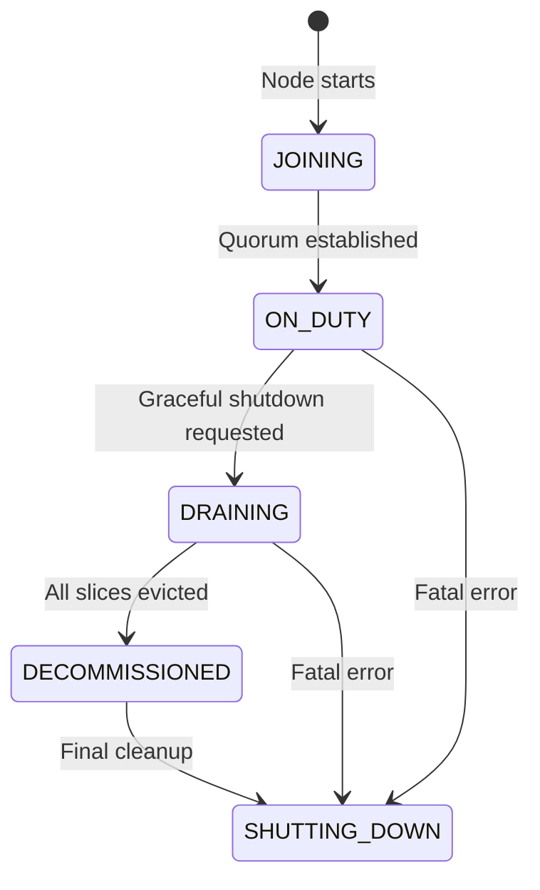
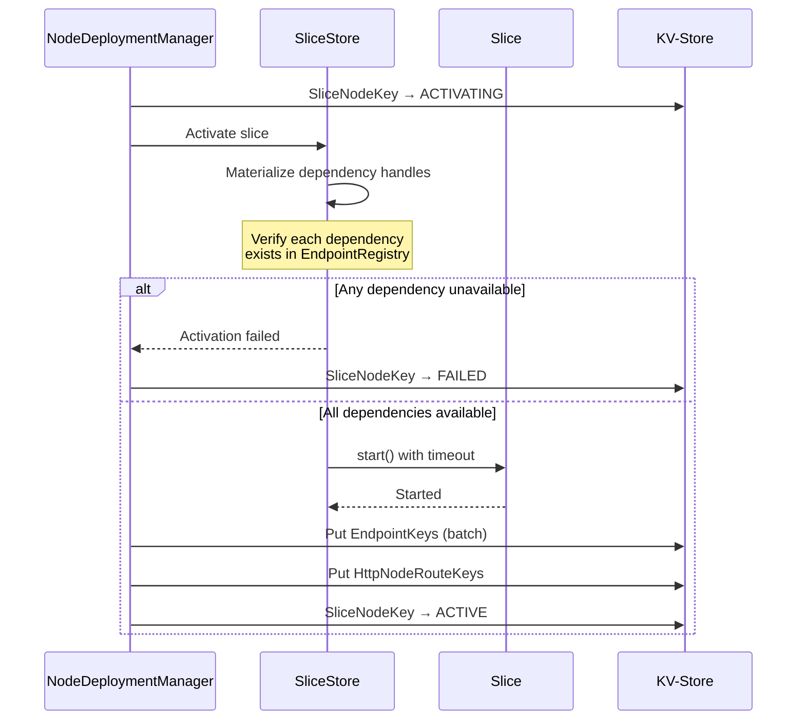

# Deployment and Lifecycle

This document describes how slices are deployed, managed, and scaled across the cluster.

## Blueprint Model

A **blueprint** declares the desired state - which slices to run and how many instances:

```toml
id = "org.example:commerce:1.0.0"

[[slices]]
artifact = "org.example:inventory-service:1.0.0"
instances = 3

[[slices]]
artifact = "org.example:order-processor:1.0.0"
instances = 5
```

Blueprints are stored in the KV-Store under `AppBlueprintKey` and replicated to all nodes via consensus.

## Deployment Flow



## ClusterDeploymentManager (CDM)

Runs on every node but only **activates on the leader**. Responsibilities:

### Allocation

When a blueprint changes, CDM computes instance-to-node allocation:



- **Round-robin** distribution across available nodes
- **ALL_OR_NOTHING** atomicity - if allocation cannot be satisfied, no partial deployment
- Writes `SliceNodeKey` entries with `LOAD` state directly to KV-Store

### Three-Phase Allocation



This progressive strategy prefers spreading slices across empty nodes first, then nodes that don't already host this artifact, and finally falls back to round-robin.

### Deployment Atomicity

| Mode | Behavior |
|------|----------|
| **ALL_OR_NOTHING** (default) | All slices in a blueprint must succeed; any failure rolls back entire blueprint |
| **BEST_EFFORT** | Each slice deploys independently; failures don't affect siblings |

`InFlightBlueprint` tracks progress per blueprint: `pendingSlices`, `activeSlices`, and `previousBlueprint` for rollback.

### Reconciliation

On leader activation (including failover), CDM performs full reconciliation:

1. Scan all `SliceTargetKey` entries (desired state)
2. Scan all `SliceNodeKey` entries (actual state)
3. Identify drift: missing instances, orphaned instances, stale state
4. Issue corrective commands to bring actual state in line with desired

### Auto-Healing

When a node departs the cluster:

1. CDM detects node removal via topology change
2. Cleans up `SliceNodeKey` entries for the departed node
3. Cleans up `HttpNodeRouteKey` entries for the departed node
4. Reallocates orphaned slice instances to surviving nodes
5. Normal deployment flow follows for reallocated instances

## NodeDeploymentManager (NDM)

Runs on every node. Watches KV-Store for `SliceNodeKey` changes specific to this node and executes the lifecycle locally.

### State Machine



### Transitional State Timeouts

| State | Timeout | Description |
|-------|---------|-------------|
| `LOADING` | 2 minutes | Download and setup |
| `ACTIVATING` | 1 minute | Startup, dependency materialization |
| `DEACTIVATING` | 30 seconds | Graceful shutdown |
| `UNLOADING` | 2 minutes | Cleanup and removal |

CDM detects stuck transitional states and may force-transition or escalate.

### Lifecycle Hooks

| Hook | Phase | Timeout | Purpose |
|------|-------|---------|---------|
| `start()` | ACTIVATING | `startStopTimeout` (default 5s) | Initialize resources, warm caches |
| `stop()` | DEACTIVATING | `startStopTimeout` (default 5s) | Graceful cleanup, drain connections |

### Node Lifecycle

Separate from slice lifecycle, nodes have their own state machine:



During **DRAINING**, CDM performs sequential eviction: one slice at a time, deploying a replacement on another node before unloading from the draining node.

### Activation Sequence



Dependencies are validated eagerly - if a required slice isn't available, activation fails immediately, not at first request time.

## Rolling Updates

Zero-downtime deployments with traffic control:

```mermaid
stateDiagram-v2
    [*] --> PENDING: Start update

    PENDING --> DEPLOYING: Deploy new version instances
    DEPLOYING --> DEPLOYED: All new instances ACTIVE

    DEPLOYED --> ROUTING: Begin traffic shift
    ROUTING --> ROUTING: Adjust weights

    ROUTING --> COMPLETING: Shift complete
    COMPLETING --> COMPLETED: Old version drained

    ROUTING --> ROLLING_BACK: Health check failed
    COMPLETING --> ROLLING_BACK: Error detected
    ROLLING_BACK --> ROLLED_BACK: Traffic restored to old version

    note right of ROUTING
        Weighted routing:
        1:3 = 25% new
        1:1 = 50/50
        3:1 = 75% new
    end note
```

### Two-Stage Model

1. **Deploy**: New version instances deployed with 0% traffic
2. **Route**: Traffic gradually shifted via `VersionRoutingKey` weights

### Health Guardrails

- Configurable `maxErrorRate` (e.g., 0.01 = 1%)
- Configurable `maxLatencyMs`
- Manual approval option (`requireManualApproval`)
- Cleanup policy: `GRACE_PERIOD` or immediate

### CLI Commands

```bash
aether update start org.example:order-processor 2.0.0 -n 3
aether update routing <id> -r 1:3    # 25% to v2
aether update routing <id> -r 1:1    # 50/50
aether update complete <id>          # 100% to v2, drain v1
aether update rollback <id>          # Revert to v1
```

## Disruption Budget

During rolling updates and node maintenance, CDM respects disruption budgets:

- Never reduce active instances below minimum
- Account for instances in transition (LOADING, ACTIVATING)
- Coordinate with RollingUpdateManager to avoid concurrent disruptions

## Route Management

### Self-Registration

Slices declare HTTP routes via `routes()` method. Routes are managed automatically:

- **On activation**: NDM registers routes in KV-Store. Idempotent - multiple instances share routes.
- **On deactivation**: NDM removes routes only if this is the **last active instance** of the artifact.
- **On node departure**: CDM cleans up stale routes for the removed node.

### Route Key Design

Each node writes its own `HttpNodeRouteKey(method, path, nodeId)` - no read-modify-write races. Consumers reconstruct the node set in-memory by scanning matching keys.

## Related Documents

- [01-consensus.md](01-consensus.md) - KV-Store that drives deployment
- [06-http-routing.md](06-http-routing.md) - HTTP route handling details
- [08-scaling.md](08-scaling.md) - Auto-scaling that triggers blueprint changes
- [11-slice-container.md](11-slice-container.md) - ClassLoader isolation and lifecycle hooks
