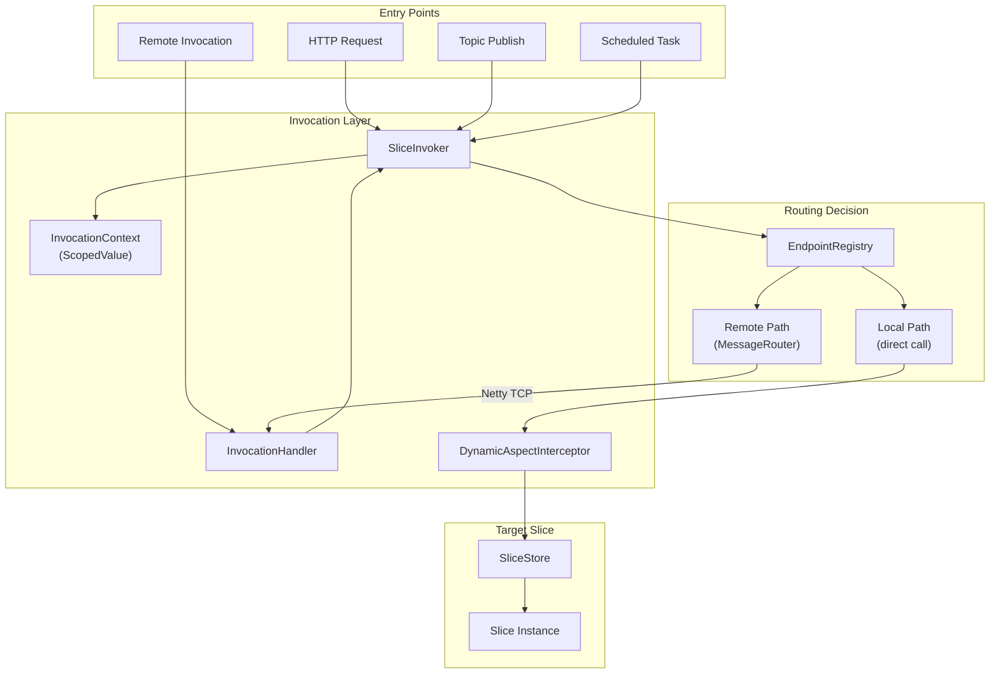
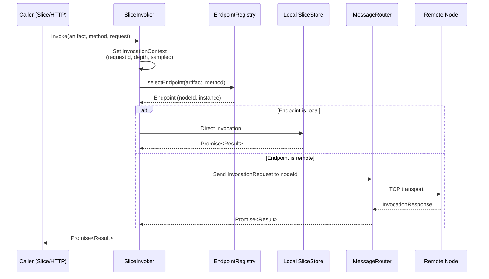
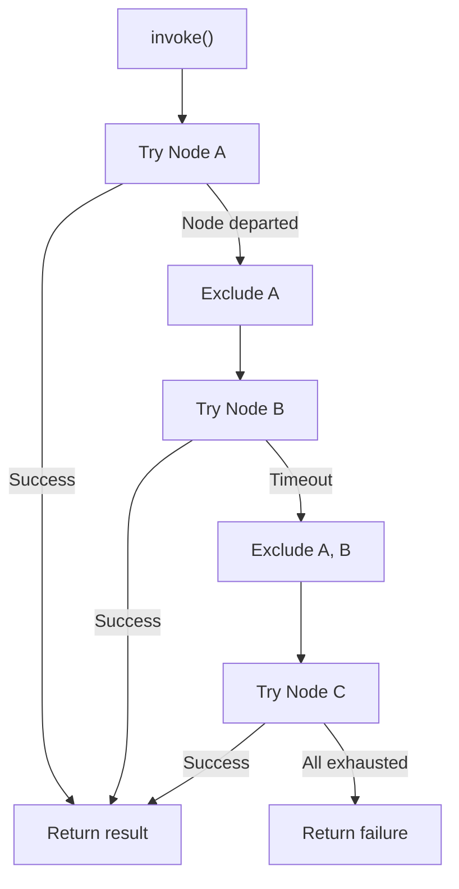
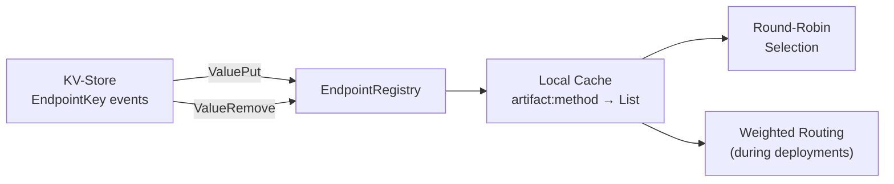
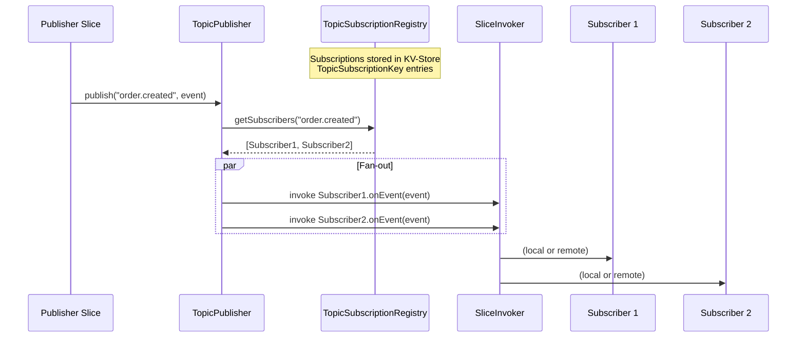
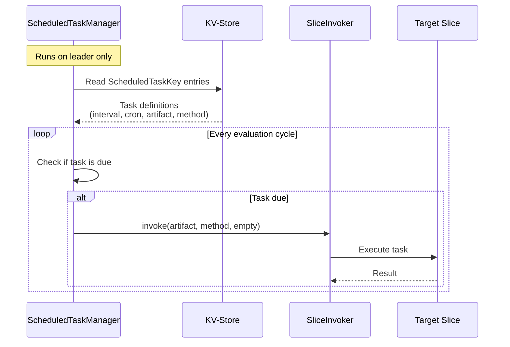

# Slice Invocation and Routing

This document describes how slice methods are invoked, how requests are routed, and how pub/sub and scheduled tasks work.

## Invocation Architecture



## SliceInvoker

Central component for all slice invocations. Handles local and remote dispatch transparently.

### Invocation Flow



### Local-First Routing

SliceInvoker prefers local endpoints when available:

1. Check `CacheAffinityResolver` if registered (DHT-aware partition routing)
2. If affinity node found, prefer it via `selectEndpointByAffinity()`
3. Check for active deployment - use weighted routing if active
4. Otherwise, query EndpointRegistry with round-robin selection
5. If any endpoint is on the current node, use it (zero network hop)
6. Default invocation timeout: 20s (client-side), 15s (server-side)

### Affinity Routing

`CacheAffinityResolver` enables DHT-partition-aware routing. Registered per (artifact, method), it maps request keys to preferred nodes for cache locality.

### Retry and Failover



- Exponential backoff between retries (base: 100ms)
- Failed nodes excluded from selection
- On node departure, in-flight requests immediately retried on surviving nodes
- KSUID correlation IDs for distributed tracing
- Pending invocations tracked with per-node secondary index for fast cleanup
- Stale entry cleanup every 60 seconds

## InvocationContext

Per-request context carried via `ScopedValue` (no thread-local leaking):

| Field | Description |
|-------|-------------|
| `requestId` | KSUID - unique per request chain |
| `depth` | Invocation depth (prevents infinite recursion) |
| `sampled` | Whether this request is sampled for detailed metrics |
| `principal` | Security principal (if authenticated) |

## EndpointRegistry

Pure event-driven component - watches KV-Store, maintains local routing cache.



### Weighted Routing for Deployments

During active deployments, `selectEndpointWithRouting()` uses `VersionRoutingKey` weights:

```
v1 weight: 3, v2 weight: 1
→ 75% of requests go to v1, 25% to v2
```

Weights are adjusted via `aether deploy promote <id>` (or the `/api/deploy/{id}/promote` endpoint).

## DynamicAspectInterceptor

Runtime-configurable per-method instrumentation:

| Mode | Effect |
|------|--------|
| `LOG` | Log entry/exit with timing |
| `METRICS` | Collect invocation metrics (count, latency, success/failure) |
| `LOG_AND_METRICS` | Both |
| `NONE` | No interception |

Toggled at runtime via REST API (`/api/aspects`) without redeployment. Configuration persisted in KV-Store via `AspectConfigKey`.

## Generated Proxies

The annotation processor generates proxy implementations for slice interfaces:

```java
// Developer writes:
@Slice
public interface InventoryService {
    Promise<StockResult> checkStock(StockRequest request);
}

// Generated proxy:
public class InventoryServiceProxy implements InventoryService {
    private final SliceInvokerFacade invoker;

    @Override
    public Promise<StockResult> checkStock(StockRequest request) {
        return invoker.invoke(ARTIFACT, "checkStock", request, StockResult.class);
    }
}
```

The proxy is what gets materialized when another slice declares `InventoryService` as a dependency. Whether the real implementation is local or remote is transparent.

## Serialization

| Path | Format | Library |
|------|--------|---------|
| Inter-node invocation | Binary | Fury |
| HTTP request/response | JSON | Jackson |
| KV-Store values | Binary | Fury |

Fury provides efficient binary serialization for inter-node communication. JSON is used only at the HTTP boundary.

## Pub/Sub

Topic-based publish/subscribe via KV-Store-backed subscription registry.



- Subscriptions declared via slice annotations, registered in KV-Store
- Fan-out uses SliceInvoker - same routing, retry, and failover as regular invocations
- At-least-once delivery semantics

## Scheduled Tasks



- Supports interval-based and cron-based scheduling
- Task definitions stored in KV-Store (cluster-wide consistency)
- Execution via SliceInvoker - inherits routing and retry

## Related Documents

- [06-http-routing.md](06-http-routing.md) - HTTP request routing and forwarding
- [02-deployment.md](02-deployment.md) - Endpoint registration during deployment
- [07-observability.md](07-observability.md) - Invocation metrics and aspect configuration
