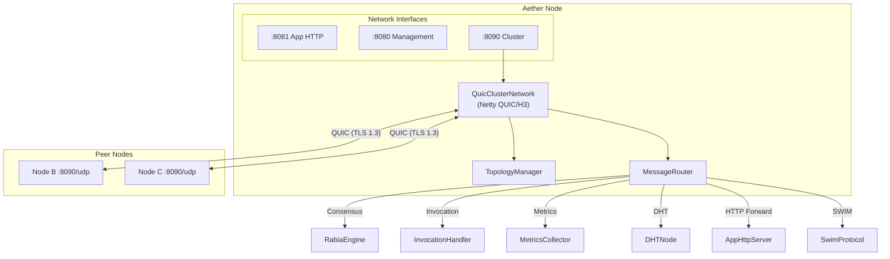
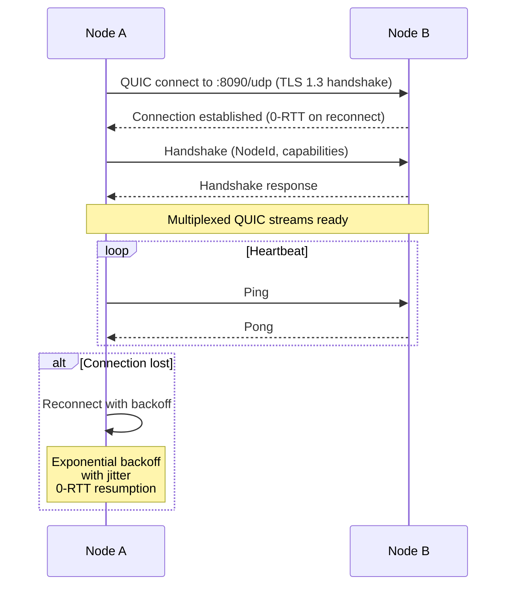
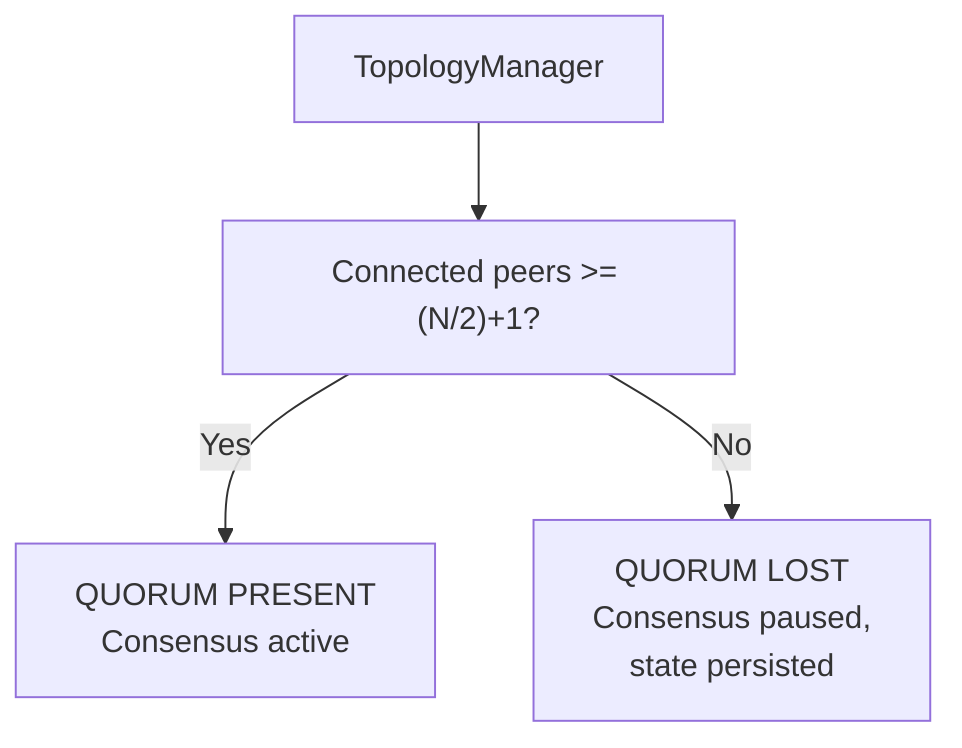
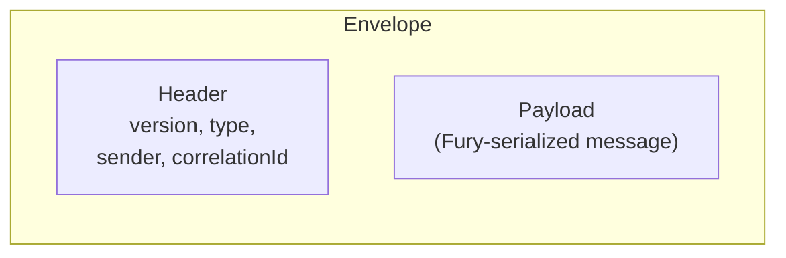
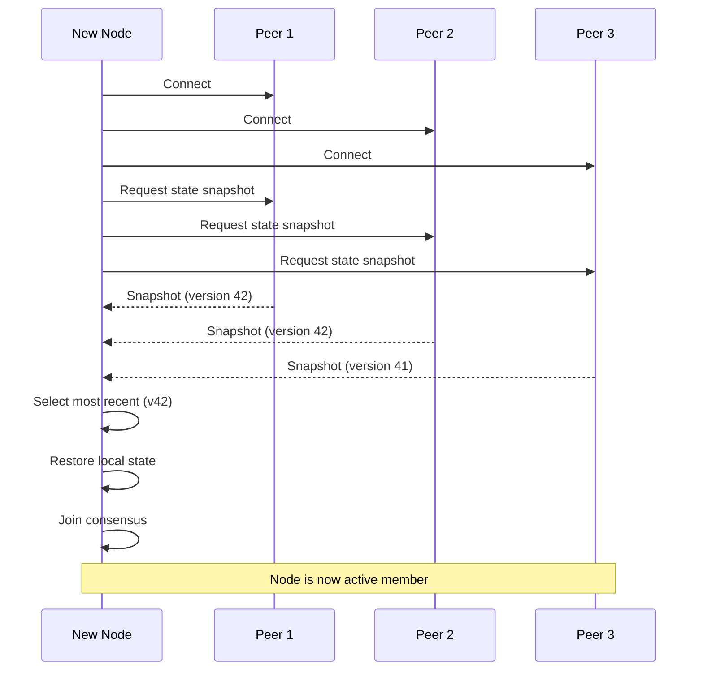
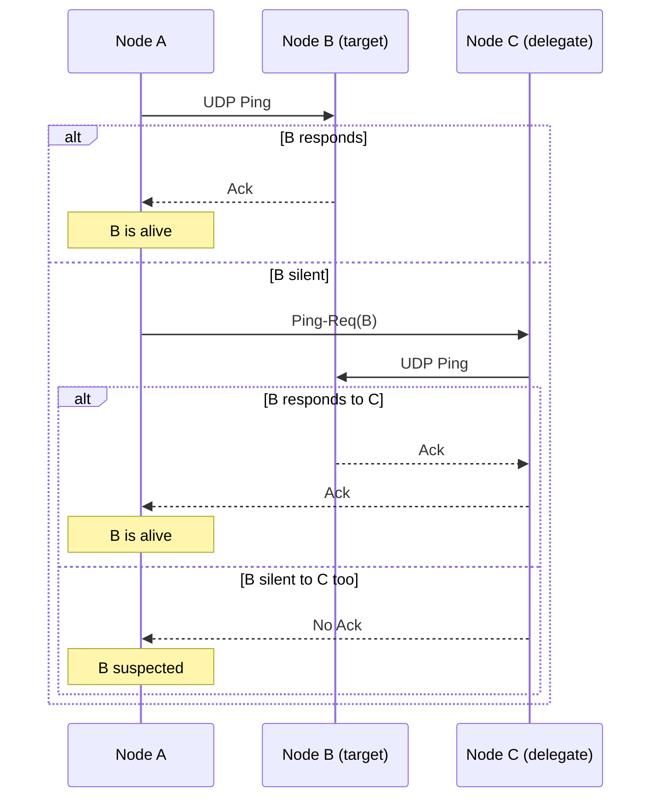

# Networking and Transport

This document describes the cluster transport layer, topology management, and message routing.

## Network Architecture



## QuicClusterNetwork

QUIC-based (HTTP/3) transport for all inter-node communication. Uses Netty's `netty-codec-http3` with TLS 1.3 built into the QUIC handshake — no separate TLS negotiation.

### Connection Management



- Peer list configured at startup (no external service registry)
- Automatic reconnection with exponential backoff and 0-RTT resumption
- Per-stream backpressure (bounded queue, 100 per peer per stream type)
- Automatic certificate rotation (60% validity trigger, atomic SSL context swap)
- SWIM health detection on separate UDP port (cluster port + 100)

### Quorum Detection



A 5-node cluster tolerates 2 simultaneous failures. When quorum is lost, consensus stops and the node persists its state. When quorum is restored, the node synchronizes and resumes.

## MessageRouter

Multiplexes all inter-node messages over QUIC streams. Each message type is routed to its handler:

| Message Type | Handler | Description |
|-------------|---------|-------------|
| Consensus messages | RabiaEngine | Rabia protocol votes and batches |
| InvocationRequest/Response | InvocationHandler | Cross-node slice calls |
| MetricsPing/Pong | MetricsCollector | Leader-to-node metrics exchange |
| DHT messages | DHTNode | Artifact storage operations |
| HttpForward messages | AppHttpServer | HTTP request forwarding |
| SWIM messages | SwimProtocol | Worker group membership |

### Routing Pattern

```java
// Targeted delivery - not broadcast
router.route(targetNodeId, message);

// Async delivery - non-blocking
router.routeAsync(() -> new ReactionMessage(...));
```

The MessageRouter is a targeted delivery system, not a broadcast bus. Each message specifies its destination node.

## Envelope Format

All inter-node messages are wrapped in an `Envelope`:



| Field | Description |
|-------|-------------|
| `version` | Protocol version for compatibility |
| `type` | Message type discriminator |
| `sender` | Source NodeId |
| `correlationId` | Request-response correlation |
| `payload` | Fury-serialized message body |

Envelope versioning allows protocol evolution without breaking existing nodes.

## Topology Management



### Node Discovery

Nodes discover each other via configured peer list. No external service registry (Consul, etcd, etc.) needed. On startup:
1. Connect to known peers
2. Request state snapshot from cluster
3. Restore local state from most recent snapshot
4. Join consensus and begin accepting work

## SWIM Protocol (Worker Groups)

For worker groups outside the core consensus layer, Aether uses SWIM (Scalable Weakly-consistent Infection-style Membership) for failure detection:



### SWIM Configuration

| Parameter | Default | Description |
|-----------|---------|-------------|
| `period` | 1s | Probe interval |
| `probeTimeout` | 500ms | Wait for Ack |
| `indirectProbes` | 3 | PingReq targets |
| `suspectTimeout` | 5s | SUSPECT -> FAULTY |
| `maxPiggyback` | 8 | Updates per message |

### SWIM Properties

| Property | Value |
|----------|-------|
| Detection | O(1) per node per round |
| Dissemination | Piggybacked on ping/ack messages |
| Transport | UDP (Netty `NioDatagramChannel`) |
| Encryption | AES-256-GCM (see [10-security.md](10-security.md)) |
| Incarnation counter | Refutes false suspicions (higher = more recent) |
| Member states | ALIVE -> SUSPECT -> FAULTY |

### Piggybacked Dissemination

Membership changes (join, leave, suspect, confirm) are piggybacked on existing ping/ack messages rather than broadcast separately. This provides O(log N) dissemination with zero additional network messages.

## Related Documents

- [01-consensus.md](01-consensus.md) - Rabia protocol that uses this transport
- [05-worker-pools.md](05-worker-pools.md) - SWIM protocol for worker group membership
- [10-security.md](10-security.md) - mTLS and gossip encryption
