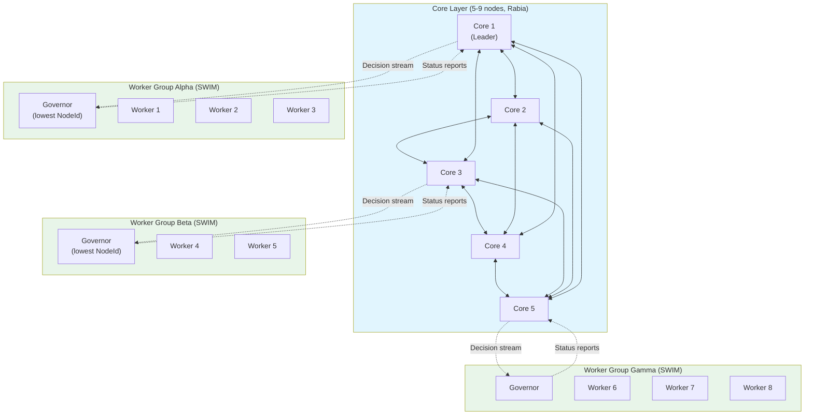
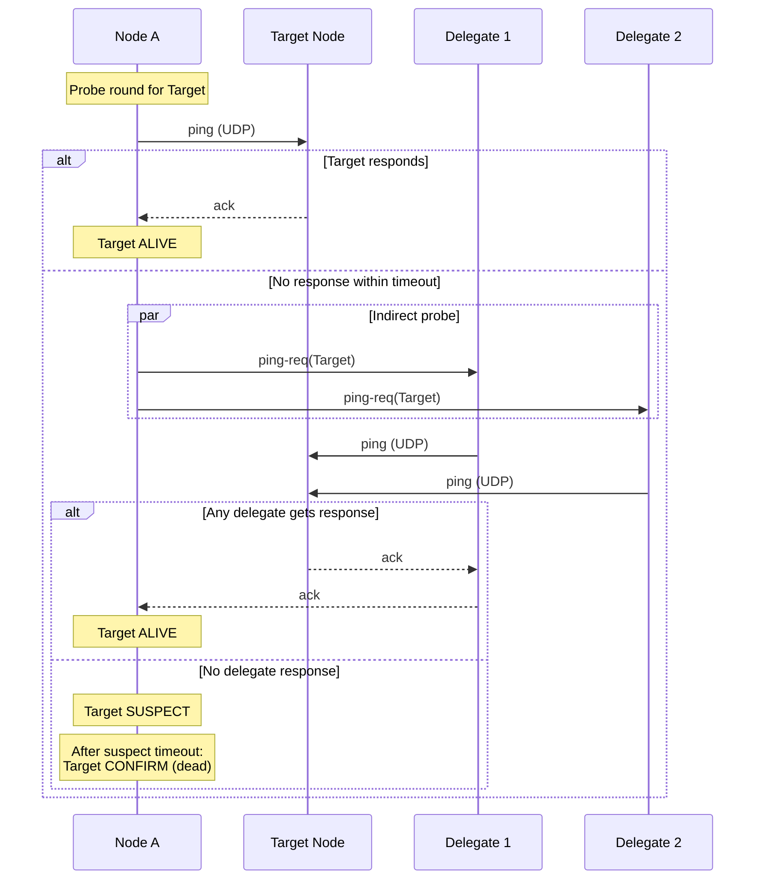
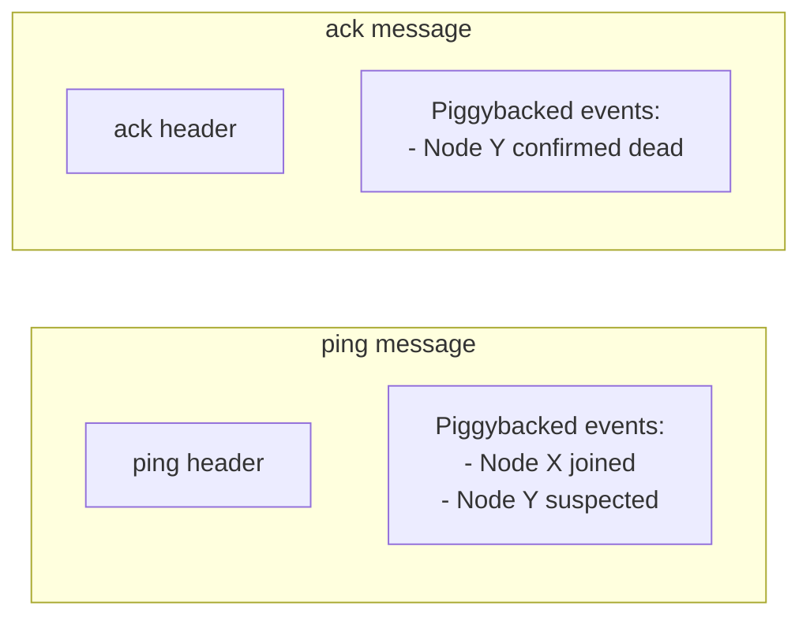
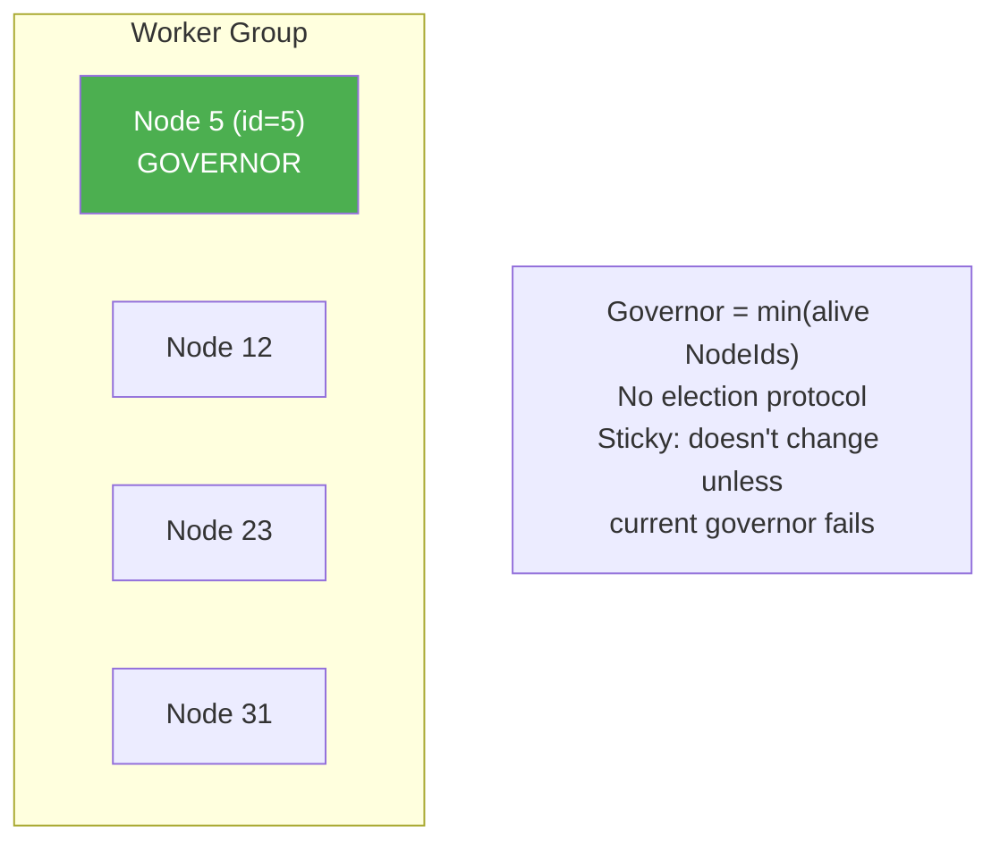
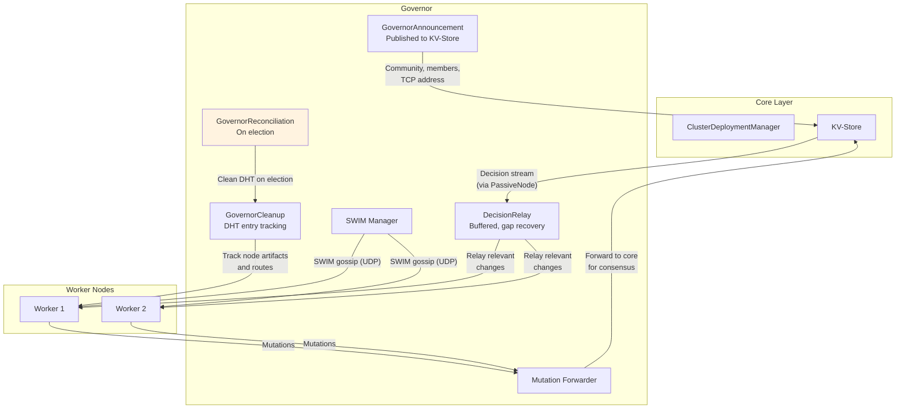
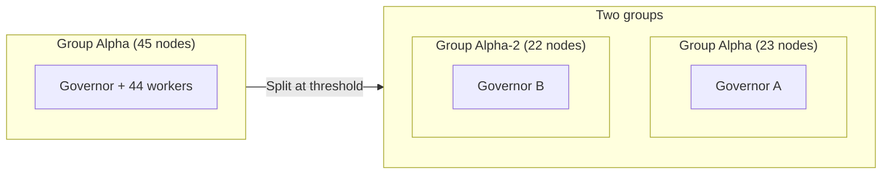
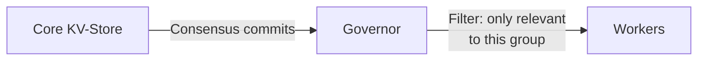
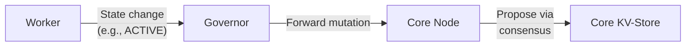
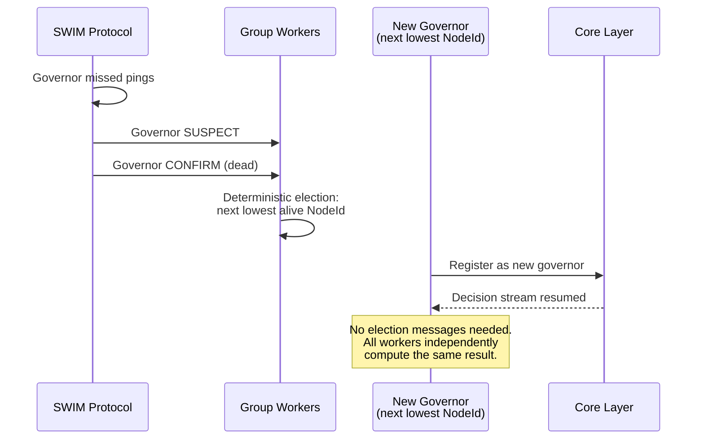

# Worker Pools and Two-Layer Topology

This document describes how Aether scales beyond the Rabia consensus limit of 5-9 nodes to support 10,000+ nodes.

## Problem

Rabia consensus uses all-to-all broadcast: O(N^2) messages per round. At 9 nodes that's 72 messages/round. At 100 nodes it would be 9,900 messages/round - unacceptable. Practical Rabia cluster size is 5-9 nodes.

Production workloads need tens to thousands of compute nodes.

## Solution: Two-Layer Topology



### Layer Responsibilities

| Layer | Size | Protocol | Owns | Runs |
|-------|------|----------|------|------|
| **Core** | 5-9 nodes | Rabia (all-to-all) | Blueprints, config, routing rules, control plane | CDM, DHT, artifact repository, infrastructure slices |
| **Worker Groups** | 10-50 nodes each | SWIM (gossip) | Local membership, health state | Application slices, governors |

### Complexity

| Operation | Core (N=5-9) | Worker Group (M=10-50) |
|-----------|-------------|----------------------|
| Consensus | O(N^2) per round | N/A (no consensus) |
| Membership | Rabia-based | O(1) per node (SWIM) |
| Health detection | Topology manager | O(1) per node (SWIM) |
| State replication | Full (KV-Store) | Decision stream relay |

## SWIM Protocol

Worker groups use SWIM (Scalable Weakly-consistent Infection-style Membership) for failure detection and membership tracking.

### Failure Detection



### SWIM Properties

| Property | Value |
|----------|-------|
| Detection time | O(1) per node per round |
| False positive rate | Configurable via suspect timeout |
| Message overhead | Constant per node (not proportional to group size) |
| Dissemination | Piggybacked on ping/ack (zero extra messages) |

### Piggybacked Dissemination

Membership events (join, leave, suspect, confirm) are attached to existing ping/ack messages:



Each event has a counter. Events with higher counters override older ones. Events are piggy-backed until they've been included in enough messages (log N rounds) to ensure propagation.

## Governor Protocol

Each worker group has a **governor** - the single liaison between the group and the core layer.

### Governor Election

**Deterministic**: Governor is the alive node with the lowest `NodeId` in the group. No election messages needed.



**Sticky incumbent**: If the governor is alive, it stays governor even if a node with a lower ID joins. Governor only changes when the current one fails or leaves.

### GovernorState

```java
sealed interface GovernorState {
    record Governor(NodeId self) implements GovernorState {}
    record Follower(NodeId governorId) implements GovernorState {}
}
```

### Governor Responsibilities



| Component | Description |
|-----------|-------------|
| **DecisionRelay** | Buffered relay with sequence tracking and gap recovery |
| **GovernorCleanup** | Tracks NodeArtifactKey/NodeRoutesKey per node for departure cleanup |
| **GovernorReconciliation** | One-time cleanup on election: removes DHT entries for dead nodes |
| **GovernorAnnouncement** | Publishes to KV-Store: communityId, members, TCP address |
| **GovernorMesh** | Cross-community connectivity via TCP for DHT routing |
| **WorkerBootstrap** | New workers request snapshot from governor, catch-up via decision stream |

## Group Formation

### Assignment

`GroupAssignment.computeGroups()` is deterministic and zone-aware:

1. Extract zone from NodeId (prefix before last dash, or `"local"` if no dash)
2. Group members by zone
3. If zone group <= `maxGroupSize` -> single group
4. Else -> split round-robin into `ceil(size/maxGroupSize)` subgroups
5. Return sorted map by `WorkerGroupId.communityId()`

```java
record WorkerGroupId(String groupName, String zone) {
    String communityId() { return groupName + ":" + zone; }
}
// Example: NodeId "worker-us-west-1" → zone "worker-us-west"
```

### Splitting

When a group exceeds its size limit:



Split is coordinated by CDM (core leader):
1. CDM decides split point
2. CDM assigns new group IDs via consensus
3. Affected workers receive new group assignment
4. New governors elected deterministically
5. SWIM membership converges

## KV-Store Integration

Worker groups don't run their own consensus. State flows in two directions:

### Core to Workers (Decision Stream)



The governor receives all KV-Store decisions and relays only those relevant to the group (e.g., slice assignments for nodes in this group).

### Workers to Core (Mutation Forwarding)



Workers cannot write to KV-Store directly. All mutations are forwarded through the governor to a core node for consensus.

### Observed State

Worker health and observed state is stored in the KV-Store (not in a separate DHT), using compound keys to minimize consensus overhead:

| Key | Description |
|-----|-------------|
| `NodeArtifactKey(nodeId, artifact)` | Compound: all artifact state for one node |
| `NodeRoutesKey(nodeId)` | Compound: all routes for one node |

Compound keys reduce KV-Store entries by ~10x compared to per-instance keys.

## Failure Scenarios

### Governor Failure



### Worker Failure

1. SWIM detects worker failure (suspect -> confirm)
2. Governor reports to core CDM
3. CDM reallocates orphaned slices to other workers in the group (or other groups)

### Core Node Failure

- Core layer tolerates f < N/2 failures (4 failures in a 9-node core)
- Worker groups continue operating with cached state
- Decision stream resumes when core recovers
- Mutations queued at governor until core is available

### Network Partition (Core-Worker Split)

- Workers continue serving cached state
- No new deployments/updates until partition heals
- Mutations queued at governor
- SWIM continues within the worker group

## Phased Implementation

| Phase | Release | Content | Status |
|-------|---------|---------|--------|
| **Phase 1** | 0.20.0 | SWIM protocol, compound keys, governor election, basic worker groups | Complete |
| **Phase 2a** | 0.20.0 | Decision stream relay, mutation forwarding | Complete |
| **Phase 2b** | 0.20.0 | Group assignment, status reporting, CDM scheduling for workers | Complete |
| **Phase 2c** | 0.21.x | Spot pool (preemptible workers with graceful drain) | Planned |
| **Phase 3** | Future | Multi-region (geo-aware groups, cross-region replication) | Planned |

## Related Documents

- [01-consensus.md](01-consensus.md) - Rabia protocol (core layer)
- [04-networking.md](04-networking.md) - SWIM transport details
- [10-security.md](10-security.md) - SWIM encryption (AES-256-GCM)
- [Passive Worker Pools Spec](../specs/passive-worker-pools-spec.md) - Full specification
