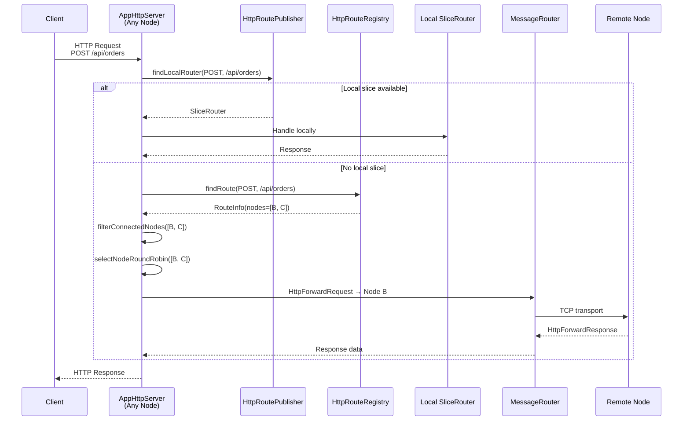
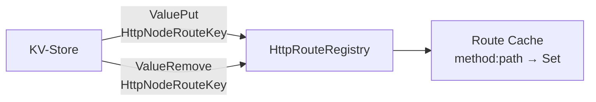
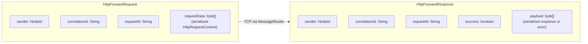
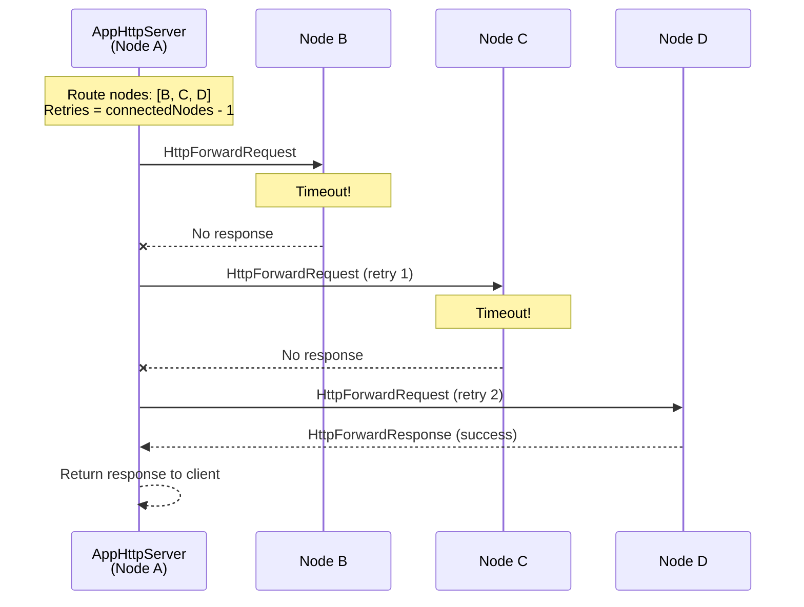
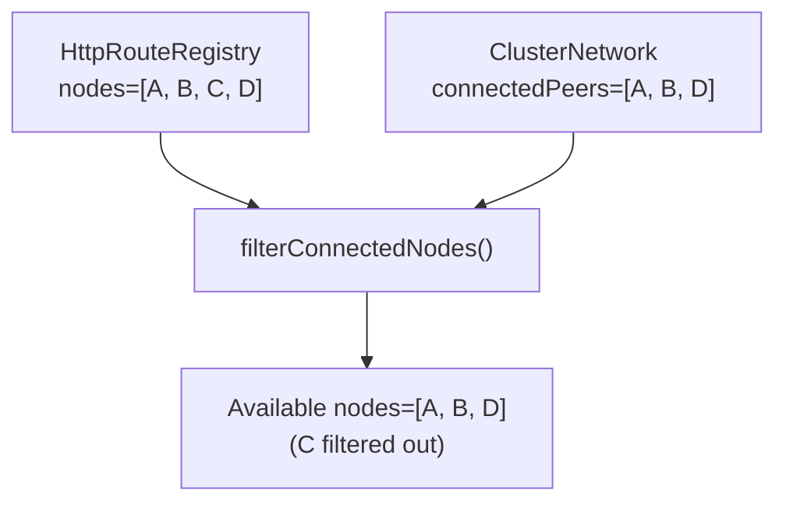

# HTTP Request Routing

This document describes how HTTP requests are routed to slices, including cross-node forwarding and retry logic.

## Request Flow



## Key Components

### AppHttpServer

Main HTTP server on port `:8081`. Handles both local and forwarded requests.

### HttpRoutePublisher

Manages route publication for locally deployed slices:
- **On activation**: Writes `HttpNodeRouteKey(method, path, selfNodeId)` to KV-Store
- **On deactivation**: Deletes own route key (only if last instance)
- Each node writes only its own keys - no read-modify-write races

### HttpRouteRegistry

Local cache of all HTTP routes, kept in sync via KV-Store notifications:



Consumers reconstruct the node set in-memory by scanning all `HttpNodeRouteKey` entries with the same method and path prefix.

### HttpNodeRouteKey Design

```
Key:   http-routes/{METHOD}:{PATH}:{NODE_ID}
Value: {artifactCoord, sliceMethod, state, weight, registeredAt}
```

**Why flat keys (one per node) instead of Set\<NodeId\>?**

The previous design stored a single key per route with a set-valued payload. This required read-modify-write on every publish/unpublish, creating races when multiple nodes deployed the same slice concurrently. The flat design eliminates these races entirely.

## Forwarding Protocol

### HttpForwardMessage



## Retry with Failover



### Retry Rules

| Rule | Description |
|------|-------------|
| Retry count | `connectedNodes.size() - 1` (try every node exactly once) |
| Node selection | Round-robin, excluding already-tried nodes |
| Timeout per attempt | `forwardTimeoutMs` (default: 5000ms) |
| All retries exhausted | 504 Gateway Timeout |

## Connectivity Filtering

Routes in KV-Store may reference disconnected nodes. Filtering happens at request time:



If no connected nodes remain: 503 Service Unavailable.

## Route Cleanup

Dead nodes cannot unpublish their routes. Cleanup happens in two places:

### On Node Removal

CDM (leader) scans and deletes all `HttpNodeRouteKey` entries where `key.nodeId() == removedNode`.

### On Leader Activation

New leader scans for stale routes during reconciliation - any `HttpNodeRouteKey` where `key.nodeId()` is not in the current topology is deleted.

## Error Responses

| Scenario | HTTP Status |
|----------|-------------|
| No route found | 404 |
| No connected nodes for route | 503 |
| All retry attempts exhausted | 504 |
| Serialization error | 500 |
| Remote processing error | Forwarded status |

## Related Documents

- [03-invocation.md](03-invocation.md) - Slice invocation (separate from HTTP routing)
- [02-deployment.md](02-deployment.md) - Route self-registration during deployment
- [04-networking.md](04-networking.md) - MessageRouter transport
