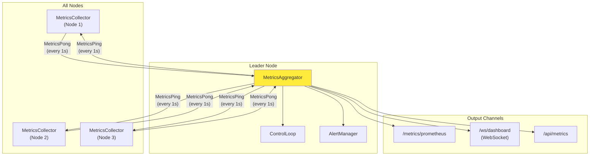
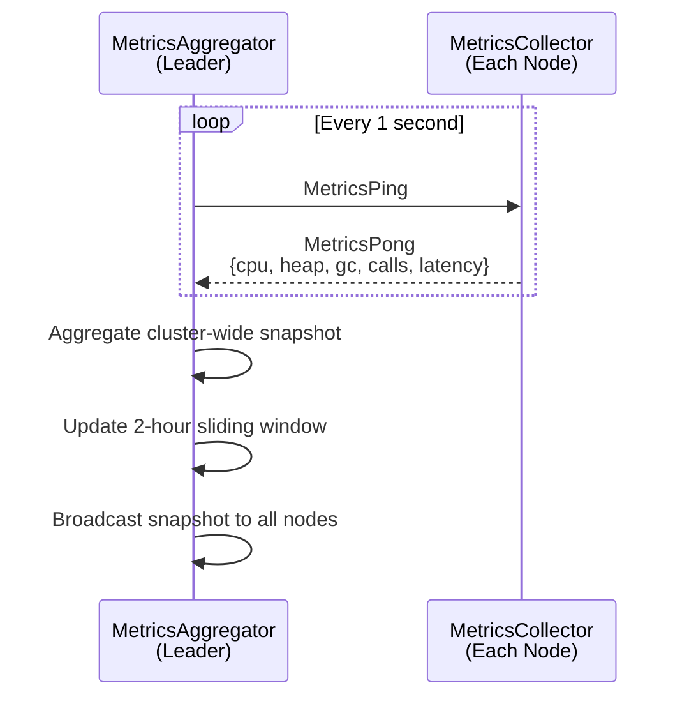
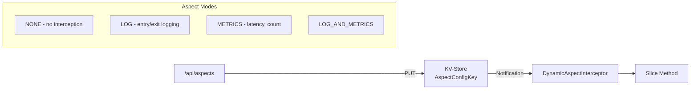
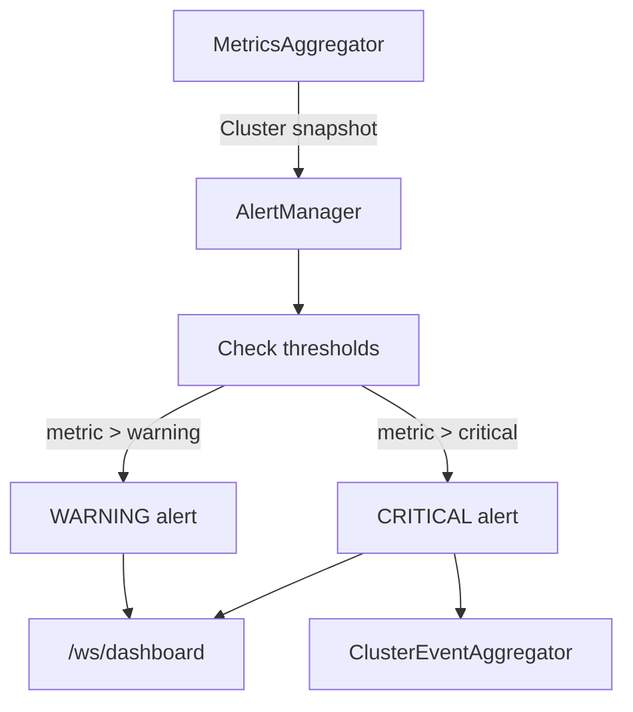

# Observability

This document describes the metrics pipeline, alerting, dynamic aspects, and monitoring interfaces.

## Metrics Architecture



**Key design**: Metrics flow via MessageRouter (gossip), never through consensus. Zero consensus I/O overhead for observability.

## Metrics Collection

### MetricsCollector (Every Node)

Collects local metrics and responds to leader's MetricsPing:

| Metric | Description |
|--------|-------------|
| Node CPU usage | Per-node CPU utilization (0.0-1.0) |
| Heap usage | JVM heap memory |
| GC time | Garbage collection duration |
| Calls per entry point | Request count per method per cycle |
| Total call duration | Aggregate processing time per cycle |
| Success/failure count | Per-method success and failure counts |

### MetricsAggregator (Leader Only)



Maintains a 2-hour sliding window for historical pattern detection (used by TTM predictor).

## Invocation Metrics

Per-method tracking with percentile latencies:

| Metric | Description |
|--------|-------------|
| Call count | Total invocations |
| Success/failure rate | Per-method |
| P50/P95/P99 latency | Percentile distribution |
| EMA latency | Exponentially weighted moving average |
| Slow invocations | Above configurable threshold |

### Slow Invocation Tracking

Configurable threshold strategies:

| Strategy | Description |
|----------|-------------|
| Fixed | Static threshold (e.g., 100ms) |
| Adaptive | Threshold based on recent P95 |
| Per-method | Different threshold per method |
| Composite | Combination of strategies |

## Dynamic Aspects

Runtime-configurable per-method instrumentation via `DynamicAspectInterceptor`:



Toggle at runtime without redeployment or restart. Configuration persisted in KV-Store.

## Alerting

### AlertManager



### Alert Thresholds

Stored in KV-Store via `AlertThresholdKey`:

| Configuration | Description |
|--------------|-------------|
| Metric | Which metric to monitor |
| Warning level | First threshold |
| Critical level | Second threshold |
| Cooldown | Minimum time between alerts |

### ClusterEventAggregator

Ring buffer collecting cluster events (up to 11 types):
- Node join/leave/fail
- Leader change
- Slice lifecycle events
- Blueprint changes
- Alert triggers
- Scaling decisions

## Prometheus Integration

```
GET /metrics/prometheus
```

Standard scrape-compatible format. Exposes all collected metrics:
- Node-level (CPU, heap, GC)
- Per-method invocation metrics
- Cluster topology
- Active alerts

## Dashboard (WebSocket)

```
WS /ws/dashboard
```

Real-time push (no polling):
- Topology visualization
- Live metrics graphs
- Active alerts
- Cluster events stream

Available in both Forge (local development) and production clusters.

## Related Documents

- [08-scaling.md](08-scaling.md) - How metrics drive scaling decisions
- [03-invocation.md](03-invocation.md) - DynamicAspectInterceptor in invocation chain
- [12-management.md](12-management.md) - Management API endpoints
