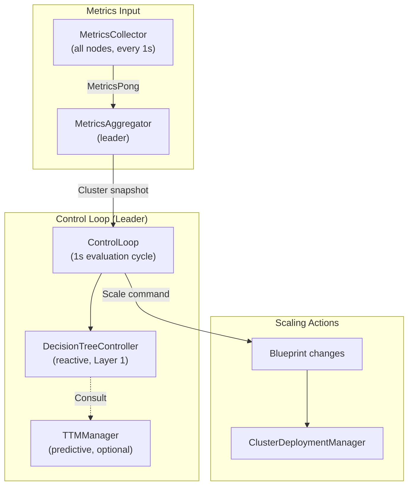
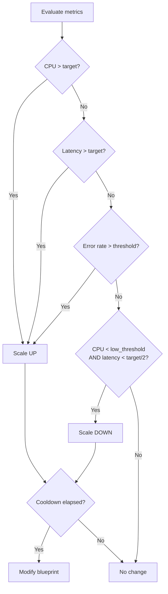
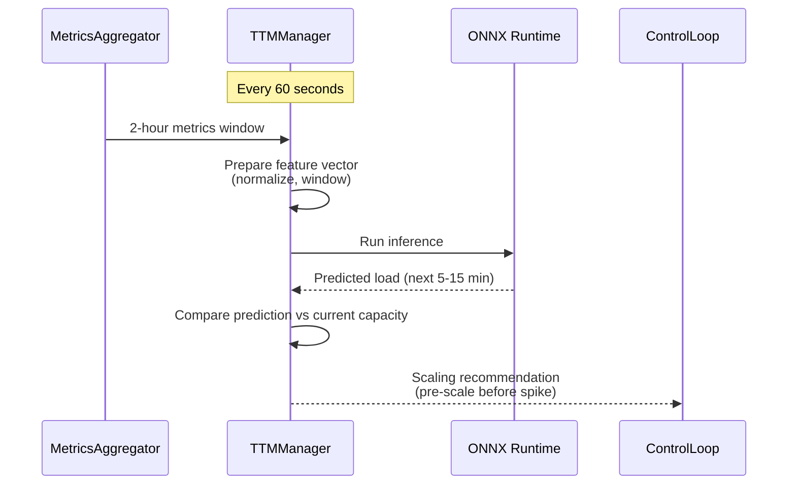
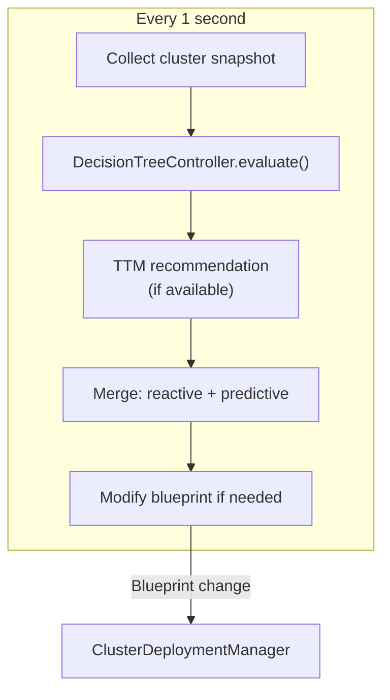
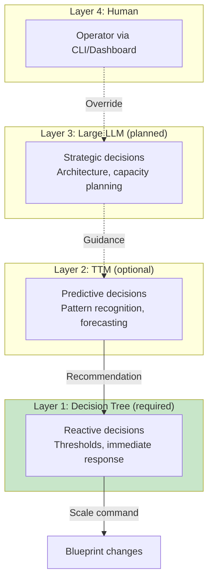

# Auto-Scaling

This document describes the two-tier scaling system: reactive (decision tree) and predictive (TTM).

## Scaling Architecture



## Two-Tier Control

| Tier | Component | Interval | Function |
|------|-----------|----------|----------|
| **Reactive (Layer 1)** | DecisionTreeController | 1 second | Responds to current conditions |
| **Predictive (Layer 2)** | TTMManager (ONNX) | 60 seconds | Forecasts load from 2-hour history |

Layer 1 is mandatory. Layer 2 is optional - requires a trained ONNX model.

## DecisionTreeController (Layer 1)

Deterministic threshold-based scaling. Evaluates every second.

### Decision Logic



### Configuration

```bash
aether scale org.example:order-processor \
    --min 2 --max 10 \
    --target-cpu 60 \
    --target-latency 100ms \
    --cooldown 30s
```

| Parameter | Description | Default |
|-----------|-------------|---------|
| `min` | Minimum instances | 1 |
| `max` | Maximum instances | unbounded |
| `cpuScaleUpThreshold` | Scale up when CPU exceeds | 0.8 (80%) |
| `cpuScaleDownThreshold` | Scale down when CPU below | 0.2 (20%) |
| `callRateScaleUpThreshold` | Scale up on high call rate | configurable |
| `sliceCooldownMs` | Minimum time between scale events | 1000ms |

### Inputs

| Signal | Source | Description |
|--------|--------|-------------|
| CPU utilization | MetricsCollector | Per-node and per-slice |
| Request latency | Invocation metrics | P50/P95/P99 |
| Error rate | Invocation metrics | Failures / total |
| Queue depth | MetricsCollector | Pending requests |
| Historical window | MetricsAggregator | 2-hour sliding window |

## TTMManager (Layer 2)

ML-based predictive autoscaling using ONNX Runtime.

### Architecture



### Feature Vector (11 Metrics)

| Index | Feature | Description |
|-------|---------|-------------|
| 0 | CPU_USAGE | Node CPU utilization |
| 1 | HEAP_USAGE | JVM heap utilization |
| 2 | EVENT_LOOP_LAG_MS | Event loop lag |
| 3 | LATENCY_MS | Average latency |
| 4 | INVOCATIONS | Request count |
| 5 | GC_PAUSE_MS | GC pause duration |
| 6 | LATENCY_P50 | 50th percentile latency |
| 7 | LATENCY_P95 | 95th percentile latency |
| 8 | LATENCY_P99 | 99th percentile latency |
| 9 | ERROR_RATE | Failure rate |
| 10 | EVENT_COUNT | Event count |

### How It Works

1. TTM receives minute-aggregated metrics from `MinuteAggregator`
2. Prepares tensor with shape `{1, seqLen, 11}` (11 features above)
3. Runs ONNX model inference via `OrtSession`
4. Calculates confidence: `1 - tanh(sqrt(max(0, variance)))` (0.0 to 1.0)
5. `ForecastAnalyzer` compares predictions to 5-minute historical average
6. Generates `ScalingRecommendation`:
   - `PreemptiveScaleUp(predictedCpuPeak, predictedLatency, suggestedInstances)`
   - `PreemptiveScaleDown(predictedCpuTrough, suggestedInstances)`
   - `AdjustThresholds(newCpuScaleUpThreshold, newCpuScaleDownThreshold)`
   - `NoAction(STABLE | LOW_CONFIDENCE | INSUFFICIENT_DATA)`

### Model

- Format: ONNX (portable, no Python dependency at runtime)
- Training: Offline, from historical metrics
- CPU thresholds: 0.7 (high), 0.3 (low), 0.15 (change detection)
- Leader-only: inference runs on leader node; followers receive state via replication

TTM is optional. Without a trained model, the system operates on Layer 1 (reactive) only.

## Control Loop



### Safeguards

| Safeguard | Description |
|-----------|-------------|
| Cooldown period | Minimum time between scale events per slice |
| Min/max bounds | Never scale below min or above max |
| Step size | Maximum instances added/removed per event |
| Disruption budget | Respect rolling update constraints |

## Layered Autonomy



- Layer 1 is always present - cluster survives with only decision tree
- Higher layers are optional enhancements
- Graceful degradation: if TTM unavailable, decision tree handles everything
- Problems escalate up, decisions flow down

## Related Documents

- [07-observability.md](07-observability.md) - Metrics that drive scaling
- [02-deployment.md](02-deployment.md) - Blueprint changes triggered by scaling
- [05-worker-pools.md](05-worker-pools.md) - Scaling across worker groups
