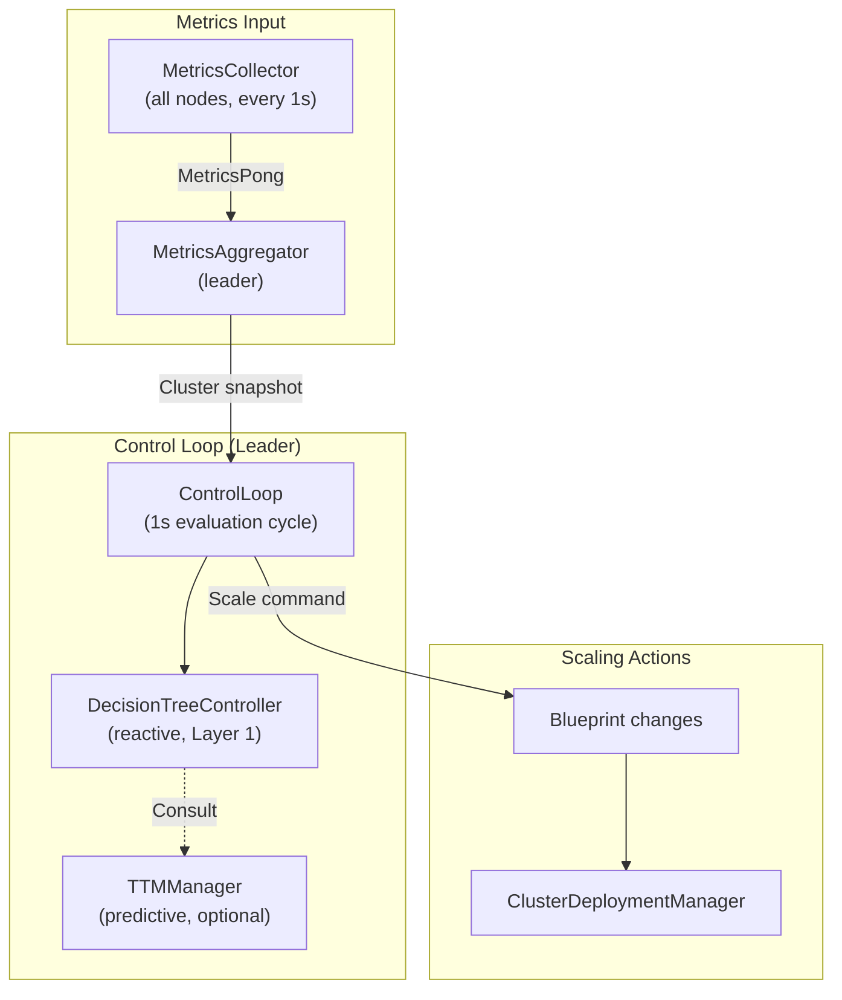
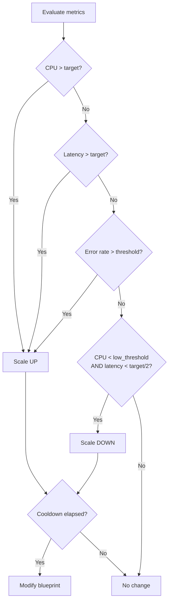
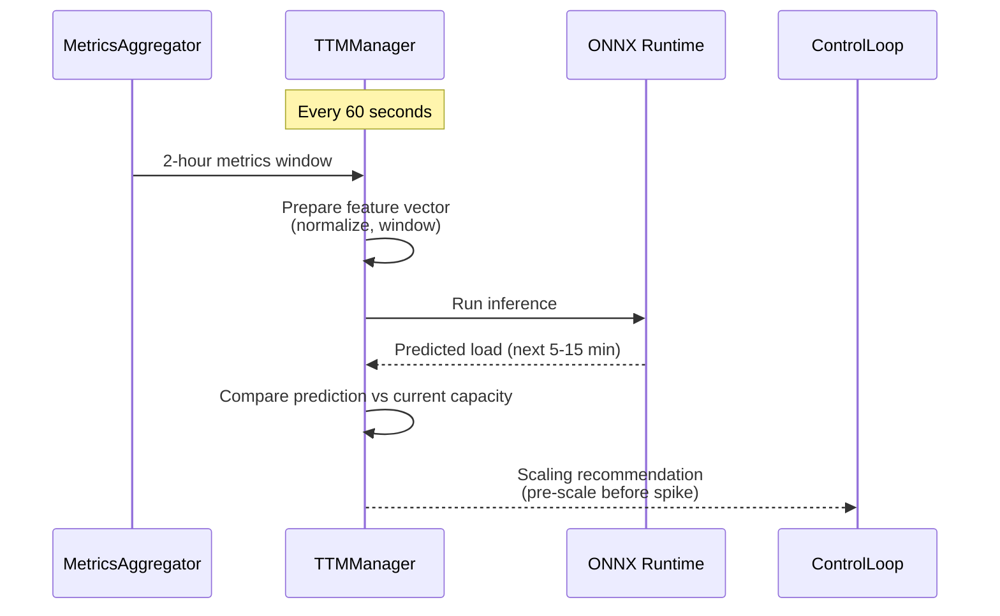
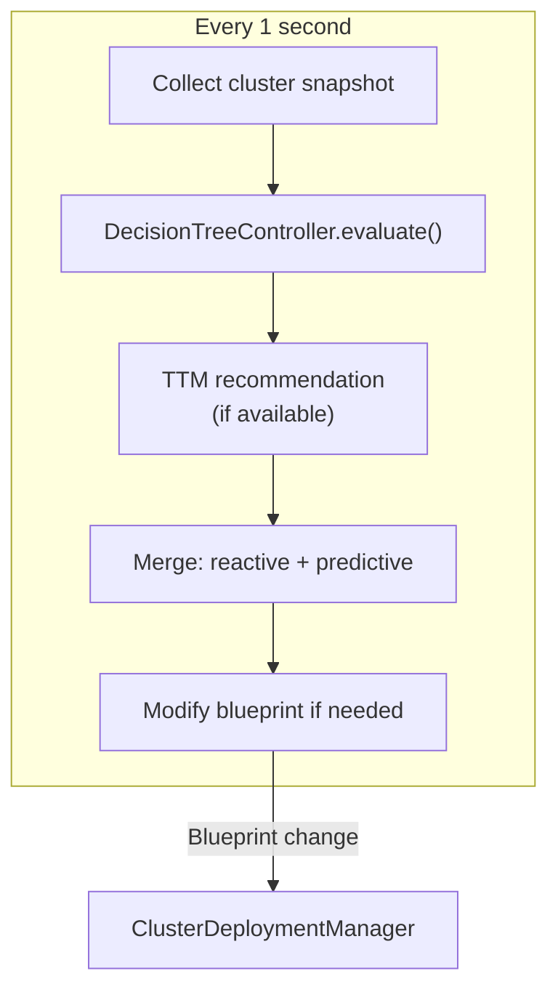
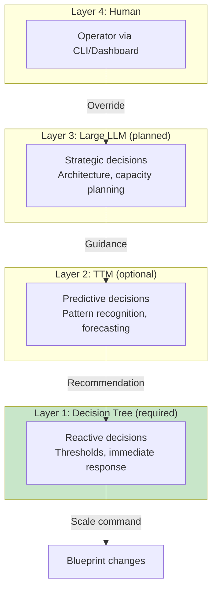

# Auto-Scaling

This document describes the two-tier scaling system: reactive (decision tree) and predictive (TTM).

## Scaling Architecture


```mermaid
graph TB
    subgraph Input["Metrics Input"]
        MC["MetricsCollector<br/>(all nodes, every 1s)"]
        MAG["MetricsAggregator<br/>(leader)"]
    end

    subgraph Control["Control Loop (Leader)"]
        CL["ControlLoop<br/>(1s evaluation cycle)"]
        DTC["DecisionTreeController<br/>(reactive, Layer 1)"]
        TTM["TTMManager<br/>(predictive, optional)"]
    end

    subgraph Output["Scaling Actions"]
        BP["Blueprint changes"]
        CDM["ClusterDeploymentManager"]
    end

    MC -->|"MetricsPong"| MAG
    MAG -->|"Cluster snapshot"| CL

    CL --> DTC
    DTC -.->|"Consult"| TTM

    CL -->|"Scale command"| BP
    BP --> CDM
```

## Two-Tier Control

| Tier | Component | Interval | Function |
|------|-----------|----------|----------|
| **Reactive (Layer 1)** | DecisionTreeController | 1 second | Responds to current conditions |
| **Predictive (Layer 2)** | TTMManager (ONNX) | 60 seconds | Forecasts load from 2-hour history |

Layer 1 is mandatory. Layer 2 is optional - requires a trained ONNX model.

## DecisionTreeController (Layer 1)

Deterministic threshold-based scaling. Evaluates every second.

### Decision Logic


```mermaid
graph TB
    Start["Evaluate metrics"] --> CPU{"CPU > target?"}

    CPU -->|"Yes"| ScaleUp["Scale UP"]
    CPU -->|"No"| Latency{"Latency > target?"}

    Latency -->|"Yes"| ScaleUp
    Latency -->|"No"| ErrorRate{"Error rate > threshold?"}

    ErrorRate -->|"Yes"| ScaleUp
    ErrorRate -->|"No"| UnderUtil{"CPU < low_threshold<br/>AND latency < target/2?"}

    UnderUtil -->|"Yes"| ScaleDown["Scale DOWN"]
    UnderUtil -->|"No"| NoAction["No change"]

    ScaleUp --> Cooldown{"Cooldown elapsed?"}
    ScaleDown --> Cooldown

    Cooldown -->|"Yes"| Execute["Modify blueprint"]
    Cooldown -->|"No"| NoAction
```

### Configuration

```bash
aether scale org.example:order-processor \
    --min 2 --max 10 \
    --target-cpu 60 \
    --target-latency 100ms \
    --cooldown 30s
```

| Parameter | Description | Default |
|-----------|-------------|---------|
| `min` | Minimum instances | 1 |
| `max` | Maximum instances | unbounded |
| `cpuScaleUpThreshold` | Scale up when CPU exceeds | 0.8 (80%) |
| `cpuScaleDownThreshold` | Scale down when CPU below | 0.2 (20%) |
| `callRateScaleUpThreshold` | Scale up on high call rate | configurable |
| `sliceCooldownMs` | Minimum time between scale events | 1000ms |

### Inputs

| Signal | Source | Description |
|--------|--------|-------------|
| CPU utilization | MetricsCollector | Per-node and per-slice |
| Request latency | Invocation metrics | P50/P95/P99 |
| Error rate | Invocation metrics | Failures / total |
| Queue depth | MetricsCollector | Pending requests |
| Historical window | MetricsAggregator | 2-hour sliding window |

## TTMManager (Layer 2)

ML-based predictive autoscaling using ONNX Runtime.

### Architecture


```mermaid
sequenceDiagram
    participant MAG as MetricsAggregator
    participant TTM as TTMManager
    participant ONNX as ONNX Runtime
    participant CL as ControlLoop

    Note over TTM: Every 60 seconds

    MAG->>TTM: 2-hour metrics window
    TTM->>TTM: Prepare feature vector<br/>(normalize, window)
    TTM->>ONNX: Run inference
    ONNX-->>TTM: Predicted load (next 5-15 min)

    TTM->>TTM: Compare prediction vs current capacity
    TTM-->>CL: Scaling recommendation<br/>(pre-scale before spike)
```

### Feature Vector (11 Metrics)

| Index | Feature | Description |
|-------|---------|-------------|
| 0 | CPU_USAGE | Node CPU utilization |
| 1 | HEAP_USAGE | JVM heap utilization |
| 2 | EVENT_LOOP_LAG_MS | Event loop lag |
| 3 | LATENCY_MS | Average latency |
| 4 | INVOCATIONS | Request count |
| 5 | GC_PAUSE_MS | GC pause duration |
| 6 | LATENCY_P50 | 50th percentile latency |
| 7 | LATENCY_P95 | 95th percentile latency |
| 8 | LATENCY_P99 | 99th percentile latency |
| 9 | ERROR_RATE | Failure rate |
| 10 | EVENT_COUNT | Event count |

### How It Works

1. TTM receives minute-aggregated metrics from `MinuteAggregator`
2. Prepares tensor with shape `{1, seqLen, 11}` (11 features above)
3. Runs ONNX model inference via `OrtSession`
4. Calculates confidence: `1 - tanh(sqrt(max(0, variance)))` (0.0 to 1.0)
5. `ForecastAnalyzer` compares predictions to 5-minute historical average
6. Generates `ScalingRecommendation`:
   - `PreemptiveScaleUp(predictedCpuPeak, predictedLatency, suggestedInstances)`
   - `PreemptiveScaleDown(predictedCpuTrough, suggestedInstances)`
   - `AdjustThresholds(newCpuScaleUpThreshold, newCpuScaleDownThreshold)`
   - `NoAction(STABLE | LOW_CONFIDENCE | INSUFFICIENT_DATA)`

### Model

- Format: ONNX (portable, no Python dependency at runtime)
- Training: Offline, from historical metrics
- CPU thresholds: 0.7 (high), 0.3 (low), 0.15 (change detection)
- Leader-only: inference runs on leader node; followers receive state via replication

TTM is optional. Without a trained model, the system operates on Layer 1 (reactive) only.

## Control Loop


```mermaid
graph TB
    subgraph Cycle["Every 1 second"]
        Collect["Collect cluster snapshot"]
        Evaluate["DecisionTreeController.evaluate()"]
        TTMCheck["TTM recommendation<br/>(if available)"]
        Decide["Merge: reactive + predictive"]
        Act["Modify blueprint if needed"]
    end

    Collect --> Evaluate --> TTMCheck --> Decide --> Act
    Act -->|"Blueprint change"| CDM["ClusterDeploymentManager"]
```

### Safeguards

| Safeguard | Description |
|-----------|-------------|
| Cooldown period | Minimum time between scale events per slice |
| Min/max bounds | Never scale below min or above max |
| Step size | Maximum instances added/removed per event |
| Disruption budget | Respect deployment constraints |

## Layered Autonomy


```mermaid
graph TB
    subgraph L4["Layer 4: Human"]
        User["Operator via CLI/Dashboard"]
    end

    subgraph L3["Layer 3: Large LLM (planned)"]
        LLM["Strategic decisions<br/>Architecture, capacity planning"]
    end

    subgraph L2["Layer 2: TTM (optional)"]
        TTM2["Predictive decisions<br/>Pattern recognition, forecasting"]
    end

    subgraph L1["Layer 1: Decision Tree (required)"]
        DT["Reactive decisions<br/>Thresholds, immediate response"]
    end

    User -.->|"Override"| LLM
    LLM -.->|"Guidance"| TTM2
    TTM2 -->|"Recommendation"| DT
    DT -->|"Scale command"| Cluster["Blueprint changes"]

    style L1 fill:#c8e6c9
```

- Layer 1 is always present - cluster survives with only decision tree
- Higher layers are optional enhancements
- Graceful degradation: if TTM unavailable, decision tree handles everything
- Problems escalate up, decisions flow down

## Cluster Scaling: Mechanism & Limits

The sections above describe **application auto-scaling** — how the runtime adjusts the *instance count of a slice* in response to load. This section describes the orthogonal question: **how far the cluster itself scales**, by what mechanism, and where the known limits are. An evaluator needs both the named mechanism and the ceiling; "it scales" without either undercuts trust rather than building it.

### The mechanism, named

Aether scales the cluster along **two composable axes** (detailed in [05-worker-pools.md](05-worker-pools.md)):

1. **Within-community growth** — a worker community grows by adding SWIM-gossip worker nodes under its deterministic governor. No consensus is involved; workers scale horizontally.
2. **Hierarchy of communities** — multiple worker communities attach to a single 5–9-node Rabia core. The core runs the control plane (consensus, deployment, membership); communities execute application slices. Adding communities, not core nodes, is how total node count grows.

The core stays small on purpose: consensus is the one thing that must *not* scale with total node count.

### Core sizing and fault-tolerance math

The core is a Rabia consensus group of **5–9 nodes**. Quorum is a simple majority, `coreCount / 2 + 1` (`TopologyManager.quorumSize()`; `QuorumLossDetector.java:33`), so the core tolerates **⌊(N−1)/2⌋ simultaneous core losses** before it loses quorum and the minority self-dissolves (the partition contract in [14-consistency-and-partitions.md](14-consistency-and-partitions.md)):

| Core size N | Quorum (N/2)+1 | Simultaneous losses tolerated |
|-------------|----------------|-------------------------------|
| 5 | 3 | 2 |
| 7 | 4 | 3 |
| 9 | 5 | 4 |

Above ~9 the O(N²) all-to-all Rabia message cost dominates (72 messages/round at 9 nodes; see [05-worker-pools.md](05-worker-pools.md)), which is why total scale comes from communities, not a larger core.

### Two scale dimensions — do not conflate

The scaling story has two distinct dimensions, each with its **own** validation gate. Numbers live in one place — [`../reference/known-limitations.md`](../reference/known-limitations.md) — and this doc references them:

| Dimension | What it measures | Target / number | Validation status |
|-----------|------------------|-----------------|-------------------|
| **Single community at scale** | One community at its node cap | ~100 nodes (design target; authoritative row in [known-limitations.md](../reference/known-limitations.md)) | **Pending validation** — single-community node-cap sweep (#365 / #366) |
| **Multi-community / hierarchical seam** | Total reach across communities; the core coordination-load slope at 1→2→3 communities | Output of the barrier run, not pre-committed | **Pending validation** — 3×3 barrier sweep (#367) |
| **Max communities** | How many communities one core coordinates | Bounded by the coordination-load slope above | **Pending validation** (#367) |

> **Pending validation (#365 / #367).** Neither scale dimension is empirically confirmed at target yet. The single-community cap (~100) is what the node-cap sweep is built to *confirm*, not a measured ceiling; the hierarchical reach and max-community count are outputs of the multi-community barrier run (#367, the headline GA gate). Until those runs land, these are stated as design targets, not measured facts. When measured, the numbers replace the targets in [known-limitations.md](../reference/known-limitations.md) — in one place, referenced here.

## Related Documents

- [07-observability.md](07-observability.md) - Metrics that drive scaling
- [02-deployment.md](02-deployment.md) - Blueprint changes triggered by scaling
- [05-worker-pools.md](05-worker-pools.md) - Two-layer topology, governors, and the community mechanism this section names
- [14-consistency-and-partitions.md](14-consistency-and-partitions.md) - The partition contract the core's fault-tolerance math rests on
- [../reference/known-limitations.md](../reference/known-limitations.md) - Single source for the scaling numbers and their validation status
