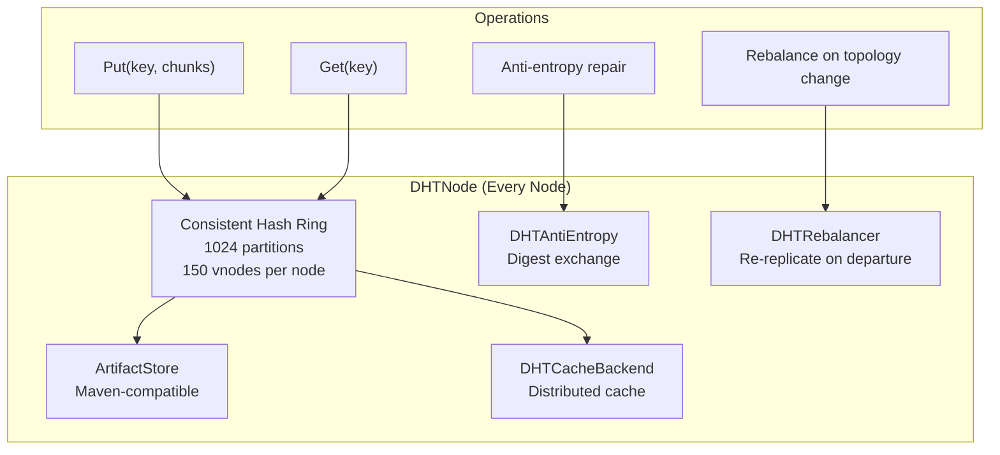
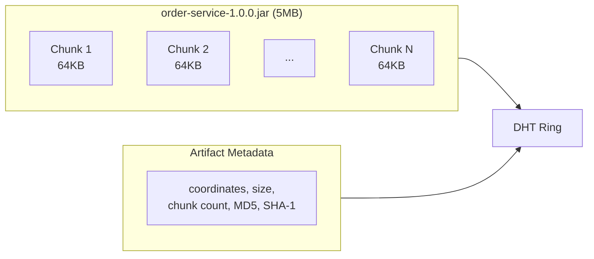
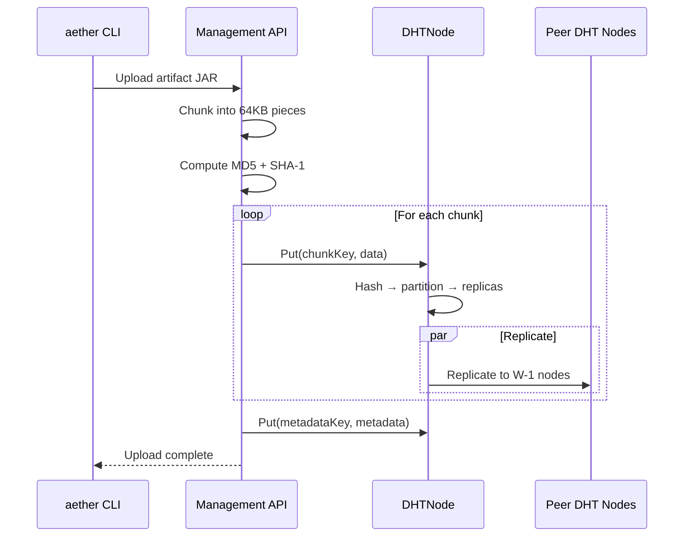
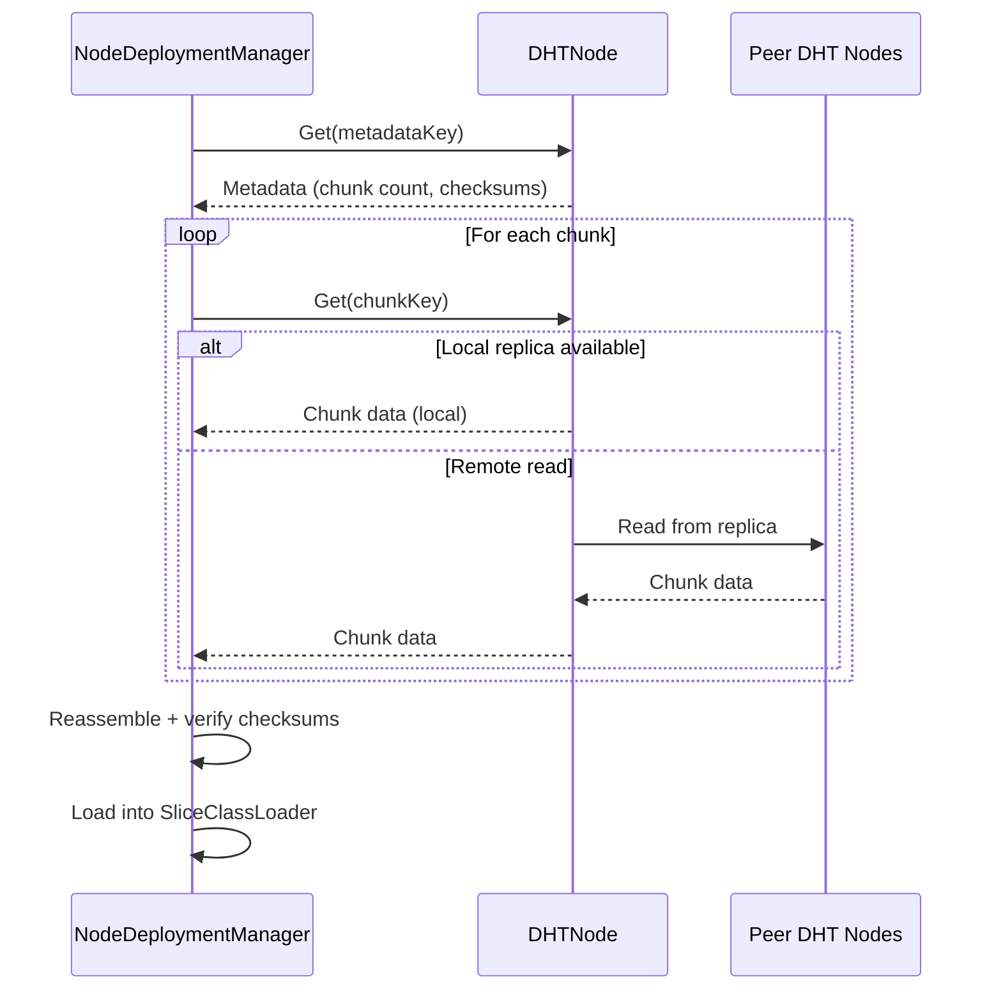
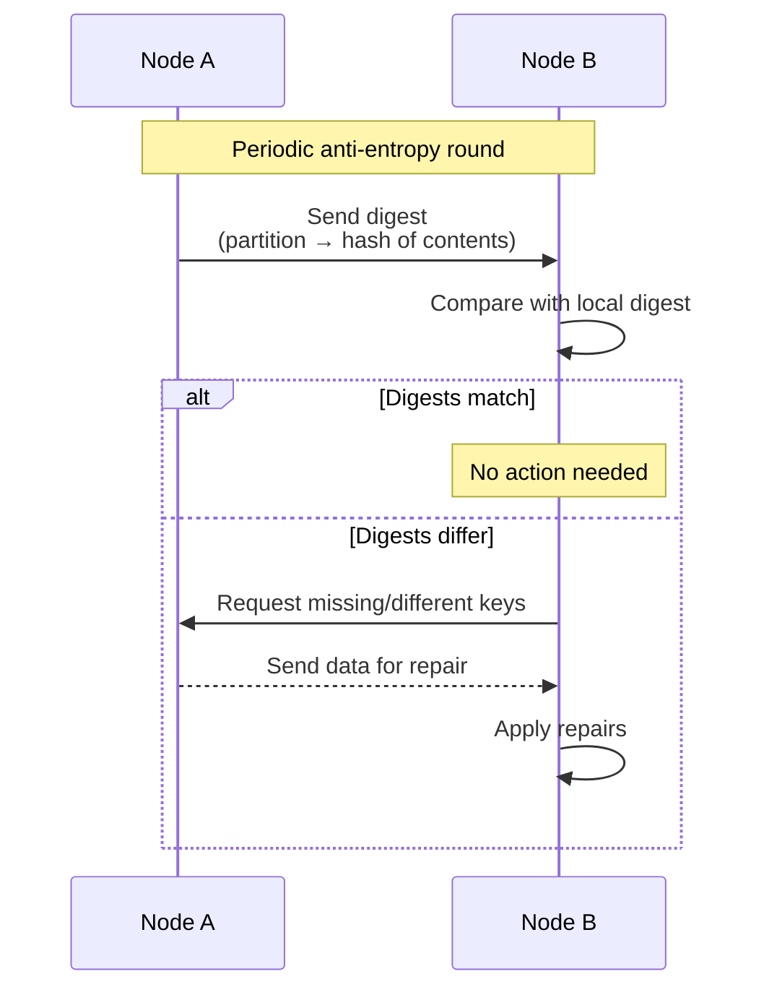
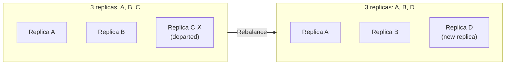

# Distributed Storage (DHT)

This document describes the distributed hash table used for artifact storage and caching.

## DHT Architecture

## Consistent Hashing

| Parameter | Value |
|-----------|-------|
| Partitions | 1024 |
| Virtual nodes per physical node | 150 |
| Hash function | MurmurHash3 |
| Replication modes | Full, Quorum, Single |

### Replication Modes

| Mode | Write quorum | Read quorum | Use case |
|------|-------------|------------|----------|
| **Full** | All nodes | Any node | Development (Forge) |
| **Quorum** | W=2, R=2 (for RF=3) | W=2, R=2 | Production (default) |
| **Single** | 1 node | 1 node | Non-critical data |

Production default: 3 replicas with quorum consistency (W=2, R=2).

## Artifact Storage

### Storage Model

Artifacts (slice JARs) are stored as chunked blobs:

| Parameter | Value |
|-----------|-------|
| Chunk size | 64KB |
| Integrity check | MD5 + SHA-1 |
| Resolution order | Local Maven repo (dev) → DHT (production) |

### Upload Flow

### Download Flow

## Anti-Entropy

`DHTAntiEntropy` ensures data consistency across replicas through periodic digest exchange:

- Digest: compact hash of partition contents
- Exchange: periodic (configurable interval)
- Repair: only missing or differing entries transferred
- Direction: bidirectional (both sides can repair)

## Rebalancer

`DHTRebalancer` handles data movement when topology changes:

### Node Departure

When a node departs, DHTRebalancer identifies under-replicated partitions and re-replicates data to new responsible nodes.

### Node Join

New nodes receive their partition assignments from the hash ring and pull data from existing replicas during the initial sync period.

## DHT Cache Backend

`DHTCacheBackend` provides a distributed cache for infrastructure slices:

| Operation | Description |
|-----------|-------------|
| `get(key)` | Read from DHT with configured consistency |
| `put(key, value, ttl)` | Write with time-to-live |
| `remove(key)` | Delete from DHT |

Used by CacheService infrastructure slice for cluster-wide caching.

## Related Documents

- [02-deployment.md](02-deployment.md) - Artifact resolution during slice loading
- [01-consensus.md](01-consensus.md) - KV-Store (separate from DHT)
- [04-networking.md](04-networking.md) - DHT messages via MessageRouter
