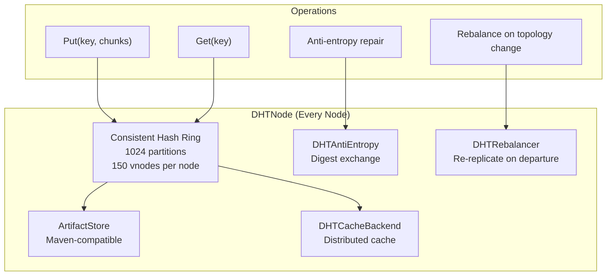
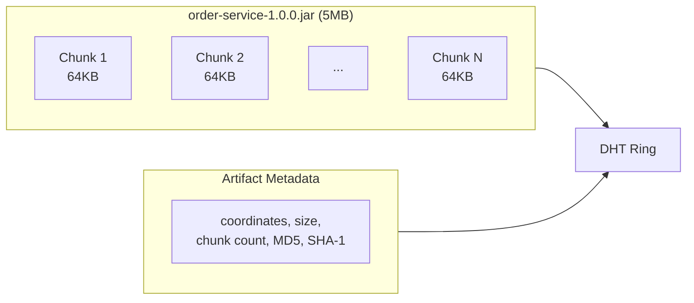
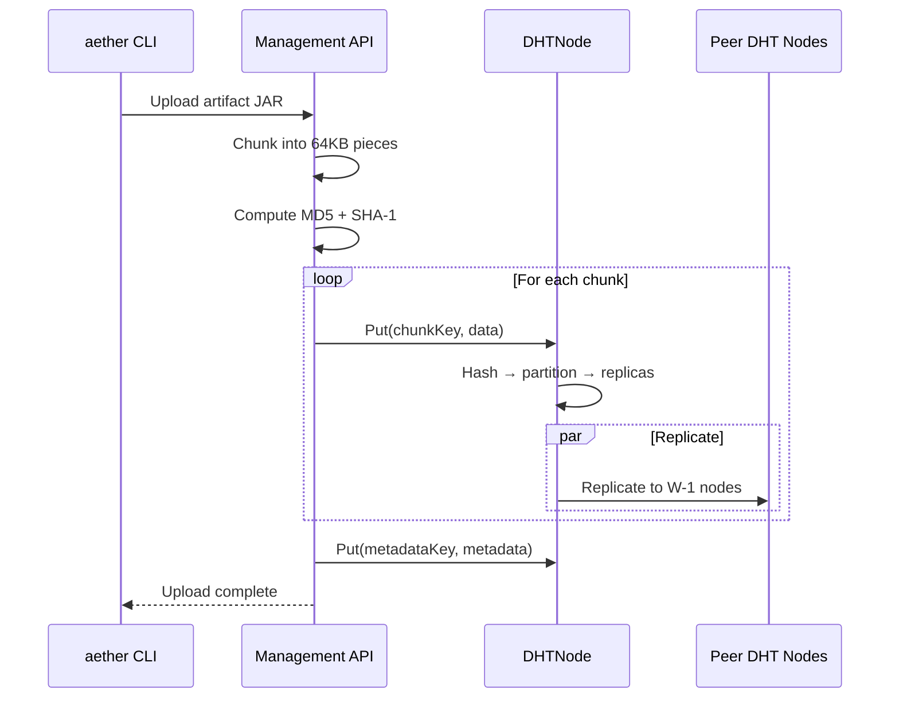
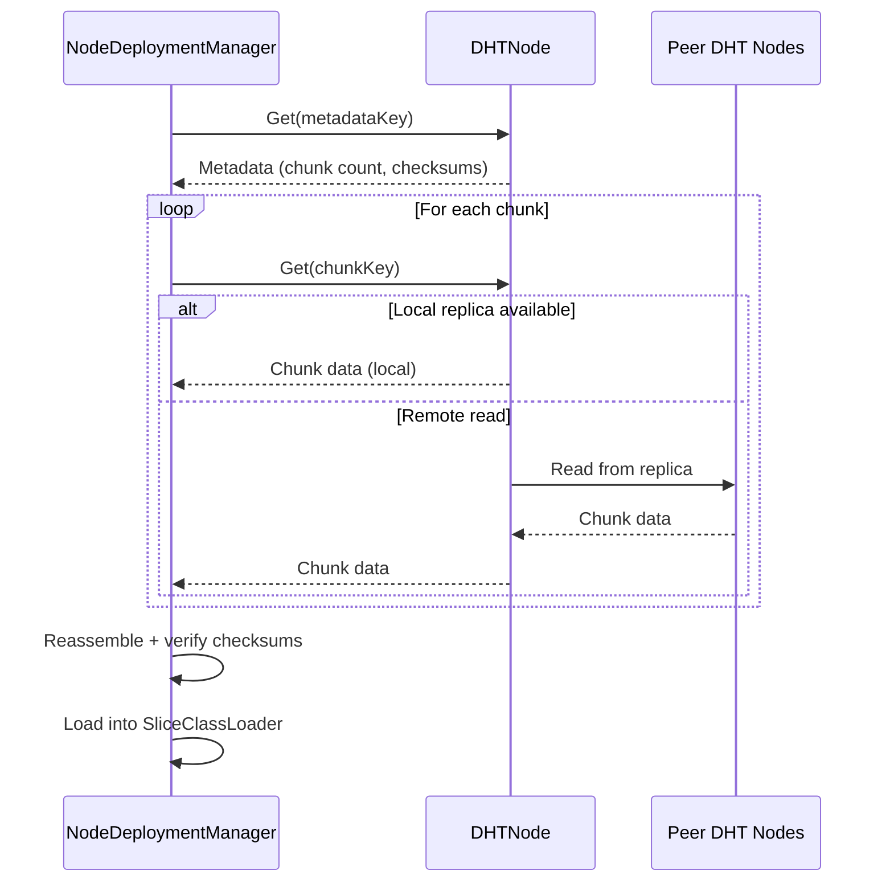
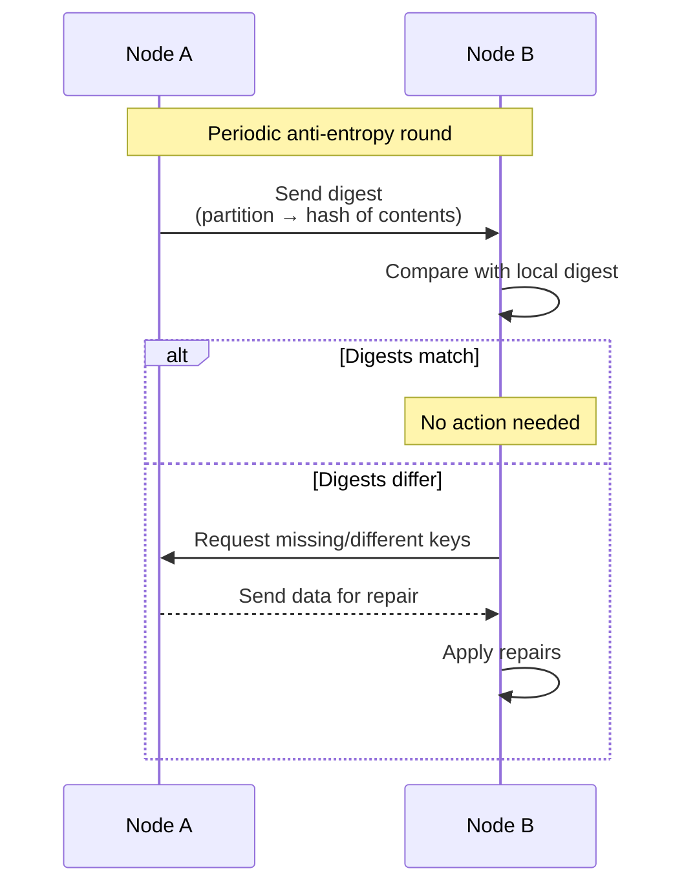
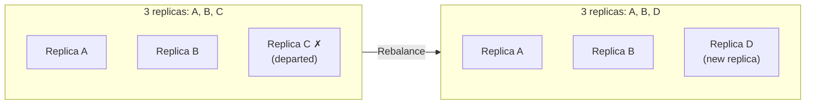

# Distributed Storage (DHT)

This document describes the distributed hash table used for artifact storage and caching.

## DHT Architecture

```mermaid
graph TB
    subgraph DHT["DHTNode (Every Node)"]
        Ring["Consistent Hash Ring<br/>1024 partitions<br/>150 vnodes per node"]
        AS["ArtifactStore<br/>Maven-compatible"]
        DC["DHTCacheBackend<br/>Distributed cache"]
        AE["DHTAntiEntropy<br/>Digest exchange"]
        RB["DHTRebalancer<br/>Re-replicate on departure"]
    end

    subgraph Operations
        Put["Put(key, chunks)"]
        Get["Get(key)"]
        Repair["Anti-entropy repair"]
        Rebal["Rebalance on topology change"]
    end

    Put --> Ring
    Get --> Ring
    Repair --> AE
    Rebal --> RB

    Ring --> AS
    Ring --> DC
```

## Consistent Hashing

| Parameter | Value |
|-----------|-------|
| Partitions | 1024 |
| Virtual nodes per physical node | 150 |
| Hash function | MurmurHash3 |
| Replication modes | Full, Quorum, Single |

### Replication Modes

| Mode | Write quorum | Read quorum | Use case |
|------|-------------|------------|----------|
| **Full** | All nodes | Any node | Development (Forge) |
| **Quorum** | W=2, R=2 (for RF=3) | W=2, R=2 | Production (default) |
| **Single** | 1 node | 1 node | Non-critical data |

Production default: 3 replicas with quorum consistency (W=2, R=2).

> **Not all DHT-hosted data uses the quorum default.** The quorum modes above apply to the artifact repository and cache. Aether's *system maps* (slice-node, HTTP-route, and endpoint state) run over `DHTConfig.FULL` (W=R=1) on an in-memory engine — see [Consistency and Durability](#consistency-and-durability) for the guarantee that keyspace actually provides.

## Artifact Storage

### Storage Model

Artifacts (slice JARs) are stored as chunked blobs:

```mermaid
graph LR
    subgraph Artifact["order-service-1.0.0.jar (5MB)"]
        C1["Chunk 1<br/>64KB"]
        C2["Chunk 2<br/>64KB"]
        C3["..."]
        CN["Chunk N<br/>64KB"]
    end

    subgraph Metadata["Artifact Metadata"]
        M["coordinates, size,<br/>chunk count, MD5, SHA-1"]
    end

    Artifact --> DHT["DHT Ring"]
    Metadata --> DHT
```

| Parameter | Value |
|-----------|-------|
| Chunk size | 64KB |
| Integrity check | MD5 + SHA-1 |
| Resolution order | Local Maven repo (dev) → DHT (production) |

### Upload Flow

```mermaid
sequenceDiagram
    participant CLI as aether CLI
    participant API as Management API
    participant DHT as DHTNode
    participant Peers as Peer DHT Nodes

    CLI->>API: Upload artifact JAR
    API->>API: Chunk into 64KB pieces
    API->>API: Compute MD5 + SHA-1

    loop For each chunk
        API->>DHT: Put(chunkKey, data)
        DHT->>DHT: Hash → partition → replicas
        par Replicate
            DHT->>Peers: Replicate to W-1 nodes
        end
    end

    API->>DHT: Put(metadataKey, metadata)
    API-->>CLI: Upload complete
```

### Download Flow

```mermaid
sequenceDiagram
    participant NDM as NodeDeploymentManager
    participant DHT as DHTNode
    participant Peers as Peer DHT Nodes

    NDM->>DHT: Get(metadataKey)
    DHT-->>NDM: Metadata (chunk count, checksums)

    loop For each chunk
        NDM->>DHT: Get(chunkKey)
        alt Local replica available
            DHT-->>NDM: Chunk data (local)
        else Remote read
            DHT->>Peers: Read from replica
            Peers-->>DHT: Chunk data
            DHT-->>NDM: Chunk data
        end
    end

    NDM->>NDM: Reassemble + verify checksums
    NDM->>NDM: Load into SliceClassLoader
```

## Anti-Entropy

`DHTAntiEntropy` ensures data consistency across replicas through periodic digest exchange:

```mermaid
sequenceDiagram
    participant A as Node A
    participant B as Node B

    Note over A,B: Periodic anti-entropy round

    A->>B: Send digest<br/>(partition → hash of contents)
    B->>B: Compare with local digest

    alt Digests match
        Note over B: No action needed
    else Digests differ
        B->>A: Request missing/different keys
        A-->>B: Send data for repair
        B->>B: Apply repairs
    end
```

- Digest: compact hash of partition contents
- Exchange: periodic (configurable interval)
- Repair: only missing or differing entries transferred
- Direction: bidirectional (both sides can repair)

## Rebalancer

`DHTRebalancer` handles data movement when topology changes:

### Node Departure

```mermaid
graph LR
    subgraph Before["3 replicas: A, B, C"]
        RA["Replica A"]
        RB["Replica B"]
        RC["Replica C ✗<br/>(departed)"]
    end

    Before -->|"Rebalance"| After

    subgraph After["3 replicas: A, B, D"]
        RA2["Replica A"]
        RB2["Replica B"]
        RD["Replica D<br/>(new replica)"]
    end
```

When a node departs, DHTRebalancer identifies under-replicated partitions and re-replicates data to new responsible nodes.

### Node Join

New nodes receive their partition assignments from the hash ring and pull data from existing replicas during the initial sync period.

## DHT Cache Backend

`DHTCacheBackend` provides a distributed cache for infrastructure slices:

| Operation | Description |
|-----------|-------------|
| `get(key)` | Read from DHT with configured consistency |
| `put(key, value, ttl)` | Write with time-to-live |
| `remove(key)` | Delete from DHT |

Used by CacheService infrastructure slice for cluster-wide caching.

## Consistency and Durability

The DHT hosts two classes of data with **different** guarantees. The distinction matters for operators, because one class is a deliberate downgrade from the consensus plane and is easy to mistake for a strongly-consistent store.

| Data class | Config | Consistency | Durability | Under partition |
|------------|--------|-------------|------------|-----------------|
| Artifact repository, cache | Quorum (default RF=3, W=R=2) | Quorum LWW by HLC — eventual, concurrent writes LWW-dropped; anti-entropy repairs replicas | In-memory, replicated; artifacts also resolvable from Maven | Majority |
| **System maps** — slice-node, HTTP-route, endpoint | `DHTConfig.FULL` (W=R=1) | **Eventual, not linearizable** — a write acks after one local put, a read returns the first non-empty response with no version reconciliation and **no read-repair**; `FULL` also disables anti-entropy and rebalancing (`DHTConfig.FULL`, `integrations/dht/.../DHTConfig.java`; wired at `AetherNode.java:1069` via `AetherMaps`) | **Not crash-durable** — in-memory engine (`MemoryStorageEngine`, `AetherNode.java:421`); a full-cluster restart loses this state | Side with ≥1 replica serves; **reads may be stale across nodes** |

**The system-maps guarantee is a deliberate downgrade, not only a performance win.** Slice-node, HTTP-route, and endpoint state was migrated *off* consensus (where it was CP and quorum-durable) *onto* the eventual DHT `ReplicatedMap` to trade O(N) consensus write-amplification for O(3) replication (feature-catalog rows 94/95/152/281). The trade Aether accepts in return: these reads can be stale across nodes, and the state is reconstructed (not recovered) after a full restart. This is safe because the maps are **derived, self-healing state** — nodes re-register their slices, routes, and endpoints on activation, so the cluster re-converges rather than depending on the DHT surviving a crash.

The precise per-operation rows (`dht.write` / `dht.read`, system maps vs. artifact repo) are in [`../reference/guarantees.md`](../reference/guarantees.md) §2 and §7; the architecture-level summary and the partition contract are in [`14-consistency-and-partitions.md`](14-consistency-and-partitions.md); the scope statement is in [`../reference/known-limitations.md`](../reference/known-limitations.md). This section does not restate those — it points to them. *Tracking: [#384](https://github.com/pragmaticalabs/pragmatica/issues/384); the `FULL` docstring honesty fix was [#380](https://github.com/pragmaticalabs/pragmatica/issues/380).*

## Related Documents

- [02-deployment.md](02-deployment.md) - Artifact resolution during slice loading
- [01-consensus.md](01-consensus.md) - KV-Store (separate from DHT)
- [04-networking.md](04-networking.md) - DHT messages via MessageRouter
- [14-consistency-and-partitions.md](14-consistency-and-partitions.md) - Per-operation consistency & partition contract (DHT rows summarized)
- [../reference/known-limitations.md](../reference/known-limitations.md) - Scope: the DHT downgrade as a stated boundary
