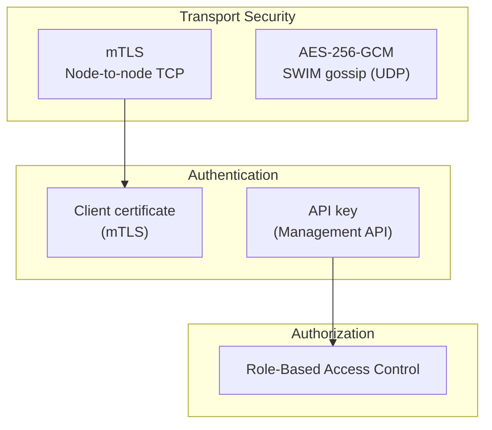
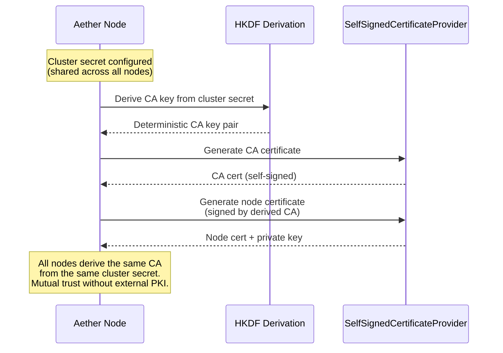
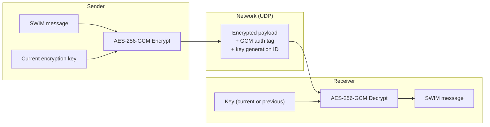
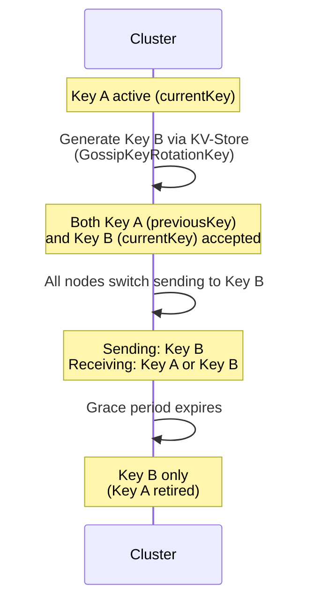
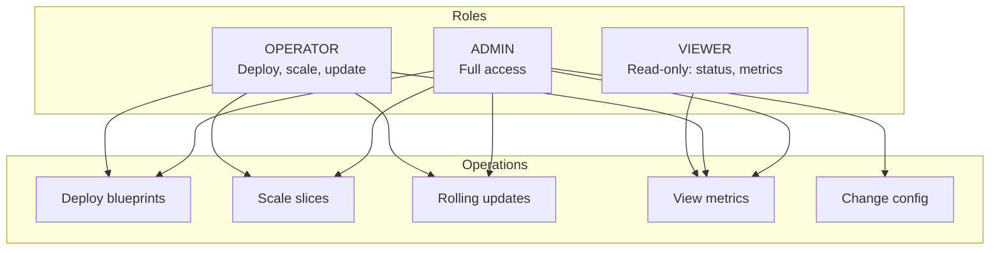
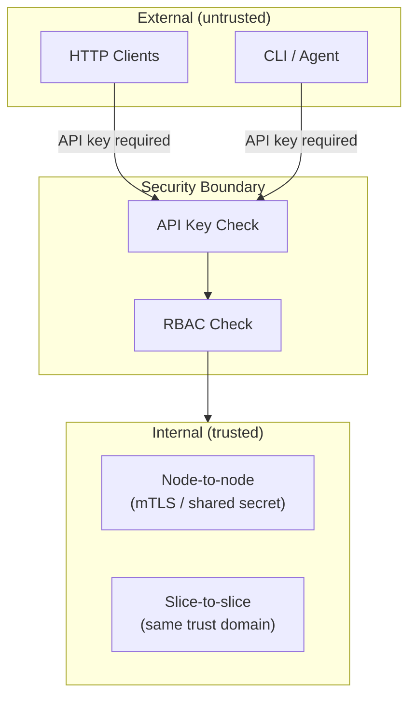

# Security

This document describes the security architecture: mTLS, gossip encryption, RBAC, and API key authentication.

## Security Layers



## mTLS (Mutual TLS)

All node-to-node TCP communication (consensus, invocation, DHT, HTTP forwarding) can be secured with mutual TLS.

### Certificate Provisioning



### Key Properties

| Property | Value |
|----------|-------|
| CA derivation | HKDF from shared cluster secret |
| HKDF salt | `"aether-ca-seed"` (UTF-8) |
| HKDF info label | `"aether-ca-key-v1"` (UTF-8) |
| EC curve | P-256 |
| Signature algorithm | SHA256withECDSA |
| CA validity | 365 days, Subject: `CN=Aether Cluster CA` |
| Node cert validity | 7 days |
| Trust model | All nodes sharing the secret trust each other |
| External PKI | Not required |

### How It Works

1. All nodes in a cluster share a secret (configured at deployment)
2. Each node independently derives the same CA key pair using HKDF
3. Each node generates its own certificate signed by this CA
4. Since all nodes derive the same CA, they mutually trust each other
5. No certificate distribution, no external PKI, no manual trust configuration

## Gossip Encryption

SWIM protocol messages (UDP) are encrypted with AES-256-GCM:



### Wire Format

```
[4-byte keyId (big-endian)] [12-byte nonce (random)] [ciphertext + 16-byte GCM auth tag]
```

| Constant | Value |
|----------|-------|
| Key size | 32 bytes (AES-256) |
| Nonce size | 12 bytes |
| GCM tag | 128 bits |
| Header overhead | 16 bytes (keyId + nonce) |

### Dual-Key Rotation



- Key rotation state stored in KV-Store via `GossipKeyRotationKey`
- Two keys active simultaneously: `currentKey` + `previousKey`
- KeyId in wire format identifies which key was used
- Receivers try current key first, fall back to previous
- `UnknownKeyId` error if neither matches
- Zero-downtime key rotation

## API Key Authentication

Management API uses API key authentication:

```
GET /api/status
X-Api-Key: <key>
```

### Configuration

```java
public record AppHttpConfig(
    boolean enabled,
    int port,
    Map<String, ApiKeyEntry> apiKeys,  // key → permissions
    long forwardTimeoutMs
) {}
```

API keys are configured per-node. Each key maps to a set of allowed operations.

## RBAC (Role-Based Access Control)



| Role | Capabilities |
|------|-------------|
| **ADMIN** | Full access including configuration changes |
| **OPERATOR** | Deployment, scaling, deployments (canary/blue-green/rolling), monitoring |
| **VIEWER** | Read-only access to status and metrics |

## Security Boundaries



- External access requires API key authentication + RBAC
- Internal node-to-node communication uses mTLS (shared trust via cluster secret)
- Slice-to-slice invocation is within the same trust domain (no additional auth)

## Related Documents

- [04-networking.md](04-networking.md) - Transport layer
- [05-worker-pools.md](05-worker-pools.md) - SWIM gossip encryption
- [12-management.md](12-management.md) - Management API authentication
