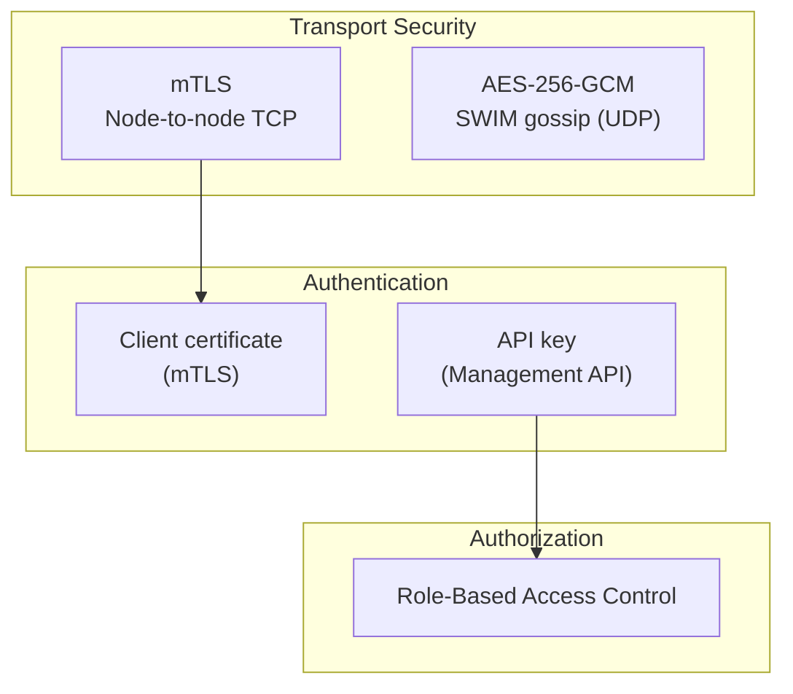
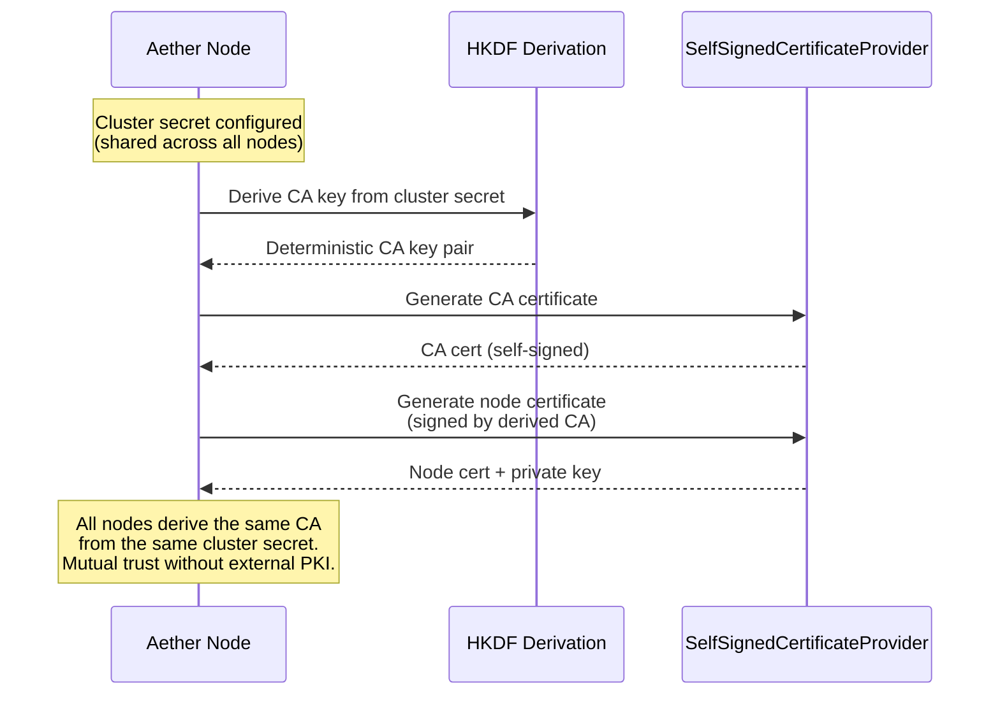
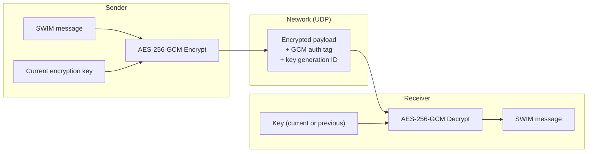
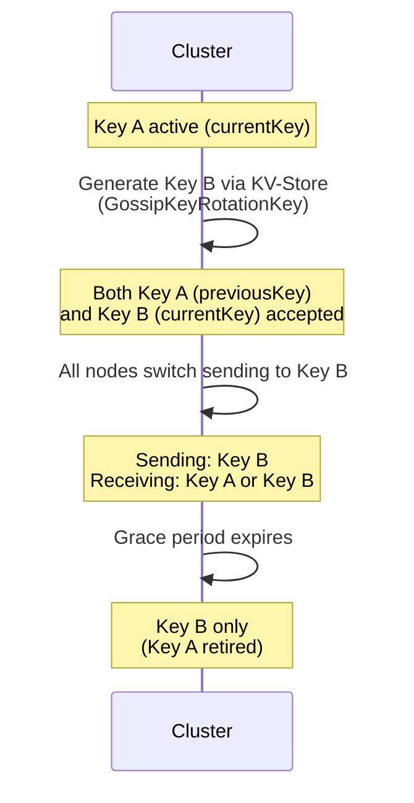
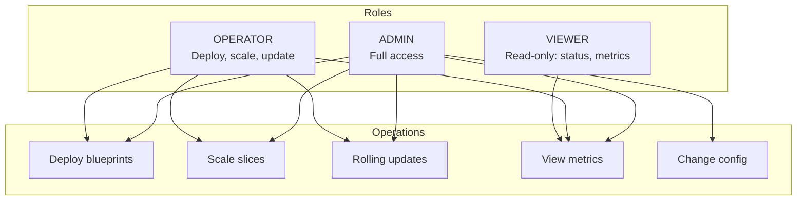
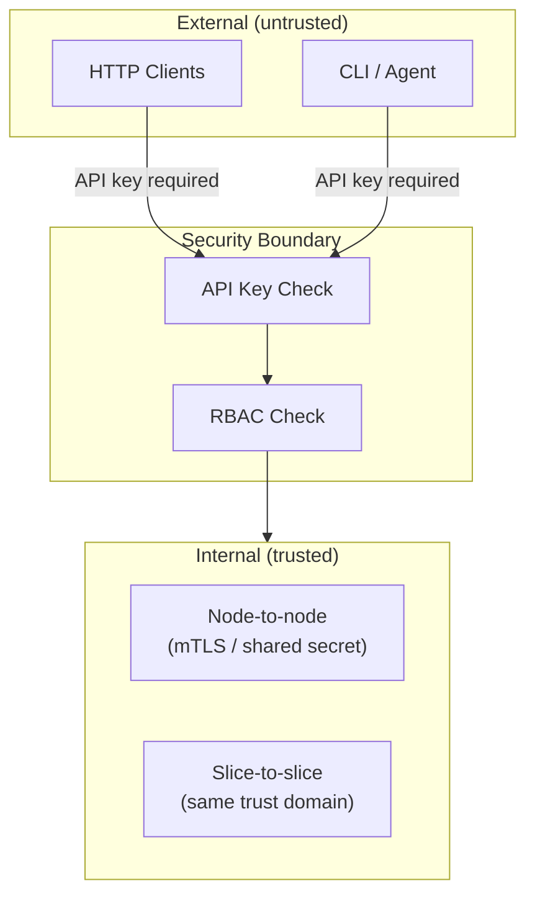

# Security

**Status:** Current

This document describes the security architecture: mTLS, gossip encryption, RBAC, and the three
`SecurityMode` options. For the trust model, default posture, and operational guidance, see
[`SECURITY.md`](../../../SECURITY.md) at the repo root.

## Security Layers


```mermaid
graph TB
    subgraph Transport["Transport Security"]
        mTLS["mTLS<br/>Node-to-node TCP"]
        SWIM_ENC["AES-256-GCM<br/>SWIM gossip (UDP)"]
    end

    subgraph AuthN["Authentication"]
        Cert["Client certificate<br/>(mTLS)"]
        APIKey["API key<br/>(Management API)"]
    end

    subgraph AuthZ["Authorization"]
        RBAC["Role-Based Access Control"]
    end

    mTLS --> Cert
    APIKey --> RBAC
```

## mTLS (Mutual TLS)

All node-to-node TCP communication (consensus, invocation, DHT, HTTP forwarding) can be secured with mutual TLS.

### Certificate Provisioning


```mermaid
sequenceDiagram
    participant Node as Aether Node
    participant HKDF as HKDF Derivation
    participant SelfSigned as SelfSignedCertificateProvider

    Note over Node: Cluster secret configured<br/>(shared across all nodes)

    Node->>HKDF: Derive CA key from cluster secret
    HKDF-->>Node: Deterministic CA key pair

    Node->>SelfSigned: Generate CA certificate
    SelfSigned-->>Node: CA cert (self-signed)

    Node->>SelfSigned: Generate node certificate<br/>(signed by derived CA)
    SelfSigned-->>Node: Node cert + private key

    Note over Node: All nodes derive the same CA<br/>from the same cluster secret.<br/>Mutual trust without external PKI.
```

### Key Properties

| Property | Value |
|----------|-------|
| CA derivation | HKDF from shared cluster secret |
| HKDF salt | `"aether-ca-seed"` (UTF-8) |
| HKDF info label | `"aether-ca-key-v1"` (UTF-8) |
| EC curve | P-256 |
| Signature algorithm | SHA256withECDSA |
| CA validity | 365 days, Subject: `CN=Aether Cluster CA` |
| Node cert validity | 7 days |
| Trust model | All nodes sharing the secret trust each other |
| External PKI | Not required |

### How It Works

1. All nodes in a cluster share a secret (configured at deployment)
2. Each node independently derives the same CA key pair using HKDF
3. Each node generates its own certificate signed by this CA
4. Since all nodes derive the same CA, they mutually trust each other
5. No certificate distribution, no external PKI, no manual trust configuration

## Gossip Encryption

SWIM protocol messages (UDP) are encrypted with AES-256-GCM:


```mermaid
graph LR
    subgraph Sender
        Msg["SWIM message"]
        Enc["AES-256-GCM Encrypt"]
        Key["Current encryption key"]
    end

    subgraph Wire["Network (UDP)"]
        Cipher["Encrypted payload<br/>+ GCM auth tag<br/>+ key generation ID"]
    end

    subgraph Receiver
        Dec["AES-256-GCM Decrypt"]
        Key2["Key (current or previous)"]
        Msg2["SWIM message"]
    end

    Msg --> Enc
    Key --> Enc
    Enc --> Cipher
    Cipher --> Dec
    Key2 --> Dec
    Dec --> Msg2
```

### Wire Format

```
[4-byte keyId (big-endian)] [12-byte nonce (random)] [ciphertext + 16-byte GCM auth tag]
```

| Constant | Value |
|----------|-------|
| Key size | 32 bytes (AES-256) |
| Nonce size | 12 bytes |
| GCM tag | 128 bits |
| Header overhead | 16 bytes (keyId + nonce) |

### Dual-Key Rotation


```mermaid
sequenceDiagram
    participant Cluster

    Note over Cluster: Key A active (currentKey)

    Cluster->>Cluster: Generate Key B via KV-Store<br/>(GossipKeyRotationKey)
    Note over Cluster: Both Key A (previousKey)<br/>and Key B (currentKey) accepted

    Cluster->>Cluster: All nodes switch sending to Key B
    Note over Cluster: Sending: Key B<br/>Receiving: Key A or Key B

    Cluster->>Cluster: Grace period expires
    Note over Cluster: Key B only<br/>(Key A retired)
```

- Key rotation state stored in KV-Store via `GossipKeyRotationKey`
- Two keys active simultaneously: `currentKey` + `previousKey`
- KeyId in wire format identifies which key was used
- Receivers try current key first, fall back to previous
- `UnknownKeyId` error if neither matches
- Zero-downtime key rotation

## Security Modes

The management API supports three mutually exclusive `SecurityMode` values, selected by the
`security_mode` config key: `NONE`, `API_KEY`, and `JWT`
[verified: `aether/aether-config/.../config/SecurityMode.java`].

**`API_KEY` is the default** when `security_mode` is omitted — a hardening fix tracked under
**#290** [mechanism: `ConfigLoader.populateAppHttpConfig`, `explicitMode.or(SecurityMode.API_KEY)`].
If no API key was provisioned, the first elected leader generates one random `ADMIN` key on first
startup and prints it once. Full trust-model detail, the bootstrap-key flow, and how to recognize
an unsafe deployment live in [`SECURITY.md`](../../../SECURITY.md) at the repo root — this page
covers only the architecture, not the operational posture.

```
GET /api/nodes/status
X-Api-Key: <key>
```

`JWT` mode verifies bearer tokens against a JWKS endpoint instead of static keys, extracting the
role claim for RBAC [mechanism: `aether/aether-config/.../config/JwtConfig.java` — `jwksUrl`,
configurable `roleClaim` (default `"role"`), JWKS cache TTL, clock-skew tolerance].

An operator can explicitly set `security_mode = "none"` to disable authentication — an explicit
setting always overrides the default. This is appropriate only for a single-node local/dev
instance, never for a network-reachable deployment.

### Configuration

```java
public record AppHttpConfig(boolean enabled,
                            int port,
                            Map<String, ApiKeyEntry> apiKeys,
                            int maxRequestSize,
                            SecurityMode securityMode,
                            Option<JwtConfig> jwtConfig,
                            HttpProtocol httpProtocol,
                            ApiVersioningDetection apiVersioningDetection,
                            String apiVersionHeaderName) {}
```

[verified: `aether/aether-config/.../config/AppHttpConfig.java`] API keys are configured per-node;
each key maps to an `authorization_role` (`ADMIN` / `OPERATOR` / `VIEWER`, default `VIEWER`).

## RBAC (Role-Based Access Control)


```mermaid
graph TB
    subgraph Roles["Roles"]
        Admin["ADMIN<br/>Full access"]
        Operator["OPERATOR<br/>Deploy, scale, update"]
        Viewer["VIEWER<br/>Read-only: status, metrics"]
    end

    subgraph Operations
        Deploy["Deploy blueprints"]
        Scale["Scale slices"]
        Update["Rolling updates"]
        Monitor["View metrics"]
        Config["Change config"]
    end

    Admin --> Deploy & Scale & Update & Monitor & Config
    Operator --> Deploy & Scale & Update & Monitor
    Viewer --> Monitor
```

| Role | Capabilities |
|------|-------------|
| **ADMIN** | Full access including configuration changes |
| **OPERATOR** | Deployment, scaling, deployments (canary/blue-green/rolling), monitoring |
| **VIEWER** | Read-only access to status and metrics |

## Security Boundaries


```mermaid
graph TB
    subgraph External["External (untrusted)"]
        Client["HTTP Clients"]
        CLI["CLI / Agent"]
    end

    subgraph Boundary["Security Boundary"]
        APIKey_Check["API Key Check"]
        RBAC_Check["RBAC Check"]
    end

    subgraph Internal["Internal (trusted)"]
        Nodes["Node-to-node<br/>(mTLS / shared secret)"]
        Slices["Slice-to-slice<br/>(same trust domain)"]
    end

    Client -->|"API key required"| APIKey_Check
    CLI -->|"API key required"| APIKey_Check
    APIKey_Check --> RBAC_Check
    RBAC_Check --> Internal
```

- External access requires API key (or JWT) authentication + RBAC **by default** — an operator can
  explicitly opt out via `security_mode = "none"`, see "Security Modes" above
- Internal node-to-node communication uses mTLS (shared trust via cluster secret)
- Slice-to-slice invocation is within the same trust domain (no additional auth)

## Related Documents

- [`SECURITY.md`](../../../SECURITY.md) - Trust model, default posture, operator guidance
- [04-networking.md](04-networking.md) - Transport layer
- [05-worker-pools.md](05-worker-pools.md) - SWIM gossip encryption
- [12-management.md](12-management.md) - Management API authentication
