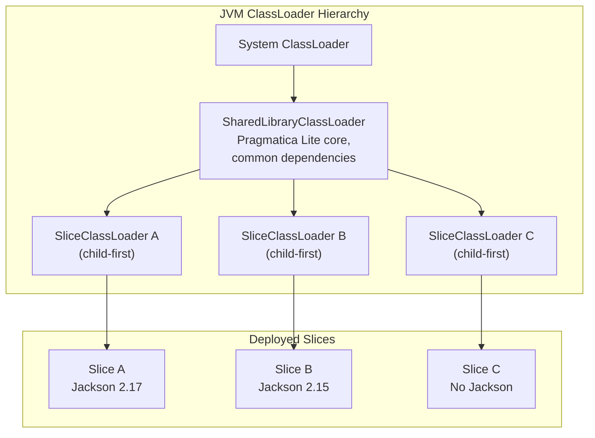
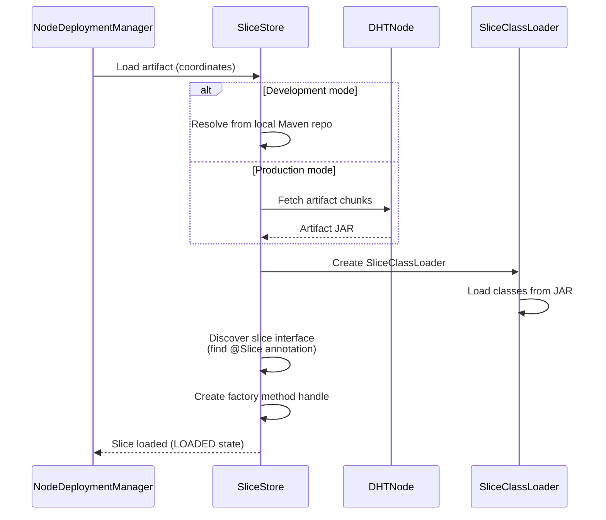
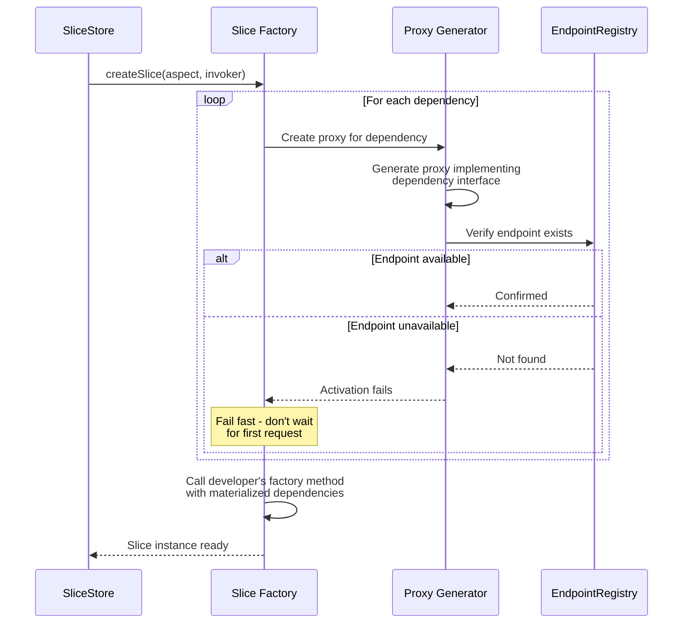
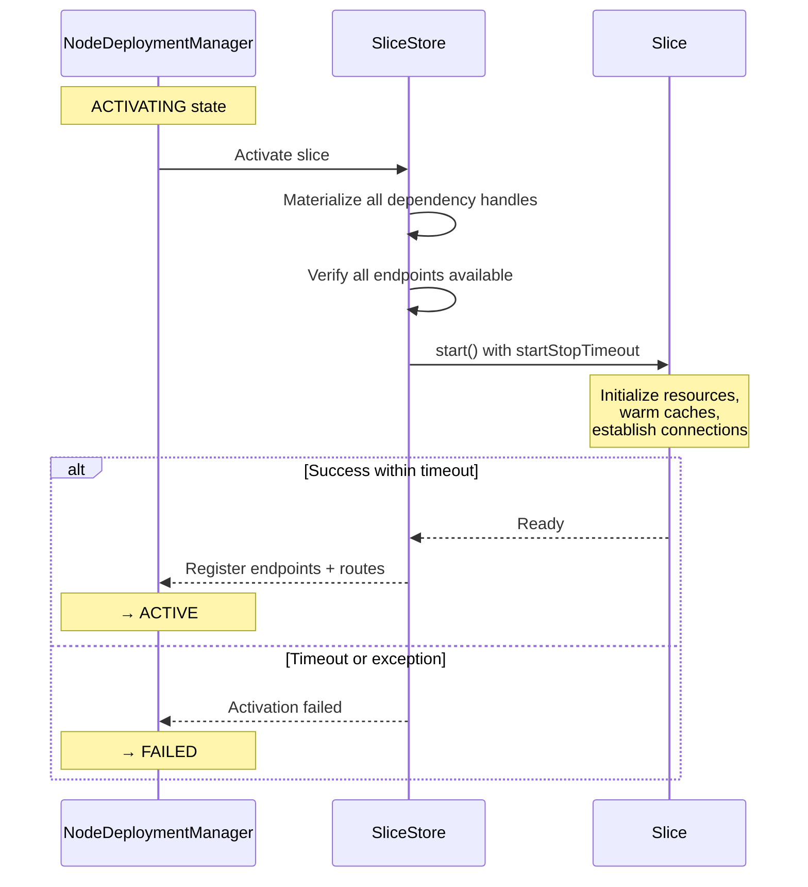
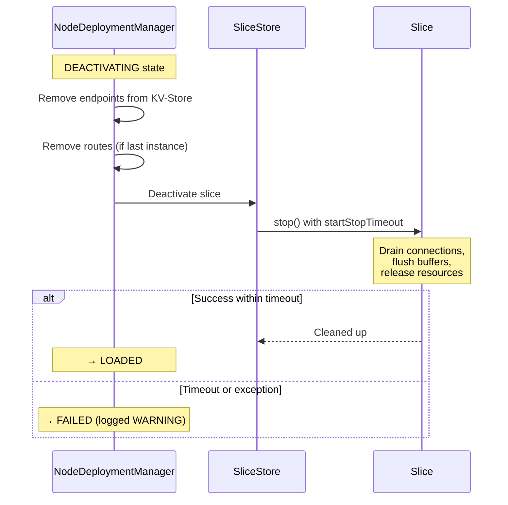

# Slice Container

This document describes ClassLoader isolation, dependency materialization, and slice lifecycle hooks.

## ClassLoader Architecture



### Child-First Delegation

Each `SliceClassLoader` uses child-first (parent-last) delegation:

1. Look in slice's own classpath first
2. If not found, delegate to `SharedLibraryClassLoader`
3. If not found, delegate to system classloader

This means two slices can use different versions of the same library without conflict.

### SharedLibraryClassLoader

Loaded once, shared across all slices:
- Pragmatica Lite core (`Result`, `Option`, `Promise`)
- Slice API interfaces
- Common serialization libraries

## Slice Loading



## Dependency Materialization

When a slice declares dependencies (other slices), they are materialized during activation:



### Factory Method Pattern

```java
@Slice
public interface OrderService {
    Promise<OrderResult> placeOrder(PlaceOrderRequest request);

    // Factory method - dependencies declared as parameters
    static OrderService orderService(InventoryService inventory, PricingEngine pricing) {
        return request -> inventory.check(request.items())
                                   .flatMap(available -> pricing.calculate(available))
                                   .map(priced -> OrderResult.placed(priced));
    }
}
```

- `InventoryService` and `PricingEngine` are materialized as proxies
- Proxies route calls through `SliceInvoker` (local or remote)
- The developer's code is identical regardless of where dependencies run

## Lifecycle Hooks

### start()



### stop()



### Timeout Configuration

```java
public record SliceActionConfig(
    Duration startStopTimeout  // Default: 5 seconds
) {}
```

## Slice Registration

When a slice reaches ACTIVE state, it registers:

| Registration | Key Type | Description |
|-------------|----------|-------------|
| Endpoints | `EndpointKey` | Each method of the slice interface |
| HTTP routes | `HttpNodeRouteKey` | Routes declared by `routes()` method |
| Subscriptions | `TopicSubscriptionKey` | Topics declared by annotations |
| Scheduled tasks | `ScheduledTaskKey` | Periodic tasks declared by annotations |

All registrations are written to KV-Store in a single batch for atomicity.

## Serialization

| Context | Format | Library |
|---------|--------|---------|
| Inter-node invocation | Binary | Fury |
| HTTP request/response | JSON | Jackson |
| KV-Store values | Binary | Fury |

Request/response types must be:
- Records or immutable classes
- Serializable (no transient dependencies like DB connections)
- Compatible across slice versions (for rolling updates)

## Resource Provisioning (SPI)

Slices can access external resources via the `ResourceProvider` SPI:

| Resource | Description |
|----------|-------------|
| Database | Connection pool to PostgreSQL, etc. |
| HTTP client | Pre-configured HTTP client |
| Interceptors | Request/response interceptors |
| Configuration | Runtime configuration values |

Resources are provisioned during slice activation and cleaned up during deactivation.

## Related Documents

- [02-deployment.md](02-deployment.md) - Slice lifecycle state machine
- [03-invocation.md](03-invocation.md) - Generated proxies and invocation
- [09-storage.md](09-storage.md) - Artifact storage in DHT
