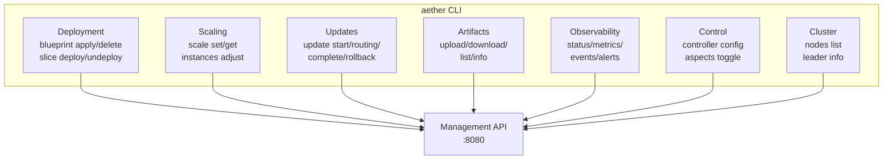
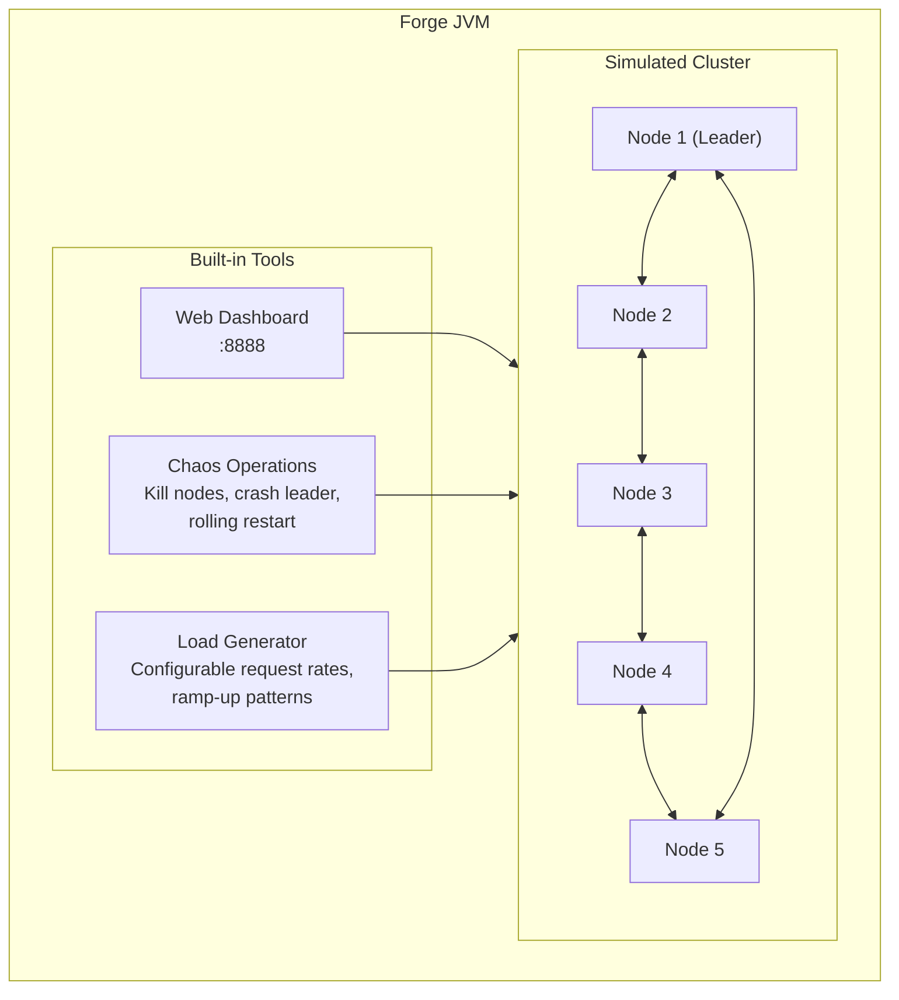
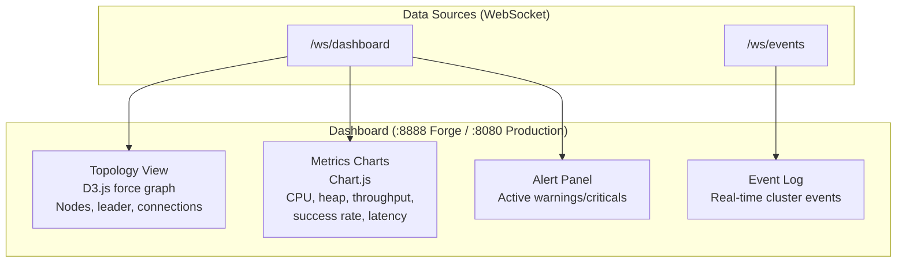

# Management and Tooling

This document describes the CLI, Management API, Forge simulator, and web dashboard.

## CLI

37 commands organized by function, supporting both single-command and interactive REPL modes.

### Command Categories



### Key Commands

| Command | Description |
|---------|-------------|
| `aether blueprint apply <file>` | Deploy blueprint from TOML |
| `aether blueprint delete <id>` | Remove blueprint and undeploy slices |
| `aether status` | Cluster status: nodes, slices, health |
| `aether metrics` | Current metrics snapshot |
| `aether scale <artifact> --min N --max M` | Configure auto-scaling |
| `aether update start <artifact> <version>` | Begin rolling update |
| `aether update routing <id> -r N:M` | Adjust traffic weights |
| `aether upload <jar>` | Upload artifact to cluster DHT |
| `aether alerts list` | View active alerts |
| `aether aspects set <artifact> <method> METRICS` | Toggle dynamic aspects |

### REPL Mode

```bash
$ aether
aether> status
Cluster: 5 nodes, leader: node-1
Slices: 3 active, 8 instances total
...
aether> blueprint apply commerce.toml
Deployed: 2 slices, 5 instances
aether> exit
```

## Management API

30+ REST endpoints covering all cluster operations.

### Endpoint Categories

| Category | Base Path | Endpoints |
|----------|-----------|-----------|
| **Cluster** | `/api/v1/cluster` | status, nodes, leader |
| **Blueprints** | `/api/v1/blueprints` | CRUD operations |
| **Slices** | `/api/v1/slices` | list, status, deploy, undeploy |
| **Metrics** | `/api/v1/metrics` | snapshot, per-node, per-slice |
| **Scaling** | `/api/v1/scale` | get/set scaling config |
| **Updates** | `/api/v1/updates` | start, routing, complete, rollback |
| **Artifacts** | `/api/v1/artifacts` | upload, download, list |
| **Alerts** | `/api/v1/alerts` | thresholds, active alerts |
| **Controller** | `/api/v1/controller` | config, mode |
| **Aspects** | `/api/aspects` | get/set per-method modes |
| **Prometheus** | `/metrics/prometheus` | Prometheus scrape endpoint |

### WebSocket Endpoints

| Endpoint | Description |
|----------|-------------|
| `/ws/dashboard` | Real-time metrics, topology, alerts |
| `/ws/events` | Cluster event stream |
| `/ws/status` | Node status updates |

All WebSocket endpoints push data - no polling required.

### Authentication

All endpoints require API key authentication:

```
X-Api-Key: <key>
```

See [10-security.md](10-security.md) for RBAC configuration.

## Forge (Local Development)

Single-JVM multi-node simulator for local development and testing.

### Architecture



### Features

| Feature | Description |
|---------|-------------|
| **5-node cluster** | Full Rabia consensus on localhost |
| **Web dashboard** | Topology (D3.js), metrics (Chart.js), WebSocket push |
| **Chaos operations** | Kill nodes, crash leader, rolling restart |
| **Load generation** | Configurable rates with ramp-up |
| **Artifact resolution** | From local Maven repository |
| **Full DHT** | Replication mode: FULL (all nodes) |

### Running Forge

```bash
cd aether/forge
mvn exec:java
# Dashboard at http://localhost:8888
```

Deploy a blueprint, generate load, kill nodes - observe cluster behavior.

## Web Dashboard



### Topology View

- Force-directed graph showing nodes and connections
- Leader node highlighted
- Node health color-coded
- Click to inspect node details

### Metrics View

- Real-time charts (1-second updates via WebSocket)
- CPU, heap, GC time per node
- Throughput and latency per slice method
- Success/failure rates

## E2E Testing

Testing is split across three layers:

| Layer | Count | Description |
|-------|-------|-------------|
| Unit tests | 10,686 | All modules, `mvn verify` |
| Forge integration | 21 | In-process EmberCluster tests (cluster formation, chaos, rolling updates) |
| Docker integration | 14 suites, ~50 scripts | 5-node Docker cluster on target host (smoke, chaos, scaling, streaming, security, deployment, resources, artifacts, database, observability, network, edge-cases) |

Docker integration tests run via `aether/tests/integration/scripts/run-all.sh` against a target host. See [integration test README](../../tests/integration/README.md) for setup and environment variables.

## Related Documents

- [10-security.md](10-security.md) - API authentication and RBAC
- [07-observability.md](07-observability.md) - Metrics exposed via dashboard
- [02-deployment.md](02-deployment.md) - Blueprint operations
