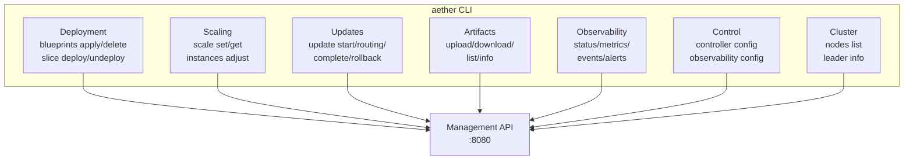
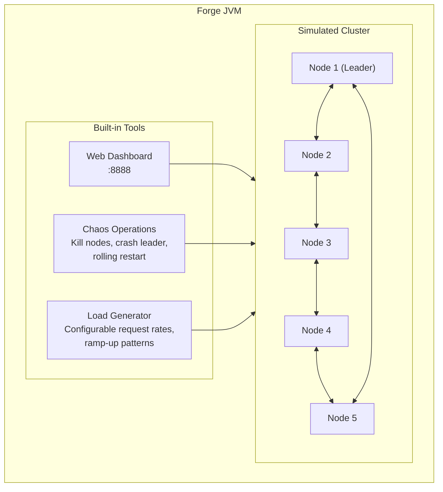
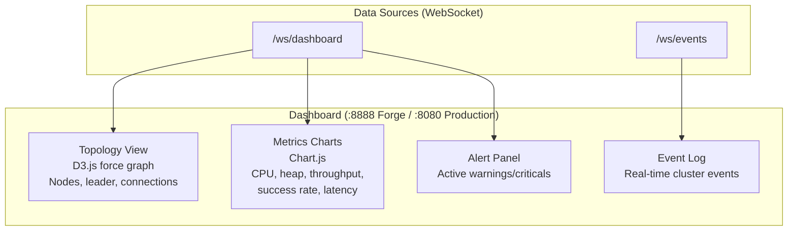

# Management and Tooling

**Status:** Current

This document describes the CLI, Management API, Forge simulator, and web dashboard.

## CLI

37 commands organized by function, supporting both single-command and interactive REPL modes.

### Command Categories


```mermaid
graph TB
    subgraph CLI["aether CLI"]
        Deploy["Deployment<br/>blueprints apply/delete<br/>slice deploy/undeploy"]
        Scale["Scaling<br/>scale set/get<br/>instances adjust"]
        Update["Updates<br/>update start/routing/<br/>complete/rollback"]
        Artifact["Artifacts<br/>upload/download/<br/>list/info"]
        Observe["Observability<br/>status/metrics/<br/>events/alerts"]
        Control["Control<br/>controller config<br/>observability config"]
        Cluster["Cluster<br/>nodes list<br/>leader info"]
    end

    Deploy --> API["Management API<br/>:8080"]
    Scale --> API
    Update --> API
    Artifact --> API
    Observe --> API
    Control --> API
    Cluster --> API
```

### Key Commands

| Command | Description |
|---------|-------------|
| `aether blueprints apply <file>` | Deploy blueprint from TOML |
| `aether blueprints delete <id>` | Remove blueprint and undeploy slices |
| `aether status` | Cluster status: nodes, slices, health |
| `aether metrics` | Current metrics snapshot |
| `aether scale <artifact> --min N --max M` | Configure auto-scaling |
| `aether deploy <coords> --rolling` | Begin rolling deployment |
| `aether deploy promote <id>` | Advance deployment |
| `aether artifacts push <group:artifact:version>` | Push local artifact to cluster repository |
| `aether alerts list` | View active alerts |
| `aether observability depth set <artifact>#<method> <threshold>` | Set per-method observability depth |

### REPL Mode

```bash
$ aether
aether> status
Cluster: 5 nodes, leader: node-1
Slices: 3 active, 8 instances total
...
aether> blueprint apply commerce.toml
Deployed: 2 slices, 5 instances
aether> exit
```

## Management API

190+ REST endpoints covering all cluster operations
[verified: `aether/aether-management-api/.../route/ManagementRoute.java` — direct enum count].
None of them carry a `/v1` (or any version) path segment; the table below reflects the actual
route prefixes, not a versioned scheme the code does not implement.

### Endpoint Categories

| Category | Base Path | Endpoints |
|----------|-----------|-----------|
| **Cluster** | `/api/cluster` | topology, status, generation, scale, config, provisioning, membership |
| **Blueprints** | `/api/blueprints` | CRUD operations |
| **Slices** | `/api/slices` | list, status, topology, config |
| **Metrics** | `/api/metrics` | snapshot, per-node, per-slice, transport, timeouts |
| **Scaling** | `/api/scale` | set scaling config |
| **Deploy** | `/api/deploy` | start (canary/blue-green/rolling), promote, rollback, complete |
| **Artifacts** | `/repository` | upload, download, list, info, delete (metrics under `/api/artifacts/metrics`) |
| **Alerts** | `/api/alerts` | thresholds, active alerts, history |
| **Controller** | `/api/controller` | config, status, scaling decisions |
| **Observability** | `/api/observability` | per-method depth and config, get/set/delete |
| **Prometheus** | `/api/metrics/prometheus` | Prometheus scrape endpoint |

### WebSocket Endpoints

| Endpoint | Description |
|----------|-------------|
| `/ws/dashboard` | Real-time metrics, topology, alerts |
| `/ws/events` | Cluster event stream |
| `/ws/status` | Node status updates |

All WebSocket endpoints push data - no polling required.

### Authentication

All endpoints require API key authentication:

```
X-Api-Key: <key>
```

See [10-security.md](10-security.md) for RBAC configuration.

## Forge (Local Development)

Single-JVM multi-node simulator for local development and testing.

### Architecture


```mermaid
graph TB
    subgraph Forge["Forge JVM"]
        subgraph Nodes["Simulated Cluster"]
            N1["Node 1 (Leader)"]
            N2["Node 2"]
            N3["Node 3"]
            N4["Node 4"]
            N5["Node 5"]
        end

        subgraph Tools["Built-in Tools"]
            Chaos["Chaos Operations<br/>Kill nodes, crash leader,<br/>rolling restart"]
            Load["Load Generator<br/>Configurable request rates,<br/>ramp-up patterns"]
            Dashboard["Web Dashboard<br/>:8888"]
        end
    end

    N1 <--> N2
    N2 <--> N3
    N3 <--> N4
    N4 <--> N5
    N5 <--> N1

    Dashboard --> Nodes
    Chaos --> Nodes
    Load --> Nodes
```

### Features

| Feature | Description |
|---------|-------------|
| **5-node cluster** | Full Rabia consensus on localhost |
| **Web dashboard** | Topology (D3.js), metrics (Chart.js), WebSocket push |
| **Chaos operations** | Kill nodes, crash leader, rolling restart |
| **Load generation** | Configurable rates with ramp-up |
| **Artifact resolution** | From local Maven repository |
| **Full DHT** | Replication mode: FULL (all nodes) |

### Running Forge

```bash
cd aether/forge
mvn exec:java
# Dashboard at http://localhost:8888
```

Deploy a blueprint, generate load, kill nodes - observe cluster behavior.

## Web Dashboard


```mermaid
graph TB
    subgraph Dashboard["Dashboard (:8888 Forge / :8080 Production)"]
        Topo["Topology View<br/>D3.js force graph<br/>Nodes, leader, connections"]
        Metrics["Metrics Charts<br/>Chart.js<br/>CPU, heap, throughput,<br/>success rate, latency"]
        Events["Event Log<br/>Real-time cluster events"]
        Alerts["Alert Panel<br/>Active warnings/criticals"]
    end

    subgraph Data["Data Sources (WebSocket)"]
        WS1["/ws/dashboard"]
        WS2["/ws/events"]
    end

    WS1 --> Topo & Metrics & Alerts
    WS2 --> Events
```

### Topology View

- Force-directed graph showing nodes and connections
- Leader node highlighted
- Node health color-coded
- Click to inspect node details

### Metrics View

- Real-time charts (1-second updates via WebSocket)
- CPU, heap, GC time per node
- Throughput and latency per slice method
- Success/failure rates

### Alert Delivery

Alerts reach the dashboard two ways, and both must agree on the wire shape:

- **WebSocket push.** `AlertManager` broadcasts `{"type":"ALERT","data":{...}}` (or
  `ALERT_RESOLVED`) over `/ws/dashboard` — the discriminator lives at the top level only,
  never duplicated inside `data`. The client dispatches the whole envelope to the alerts
  store and reads `type` there, not on an already-unwrapped payload.
- **REST poll fallback.** The alerts store is also refreshed from the same gated
  2-second poll timer that drives cluster status and events, so a missed or dropped WS
  message self-heals within one poll cycle rather than leaving the panel stale until the
  next alert fires.

### Live Event Feed

`ClusterEventView` carries its Hybrid Logical Clock time under `at` (packed
physical-ms/counter), never `timestamp` — the dashboard's event dedup/display key is
computed from whichever time field the payload actually carries (`at` for node-mode
events, `timestamp` for Forge-mode events), never assumed to be one or the other.

### Polling Behavior Under Degraded Health

Every dashboard poll timer (status, events, alerts, requests, topology, schema, and the
rest of the secondary-store refreshes) is gated on a client-side `degraded` flag, checked
on every tick:

- The gate is refreshed by an ungated health probe that runs on every primary-timer tick
  regardless of the current gate state, so the dashboard can detect recovery as well as
  degradation. `degraded` is keyed semantically on `status !== 'healthy'` — there is no
  literal `"degraded"` wire value in either health shape.
- **The probe tries `GET /api/v1/health` first, falling back to bare `GET /health`.** The
  versioned path is the only health route the real node's Management API serves — bare
  `/health` does not exist there at all (only `/api/v1/health`, `/health/live`, and
  `/health/ready`, see [management-api.md](../reference/management-api.md)). Bare `/health`
  remains as the fallback because it's what Forge actually serves; Forge's own
  `HealthResponse` is hardcoded to always report `"healthy"` and can never signal
  degradation, an honest limit on this gate's real-world triggerability against Forge.
  Probing versioned-first (rather than bare-only, the original cut of this fix) is what
  makes the gate actually engage against a real node — bare-only meant every probe 404'd
  there and the gate silently never left its default.
- **A probe failure (neither path answers) fails open to healthy, never wedges on
  `degraded = true`.** Unknown health is not the same claim as degraded health: treating
  the two as one would let a target that answers neither health path permanently gate off
  every other poll, since the very probe meant to detect recovery could never itself
  succeed. The failure is warned once per session, not re-logged on every tick.
- **A 404 from an endpoint the server has no route for is logged once per endpoint, not
  toasted on every tick.** Every other failure status (5xx, network error) still toasts
  on every occurrence — this is a narrow carve-out for the specific, expected case of
  polling an endpoint the target server doesn't implement, not general failure
  suppression.

**Known gap, out of scope here (tracked in #300):** the dashboard and Forge speak the
unversioned `/api/...` convention throughout, while the real node's Management API has
already migrated most routes to `/api/v1/...` (`ManagementRoute`). The health probe above
now bridges this for `/health` specifically; every other dashboard REST call still needs
updating to close the gap fully.

## E2E Testing

Testing is split across three layers:

| Layer | Count | Description |
|-------|-------|-------------|
| Unit tests | 10,686 | All modules, `mvn verify` |
| Forge integration | 21 | In-process EmberCluster tests (cluster formation, chaos, deployments) |
| Docker integration | 14 suites, ~50 scripts | 5-node Docker cluster on target host (smoke, chaos, scaling, streaming, security, deployment, resources, artifacts, database, observability, network, edge-cases) |

Docker integration tests run via `aether/tests/integration/run-tests.sh --env docker` against a target host. See [integration test README](../../tests/integration/README.md) for setup and environment variables.

## Related Documents

- [10-security.md](10-security.md) - API authentication and RBAC
- [07-observability.md](07-observability.md) - Metrics exposed via dashboard
- [02-deployment.md](02-deployment.md) - Blueprint operations
