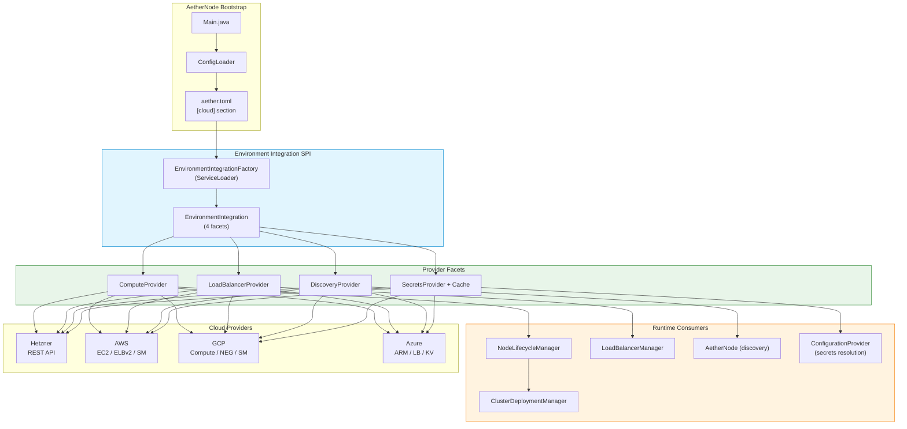
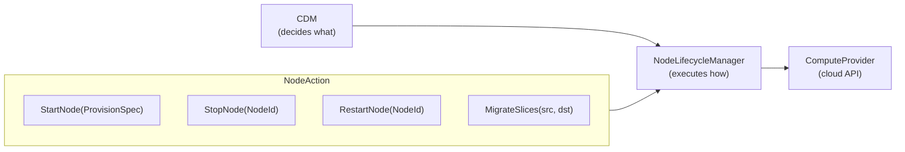

# Cloud Integration

This document describes how Aether integrates with cloud providers for automated infrastructure management.

## Architecture



## Provider Selection

Aether uses ServiceLoader to discover cloud providers at runtime. Each provider module registers an `EnvironmentIntegrationFactory` that converts generic TOML configuration into provider-specific types.

```
aether.toml [cloud] section
    ↓
ConfigLoader → CloudConfig (generic string maps)
    ↓
EnvironmentIntegrationFactory.forProvider("aws")
    ↓
AwsEnvironmentIntegrationFactory.create(CloudConfig)
    ↓
EnvironmentIntegration (4 optional facets)
```

No cloud SDKs are used. All providers use raw HTTP via `HttpOperations`:
- **AWS**: SigV4 signing from scratch, EC2 Query API (XML), ELBv2/SM (JSON)
- **GCP**: RS256 JWT token management, JSON REST
- **Azure**: Dual OAuth2 tokens (management + Key Vault), ARM REST

## Four Facets

### ComputeProvider

Provisions, terminates, lists, and manages cloud instances.

| Method | Purpose |
|--------|---------|
| `provision(InstanceType)` | Create a new instance |
| `provision(ProvisionSpec)` | Create with detailed spec (size, pool, tags, image, userData) |
| `terminate(InstanceId)` | Destroy an instance |
| `listInstances()` | List all managed instances |
| `listInstances(Map/TagSelector)` | Filter by tags/labels |
| `instanceStatus(InstanceId)` | Get current status |
| `restart(InstanceId)` | Reboot an instance |
| `applyTags(InstanceId, Map)` | Apply metadata tags |

Status mapping is provider-specific:

| Provider | PROVISIONING | RUNNING | STOPPING | TERMINATED |
|----------|-------------|---------|----------|------------|
| Hetzner | initializing, starting | running | stopping, off | deleted |
| AWS EC2 | pending | running | stopping, stopped | shutting-down, terminated |
| GCP | PROVISIONING, STAGING | RUNNING | STOPPING, SUSPENDED | TERMINATED |
| Azure | VM starting, Provisioning | VM running | VM deallocated, VM stopped | — |

### LoadBalancerProvider

Synchronizes cloud load balancer targets with cluster membership.

| Method | Purpose |
|--------|---------|
| `onRouteChanged(RouteChange)` | Register new targets |
| `onNodeRemoved(nodeIp)` | Deregister a target |
| `reconcile(LoadBalancerState)` | Diff current vs desired, fix drift |
| `loadBalancerInfo()` | Query current LB state |
| `deregisterWithDrain(nodeIp, timeout)` | Graceful deregistration |
| `syncWeights(weightsByIp)` | Rolling update weight sync (future) |

Provider-specific LB backends:

| Provider | Backend | Target Type |
|----------|---------|-------------|
| Hetzner | L4 Load Balancer | IP targets |
| AWS | ALB/NLB Target Group | Instance IDs |
| GCP | Network Endpoint Group (NEG) | IP:port endpoints |
| Azure | Backend Address Pool | IP addresses |

### DiscoveryProvider

Replaces static peer lists with tag/label-based discovery for dynamic cluster formation.

| Method | Purpose |
|--------|---------|
| `discoverPeers()` | Find current cluster peers |
| `watchPeers(callback)` | Poll for membership changes |
| `registerSelf(PeerInfo)` | Tag self as cluster member |
| `deregisterSelf()` | Remove self from discovery |
| `stopWatching()` | Cancel the polling watch |

Discovery flow during node startup:
1. `DiscoveryProvider.registerSelf()` — tag the instance
2. `DiscoveryProvider.discoverPeers()` — find existing peers
3. Use discovered peers as `coreNodes` for Rabia quorum formation
4. `DiscoveryProvider.watchPeers()` — poll for changes

### SecretsProvider

Resolves `${secrets:path}` placeholders in configuration.

| Method | Purpose |
|--------|---------|
| `resolveSecret(path)` | Get secret value |
| `resolveSecretWithMetadata(path)` | Get value + version/expiry |
| `resolveSecrets(paths)` | Batch resolution |
| `watchRotation(path, callback)` | Rotation notification (future) |

All providers are wrapped with `CachingSecretsProvider` (5-minute TTL).

| Provider | Backend | Path Format |
|----------|---------|-------------|
| Hetzner | Environment variables | `database/password` → `AETHER_SECRET_DATABASE_PASSWORD` |
| AWS | Secrets Manager | Secret name/ARN |
| GCP | Secret Manager | Secret name |
| Azure | Key Vault | `vaultName/secretName` |

## NodeLifecycleManager

Abstraction between CDM and ComputeProvider. Encapsulates tag-based instance lookup.



### Terminate-on-Drain Flow

When CDM completes drain of a node:
1. CDM calls `lifecycleManager.terminateNode(nodeId)`
2. NodeLifecycleManager looks up instance by `aether-node-id` tag
3. Calls `computeProvider.terminate(instanceId)`
4. Cloud instance is destroyed — billing stops

The `aether-node-id` tag is applied during node startup via IP-based self-identification:
1. `AetherNode.applyNodeIdTag()` on startup
2. Lists all instances, matches by IP address from topology config
3. Applies `aether-node-id={nodeId}` tag to the matched instance

## Module Structure

```
integrations/cloud/
├── hetzner/     # Hetzner REST client
├── aws/         # AWS client (SigV4, EC2 XML, ELBv2/SM JSON)
├── gcp/         # GCP client (JWT OAuth2, JSON REST)
└── azure/       # Azure client (dual OAuth2, ARM REST)

integrations/xml/
└── jackson-xml/ # XmlMapper for EC2 XML responses

aether/environment-integration/   # SPI interfaces + types
aether/environment/
├── hetzner/     # Hetzner providers + factory
├── aws/         # AWS providers + factory
├── gcp/         # GCP providers + factory
└── azure/       # Azure providers + factory
```

See [Cloud Integration Reference](../reference/cloud-integration.md) for TOML configuration details.
