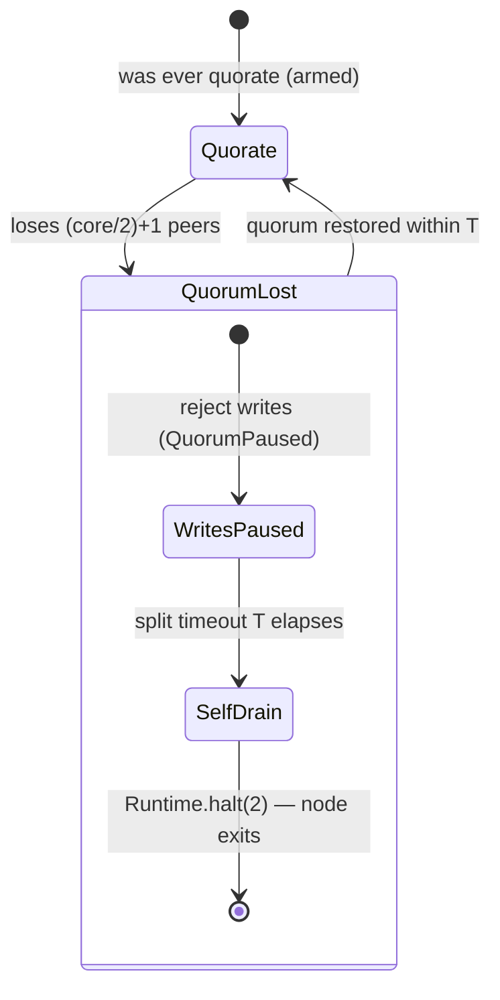

# Consistency and Partition Behavior

**Status:** Current

This document states Aether's consistency and partition-behavior model **as a contract**: what each operation guarantees during normal operation and during a partition, and the mechanism that earns each guarantee. The model is decided, not aspirational — this page names it so a distributed-systems evaluator finds it where they look first.

Per-operation authority lives in [`../reference/guarantees.md`](../reference/guarantees.md) (the single source of truth for guarantees, traced to `file:line`). This page is the architecture-level companion: it explains the partition contract each tier honors and anchors every claim to the chaos/partition test that proves it. Scope boundaries — what is deliberately *not* yet guaranteed — live on [`../reference/known-limitations.md`](../reference/known-limitations.md); the two pages share terminology and cross-link each other.

## The partition contract, per tier

Aether prefers **consistency over availability** under partition, and enforces that choice at every tier by *dissolving* the side that cannot make progress rather than letting it operate autonomously. There is no split-brain at any tier.

### Core cluster — the minority dissolves automatically

The core runs leaderless Rabia consensus over the KV write/metadata plane. Consensus commits only while a node sees a quorum (`core/2 + 1`, workers excluded; `QuorumLossDetector.java:429`). On quorum loss:

1. The engine **pauses and rejects writes** with `QuorumPaused` (`RabiaEngine.java:325,682`).
2. After the split timeout `T` (default 15 s) the minority node **self-terminates** via `Runtime.halt(2)` — the self-drain / self-fence path (`DrainProcedure` + `QuorumLossDetector`, fed `MembershipConfig.splitTimeout()`).

The self-drain is **gated** so it never fires spuriously: it is armed only after the node was ever quorate (armed-latch), is suppressed during the 75 s cold-boot convergence window (`AetherNode.COLD_BOOT_CONVERGENCE_WINDOW_MS`), and stands down when a false-`FAULTY` storm is co-confirmation-refuted. Recovery of a fenced node requires an external restart / CTM reprovision.



The majority side keeps committing throughout; the minority never accepts a conflicting write, so the two sides cannot diverge.

### Worker communities — an isolated community dissolves and drains

Worker communities are SWIM-gossip groups that execute application slices under a deterministic governor. A community is **not** an autonomous cluster: its right to run is leased from the core through a governor→core epoch acknowledgment (`GovernorAnnouncementKey`; `ClusterQuiescenceEvaluator.evaluateCommunity`). A community whose governor cannot reach the core, or whose core-side epoch ack lapses, transitions through its lifecycle to teardown:

```
minted → FORMING → ACTIVE → (DEGRADED ↔) DISSOLVING → DISSOLVED
```

(`CommunityState`). A community that times out or is partitioned from the core **dissolves and drains** — it does not continue serving on its own authority, and it rejoins by re-forming once the core is reachable. `DISSOLVED` is an explicit terminal fact, not an inferred absence.

### The consequence, stated plainly

**Core availability is the system's availability ceiling.** When the core is unreachable, affected communities dissolve and drain rather than operate autonomously; when the core loses quorum, its minority halts. This is a deliberate design contract — the price of never serving divergent state — not an apology. An operator sizes and places the core with that ceiling in mind.[^cap]

[^cap]: In CAP shorthand this is commonly called **CP**; we avoid the bare label because it under-specifies per-operation behavior — reads, for example, remain locally available and eventually consistent on *both* sides of a partition (see the guarantee table below). The precise per-operation contract is what this page documents instead.

## The dissolve timeout

Both dissolve paths above are governed by **one tunable**, the split timeout `T` (TOML key `split_timeout`, `MembershipConfig.splitTimeout()`, default **15 s**). A single knob governs both sides of a split by design: the minority's quorum-loss self-drain and the majority's departure-verdict / re-provision derive from the same `T`, and their ordering is asserted by `MembershipConfigSplitTimeoutOrderingTest` so the minority always fences before the majority re-provisions its slot (no double-active window).

The trade-off is two-sided:

| `split_timeout` | Effect |
|-----------------|--------|
| **Too low** | A transient core blip (GC pause, brief network hiccup, in-flight SWIM convergence) needlessly dissolves communities / halts minority nodes, converting a recoverable stall into a teardown. |
| **Too high** | Slow reaction to a *real* outage — the isolated side stays paused longer before dissolving, extending time-to-recover. |

The 15 s default is sized to absorb SWIM convergence (~5 s) plus a brief GC/pause margin without dissolving on noise. Operators tuning it are choosing a point on the blip-tolerance ↔ outage-reaction curve; the multi-community barrier run (#367) produces the recommended-default curve for hierarchical topologies (see [Pending validation](#pending-validation)).

## Per-operation guarantees

Each row states the guarantee during **normal operation** and during a **partition**, and the proof anchor. Consistency vocabulary (strongest→weakest): *linearizable · sequential · causal+session · snapshot · read-committed/bounded-staleness/eventual*. Durability: *crash-durable* (fsync-before-ack) · *quorum-durable* (committed on N replicas, in-memory) · *process-durable*. Full detail and `file:line` mechanisms are in [`../reference/guarantees.md`](../reference/guarantees.md); this table is the architecture-level summary.

| Operation | Normal operation | Under partition | Status / proof |
|-----------|------------------|-----------------|----------------|
| **KV / consensus write** (`kv.write`, `consensus.commit`) | Linearizable write order (single Rabia log, quorum-commit + local apply); quorum-durable **in memory** | Majority side only; minority returns `QuorumPaused` then self-halts | LIVE · [02-chaos](../../tests/integration/suites/02-chaos) self-drain (C12–C16), kill-leader (C4) |
| **KV read** (`kv.read`) | **Not linearizable** — sequential, served from local applied map; may trail the committed frontier | **Both sides serve** (stale local state); no `sync()` / linearizable read path | LIVE (as local/eventual) · guarantees.md §1 |
| **KV delete** (`kv.delete`) | Total-ordered, epoch/leader-fenced symmetrically with `Put` (#379) | Majority only | LIVE · guarantees.md §1, `#379` closed |
| **Ownership fence** (`epoch.fence`) | Monotonic single-writer per ownership key — deposed owner's stale-epoch write rejected deterministically on every replica | Enforced when writes resume; decision rides the committed value | LIVE · guarantees.md §1 |
| **Stream append** (`stream.append`, default RF=1) | Per-partition total order; **crash-durable** (per-partition WAL, fsync-before-ack) | HRW-owner side; **RF=1 is one-disk-deep** — survives crash+restart, **not** disk loss or owner failover (consumer reads empty until original owner returns) | LIVE · Forge `StreamCrashDurabilityTest` (A6 restart), [02-chaos](../../tests/integration/suites/02-chaos) stream-replica-failover (C19: complete history) |
| **Stream append** (sync-replicated, `min-sync-replicas ≥ 2`) | Publish awaits `min-sync-replicas − 1` distinct non-self acks; `replicas` sets RF independently (#262 two-knob) | Survives owner failover to an in-sync replica; too-small cluster fails clearly with `NOT_ENOUGH_REPLICAS` | LIVE · `ReplicaSetControllerTest`, [02-chaos](../../tests/integration/suites/02-chaos) stream-replica-failover (C17/C18, RF=2) |
| **Stream read** (GOVERNOR / NEAREST default) | Eventual / local-first; NEAREST forwards to owner **only on empty** local read | Local node; stale non-empty read is not forwarded | LIVE · guarantees.md §4 |
| **Stream read** (`LINEARIZABLE`) | Linearizable — owner-routed + no-op consensus round + post-round epoch fence + catch-up gate | Owner only; degrades to `ANY_REPLICA` if the committed-owner source is unwired | LIVE (no-op-round mode) · guarantees.md §4 |
| **Stream consume** (`stream.consume`) | Per-partition order; **at-least-once** while the consumer runs (RAM cursor advances only post-ack, failures retried). On restart there is **no automatic cursor resume**: app `StreamAccess` consumers that commit + re-seek (`committedOffset()`) get bounded-window redelivery, while non-committing apps and system consumers **replay from offset 0** (duplicate-heavy, still at-least-once — the per-partition WAL restores the log). Drops to at-most-once end-to-end **only if the log is lost** (RF=1 failover / fresh-disk replacement; avoidable with `min-sync-replicas ≥ 2`) — see [known-limitations](../reference/known-limitations.md) | Owner side; RF=1: empty after failover | LIVE · guarantees.md §4 |
| **DHT op** (`dht.write` / `dht.read`, system maps: slice-node / route / endpoint) | **Eventual**, W=R=1 single-node ack; **not crash-durable** (in-memory) — reads may be stale across nodes, lost on full restart | Side with ≥W replicas (≈local); ack-then-crash before async replication loses the write | LIVE (eventual) · guarantees.md §2; downgrade tracked `#384` |
| **DHT op** (artifact repository) | Quorum **LWW by HLC** (W=R=majority); still eventual, concurrent writes LWW-dropped | Majority | LIVE · guarantees.md §2 |
| **Management read** (management-API snapshot reads) | Eventual / local snapshot of KV + DHT + event state — no hot-path cost, no linearizable read path | Served from local state; may be stale, like `kv.read` | LIVE · guarantees.md §1–§2 |
| **Pub/sub publish** (`topic.publish`) | **At-most-once, unordered, best-effort** — never persisted; subscriber down at publish time misses permanently; no retry, no dedup | Best-effort, no consensus on the hot path | LIVE · guarantees.md §5 |
| **Subscription register** | Crash-durable (Rabia-replicated KV write); topology self-heals across restart | Majority for the registration write | LIVE · guarantees.md §5 |

Durable-entity's fenced/durable guarantees are **planned, not yet wired** into a deployed slice; see [`../reference/known-limitations.md`](../reference/known-limitations.md) and guarantees.md §6.

## What proves this

Authority traces to something executable, not to prose. The partition contract is exercised by the destructive chaos suite ([`aether/tests/integration/suites/02-chaos`](../../tests/integration/suites/02-chaos), charter contracts C1–C20) and the Forge crash-durability suite:

| Claim | Proving test |
|-------|--------------|
| Core minority dissolves — quorum loss → each survivor self-drains and exits `Runtime.halt(2)` (code 2) within the `T`-derived budget (≈45 s), then the cluster recovers to N healthy cores ≤60 s | `test-self-drain-quorum-loss.sh` (S19/S20, C12–C16); unit guard `SelfDrainCoordinatorTest.noConsensusOrKvImports` (no KV/consensus writes during drain, C15) |
| No dual-leader / no split-brain on leader loss — new leader elected, id ≠ old | `test-kill-leader.sh` (C3/C4) |
| Quorum survival + auto-heal under kill and under load (error rate < chaos-tier 10%) | `test-kill-node.sh`, `test-kill-multiple.sh`, `test-kill-under-load.sh` (C5–C8) |
| Stream owner kill → new owner serves the **complete** pre-kill history (all N events, in order) with no lagging CAUGHT_UP replica | `test-stream-replica-failover.sh` (C17–C20, #260/#261/#333) |
| Stream append is crash-durable across a full-cluster restart (per-partition WAL) | Forge `StreamCrashDurabilityTest` (streaming-persistence A6) |
| Append epoch fence — deposed-but-alive owner's stale append rejected | Forge `StreamOwnershipDriverFenceTest` |

### Pending validation

The **worker-community dissolve** contract (a community isolated from the core dissolves and drains, no rogue autonomous community) is **designed and wired** but its empirical confirmation is **pending validation** — it is proven today only at the single-tier core (the self-drain suite above runs a 5-node core). The hierarchical proof comes from the **multi-community scaling barrier run** (3-node core + 3×3 worker communities, chaos aimed at the core): partition a community from the core and confirm it dissolves rather than running autonomously.

> **Pending validation (#367)** — worker-community dissolve-on-core-isolation, the dissolve-timeout tuning curve for hierarchical topologies, and the core coordination-load slope at 1→2→3 communities. This is the headline GA gate; until it produces its three outputs, the worker-tier dissolve claim is stated as contract, not as measured fact. See [`#367`](https://github.com/pragmaticalabs/pragmatica/issues/367).

## Related Documents

- [01-consensus.md](01-consensus.md) — Rabia protocol, KV-Store state machine, leader election (the mechanism behind the core-tier contract)
- [05-worker-pools.md](05-worker-pools.md) — two-layer topology, governors, community lifecycle
- [09-storage.md](09-storage.md) — DHT data plane (the eventual, non-crash-durable tier)
- [10-security.md](10-security.md) — trust domain and mTLS
- [resilience-operability-principles.md](resilience-operability-principles.md) — recovery-first invariants and the failure-behavior-as-documentation discipline this page follows
- [../reference/guarantees.md](../reference/guarantees.md) — authoritative per-operation guarantees, traced to `file:line`
- [../reference/known-limitations.md](../reference/known-limitations.md) — deliberate scope boundaries (single source for scope)
- [../operators/runbooks/incident-response.md](../operators/runbooks/incident-response.md) — operator procedures for partition / quorum-loss events
