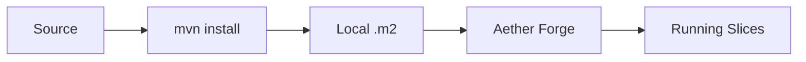
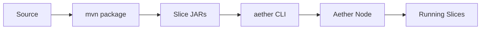

# Slice Deployment

Deploy slices to Aether environments using blueprints and deploy scripts.

## Deployment Architecture

### Local Development (Forge)



Forge reads slices directly from your local Maven repository (`~/.m2/repository`).

### Test/Production Environments



Remote environments use the Management API to push artifacts to the Aether node's built-in repository (`PUT /repository/...`).

## Blueprint Generation

### Automatic Generation

```bash
./generate-blueprint.sh
```

Or directly:
```bash
mvn package jbct:generate-blueprint -DskipTests
```

### What Blueprint Contains

```toml
# Generated by jbct:generate-blueprint
# Regenerate with: mvn jbct:generate-blueprint

id = "org.example:commerce:1.0.0"

[[slices]]
artifact = "org.example:inventory-service:1.0.0"
instances = 1
# transitive dependency

[[slices]]
artifact = "org.example:commerce-payment-service:1.0.0"
instances = 2
timeout_ms = 30000
load_balancing = "round_robin"

[[slices]]
artifact = "org.example:commerce-order-service:1.0.0"
instances = 3
memory_mb = 512
affinity_key = "customerId"
```

### Slice Configuration

Blueprint properties are read from per-slice config files at `src/main/resources/slices/{SliceName}.toml`:

```toml
# src/main/resources/slices/OrderService.toml

[blueprint]
instances = 3
timeout_ms = 30000
memory_mb = 512
load_balancing = "round_robin"
affinity_key = "customerId"
```

| Property | Type | Default | Description |
|----------|------|---------|-------------|
| `instances` | int | `1` | Number of slice instances |
| `timeout_ms` | int | - | Request timeout in milliseconds |
| `memory_mb` | int | - | Memory allocation per instance |
| `load_balancing` | string | - | Load balancing strategy (`round_robin`, `least_connections`) |
| `affinity_key` | string | - | Request field for sticky routing |

If a slice config file is missing, default values are used (logged as info message).

### Topological Ordering

The blueprint lists slices in dependency order:
1. External dependencies first (transitive)
2. Local slices ordered by their internal dependencies
3. Dependents after their dependencies

This ensures Aether can start slices in the correct order.

### Custom Blueprint ID

```bash
mvn jbct:generate-blueprint -Djbct.blueprint.id="my-system:prod:2.0.0"
```

### Custom Output Location

```bash
mvn jbct:generate-blueprint -Djbct.blueprint.output=deploy/my-blueprint.toml
```

## Deploy Scripts

Generated by `jbct init --slice`:

| Script | Environment | Mechanism |
|--------|-------------|-----------|
| `deploy-forge.sh` | Local development Forge | `mvn install` → local .m2 |
| `deploy-test.sh` | Test environment | `aether artifact push` + `aether blueprint apply` |
| `deploy-prod.sh` | Production (with confirmation) | `aether artifact push` + `aether blueprint apply` |

### deploy-forge.sh

For local development. Installs to local Maven repository, which Forge reads directly:

```bash
#!/bin/bash
# Deploy to local Aether Forge
set -e

echo "Building and installing to local repository..."
mvn clean install -DskipTests

echo ""
echo "Slice installed to local Maven repository."
echo "Forge will automatically detect the update."
echo "Dashboard: http://localhost:8888"
```

### deploy-test.sh

For test environment. Uses the Aether CLI to deploy artifacts and blueprints:

```bash
#!/bin/bash
# Deploy to test environment
set -e

AETHER_URL="${AETHER_TEST_URL:-http://test.aether.example.com:5150}"

echo "Building..."
mvn clean verify

echo "Pushing artifact to test..."
aether -c "$AETHER_URL" artifact push target/*.jar

echo "Applying blueprint..."
aether -c "$AETHER_URL" blueprint apply target/blueprint.toml

echo ""
echo "Deployed to test: $AETHER_URL"
```

#### Alternative (HTTP API)

If the CLI is not available, use the Management API directly:

```bash
GROUP_PATH="com/example"  # groupId with dots replaced by slashes
ARTIFACT="my-slice"
VERSION="1.0.0"

curl -X PUT "${AETHER_URL}/repository/${GROUP_PATH}/${ARTIFACT}/${VERSION}/${ARTIFACT}-${VERSION}.jar" \
  --data-binary @target/${ARTIFACT}-${VERSION}.jar

curl -X POST "${AETHER_URL}/api/blueprint" \
  -H "Content-Type: application/toml" \
  --data-binary @target/blueprint.toml
```

### deploy-prod.sh

For production (with safety confirmation):

```bash
#!/bin/bash
# Deploy to production
set -e

AETHER_URL="${AETHER_PROD_URL:-http://prod.aether.example.com:5150}"

echo "WARNING: Deploying to PRODUCTION"
echo "Target: $AETHER_URL"
echo ""
read -p "Are you sure? (yes/no): " confirm

if [ "$confirm" != "yes" ]; then
    echo "Deployment cancelled"
    exit 1
fi

echo "Building..."
mvn clean verify

echo "Pushing artifact to production..."
aether -c "$AETHER_URL" artifact push target/*.jar

echo "Applying blueprint..."
aether -c "$AETHER_URL" blueprint apply target/blueprint.toml

echo ""
echo "Deployed to production: $AETHER_URL"
```

#### Alternative (HTTP API)

If the CLI is not available, use the Management API directly:

```bash
GROUP_PATH="com/example"  # groupId with dots replaced by slashes
ARTIFACT="my-slice"
VERSION="1.0.0"

curl -X PUT "${AETHER_URL}/repository/${GROUP_PATH}/${ARTIFACT}/${VERSION}/${ARTIFACT}-${VERSION}.jar" \
  --data-binary @target/${ARTIFACT}-${VERSION}.jar

curl -X POST "${AETHER_URL}/api/blueprint" \
  -H "Content-Type: application/toml" \
  --data-binary @target/blueprint.toml
```

## Environment Configuration

### Environment Variables

Configure Aether Management API URLs via environment variables:

```bash
# In ~/.bashrc or ~/.zshrc
export AETHER_TEST_URL="http://test.aether.example.com:5150"
export AETHER_PROD_URL="http://prod.aether.example.com:5150"
```

Or set them in CI/CD secrets.

## Aether Forge

### What is Forge?

Aether Forge is the local development environment for slices:
- Runs slices locally
- Provides hot-reload on code changes
- Simulates cluster behavior
- Includes debugging tools

### Starting Forge

```bash
# Build and start Forge (from project root)
./run-forge.sh
```

Or manually:

```bash
mvn package -pl aether/forge/forge-core -am -DskipTests
java -jar aether/forge/forge-core/target/aether-forge.jar
```

Default dashboard port: 8888. Management ports start at 5150.

### Forge Dashboard

Access at `http://localhost:8888`:
- View running slices
- Monitor slice health
- View request/response logs
- Inspect dependency graph

### Development Workflow

```bash
# Terminal 1: Start Forge
./run-forge.sh

# Terminal 2: Build and deploy
./deploy-forge.sh

# Make changes, then redeploy
./deploy-forge.sh
```

Forge watches your local Maven repository and automatically reloads when slices are updated.

## Multi-Module Deployment

For projects with multiple slice modules:

```
parent/
├── pom.xml
├── inventory/
│   └── pom.xml
├── payments/
│   └── pom.xml
└── orders/
    └── pom.xml
```

### Aggregator Blueprint

Create a blueprint that includes all modules:

```bash
# From parent directory
mvn package -DskipTests

# Generate combined blueprint
cat > target/system-blueprint.toml << EOF
id = "org.example:commerce-system:1.0.0"

[[slices]]
artifact = "org.example:inventory-service:1.0.0"
instances = 2

[[slices]]
artifact = "org.example:payment-service:1.0.0"
instances = 1

[[slices]]
artifact = "org.example:order-service:1.0.0"
instances = 3
EOF
```

### Instance Scaling

Modify `instances` in blueprint for different environments:

```toml
# Development
[[slices]]
artifact = "org.example:order-service:1.0.0"
instances = 1

# Production
[[slices]]
artifact = "org.example:order-service:1.0.0"
instances = 5
```

## Dependency Resolution

### How External Dependencies are Resolved

1. **Build time**: Annotation processor records external dependencies in manifest
2. **Blueprint generation**: Reads manifests, recursively resolves transitive deps
3. **Deployment**: Aether Forge/runtime fetches JARs from Maven repository

### Dependency Version Sources

Priority order:
1. Explicit version in `slice-deps.properties`
2. Version from Maven dependency resolution
3. Error if unresolved

### slice-deps.properties

Generated by `jbct:collect-slice-deps`:

```properties
# Escaped colons in property keys
org.example\:inventory-service\:api=1.0.0
org.example\:pricing-engine\:api=2.1.0
```

## Deployment Verification

### Check Deployed Slices

```bash
curl http://localhost:5150/api/blueprints
```

Response:
```json
{
  "slices": [
    {
      "artifact": "org.example:order-service:1.0.0",
      "status": "running",
      "instances": 1
    }
  ]
}
```

### Health Check

```bash
curl http://localhost:5150/health
```

### Test Slice Endpoint

Slices are invoked via their HTTP routes defined in `routes.toml`. The app HTTP port
starts at 8070 in Forge (or as configured in your deployment):

```bash
# Example: call a route defined in routes.toml as POST /api/orders
curl -X POST http://localhost:8070/api/orders \
  -H "Content-Type: application/json" \
  -d '{"customerId": "CUST-123", "items": []}'
```

## Rollback

### Forge (Development)

```bash
# Redeploy previous version
git checkout v1.0.0
mvn verify && ./deploy-forge.sh
```

### Production

1. Deploy previous version:
```bash
git checkout v1.0.0
mvn verify && ./deploy-prod.sh
```

2. Or use the Management API to apply a previous blueprint version:
```bash
# Re-apply the previous blueprint pointing to the older artifact version
curl -X POST "${AETHER_PROD_URL}/api/blueprint" \
  -H "Content-Type: application/toml" \
  --data-binary @target/blueprint-v1.0.0.toml
```

Forge also supports deployments via its API (see [Forge Guide](forge-guide.md)).

## Deployment Atomicity

### ALL_OR_NOTHING Mode

All Aether deployments use ALL_OR_NOTHING atomicity by default. This means:

- **All slices in a blueprint deploy together** — if any slice fails to load, the entire deployment rolls back
- **No partial deployments** — you never end up with some slices running and others failed
- **Automatic rollback** — on failure, previously running slices are restored to their prior state

This is enforced at the blueprint level. Individual slice deployments inherit the same behavior.

### Blueprint Auto-Rollback

When a blueprint deployment fails:

1. The failing slice reports a `SliceLoadingFailure` cause
2. The Cluster Deployment Manager (CDM) detects the failure
3. All slices in the blueprint are rolled back to their previous versions
4. The failure cause is propagated through the KV store
5. The CLI/API returns the specific error with deployment context

```bash
# If deployment fails, you'll see the cause:
aether -c $URL blueprint apply blueprint.toml
# Error: Deployment failed: SliceLoadingFailure(OrderService) - ClassNotFoundException: ...
# All slices rolled back to previous state.
```

## CI/CD Integration

### GitHub Actions Example

```yaml
name: Deploy

on:
  push:
    branches: [main]

jobs:
  deploy-test:
    runs-on: ubuntu-latest
    steps:
      - uses: actions/checkout@v4

      - uses: actions/setup-java@v4
        with:
          java-version: '25'
          distribution: 'temurin'

      - name: Build and Test
        run: mvn verify

      - name: Deploy Artifact to Test
        run: aether -c "$AETHER_TEST_URL" artifact push target/my-slice-1.0.0.jar
        env:
          AETHER_TEST_URL: ${{ secrets.AETHER_TEST_URL }}

      - name: Apply Blueprint to Test
        run: aether -c "$AETHER_TEST_URL" blueprint apply target/blueprint.toml
        env:
          AETHER_TEST_URL: ${{ secrets.AETHER_TEST_URL }}

  deploy-prod:
    needs: deploy-test
    runs-on: ubuntu-latest
    if: github.ref == 'refs/heads/main'
    environment: production
    steps:
      - uses: actions/checkout@v4

      - uses: actions/setup-java@v4
        with:
          java-version: '25'
          distribution: 'temurin'

      - name: Build
        run: mvn package -DskipTests

      - name: Deploy Artifact to Production
        run: aether -c "$AETHER_PROD_URL" artifact push target/my-slice-1.0.0.jar
        env:
          AETHER_PROD_URL: ${{ secrets.AETHER_PROD_URL }}

      - name: Apply Blueprint to Production
        run: aether -c "$AETHER_PROD_URL" blueprint apply target/blueprint.toml
        env:
          AETHER_PROD_URL: ${{ secrets.AETHER_PROD_URL }}
```

### Jenkins Pipeline

```groovy
pipeline {
    agent any

    environment {
        AETHER_TEST_URL = credentials('aether-test-url')
        AETHER_PROD_URL = credentials('aether-prod-url')
    }

    stages {
        stage('Build') {
            steps {
                sh 'mvn verify'
            }
        }

        stage('Deploy Test') {
            steps {
                sh '''
                    aether -c "${AETHER_TEST_URL}" artifact push target/my-slice-1.0.0.jar
                    aether -c "${AETHER_TEST_URL}" blueprint apply target/blueprint.toml
                '''
            }
        }

        stage('Deploy Prod') {
            when {
                branch 'main'
            }
            input {
                message 'Deploy to production?'
            }
            steps {
                sh '''
                    aether -c "${AETHER_PROD_URL}" artifact push target/my-slice-1.0.0.jar
                    aether -c "${AETHER_PROD_URL}" blueprint apply target/blueprint.toml
                '''
            }
        }
    }
}
```
