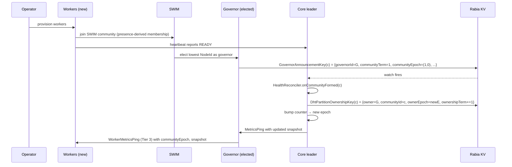
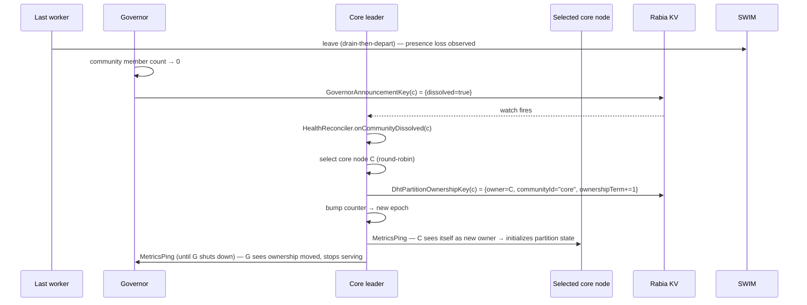

# ClusterGeneration — End-to-End Membership Choreography

> ✏️ **UPDATED — membership content SUPERSEDED by [`cluster-topology-overhaul-spec.md`](cluster-topology-overhaul-spec.md).** Placement / generation / epoch / quiescence content stays current; the membership content (`coreMembers` in the snapshot, `HealthReconciler` as membership writer, `NodeLifecycleKey`) is wrong on shipped mechanics — `HealthReconciler` does not exist; membership is FSM-derived.

**Status:** Draft sketch for review · **Target:** v1.0.0-rc1 or v1.0.1 (scope TBD) · **Author:** design session 2026-04-18 evening

## 1. Goals

1. **One conductor, one baton.** Single-writer discipline for every membership-affecting decision. No more independent reconcilers drifting apart.
2. **Coherent cluster view across all nodes.** Every healthy node observes the same snapshot within one ping interval of commit.
3. **Quiescence is observable.** Tests and operators can ask "is the cluster settled at epoch ≥ N?" and get a deterministic answer.
4. **Transparent small↔large mode transition** between core-only and core+communities, including DHT partition ownership migration.
5. **Piggyback on existing infrastructure.** Extend `MetricsPing/Pong` and `WorkerMetricsPing/Pong`; do not add a parallel distribution layer.
6. **Delete more than we add.** Collapse ~15 independent timers, retire tombstones/eviction/manual cleanup paths, strip test-harness retry loops.

## 2. Non-goals

- Full Phase 2 DHT (anti-entropy, rolling update routing, affinity routing). This spec prepares the ground (partition ownership atom + epoch stamping) but does not close Phase 2 open issues.
- Rolling-upgrade path from 0.x. Clean break at the version where this lands.
- Worker↔core role promotion. Per user, roles are fixed at provision; different provisioning sources.
- LLM / TTM integration. Post-RC1 concerns; this spec leaves the metrics pipeline compatible.

## 3. Principle

The cluster's authoritative state is expressed as a set of **atoms** committed via Rabia into KV-Store. Each atom is an independent, versioned fact about one slice of reality (one community's governor, one partition's owner, the desired core size). Node membership is **not** an atom: it is presence-derived (SWIM/QUIC via NTT), and node readiness/drain is heartbeat-reported and leader-cached — never stored in or committed to the KV-Store (see `aether/docs/specs/membership-architecture-v2-spec.md`).

The **generation snapshot** (`ClusterGenerationSnapshot`) is a **projection** of those atoms, held in the elected leader's memory, distributed via periodic ping, and consumed by all nodes as a single coherent view. The snapshot itself is **ephemeral** — never committed to KV-Store. Its epoch is derived from `(rabiaTerm, localMutationCounter)`, which is globally monotonic.

This separation gives us:

- **Durability** through Rabia-committed atoms (survives leader death, partition heal).
- **Coherence** through leader-projected snapshots (single truth per epoch).
- **Liveness** through ping distribution (bounded propagation).
- **Observability** through ping-response aggregation (quiescence is a scalar).

## 4. Epoch

```
Epoch = (rabiaTerm: long, localCounter: long)
```

Ordering: `(t₁,c₁) < (t₂,c₂)` iff `t₁<t₂ || (t₁==t₂ && c₁<c₂)`.

Leader behavior:
- On election, leader reads its Rabia term `T`. Local counter resets to 0. First emitted epoch is `(T, 0)`.
- On each atom-mutating action the leader takes, local counter increments. Example: applying a `DhtPartitionOwnershipKey` transfer increments the counter; snapshot is reprojected; next ping carries `(T, counter+1)`.
- Epoch is **strictly monotonic across all leader terms** because Rabia guarantees `T` is monotonic.

Node behavior:
- Track `observedEpoch` (last accepted) and `observedRabiaTerm`.
- Reject any ping whose `rabiaTerm < observedRabiaTerm` (stale leader).
- Accept any ping whose `rabiaTerm > observedRabiaTerm` (new leader; begin tracking at its `(T, 0)`).
- Accept any ping whose `rabiaTerm == observedRabiaTerm` only if `localCounter ≥ observed localCounter` (ignore reordered-stale pings within a term).

Consumer fencing:
- Any action that takes effect on behalf of a specific epoch (e.g. governor cleanup commands, DHT partition writes, slice ACTIVE transitions) carries the epoch it was decided at. Receivers accept only if their `observedEpoch ≥ stampedEpoch`. Older-epoch actions are dropped.

## 5. Atoms (the Rabia-committed facts)

### 5.1 Existing atoms (unchanged)

| Key | Value | Written by | Role |
|---|---|---|---|
| `SliceTargetKey(sliceId)` | `SliceTargetValue { version, instanceCount, ... }` | ControlLoop / operator | Desired slice state |
| `NodeArtifactKey(nodeId, artifact)` | `NodeArtifactValue { state, ... }` | CDM (command state) | Per-node per-slice command |
| `SliceNodeKey(sliceId, nodeId)` | `SliceNodeValue { state, ... }` | NDM (state transitions) | Per-node per-slice observed state |
| `NodeRoutesKey(nodeId, artifact)` | `NodeRoutesValue { routes[] }` | NDM on activation | Per-node published routes |

### 5.2 Extensions to existing atoms

**`GovernorAnnouncementValue` gains:**
- `communityTerm: long` — bumps on each governor change within a community. Community-level equivalent of Rabia term.
- `communityEpoch: Epoch` — `(communityTerm, localCounter)` for fencing community-level actions.
- `observedCoreEpoch: Epoch` — stamped at announcement time.
- `transitionedAt: HlcTimestamp` — when the `governorId` last changed. Distinct from existing `announcedAt` (which updates on every periodic re-announcement).

### 5.3 New atoms

#### 5.3.1 `DhtPartitionOwnershipKey(partitionId: String) → DhtPartitionOwnershipValue`

```
DhtPartitionOwnershipValue {
  ownerNodeId:      NodeId,
  ownerCommunityId: String,      // "core" or a worker communityId
  ownerEpoch:       Epoch,       // core epoch at the time of assignment
  ownershipTerm:    long,        // bumps on each ownership transfer
  transferredAt:    HlcTimestamp
}
```

Written only by the leader through `HealthReconciler.assignPartition()`. Read by DHT clients to route requests. Epoch-fenced: writes by `ownerNodeId` to DHT entries carry `ownershipTerm`; readers reject stale-term writes.

#### 5.3.2 `SpokesmanKey(coreNodeId: NodeId) → SpokesmanValue`

```
SpokesmanValue {
  communities:     List<String>,         // community IDs this core node handles
  assignedEpoch:   Epoch,                // core epoch at assignment time
  assignedAt:      HlcTimestamp,         // when the current list took effect
  version:         long,                 // bumps on each rebalance
  status:          ASSIGNED | ACTIVE | FAILED,
  failureReason:   String                // optional
}
```

Shards Tier 2 governor communication across all core nodes. Each core node holds one `SpokesmanValue` listing the communities it is responsible for pinging. Uses the existing 3-state lifecycle from the delegated-control-plane spec (`ASSIGNED` → `ACTIVE` on successful activation; `FAILED` → coordinator rebalances).

**Rebalance triggers:**
| Trigger | Action |
|---|---|
| Community formed | Append to least-loaded core node's list |
| Community dissolved | Remove from all lists |
| Core node added | Redistribute evenly |
| Core node removed / FAULTY | Redistribute its communities across survivors |
| Spokesman assignment FAILED | Reassign affected communities |

All rebalance actions are atomic Rabia batch writes through `HealthReconciler`.

## 6. ClusterGenerationSnapshot (ephemeral)

```
ClusterGenerationSnapshot {
  epoch:              Epoch,                         // (rabiaTerm, localCounter)
  rabiaTerm:          long,                          // duplicated for fencing convenience
  committedAt:        HlcTimestamp,
  reason:             GenerationReason,              // last mutation cause

  coreMembers:        Map<NodeId, CoreMember>,       // ≤ 11 entries
  desiredCoreSize:    int,

  communities:        Map<String, CommunitySummary>, // 0..N; "core" implicit
  partitions:         Map<String, PartitionOwner>,   // 0..M DHT partitions

  derivedMode:        ClusterMode                    // COREONLY | HIERARCHICAL
}

CoreMember {
  nodeId, host, port,
  readiness:     SYNCING | READY | DRAINING,   // heartbeat-reported, leader-cached — never KV
  healthHint:    HEALTHY | SUSPECTED | FAULTY,
  joinedEpoch:   Epoch,
  lastSeenEpoch: Epoch          // last epoch at which leader received a pong
}

CommunitySummary {
  communityId, governorNodeId,
  communityTerm:    long,
  communityEpoch:   Epoch,
  memberCount:      int,
  healthHistogram:  { healthy, suspected, faulty },
  partitions:       Set<String>,
  lastAckAtCore:    Epoch        // last core-epoch at which governor acknowledged
}

PartitionOwner {
  partitionId,
  ownerNodeId, ownerCommunityId, ownerEpoch, ownershipTerm
}

GenerationReason  = LEADER_ELECTED | MEMBER_ADDED | MEMBER_REMOVED | HEALTH_CHANGE
                  | COMMUNITY_FORMED | COMMUNITY_DISSOLVED | PARTITION_TRANSFERRED
                  | CLUSTER_SIZE_CHANGED | PERIODIC_REFRESH

ClusterMode = COREONLY | HIERARCHICAL   // derived: HIERARCHICAL iff ∃ non-"core" community
```

Size: ~1.5 KB at 10 core members + a handful of communities. Bounded by core count (≤11) + community count; each community is a summary, not member list.

## 7. Distribution — three tiers, piggyback on existing ping-pong

### 7.1 Infrastructure that already exists

| Component | Location | Today's purpose |
|---|---|---|
| `MetricsMessage.MetricsPing/Pong` | `integrations/cluster/src/main/java/org/pragmatica/cluster/metrics/MetricsMessage.java` | Leader pings all nodes with aggregated metrics; nodes respond |
| `MetricsCollector`, `MetricsScheduler` | `aether/aether-metrics/src/main/java/org/pragmatica/aether/metrics/` | Orchestrate per-node collection + leader aggregation |
| `WorkerMetricsAggregator` + `WorkerMetricsPing/Pong` | `aether/aether-metrics/src/main/java/org/pragmatica/aether/worker/metrics/` | Governor pings community followers; collects metrics |
| `CommunityMetricsSnapshot` / `…Request` | `aether/aether-metrics/worker/metrics/` | Governor responds to core's snapshot request with aggregated community state |
| `DeploymentMetricsMessage` | `integrations/cluster/.../DeploymentMetricsMessage.java` | Second ping-pong, carries deployment milestones |

### 7.2 Tier 1 — Core leader ↔ core members (extend `MetricsPing/Pong`)

**Ping (leader → each core member), interval = 500ms (configurable):**

```
MetricsPing {
  sender:           NodeId (leader),
  rabiaTerm:        long,
  epoch:            Epoch,
  generation:       ClusterGenerationSnapshot | Diff,
  allMetrics:       Map<NodeId, Map<String, Double>>     // existing, unchanged
}
```

The generation field carries a full snapshot when the epoch has advanced since the last ping to this node, or a diff (cheap) when epoch is unchanged. Diff reduces steady-state bytes on the wire; full snapshot on every epoch advance keeps consumer state-machine simple.

**Pong (core member → leader):**

```
MetricsPong {
  sender:                NodeId,
  observedRabiaTerm:     long,
  observedEpoch:         Epoch,
  readiness:             NodeReadiness,                  // node-authoritative (SYNCING/READY/DRAINING), heartbeat-reported — never KV
  metrics:               Map<String, Double>             // existing
}
```

Leader aggregates per-node `observedEpoch` into a live map. Quiescence is `min(observedEpoch for healthy members) ≥ targetEpoch`.

### 7.3 Tier 2 — Core nodes ↔ community governors (sharded via SPOKESMAN)

Tier 2 is **sharded across all core nodes** — not centralized on the leader — to avoid fan-out bottleneck and match the existing delegated-control-plane model.

**Assignment:** Each core node reads its `SpokesmanKey(selfNodeId)` (§5.3.2) and pings only the governors of its assigned communities.

**Snapshot relay:** The leader's Tier 1 ping distributes the current `ClusterGenerationSnapshot` to all core nodes. Each core node **relays the same snapshot** in its Tier 2 pings to assigned governors. No independent snapshot state on follower core nodes — they echo the leader's view.

**Ping (core node → each assigned governor), interval = 500ms (configurable):**

```
MetricsPing  (same message type as Tier 1)
  sender:          NodeId (this core node, not necessarily the leader),
  rabiaTerm:       long,
  epoch:           Epoch,
  generation:      ClusterGenerationSnapshot,
  allMetrics:      Map<NodeId, Map<String, Double>>
```

**Pong (governor → assigned core node):**

```
MetricsPong (from governor) additionally carries:
  communityId:          String,
  communityTerm:        long,
  communityEpoch:       Epoch,
  communityMembership:  { onDuty: int, draining: int, faulty: int },
  partitionsHeld:       Set<String>
```

**Aggregation up to leader:** Each core node aggregates its assigned-community pongs into a `CommunityReport` batch. This batch piggybacks on the core node's own Tier 1 pong to the leader:

```
MetricsPong (core node → leader) additionally carries:
  communityReports: List<CommunityReport> {
    communityId, communityTerm, communityEpoch,
    governorNodeId, memberCount, healthHistogram, partitionsHeld,
    lastPongFromGovernorAt
  }
```

**Leader composition:** The leader projects `snapshot.communities` from all core nodes' `communityReports` (plus `GovernorAnnouncementKey` watch for new communities / dissolutions). Each community in the snapshot is tagged with the core node currently responsible for it.

**Orphan window:** Between a community forming (governor writes `GovernorAnnouncementKey`) and its Spokesman assignment committing, the community has no assigned core node. Duration: ≤1 rebalance cycle (≤ ping interval). Workers keep Tier 3 running; core simply lacks observation for that interval. Acceptable.

**Failover:** When core node C departs (presence loss observed via SWIM/QUIC, §8), the leader rebalances C's communities across survivors. No observation gap for survivors; brief gap for C's former assignees until the rebalanced core node's first Tier 2 ping. C's departure is presence-derived — there is no node-state KV write.

### 7.4 Tier 3 — Governor ↔ community workers (extend `WorkerMetricsPing/Pong`)

**Governor's ping cycle already runs** (see `WorkerMetricsAggregator.runCycle()`). We extend the payload:

```
WorkerMetricsPing {
  sender:           NodeId (governor),
  timestampMs:      long,                                // existing
  communityTerm:    long,
  communityEpoch:   Epoch,
  observedCoreEpoch: Epoch,                              // governor's last-acked core epoch
  snapshot:         CommunityGenerationSnapshot          // small: governor + members + partitions
}

WorkerMetricsPong {
  sender:           NodeId,
  observedCommunityEpoch: Epoch,
  cpuUsage, heapUsage, activeInvocations, p95LatencyMs, errorRate      // existing
}
```

Governor tracks `observedCommunityEpoch` per follower → community quiescence scalar.

### 7.5 Snapshot-vs-diff on the wire

For Tier 1/2 pings:
- If `(targetNode, lastEpoch) == (n, E_prev)` and current epoch is `E_prev` → ping carries **no generation** (just heartbeat).
- If current epoch `E > E_prev` → ping carries **full snapshot**.
- If a node is more than K epochs behind (rare — network blip) → ping carries full snapshot.

Steady-state wire: heartbeats with metrics only. Change events: one-ping full snapshot. No diff mechanism needed for RC1; keeps consumer logic trivial.

### 7.6 Leader election and ping continuity

- Rabia re-election bumps `rabiaTerm`.
- New leader reads all committed atoms, projects `ClusterGenerationSnapshot`, emits epoch `(newTerm, 0)`.
- First ping carries `rabiaTerm > observedRabiaTerm` at every node → snapshot accepted universally.
- Old leader's pings (if still in flight) are rejected silently by term check.

Gap: Rabia election (~1–2s) + projection (<100ms) + ≤1 ping interval (500ms) → **~2–3s of distribution staleness** during leader change. Projections on nodes continue serving the last-known-good snapshot in the interim.

## 8. HealthReconciler (leader-only, single-writer)

The `HealthReconciler` is the leader-resident component that consumes health signals and decides which atoms to mutate. It issues `DhtPartitionOwnershipKey` transfers and `SpokesmanKey` updates in response to node presence changes, and drives the ephemeral epoch counter. Node membership itself is presence-derived (SWIM/QUIC via NTT) and is **not** an atom it writes — there is no node-state KV record (see `aether/docs/specs/membership-architecture-v2-spec.md`).

### 8.1 Input signals

| Signal | Source | Semantics |
|---|---|---|
| `PingTimeout(nodeId)` | `MetricsAggregator` — missed pong for K intervals | Node unreachable from leader |
| `SwimHint(nodeId, state)` | `CoreSwimHealthDetector` (advisory now) | Peer-to-peer observation |
| `QuicDisconnect(nodeId)` | `QuicClusterNetwork` | Transport-level signal |
| `GovernorAnnouncement(communityId, newGovernor)` | KV watch | Community elected new governor |
| `CommunityDissolved(communityId)` | KV watch | Governor wrote `dissolved=true` |
| `SpokesmanAssignmentFailed(coreNodeId, communities)` | KV watch on `SpokesmanKey` with `status=FAILED` | A core node could not activate its Spokesman assignment |
| `OperatorAction(intent)` | REST/CLI | Explicit scale / drain / remove |

### 8.2 Decision table (abbreviated)

| Event | Gate | Action (atom writes, in Rabia batch) | Epoch effect |
|---|---|---|---|
| `PingTimeout(n)` for 3 × interval AND `n` is a present member | Not in `pendingRems` | → mark `healthHint=SUSPECTED`; no membership change yet | counter++ |
| `PingTimeout(n)` for 10 × interval AND `SwimHint(n, FAULTY)` | Not in `pendingRems` | presence loss confirmed → if `n` owned partitions, schedule transfer (membership update is presence-derived, no KV node-state write) | counter++ |
| `SwimHint(n, FAULTY)` alone (no ping timeout) | — | `healthHint=SUSPECTED` only (don't remove on SWIM alone) | counter++ |
| `OperatorAction(remove(n))` | Budget check | send `DRAIN` command to `n` on the heartbeat → await node's `DRAINING`/departure self-report (no KV node-state write) | counter++ |
| `GovernorAnnouncement(c, g_new)` | `communityTerm` > current | Update projection only (atom is already committed) | counter++ |
| `CommunityDissolved(c)` | `GovernorAnnouncementKey(c)` has `dissolved=true` | Select core node `n`; `DhtPartitionOwnershipKey(p) = (n, "core", newEpoch, termᐩᐩ)` for each `p` held by `c`; remove `c` from all `SpokesmanKey(*)` lists | counter++ per partition |
| `CommunityFormed(c)` (new announcement for new `c`) | — | Append `c` to least-loaded core node's `SpokesmanKey`; optionally transfer partition ownership from "core" to governor | counter++ |
| core node C departs (presence loss) | — | Remove C's `SpokesmanKey`; redistribute C's communities across remaining core nodes (single Rabia batch) | counter++ |
| core node C becomes present and `READY` (heartbeat) | — | Create `SpokesmanKey(C)` with initial share rebalanced from overloaded peers | counter++ |
| `SpokesmanAssignmentFailed(C, communities)` | — | Reassign `communities` to other core nodes; clear FAILED state | counter++ |

### 8.3 Atomicity

All atom writes in a single decision are batched via one `cluster.apply(...)` Rabia call. Leader's next ping carries the reprojected snapshot. Either everything commits or nothing does — consistent with Rabia's semantics.

## 9. DHT partition ownership + transfer protocol

### 9.1 Partition identity

Partition is a logical shard of DHT keyspace. For Phase 1 simplicity we define partitions as **one per community** (`"core"` + each worker community → 1..N partitions). In Phase 2 finer partitioning kicks in; the atom generalizes.

### 9.2 Ownership atom (see §5.3)

`DhtPartitionOwnershipKey(partitionId) → DhtPartitionOwnershipValue` holds `(ownerNodeId, ownerCommunityId, ownerEpoch, ownershipTerm)`.

### 9.3 Transfer protocol

Leader-driven, atomic:

```
mutate(TransferPartition(partitionId, fromOwnerInfo, toOwnerInfo)):
  1. Read current DhtPartitionOwnershipKey(partitionId) from consensus
  2. Validate from-owner matches current owner
  3. Write DhtPartitionOwnershipKey(partitionId) = {
         ownerNodeId     = toOwnerInfo.nodeId,
         ownerCommunityId= toOwnerInfo.communityId,
         ownerEpoch      = nextEpoch(),
         ownershipTerm   = oldTerm + 1,
         transferredAt   = hlcNow()
     }
  4. Bump local counter (ephemeral epoch advances)
  5. Next ping carries reprojected snapshot; old owner sees its `ownershipTerm` is stale
```

Old owner's in-flight DHT writes are fenced: consumers reject writes carrying `ownershipTerm < current`.

### 9.4 When transfer is triggered

| Trigger | From → To |
|---|---|
| Community forms | `"core"` → new governor's community |
| Community dissolves | governor's community → `"core"` (core node selected round-robin) |
| Governor failover within community | old governor → new governor (same community, `ownershipTerm` bumps) |
| Operator manual reassignment | explicit |

## 10. Governor announcement extensions

`GovernorAnnouncementValue` today holds `{governorId, members[], tcpAddress, memberCount, announcedAt}`. Extensions:

```
GovernorAnnouncementValue {
  communityId,
  governorId,
  members:          List<NodeId>,
  tcpAddress,
  memberCount,
  announcedAt,
  communityTerm:    long,                // NEW
  communityEpoch:   Epoch,               // NEW
  observedCoreEpoch: Epoch,              // NEW, stamped at announcement time
  dissolved:        boolean              // NEW, default false
}
```

- Governor writes announcement on election; `communityTerm` bumps, `communityEpoch = (communityTerm, 0)`.
- Governor writes announcements periodically (heartbeat into consensus — low freq, e.g. every 10s) to refresh `observedCoreEpoch` liveness signal.
- On community dissolve (last worker leaves), governor writes `dissolved=true` → HealthReconciler picks up via KV watch → transfers partitions to core.

## 11. Transition scenarios

### 11.1 Small cluster (COREONLY mode)

- 5 core nodes, zero communities, zero workers.
- Snapshot: `coreMembers[5]`, `communities = {}`, `partitions = { "default": owner = core-leader }`, `derivedMode = COREONLY`.
- Only Tier 1 ping-pong active.
- `/api/cluster/generation` exposes `mode: "core-only"`.

### 11.2 Growth to HIERARCHICAL



### 11.3 Shrinking — community dissolves, core absorbs



### 11.4 Governor failover within a community

- Governor G dies.
- SWIM within community detects; next-lowest-NodeId governor G' elected.
- G' writes `GovernorAnnouncementKey(c) = {governorId=G', communityTerm+=1, communityEpoch=(newTerm,0), ...}`.
- Core leader sees via KV watch → HealthReconciler updates projection + issues partition-ownership transfer `G → G'` (same communityId, new owner).

### 11.5 Core leader election

- Current leader `L` dies.
- Rabia elects `L'`. `rabiaTerm` bumps.
- `L'` reads all committed atoms, projects snapshot, emits epoch `(newTerm, 0)`.
- First ping from `L'` carries higher `rabiaTerm` → all nodes accept.
- In-flight pings from `L` rejected on arrival.
- Gap: ~2–3s distribution staleness during the transition.

## 12. Projections on consumers

Every node receives snapshots via ping and updates projections:

| Consumer | Reads from snapshot | Replaces what |
|---|---|---|
| `TopologyObserver` | `coreMembers` | In-memory `nodeStatesById`, `coreNodeIds`, `readyNodes`, `tombstonedNodes` — **DELETED** |
| `ClusterTopologyManagerRecord` | `coreMembers.size()`, `desiredCoreSize`, `pendingAdds/Rems` | Deficit detection from periodic timer → now snapshot-delta-driven |
| `ClusterDeploymentManager` | `coreMembers`, `communities` for scheduling | Stale-cleanup timer → now snapshot-delta-driven (nodes that disappear → cleanup their artifacts in next reconcile triggered by snapshot change) |
| `HttpRouteRegistry` | `coreMembers` + `communities` for route presence | `NodeRoutesKey` watch stays, but ACTIVE transition is epoch-fenced |
| `NodeDeploymentManager` | current `epoch` for ROUTING → ACTIVE gate | Timer-based ROUTING wait → epoch-fenced |
| `QuicClusterNetwork` | informational only | No longer authoritative writer — emits only `TransportObservation` (local OBSERVATION stream); the cluster-canonical `MembershipDecision.NodeRemoved` comes exclusively from `TopologyObserver.publishMembershipDeltas`. See `membership-architecture-v2-spec.md` (typed-stream split). |
| Dashboard / `/api/cluster/topology` | core+communities+partitions | Single source |

## 13. What gets deleted

### 13.1 Code

- `TopologyObserver`: `handleAddNodeMessage`, `handleRemoveNodeMessage`, `handleSetClusterSize`, `tombstonedNodes`, `evictLongSuspectedPeers`, `initReconcile` timer → DELETED. Becomes a thin projection of `ClusterGenerationSnapshot`.
- `TopologyManagementMessage.AddNode / RemoveNode / SetClusterSize` records + their router wiring (`RabiaNode:197-199`, `PassiveNode:114-116`) → DELETED.
- `QuicClusterNetwork`: `onPostEstablishGraceComplete` flush-nodeRemoved, `onQuorumLossConfirmed` flush, quorum-loss hysteresis buffers → DELETED or demoted to health hints.
- `CoreSwimHealthDetector.onMemberFaulty`: no longer emits `RemoveNode` directly; emits `SwimHint` to HealthReconciler.
- `ClusterTopologyManagerRecord`: `scheduleRecheck` timer, `attemptProvisionAfterHysteresis` timer, `deficitHysteresis` → REPLACED by snapshot-delta reactions.
- `ClusterDeploymentManager`: `cleanupStaleNodeArtifactEntries`, `cleanupStaleSliceEntries`, independent `reconcileIfActive` timer → snapshot-delta-driven.
- `GovernorCleanup`: in-memory index rebuild on every re-election → replaced by ownership-epoch-fenced writes; old governor's stale writes rejected at KV write time.

### 13.2 Independent timers

| Timer | Today | After |
|---|---|---|
| `TopologyObserver.initReconcile` | periodic reprojection | **DELETED** (snapshot is pushed) |
| CTM recheck timer | deficit retry | **DELETED** (snapshot delta triggers reaction) |
| CTM provision hysteresis timer | coalesce flaps | **DELETED** (healthHint transitions absorb flaps) |
| CDM `reconcileIfActive` periodic | stale cleanup | **DELETED** (driven by snapshot delta events) |
| CDM ad-hoc `schedule(reconcile, Xs)` (6 sites) | various | **DELETED** |
| QUIC `stabilizationTimer` / `postEstablishGraceTimer` / `quorumLossTimer` | buffer transport events | **DELETED** or demoted to hints |
| `TaskAssignmentCoordinator` reconcile | delegation | Snapshot-driven trigger |

Remaining timers after cleanup:
- **Leader's heartbeat loop** (500ms core, via extended `MetricsScheduler`).
- **Governor's community heartbeat loop** (1s, via extended `WorkerMetricsAggregator`).
- **Governor's periodic re-announcement** to KV (~10s, liveness refresh).
- SWIM's internal protocol timers (peer-to-peer, unchanged).
- Rabia's internal protocol timers (unchanged).

### 13.3 Test harness

| Today | After |
|---|---|
| `deploy_blueprint` retries 4× over 20s | Single call; `await_generation_quiesced` if needed |
| `publish_blueprint` retries 4× | Single call |
| `deploy_start` retries 4× | Single call |
| Initial `deploy_blueprints` retries 5× | Single call after `await_generation_quiesced` |
| `self_heal` 3-step recovery, 8 call sites | **DELETED** (snapshot quiescence is deterministic) |
| `restore_baseline` | **DELETED** |
| `restart_all_nodes` complex scope logic | Simpler |
| ~30 of 40+ `sleep N` calls | **DELETED** |
| `tolerate already-in-state` branches | **DELETED** (epoch determines current state) |
| Test-side phantom detection (kill-node 5..7 tolerance) | **DELETED** |

Kept:
- Sleeps simulating real-world chaos timing (`sleep 5` after `kill_node` to give failure detection a window).
- Per-suite `CLUSTER_NAME` / `LB_*_ENDPOINT` scoping (orthogonal).
- `deploy_cleanup` terminal-state skip (operator-level concern).

## 14. Observability

### 14.1 REST API

**`GET /api/cluster/generation`** — returns the current snapshot as observed by the queried node:

```json
{
  "epoch": { "rabiaTerm": 7, "localCounter": 142 },
  "rabiaTerm": 7,
  "mode": "hierarchical",
  "quiesced": true,
  "core": {
    "desiredSize": 5,
    "members": [
      { "nodeId": "…", "lifecycle": "ON_DUTY", "healthHint": "HEALTHY",
        "joinedEpoch": { "rabiaTerm": 7, "localCounter": 0 },
        "lastSeenEpoch": { "rabiaTerm": 7, "localCounter": 142 } }
    ]
  },
  "communities": [
    { "communityId": "worker-pool-a", "governorNodeId": "…",
      "communityTerm": 3, "communityEpoch": { … }, "memberCount": 12,
      "health": { "healthy": 12, "suspected": 0, "faulty": 0 },
      "partitions": ["worker-pool-a"],
      "lastAckAtCore": { … } }
  ],
  "partitions": [
    { "partitionId": "core", "owner": "…", "ownerCommunityId": "core",
      "ownerEpoch": { … }, "ownershipTerm": 1 }
  ]
}
```

**`POST /api/cluster/await-quiesced?epoch={ t:c }&timeout=30s`** — blocks until the queried node has `observedEpoch ≥ requested` AND the leader reports cluster-wide quiescence at ≥ that epoch; returns 200 on success, 408 on timeout.

### 14.2 Quiesced = what exactly?

A snapshot at epoch `E` is **quiesced** iff, on the leader:
- Every present core member that reports `READY` (heartbeat) has `lastSeenEpoch ≥ E`.
- No `pendingAdds` / `pendingRems` (structural fields inside the snapshot's mutation queue — held on leader only).
- Every community governor has `lastAckAtCore ≥ E` AND reports its own community quiesced (`communityEpoch` stable for ≥ 1 cycle with all members acking).
- Every partition has `ownerEpoch ≤ E` and owner confirms ownership in its pong.

Single scalar: `minOfAllAcks ≥ E AND noPending`.

### 14.3 CLI

```
aether cluster generation [--json|--watch]
aether cluster await-quiesced --epoch=7:142 [--timeout=30s]
```

### 14.4 Events

`/api/events` gains an event stream of `GenerationChanged(oldEpoch, newEpoch, reason)` so external observers can subscribe.

## 15. Edge cases

### 15.1 Two leaders during election race (brief)

- Rabia should prevent two leaders at same term, but during transition there may be a sliver where old leader is still sending pings while new leader ramps.
- Fencing: pings carry `rabiaTerm`. Nodes reject lower-term pings. Old leader's pings become no-ops on every recipient.

### 15.2 Split brain

- Partition A (majority) keeps electing leader, commits atoms, pings its half.
- Partition B (minority) can't elect leader (Rabia rejects minority proposals). Pings from the last-known leader to B's half of nodes: if old leader is in B, its `rabiaTerm` stays the same but it's minority — it can't commit new atoms. If old leader is in A, nodes in B see no pings (leader unreachable). They eventually mark the cluster "no-leader-observed" and refuse writes.
- On heal: A's leader has higher committed state; B-side nodes accept on first ping with `rabiaTerm ≥ observed` (may be equal) and catch up via full snapshot.

### 15.3 Leader loses all pings briefly (network blip)

- Leader sees no pongs from some nodes for 3×interval → marks `healthHint=SUSPECTED` (does not remove).
- Ping-to-that-node attempts continue. On reconnection, next pong resets to HEALTHY.
- No atom writes on a transient blip — matches behavior of `deficitHysteresis` we're deleting, but via shorter and cheaper path.

### 15.4 Clock skew

- Epoch is logical (Rabia term + counter); no wall-clock dependency.
- `HlcTimestamp.committedAt` uses HLC (already in repo) — monotonic per-node, approximately aligned.
- Ping-timeout thresholds are local-clock (`System.currentTimeMillis()`); skew tolerable at the ~500ms granularity we care about.

### 15.5 Very slow node

- Node accepts ping, projects, replies. But if projection takes long, observedEpoch lags.
- Leader's view: `lastSeenEpoch` of this node lags → quiescence gated on it → tests may observe non-quiesced until it catches up.
- Acceptable. If a node is chronically slow, it's a real problem worth noticing.

### 15.6 Bootstrap

- First-ever boot: no committed atoms. Leader elected (Rabia). `HealthReconciler` sees empty atom set → builds initial snapshot from `ClusterFormationConfig` (existing). Formation peers appear via presence (SWIM/QUIC) and report `READY` on the heartbeat — there is no node-state KV write. Emits `(rabiaTerm, 0)`.
- First ping distributes initial snapshot. All core members accept.

### 15.7 Operator wipes KV-Store and restarts

- All atoms gone. Leader reads empty. Snapshot is empty core. Bootstrap path from §15.6 takes over. Epoch restarts at `(newTerm, 0)` — monotonic because Rabia term increments on election.

## 16. Implementation plan — 6 commits

### Commit 1 — Atoms + extensions
- New: `DhtPartitionOwnershipKey`, `DhtPartitionOwnershipValue`.
- Extend: `GovernorAnnouncementValue` with `communityTerm`, `communityEpoch`, `observedCoreEpoch`, `dissolved`.
- No behavior change yet; just data model + codec generation.
- Tests: serialization round-trips.

### Commit 2 — `ClusterGenerationSnapshot` + epoch machinery + `HealthReconciler`
- Records: `ClusterGenerationSnapshot`, `CoreMember`, `CommunitySummary`, `PartitionOwner`, `Epoch`.
- `ClusterGenerationProjector`: builds snapshot from atoms.
- `HealthReconciler` (leader-only): consumes inputs, decides atom writes, bumps counter, reprojects.
- Unit tests: projection correctness, decision table coverage.

### Commit 3 — Ping extensions + distribution + SPOKESMAN sharding
- Extend `MetricsMessage.MetricsPing/Pong` with epoch + snapshot fields + `communityReports` piggyback.
- Extend `WorkerMetricsPing/Pong` with community epoch + snapshot.
- New atom: `SpokesmanKey` + its codec.
- Leader's `MetricsScheduler` emits Tier 1 pings to all core nodes; tracks per-node observed epoch.
- Each core node's `MetricsScheduler` activates Tier 2 ping loop when its `SpokesmanValue` transitions to `ACTIVE`; pings governors in its shard.
- Governor's `WorkerMetricsAggregator` runs Tier 3 ping loop with community snapshot.
- `CommunityMetricsSnapshot` carries community epoch on upward aggregation.
- `HealthReconciler` performs Spokesman rebalance on community / core-node changes.
- Tests: ping round-trip, epoch monotonicity under concurrent mutations, rebalance correctness under core-node churn.

### Commit 4 — Consumer migration
- `TopologyObserver` rewritten as snapshot projection (delete tombstones, in-memory maps become views).
- `ClusterTopologyManagerRecord` reads `desiredCoreSize` + `pendingAdds/Rems` from snapshot (delete deficit timers).
- `ClusterDeploymentManager` cleanup methods driven by snapshot delta (delete timers + manual cleanups).
- `HttpRouteRegistry` and `NodeDeploymentManager` use epoch for ACTIVE gate.
- `QuicClusterNetwork` stops emitting authoritative topology events; emits health hints only.
- `CoreSwimHealthDetector` emits `SwimHint` to HealthReconciler; stops emitting `RemoveNode`.
- Tests: all existing unit tests pass against new projection path.

### Commit 5 — Delete obsolete paths
- `TopologyManagementMessage.AddNode/RemoveNode/SetClusterSize` records + all wiring removed.
- `evictLongSuspectedPeers`, `tombstonedNodes`, deficit hysteresis, Quic flush hysteresis removed.
- `GovernorCleanup` simplified (ownership-term fencing replaces manual dedup).
- `/api/cluster/generation` + `POST /api/cluster/await-quiesced` routes added.
- CLI: `aether cluster generation`, `await-quiesced`.

### Commit 6 — Test harness simplification + acceptance run
- `await_generation_quiesced` shell helper.
- Strip retry loops, sleeps, self_heal machinery per §13.3.
- Update suites `02-chaos`, `06-deployment`, `08-resources`, `12-network`, `13-edge-cases` to use the new helper.
- Full 15-suite sweep on `192.168.0.71`. Acceptance = 15/15 green, then repeat 3× for stability.
- Update `CHANGELOG.md` and `aether/docs/reference/feature-catalog.md`.

### Effort

| Commit | Est. effort |
|---|---|
| 1 | 0.5 day |
| 2 | 1.5 days |
| 3 | 1.5 days |
| 4 | 2 days |
| 5 | 1 day |
| 6 | 1.5 days |
| **Total** | **~8 days walking-pace** |

Parallelism possible at commit 4 (consumer migration has ~8 consumers that can be split across jbct-coder agents in a worktree).

## 17. Resolved decisions

All design questions reviewed and locked in conversation 2026-04-18 evening.

1. **Ping intervals** — Tier 1/2: 500 ms; Tier 3: 1 s.
2. **Hierarchical from day one** — leader → core nodes only; sharded core → governors via SPOKESMAN; governor → workers.
3. **Ephemeral generation** — `ClusterGenerationSnapshot` lives only in the leader's memory; durability via Rabia-committed atoms.
4. **Partition granularity** — one partition per community for RC1; same atom scales to finer Phase 2 partitioning.
5. **Community state distribution** — KV watch on `GovernorAnnouncementKey` for structural events + pong piggyback for live observability. Both kept; non-overlapping content.
6. **Governor re-announcement interval** — 30 s.
7. **`ClusterMode` representation** — derived from `communities`; no stored variant, no future ticket.
8. **`DhtPartitionOwnershipKey` bootstrap** — eager creation of `"core"` partition at cluster formation; rewritten on leader change with `ownershipTerm++`.
9. **`GovernorCleanup`** — deleted entirely. Member-death cleanup absorbed by HealthReconciler (lifecycle write) + CDM projection (per-artifact removal).
10. **Lifecycle stamping** — every relevant atom carries `observedCoreEpoch: Epoch` and `transitionedAt: HlcTimestamp` (the latter updated only on actual state change).
11. **Tier 2 sharding** — SPOKESMAN duty distributes governor communication across all core nodes; no leader-to-all-governors fan-out.
12. **Quiescence representation** — enum, not boolean. Community: `{QUIESCED, CONVERGING, DEGRADED, DISSOLVING}`. Cluster: `{QUIESCED, CONVERGING, DEGRADED}`. Cluster value is worst-state-wins from sub-components. Both scopes include a `quiescenceDetail: String` for human-readable diagnosis.
13. **SpokesmanKey shape** — per-core-node list (`SpokesmanKey(coreNodeId) → SpokesmanValue { communities: [...] }`). No future restructuring planned.
14. **Naming** — `SPOKESMAN` (Workers → Communities → Governors → Government → Spokesman).
15. **Coexistence with `GovernorFailoverHandler`** — separate concern (streaming-specific), stays in STREAMING delegated group. Audit at implementation time to ensure it consumes `communityEpoch` for fencing. No structural change from this spec.
16. **Rebalance policy** — round-robin. Load-weighted deferred to 1.1+ if real workload reveals skew.
17. **Core nodes with zero Spokesman assignments** — allowed; `SpokesmanValue` is always present for every core node, possibly with `communities = []`. No special-case path.

## 18. Non-sketch work identified

These are flagged for the implementation phase but do not need spec-level decisions:

- JBCT compliance: all new records use factory naming `typeName.typeName(...)`, use `Result` / `Option` / `Promise`, no business exceptions.
- Every new REST route wires through the management REST → CLI → docs chain.
- Envelope version bump if slice-processor output structure changes.
- Regression tests for every behavior change.
- Feature catalog entry: "ClusterGeneration choreography" under stable.

---

**End of sketch.** Review comments welcome in-line or section-by-section per `/ndx-recall one-by-one` preference.
