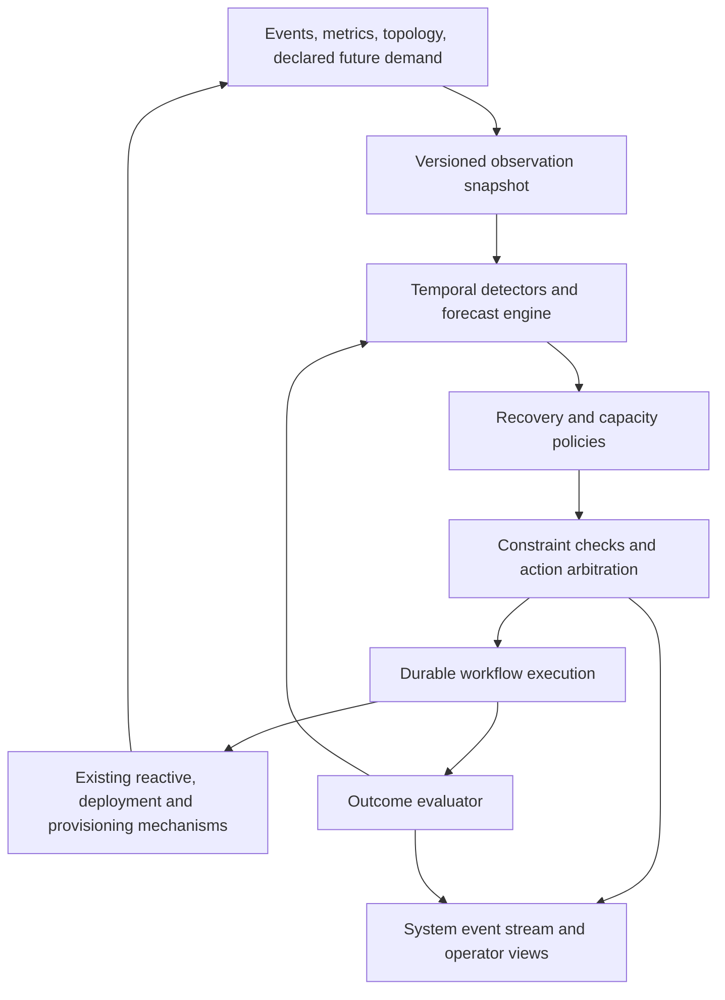

<!-- SPDX-License-Identifier: BUSL-1.1 -->
<!-- Copyright (c) 2026 Pragmatica Labs - Sergiy Yevtushenko -->
<!-- Licensed under Business Source License 1.1. Change Date: 2030-01-01. Change License: Apache-2.0. -->

# Deterministic Cluster Supervision and Predictive Capacity Planning

| Field | Value |
|---|---|
| Status | Implementation specification; design only, not implemented |
| Date | 2026-09-18 (decisions owner-confirmed 2026-09-19) |
| Release target | 1.0.0-rc5 — owner ruling 2026-09-19; work starts once the prerequisites below are met |
| Tracking | #1251 (epic); prerequisites listed in "Prerequisites" below |
| Source baseline | Authored against `0143cdf79`; every §3 integration path and §14 link re-checked present at `release-1.0.0-rc4` `ccba0dba5`. Implementation must still reconcile against its target branch |
| Primary ownership | `aether-control`, with metrics, deployment, environment, configuration, persistence, and management adapters |
| Evidence | **[design intent — unverified]** applies to every proposed behavior and guarantee in this document |

This specification records the agreed product direction and supplies concrete implementation
decisions. Numeric defaults below are initial engineering defaults, not measured safe production
settings. They are versioned configuration and must be validated by the acceptance gates. Existing
runtime behavior mentioned in §3 is a source-inspection finding, not a new runtime verification.

## Reading and implementation order

Sections 1–4 define scope, invariants and contracts; 5–8 define deterministic execution and recovery;
9–10 define forecasting and persistence; 11 defines the operator surfaces; 12 gives the delivery
sequence; 13 is the acceptance checklist. Follow the phase gates in §12, not document order, when
implementing. Algorithm parameters and rollout defaults are design choices supplied by this spec,
not additional owner rulings from the design discussion.

## Prerequisites

The §1 decisions are owner-confirmed; the following are not design questions but capabilities this
spec builds on that are defective or missing today. Do not start the dependent phase before each is
closed — the spec's own rule (§3) is that a gap is implemented in its owning subsystem first.

| Needed by | Prerequisite |
|---|---|
| §11.1 incident channel on `system:cluster-events` | #1230 — that stream is currently appended on non-owner nodes (multi-writer) |
| §11.1 durable outbox; any stream-backed event | the stream correctness set #1231–#1239 (append ordering, WAL recovery, drop-as-success, seal-before-reclaim, read visibility, publish outcomes, consumer delivery) |
| §6.1 conditional admission and reservation sets (P2) | #1250 — the KV applier already fences by epoch/version/monotonic value, but a rejected write is not visible to its submitter and no atomic multi-key command exists |
| §7.4 replacement adoption, SUP-R03/R04, INV-02 | #1038 — auto-heal deletes an unhealthy node's VM even when auto-heal is disabled |
| §2.1 10K+ nodes / multi-region, §13.3 scale acceptance | #365, #366, #367 — the per-community and multi-community scale targets in [scaling architecture](../architecture/08-scaling.md) are still pending validation |

Related: #435 (setpoint controller + TTM forecast) is the narrower predecessor of §9.4 and §12's
proposal-only TTM; #1021 records why process auto-restart is deliberately absent — no runbook in
§7 may add it ("Aether owns the recovery layer", [deployment recovery](../operators/deployment-recovery.md)).

## 1. Objective and settled decisions

Build one supervision mechanism for executable operational runbooks, continuously active reactive
scaling, and calendar-aware predictive capacity preparation. It observes cluster conditions,
selects bounded responses deterministically, coordinates their effects, verifies outcomes, and
emits unresolved incidents through the existing system event channel for human or LLM consumption.

The following are requirements, not alternatives for the implementing agent to reconsider:

1. **Bounded recovery and scaling are autonomous.** Draining and replacing nodes are allowed only
   through explicit safety/admission rules; an operator is not asked to approve every admitted step.
2. **Reactive scaling remains active while prediction learns and operates.** Prediction neither
   replaces reactive assessment nor makes it dependent on successful forecasting/history access.
3. **One coordinated execution path.** Prediction supplies anticipated requirements. Existing
   scaling/provisioning mechanisms execute within available budgets. Budget exhaustion uses the
   existing reporting channels; do not invent a separate financial approval workflow.
4. **Region/market scoping is mandatory.** Demand scope affects both capacity quantity at each
   runtime tier and selection of eligible capacity sources.
5. **Long-term means a year and beyond.** Cover intraday, working-day/weekend, monthly, and annual
   patterns, moving calendar events such as Black Friday, regional school periods, and advance
   campaign declarations.
6. **Reactive interventions are feedback.** Attribute anticipation failures to demand prediction,
   capacity conversion, readiness timing, recovery, or constraints before updating models.
7. **Decision trees and state machines cooperate.** Trees/tables choose responses; detectors and
   action workflows retain temporal state. Forecasting is a deterministic numerical component,
   not a giant decision tree and not an LLM decision in the hot path.
8. **Escalation is an explicit result.** Unhandled situations, exhausted remedies, missing safety
   evidence, and uncertain external effects produce actionable incidents.
9. **The design target includes 10K+ nodes and multi-region setups within one logical cluster.**
   Scope, source selection, aggregation, coordination and validation must support that target.
   Do not replace it with an assumption of independent single-region clusters.

### 1.1 Included processes

| Process | Trigger | Successful outcome | Important failure outcomes |
|---|---|---|---|
| Maintain serving capacity | Existing reactive evaluation | Required usable capacity or an accurately reported constrained target | Budget/placement/source unavailable |
| Prepare future capacity | Closed demand bucket, calendar/campaign/config change, planning tick | Dated requirements and timely execution through existing machinery | Insufficient evidence, history unavailable, infeasible deadline |
| Restore cluster health | Confirmed temporal condition/current-state violation | Verified recovery within policy bounds | Unsafe remedy, ambiguous diagnosis, exhausted attempts |
| Handle unresolved incident | No supported remedy or bounded workflow exhaustion | Correlated operator event and inspectable durable incident | Event transport unavailable; pending delivery remains visible |
| Improve anticipation | Realized demand and action outcomes | Versioned forecast/capacity/lead-time evaluation | Incomplete/censored observations; attribution remains unknown |

### 1.2 Explicit exclusions

- Implementing a new cross-region consensus/replication protocol, cross-cluster actuation, or a new
  global fleet control plane. A single logical cluster may contain multiple execution regions;
  this supervisor plans across its eligible regional pools. Topology safety and data locality
  come from explicit runtime capabilities, not from assuming that node count proves WAN support.
- Automatically shifting customer traffic or data residency between regions. Such movement needs
  an explicit routing/placement contract and authorization; adding capacity in an already eligible
  regional pool is in scope. Cross-cluster allocation remains a separate contract.
- Replacing membership/quorum protocols, auto-heal, slice lifecycle, provider APIs, or reactive
  policy semantics merely to fit the supervisor.
- Arbitrary shell commands, free-form executable runbooks, LLM-generated live policies, automatic
  policy mutation, unbounded retries, or autonomous changes to financial budgets.
- Automatic data restoration, destructive storage repair, secret rotation, or forced schema
  migration retries in the initial runbook set.
- A requirement to use ONNX/TTM or a new distributed stream implementation.

## 2. Architecture and invariants



**INV-01 — continuous reaction.** Forecast/history/model failures cannot suppress an otherwise
admissible reactive scale-up. Existing reactive gates, quorum requirements, and safety rules still
apply. Do not reinterpret this invariant as permission to bypass them.

**INV-02 — one effect owner.** Exactly one current authority admits each controlled effect. Existing
reconcilers execute it. No simultaneous legacy/new writers for the same desired-capacity dimension.

**INV-03 — no invented safety.** Missing, stale, contradictory, or incomplete evidence cannot count
as healthy, idle, zero demand, completed drain, or sufficient redundancy.

**INV-04 — conserved capacity.** The same ready node, pending provision, slice instance, reservation,
or spend allowance cannot be independently counted for incompatible commitments.

**INV-05 — durable uncertainty.** An external timeout does not prove failure or cancel an effect.
An unresolved attempt retains its identity and reservations until reconciled or explicitly resolved.

**INV-06 — restart-safe bounds.** Failover does not reset retry counts, disruption reservations,
incident identity, campaign revisions, model lineage, or recovery deadlines.

**INV-07 — verifiable completion.** API acceptance is not operational completion. A workflow ends
successfully only when its recorded postconditions are observed.

**INV-08 — source and scope isolation.** No capacity source is used outside its allowed workload,
region, market, role, residency, and placement constraints. No fallback silently broadens eligibility.

**INV-09 — reproducible decision.** Identical versioned inputs and prior state produce identical
semantic outputs; policy evaluation has no hidden clock, randomness, I/O, or map-order dependence.

**INV-10 — bounded execution.** Every autonomous workflow has a finite attempt budget, elapsed-time
budget, and effect budget. Exhaustion transitions to a visible state with a recovery action.

**INV-11 — scalable observation.** Routine evaluation operates on changed scopes and hierarchical
aggregates. It does not require every policy to scan every node, copy every historical series, or
send every metric sample through the system event stream or consensus.

### 2.1 Multi-region and 10K+ node execution model

One logical supervisor consists of a cluster admission authority, regional/community observation
aggregators, scoped policy evaluators and bounded forecast workers. The shared contracts in this
spec do not require all computation to run on one leader thread or all observations to be replicated
to every worker. Start with the existing community/governor metrics hierarchy and explicit region
metadata. A region can contain several communities; a community's current placement is not a
substitute for its declared geographic/failure-domain identity.

- Regional/community aggregators maintain incremental scope summaries plus exceptional node
  evidence. Include covered membership/version and missing producers; a regional partition cannot
  turn the region's demand into zero.
- Policy evaluations are partitioned by stable scope/pool identity and triggered by changed inputs
  or relevant deadlines. Shared incidents involving several regions go to the cluster coordinator.
- Forecast fitting is queued per scope with bounded concurrency outside reactive/control threads.
  Results are immutable proposals referencing their input cut and model version. Late results are
  discarded or retained as historical evidence, never applied to a superseded current plan.
- A single fenced cluster authority remains the admission owner in v1. Regional evaluators cannot
  independently spend a shared budget or drain nodes. Bulk metric/history computation is distributed;
  only compact target changes, reservations and workflow transitions require authoritative commits.
  Batch independent admissions where their atomicity requirements permit it.
- Model physical capacity by region, availability zone/failure domain, role/tier and source. Demand
  from a market may use multiple regions only when configured routing, latency, residency and
  data-access constraints admit each region. Never shift a requirement to a distant source merely
  because it is cheaper or another region is unreachable.
- If WAN loss removes authoritative safety information, inhibit affected destructive supervisory
  actions, preserve commitments and report a regional incident. Reactive mechanisms continue to
  the extent their existing authority permits. This spec does not invent autonomous minority-side
  provisioning or claim that the event stream remains available through every partition.

At startup/enabling, expose a topology capability report: multi-region membership mode, consensus
placement/authority, cross-region stream replication/readiness semantics, per-region placement,
source eligibility, connectivity freshness and latency constraints. Unsupported deployment modes
are explicit admission failures. Implementing missing topology capabilities is separate prerequisite
work; provide them before claiming multi-region live acceptance. The supervisor's schemas, pure
planning and scale tests must support multi-region regardless of current deployment limitations.

## 3. Existing integration points and required discovery

Paths below are relative to `aether/` unless stated otherwise. Verify them on the implementation
branch before editing; older prose specs contain superseded membership designs.

| Existing surface | Observed purpose | Required integration |
|---|---|---|
| `aether-control/.../controller/DecisionTreeController.java` | Per-artifact reactive scale decisions | Preserve policy; adapt output into current capacity requirements |
| `aether-control/.../controller/ControlLoop.java`, `fsm/ControlLoopContext.java`, `fsm/ControlLoopState.java` | Collection, warmup/cooldown, application of scaling decisions | Sole coordinated application boundary; preserve cooldown/readiness behavior |
| `aether-control/.../controller/fsm/ScalingDecisionRecord.java` | Per-artifact decision evidence | Preserve API compatibility and attach supervision correlation |
| `aether-metrics/.../metrics/ClusterSyncCollector.java` | Distributed observations and bounded historical metrics | Snapshot input with freshness, coverage and producer identity |
| `aether-metrics/.../worker/metrics/CommunityMetricsSnapshot.java`, `PerSliceMetrics.java` | Per-artifact workload observations | Extend collection with scoped demand accounting, without duplicate aggregation |
| `aether-metrics/.../metrics/MinuteAggregator.java` | Default 120 minute aggregates | Not a year-scale durable history backend |
| `node/.../api/ClusterEventAggregator.java`, `ClusterEvent.java`, `ExtendedEvent.java` | Replicated system events | Correlated supervision events and observation adapter |
| `aether-stream/.../stream/SystemStreamFactories.java` | System stream provisioning | Reuse existing transport and namespace rules |
| `aether-deployment/.../deployment/cluster/ClusterTopologyManager.java` | Reconcile, provision replacement, initiate drain | Adapter to existing effect owner; acceptance is not completion |
| `aether-deployment/.../deployment/membership/ntt/LeaderReconciler.java`, `DrainProcedure.java` | Membership recovery and drain progress | Observe and coordinate; do not add a second membership state writer |
| `node/.../api/routes/NodeLifecycleRoutes.java` | Operator lifecycle and pending-drain budget guards | Reuse/extract common admission semantics for API and supervisor |
| `aether-config/.../config/cluster/SourceProfile.java`, `environment-integration/.../environment/SourceName.java` | Named provisioning sources | Extend metadata/capability contracts where necessary |
| `aether-ttm/.../ttm/AdaptiveDecisionTree.java` | Existing optional forecast wrapper | No parallel direct actuation; disable or adapt when new predictive mode is active |
| `slice/.../slice/kvstore/AetherKey.java`, `AetherValue.java` | Replicated control records | Add versioned supervisory records, not duplicate node membership facts |
| `node/.../api/routes/*`, `aether-management-api/.../management/route/ManagementRoute.java`, `cli/` | Management surface | API, CLI, docs, dashboard together |

The inspected event aggregator has bounded retention, ownership gating, and bootstrap drops.
Metrics distribute outside consensus. Neither is a complete durable decision journal or an atomic
cluster snapshot. Supervision must tolerate gaps and mixed observation ages.

**Implementation prerequisite:** produce an adapter capability table naming the actual owners of
budget admission, source selection, desired counts, pending provisioning, targeted drain, and
placement exclusion. Do not infer a working financial-budget API from the word “budget” in a drain
guard. Missing capabilities must be implemented through their owning subsystem, with tests, before
dependent policies can be enabled. Document each gap; do not silently substitute unlimited capacity.

## 4. Typed domain model and scope

Use validated value objects and sealed outcomes following JBCT. Names below are proposed contracts,
not claims that these Java types already exist. Pure evaluations return plain values; parsing uses
`Result`; I/O uses `Promise`. Throwing integrations use `lift` at the adapter boundary.

### 4.1 Identities

| Type | Required fields/semantics |
|---|---|
| `DemandScope` | Cluster identity, application/blueprint identity, stable workload identity, market, demand region, calendar zone, mapping revision |
| `CapacityPoolId` | Cluster, execution region, availability zone/failure domain, runtime role/tier, placement group; names the physical pool shared by demand scopes |
| `CapacitySourceId` | Existing source identity plus source-profile revision; provider/location/role capabilities are resolved metadata |
| `WorkloadRevision` | Deployed implementation/configuration revision affecting service cost; distinct from stable historical workload identity |
| `ObservationId` | Producer identity, producer incarnation, sequence, observation kind |
| `IncidentId` | Stable incident identity across updates, leader changes, node restarts in one episode, and duplicate observations |
| `ActionId` / `AttemptId` | Deterministic identity derived from committed workflow identity, step and attempt number |
| `DecisionId` | Authority term, committed sequence, canonical input digest, policy revision |
| `ForecastId` | Scope, issue time, training cutoff, input digest, model/calendar/campaign revisions |

Market and demand region are not assumed to equal provider region. Multiple markets can share a
physical pool. Aggregation must count their demand once and allocate that pool once. A source may
serve several scopes only when their policies permit it. Missing market classification enters an
explicit bounded `unclassified` scope; never drop it or invent residency eligibility.

Scope classification is configured from trusted application/route/tenant metadata. Do not allow
arbitrary request headers to create unbounded series or choose a provisioning jurisdiction. Cap
active scopes and reject invalid mappings. Cohort migration carries a mapping revision; history is
not silently combined across incompatible mappings.

### 4.2 Primary records

- `ObservationSnapshot`: evaluation time, topology/generation and authority versions, event cursor
  vector, observed metrics with sample/receive times, membership/readiness facts, active operations,
  capacity inventory, policy/calendar/campaign revisions, and quality flags per field.
- `DetectorState`: keyed condition, counters/window boundaries, last processed observation IDs,
  evidence references, current episode, state-entered time, and expiry.
- `CapacityRequirement`: scope/pool, required capacity vector, effective interval, ready-by deadline,
  origin (`REACTIVE`, `FORECAST`, `RECOVERY`, `OPERATOR`), eligibility constraints and evidence.
- `CapacityPlan`: requirements served, per-source target allocation, existing ready/pending capacity,
  reservations, actuation schedule, predicted shortfall and constraint reasons.
- `ActionProposal`: policy/rule ID, incident/scope, workflow kind, preconditions, resources required,
  conflict keys, urgency/deadline, finite limits, and expected postconditions.
- `WorkflowRecord`: status, revision, pinned workflow version, owner term, current step, timestamps,
  attempts, command identity, effect observations, reservations and terminal/escalation reason.
- `ForecastRecord`: issue time and horizon, baseline and adjusted demand quantiles, declared-event
  contributions, evidence/eligibility status and immutable model lineage.
- `IncidentRecord`: condition, severity, evidence quality, related decisions/workflows, attempts,
  blocked alternatives, next required action, acknowledgement and resolution state.

Use typed fields internally and in versioned event payloads; a free-form `details` map may carry a
human rendering but must not be the input to safety decisions.

## 5. Observation normalization, time and replay

### 5.1 Ingestion

1. Deduplicate events by durable event identity/stream position and metrics by producer incarnation
   plus sequence. A repeated gossip snapshot is not a new sample or flap.
2. Distinguish source event time, receive time, and evaluation time. HLC order is not proof that
   every metrics producer observed the same state. Preserve per-source cursors and coverage.
3. Reconcile event-derived conditions against current authoritative state on activation, detected
   gaps, retention loss, and periodically. A healthy-looking current snapshot cannot reconstruct a
   missing history of transitions; mark that detector history incomplete and warm it again.
4. Exclude expected deployment/drain transitions from fault-pattern counts, but preserve their
   operational effects in available-capacity accounting.
5. Counter resets require a new producer incarnation/reset marker. Negative deltas are invalid;
   do not convert them into negative traffic or interpolate through a reset.
6. Never average p95s into a cluster p95. Merge compatible histograms or use a named conservative
   bound. Record aggregation semantics alongside the metric schema.

### 5.2 Consistent decision input

The active evaluator freezes a bounded immutable snapshot for its affected scope at each evaluation;
the admission authority validates the relevant committed versions. This is a recorded
observation set, not a claim of simultaneous measurement. Quality includes `Fresh`, `Stale`,
`Missing`, `Incomplete`, `Contradictory`, and `Censored`. Destructive actions require all of their
declared safety inputs fresh and authoritative. Additive reactive actions retain their existing
minimum evidence requirements even when optional forecast inputs are unavailable.

Pure contracts:

```text
detect(priorDetectorState, observationBatch, evaluationTime, policy) -> DetectorTransition
forecast(historyCut, calendar, campaigns, modelPolicy) -> ForecastOutcome
decide(snapshot, detectorStates, forecasts, policy) -> List<Intent>
arbitrate(intents, inventory, reservations, constraints) -> AdmissionPlan
advance(workflow, observedEffects, evaluationTime) -> WorkflowTransition
```

`Intent` is one of `RequireCapacity`, `ProposeRecovery`, `WaitUntil`, `Healthy`, or `Escalate`.
Absence of a matching rule is explicit `UnsupportedCondition`, not a healthy result.

Canonical serialization sorts identities and map keys. Specify units and roundings. Numerical
forecast v1 uses strict binary64 operations/`StrictMath`, fixed loop order, no parallel reductions,
no randomized solver, and rounds published rates to 0.001 requests/s with ties-to-even. Capacity
counts round upward. Model version includes algorithm, feature order, coefficient ordering, and
calendar/tzdb version. Reject non-finite input; never turn NaN into a no-op decision.

Every admitted effect and escalation retains the snapshot content needed to reproduce it, or a
content-addressed durable reference with matching retention. A digest alone is insufficient.
No-effect ticks keep bounded summaries; full raw metric streams do not pass through consensus.
The minimal action/safety evidence is bounded and persisted with the control record, so an optional
history-backend outage does not block reactive admission or durable recovery. Detailed forecasting
payloads may live in the history store; a predictive proposal requiring an unavailable payload is
not admitted. Include the configured maximum evidence size in protocol validation.

### 5.3 Timers and lateness

Use monotonic elapsed time for local waiting. Persist UTC deadlines and elapsed/remaining budget
checkpoints for failover; the new owner computes conservatively and never grants a fresh full
budget. Clock skew beyond configured tolerance invalidates time-sensitive destructive decisions.
Tests inject time. Replayed timers are explicit evaluation inputs.

Close demand buckets after a configured lateness allowance. Later samples create revisioned
corrections for future fitting; they never rewrite already-issued forecasts or decisions. Historical
replay uses the information available at each original cutoff, including campaign revisions.

## 6. Authority, durable state and effect execution

### 6.1 Authority protocol

Use one active supervision authority per cluster, integrated with current leader/term ownership.
On leadership gain: enter `RecoveringAuthority`, reach an applied committed frontier, acquire a
conditional versioned authority record, load unresolved workflows/reservations, reconcile effects,
then admit new supervisory actions. Reactive operation keeps its current activation requirements;
forecast recovery must not add a blocking dependency to them.

Persist compact controller records in the existing replicated control store: authority, incident
and workflow state, action reservations, policy revisions, campaign/calendar declarations, model
manifest/checkpoint references, and pending event delivery. Do not persist a parallel authoritative
node-membership or readiness model. Large histories and replay payloads use §10 storage.

**Conditional commits are required.** Leadership checks in local Java code followed by an
unconditional KV write are insufficient. Admission compares expected authority term, record
revision, and relevant reservations/target revision in the applied state machine. If the existing
KV command surface cannot express this, add a typed conditional command/transaction with explicit
rejection before enabling execution. An atomic single-record aggregate can hold one pool's target
and reservations; cross-pool operations need an atomic reservation set or a bounded reservation
protocol that releases partial holds before retry. No network I/O occurs inside consensus apply.

### 6.2 Effect protocol

1. Commit admitted intention, workflow step/attempt, deterministic command identity and reservations.
2. Recheck current safety inputs and authority immediately before dispatch.
3. Dispatch through the existing owner with command identity, expected target revision and fencing
   token where supported. In-cluster receivers reject stale ownership tokens at acceptance.
4. Record acceptance or uncertain outcome. Observe actual readiness/health/placement afterward.
5. Advance only when postconditions are satisfied; release holds according to observed effects,
   not merely expiration of a local request timeout.

Cloud providers may not support fencing. Their adapter must use provider idempotency keys or
durable operation labels plus lookup/reconciliation. After an ambiguous create, do not retry with
a new identity or switch providers until the first operation is resolved. If neither capability
exists, mark autonomous ambiguous retry unsupported and escalate. An external request already
accepted before leadership loss can still finish; reservations and reconciliation account for it.
This is not a claim of exactly-once external execution.

New authority adopts unresolved identities rather than reissuing fresh operations. On quorum loss,
stop admitting supervisory mutations; existing local safety/self-fencing remains authoritative.

### 6.3 Workflow lifecycle

```text
Proposed -> Admitted -> Executing -> Verifying -> Succeeded
    |          |            |           |
    +-> Blocked/Expired      +-> ReconcilingUnknownEffect
                            +-> WaitingRetry -> Executing
                            +-> Escalated
```

`Blocked` has a typed reason and reevaluation trigger. `Escalated` may retain outstanding resource
holds. Acknowledging an incident does not resolve an unknown effect. Cancellation before dispatch
releases reservations; cancellation after dispatch stops new steps, reconciles accepted effects,
and performs only the workflow's explicit cleanup. Never “undo” a completed drain by guessing.

Pin in-flight workflow versions. Config changes recheck safety immediately but do not reset attempt
budgets. Unsupported workflow/checkpoint versions enter inspectable `UnsupportedVersion` with no
new destructive action. Policy upgrades cannot silently reinterpret persisted state.

## 7. Policy engine, detectors and initial executable runbooks

### 7.1 Policy representation

Implement versioned, typed Java decision trees/tables in `aether-control`. Each rule has a stable
ID, required inputs, predicate, typed result and explanation template. Configuration supplies
validated bounds and enablement; v1 does not execute arbitrary policy scripts. Record the matched
path and rejected guard reasons. Unknown predicates are three-valued (`true/false/unknown`);
unknown safety evidence cannot satisfy a guard.

Separate detector episodes from action lifecycles. Incident deduplication key is condition kind +
scope + stable entity identity + episode. Producer incarnation deduplicates observations but does
not reset a physical node's flap history. Resolve stable identity using the existing node/provider
resource identity; if a recreated resource reuses a name, require an explicit identity transition.
Closing a confirmed episode permits a later new incident;
leadership changes and event duplication do not.

### 7.2 Flapping detector

States: `Stable`, `Suspected`, `Confirmed`, `Recovering`, `Stable` again. Track unexpected
healthy→unavailable→healthy cycles using authoritative transitions and explicit observation IDs.
A suspicion ping alone is not an authoritative departure. Keep raw transition evidence bounded.

Initial configurable profile: two completed cycles in 10 minutes means `Suspected`; three means
`Confirmed`; 30 minutes of fresh continuous healthy evidence with no new cycle clears the condition.
Freshness gaps interrupt the continuous-health proof. The first transition to Confirmed opens an
incident; subsequent transitions update it. Planned drain, maintenance and deployment restarts are
excluded only when correlated with an admitted action, not by an untrusted reason string.

Before individual replacement, check correlated failures: initial threshold is at least two nodes
and at least 25% of observed nodes in one failure domain within two minutes. That selects
`CorrelatedInstability`; inhibit mass replacement and escalate diagnostics. These numbers are
testable starting parameters, not established production thresholds.

### 7.3 Required initial policy catalog

| ID | Condition | Admitted response | Verification / escalation |
|---|---|---|---|
| SUP-R01 | Current reactive capacity deficit | Existing reactive requirement and provisioning path | Usable serving capacity; ordinary cap/budget reporting |
| SUP-R02 | Eligible forecast deficit approaching ready-by time | Temporary anticipatory capacity floor | Capacity ready before deadline; attribute lateness/shortfall |
| SUP-R03 | Confirmed isolated worker instability | Bounded replacement workflow | Replacement ready, old worker retired, redundancy/service restored |
| SUP-R04 | Confirmed isolated core-node instability | Role-aware replacement through membership owner | Authoritative quorum/join/redundancy proof; otherwise Blocked and escalated |
| SUP-R05 | Provisioning fails or stalls | Reconcile existing attempt; bounded retry/fallback to eligible source | No duplicate resources; source failure or unknown effect escalated |
| SUP-R06 | Prepared capacity no longer needed | Expire forecast requirement; existing reactive release logic | No floor/hold violated; no direct predictive destructive downscale |
| SUP-R07 | Correlated instability, lost authority, stale critical evidence | Suppress unsafe supervisory actions, observe/escalate | Resume only on explicit fresh proof; preserve local safety behavior |
| SUP-R08 | Deployment makes no progress by its existing deadline | Inspect known lifecycle failures and emit correlated incident | No blind redeploy, migration retry or repeated restart |
| SUP-R09 | No rule covers a confirmed actionable condition | Unsupported-condition incident | Evidence and missing capability delivered to regular operators |

The first version must support bounded worker recovery and supported core recovery; a missing
core membership safety adapter is an explicit implementation blocker for R04, not permission to
treat a core as a worker. New runbooks extend this catalog with the same contracts.

### 7.4 Replacement workflow

1. Confirm incident, intended role, source eligibility and current usable capacity.
2. Discover an already-running auto-heal replacement. Adopt/observe it where compatible rather
   than provisioning another. Reserve the retirement target and required surge capacity atomically.
3. Ask the existing reconciliation/provisioning owner for the temporary replacement commitment.
   That owner must recognize the hold; it must not auto-drain the temporary surplus.
4. Await replacement readiness, required state hydration, placement capability and role-specific
   membership convergence. Pending/booted is not ready. A new core requires the membership owner's
   topology-specific safety verdict, not a hardcoded majority formula in this workflow.
5. If the unstable target remains present, recheck drain safety including other pending drains,
   then request targeted drain through the existing path. If it is already absent, verify the
   owner has retired/reconciled its provider resource without draining another node.
6. Verify departure, surviving replica constraints, workload minima, provider reconciliation,
   and restored intended capacity. Release the replacement hold and close only on observed success.

Replacement is a temporary retirement/coverage commitment, not a permanent increase of the steady
target. Campaign growth remains in the target independently. A failed replacement never licenses
draining the old serving node to “make progress.” The native safety machinery may independently
fence a genuinely unsafe node; record this outcome rather than trying to override it.

Placement quarantine, if implemented, means an explicit placement exclusion with reason and expiry,
not membership expulsion or arbitrary traffic blackholing. It consumes the appropriate capacity
budget. Do not fabricate a quarantine implementation if no placement hook exists; add and verify
the hook first, or use the supported replacement workflow without claiming quarantine support.

### 7.5 Bounds and operator interventions

Share disruption, surge, source, and attempt reservations across all supervisory policies and
manual operations using the same effect path. Default one disruptive workflow per failure domain;
additional concurrency requires explicit policy. Attempts default to three total per workflow step
(initial attempt plus two retries), with backoff 5 then 15 seconds. If a policy permits further
attempts, cap subsequent backoff at 45 seconds. Apply an overall deadline from the owner's timeout
contract. For provisioning/ready waits require an explicit source deadline; no infinite default.

Operator changes carry actor, scope, reason, revision and optional expiry. Represent minimum
capacity reservations and maintenance exclusions explicitly. Recompute plans on manual changes;
do not immediately reverse maintenance or operator-held capacity. An operator pause of recovery
or prediction does not pause reactive scaling. Existing emergency controls remain separate,
audited capabilities; this spec grants no new safety bypass to an LLM or normal operator proposal.

## 8. Capacity arbitration and source selection

### 8.1 Reconcile requirements, not deltas

Convert a reactive `+/- instances` decision into a desired target against its recorded base target
revision exactly once. If that revision changed, reevaluate; never repeatedly add the same delta.
For each workload/pool/time interval:

```text
servingTarget = max(configuredMinimum, reactiveTarget, predictiveFloor, operatorFloor)
```

This maximum combines alternative requirements for the SAME demand, not independent workloads.
Sum independent workloads' resource vectors before calculating shared pool/node needs. Add
explicit redundancy/reserve requirements according to their policy, without double counting
existing reserved capacity. Core, worker, and spot tiers are not interchangeable scalar nodes.

Use existing placement/resource accounting to map slice targets to pool capacity. Different source
classes need distinct capacity profiles; “one extra node” is not a universal unit of work.

`ready` capacity can serve now; `pending` capacity reduces duplicate provisioning but cannot satisfy
current service. Count draining/quarantined nodes according to their effective serving/placement
state. Link each pending operation and hold to exactly one ledger entry. A shared pool allocates
its capacity vector to scopes once; no per-market sum of the same node's full capacity.

Predictive floors are time-bounded and cannot go below minima. Expiry releases the predictive
claim only; existing reactive cooldown/hysteresis and drain guards determine actual scale-down.

### 8.2 Arbitration order

1. Enforce non-negotiable role/quorum/replica/placement constraints and unknown-effect holds.
2. Preserve existing commitments and account for already accepted operations.
3. Resolve current serving/redundancy deficits using configured workload priority and stable scope
   ID as tie-breaker. Emergency safety mechanisms remain outside ordinary optimization.
4. Schedule eligible future requirements by latest safe start, then workload priority and scope ID.
5. Permit optional cost reduction only when all applicable requirements/holds remain satisfied.

Conflict keys include node/incarnation, workload target, physical pool, failure domain and provider
operation. Unrelated effects can proceed concurrently. Future plans do not hold immediate cloud
budget merely because they exist; reserve execution resources at admission, within the configured
lead window. Existing commitments cannot be cancelled as if an accepted provider call never happened.

Budget and quota checks occur at plan feasibility and again at effect admission using the existing
budget owner. Preserve its events/statuses and attach correlation. No forecast bypass or new
approval channel. If money, quota or inventory data is unknown, report the exact constraint and
retain current reactive behavior; never assume a zero price or unlimited allowance.

### 8.3 Source algorithm

Filter sources by cluster ownership, execution region, market/residency policy, role, placement,
workload compatibility, source health, quota and budget. Rank eligible sources lexicographically:

1. Can meet ready-by time using the source/role-specific conservative lead-time estimate.
2. Configured preference rank.
3. Incremental cost in the budget owner's common units, when comparable.
4. Estimated readiness time.
5. Stable source ID.

Allocate discrete capacity using this fixed order and existing placement feasibility checks.
This is a deterministic first-fit policy, not a claim of globally optimal placement. If no source
can meet the deadline, choose the earliest admissible option for an immediate deficit and report
the remaining shortfall; do not silently call a late future plan successful. Unknown cost is not
ranked as free. A profile may forbid fallback entirely. Respect source-specific capacity granularity.

Select fallback only after resolving previous accepted/uncertain attempts. A source circuit breaker
has persisted failure counts and bounded half-open probes; defaults inherit existing provider
retry/breaker policy rather than stacking a second independent retry loop.

## 9. Calendar-aware demand forecasts and campaigns

### 9.1 Measurements

Collect offered arrivals before admission/throttling where available, accepted arrivals,
completions, failures, rejected/throttled arrivals, queue/backlog, work-class mix, active service
capacity, and resource/service-time measurements by bounded DemandScope. Count internal calls
separately from external arrivals. Retries carry attribution; do not learn retries as new customer
demand when identifiable. Shared bottlenecks require their own workload/resource model.

Missing arrival instrumentation yields `ThroughputOnly` quality. Such history is censored under
overload and cannot certify predictive sufficiency. Keep reactive protection active and expose
the instrumentation gap. Do not infer demand by blindly scaling CPU utilization with node count.

### 9.2 Calendar and event declarations

Persist revisioned calendar definitions with market, IANA zone, effective date interval, source,
semantic event IDs and event-relative day/phase. Support workday/weekend and local holidays,
month/day-of-month and month-end, annual position, and explicitly supplied periods such as
back-to-school. Black Friday maps to a semantic event window, not last year's date. Do not fetch
an external mutable calendar during evaluation; import/validate it as a new version.

Aggregate physical time in UTC. Derive calendar features using the recorded zone/tzdb version.
Repeated DST hours remain two physical buckets; missing hours are not zero observations. Leap
days have a defined annual position. Calendar/model revisions cannot rewrite old issued forecasts.

`CampaignDeclaration` requires ID, revision, scope selectors, owner, semantic kind, start/end with
explicit zone/offset resolution, and a nonnegative piecewise-linear ramp envelope over that interval.
Exactly one impact mode:

- `AdditiveRate`: additional arrivals/s (expected and upper estimate).
- `RelativeUplift`: fraction of the unadjusted baseline (expected and upper estimate).
- `TotalDemand`: total expected/upper demand for the selected scope; replaces the baseline for that
  interval and conflicts with other total-demand declarations unless explicitly superseded.
- `CapacityReservation`: explicit typed minimum capacity, no invented demand estimate.
- `UnknownImpact`: visibility/planning notification only; prediction cannot invent an uplift.

An optional comparable-event reference supplies a versioned prior only when its scale and scope
mapping are explicit. Unknown-impact declarations can request operator planning through the
regular incident channel while reaction continues.

Default overlap semantics: sum additive rates; sum relative uplift fractions against the SAME
unadjusted baseline; do not multiply independent multipliers. TotalDemand overlaps are rejected
unless an explicit revision names superseded declarations. Capacity reservations combine by max
for the same scope/resource and sum only for explicitly disjoint demand. Every declaration can
be revised/cancelled with optimistic concurrency and idempotency keys. Past forecasts retain the
revision known at their issue time.

Avoid double counting a recurring event learned by the model and a new declaration for that event.
Both share semantic event identity; a declaration replaces that event's learned contribution for
its interval. Declare whether a historical uplift is additive to an existing campaign before fitting.

### 9.3 Deterministic forecast v1

Implement a reproducible baseline family rather than selecting an unspecified future ML model.
The following is the required initial algorithm; later algorithms are separately versioned policies.

**Resolution/horizons:** generate 5-minute forecasts through 48 hours, hourly forecasts through
400 days, and retain long-horizon uncertainty separately. Do not hold 400 days of capacity.
Retrain daily from a fixed UTC cutoff; refresh forecasts every 15 minutes and on declarations,
mapping changes or material observed shifts. Reactive cadence is unchanged.

**Candidates:**

1. Persistence baseline: latest complete uncensored rate, with error quantiles from earlier issued
   forecasts. Short-horizon baseline only; not eligible for annual claims.
2. Weekly seasonal baseline: median rate for matching local weekday/time bucket over the previous
   eight eligible weeks; at least four observations per slot.
3. Calendar model: deterministic ridge regression on `log1p(arrivalRate)`, with unpenalized intercept
   and a fixed feature order: normalized recent linear trend, time-of-day Fourier terms (orders
   1–3), weekday contrasts, holiday/workday indicators, interactions of each time-of-day term with
   workday/weekend/holiday class, annual Fourier terms (orders 1–3),
   day-of-month contrasts, month-end indicator, and versioned semantic-event/phase indicators.

Fit candidate 3 over at most the previous 1,095 days of complete hourly history; derive the next
48-hour 5-minute shape from the median within-hour profile over eligible recent matching slots,
normalized so the twelve subdivisions preserve the predicted hourly integral. If insufficient
shape evidence, use a flat within-hour profile and mark resolution confidence accordingly.
Long-horizon hourly projections must not imply precise five-minute knowledge.
Generate far-future projections lazily from an immutable forecast basis; do not eagerly retain a
400-day vector per scope on every five-second evaluation. Issue a new basis only on its forecast
refresh/declaration/model change, and share content-addressed unchanged inputs.

Center/scale nonconstant features using training data only; constant columns are omitted with a
recorded mask. Minimize weighted squared error plus `lambda * sum(beta_j^2)` for non-intercept
coefficients. Use fixed `lambda=1.0`, deterministic Householder QR on the augmented design matrix,
fixed column order/no pivot randomness, and weights `2^(-ageDays/365)`. No randomized fitting.
Store coefficients, scaling, feature mask and solver version. Numerical failure yields a typed
ineligible-model outcome and falls back to an eligible baseline.

Trend is measured in days centered at cutoff and divided by 365; clamp its future feature at
30 days beyond cutoff to avoid extending a recent ramp indefinitely. Inverse transform with
`max(0, expm1(predictedLogRate))`; uncertainty calibration accounts for transformation bias. Fit
ordinary demand separately from known exceptional-event contributions; quarantined/censored
periods do not silently become normal baseline rows.

For implementable event decomposition: fit the baseline without semantic-event columns using
non-event eligible rows; then fit the semantic-event/phase columns to residuals of eligible event
rows using the same ridge procedure. Persist baseline and event coefficient vectors separately.
Define annual phase as `(local day-of-year - 1 + local day fraction) / days-in-that-year` and daily
phase using local time-of-day; order sine before cosine for each harmonic. Weekday/day-of-month
contrasts omit their first category. Event phase is a declared categorical phase, not a bucket
name synthesized from every date. Overlapping event rows require a known additive decomposition;
otherwise keep them for realized-demand evaluation but exclude them from event fitting.

Compute each event's rate contribution as the difference between the back-transformed baseline
with that event and the baseline alone, with negative effects permitted for learned quiet periods.
Replace this named contribution when a declaration for the same semantic event applies. Apply
declared rates/uplifts in rate space according to §9.2, then clamp the final demand nonnegative.

**Evidence eligibility:** intraday/weekly terms require 28 days at >=90% complete hourly coverage;
monthly terms require 90 days; annual terms require 730 days covering two annual cycles; learned
event terms require two completed comparable occurrences. Ineligible terms stay absent, not zero
evidence of an absent effect. Imported historical data can satisfy these requirements only after
schema/scope/provenance validation. Declared future impacts do not need two years of history.

Choose the eligible candidate per scope and horizon band using rolling-origin evaluation at
previous daily cutoffs, never random train/test splits. Horizon bands: <=1 hour, <=6 hours,
<=48 hours, <=31 days, <=400 days. Require at least 20 realized evaluation origins in a band;
long bands remain `InsufficientEvidence` until their outcomes exist. Short-horizon performance
does not authorize a year-horizon model. Do not interpolate a confidence score from history age.

Use mean absolute error for the median forecast and pinball loss at q=0.95 for the upper planning
forecast. Construct that upper forecast by adding the nearest-rank 95th percentile of out-of-sample
residuals in the same scope/horizon band, clamped at zero. Group residuals by event class when
sufficient; otherwise expose the broader calibration cohort. These are empirical bounds, not a
guarantee about unprecedented demand. Ties within 0.1% select the simpler candidate, then stable
candidate ID. Retain both accuracy and capacity/cost outcomes; none alone proves useful planning.

### 9.4 From demand to capacity and readiness

Build separate versioned capacity profiles by workload revision, work class, source hardware class,
and placement tier. Obtain sustainable throughput/service-resource demand from healthy observed
windows or explicit load-test profiles under declared latency/error objectives. Sparse or saturated
data cannot establish spare capacity. A configured conservative profile can bootstrap automation;
absent a valid profile, forecasting remains visible/shadow and reactive provisioning continues.

For a homogeneous independent workload with verified sustainable per-instance rate `c` under the
objective, a starting conversion is `ceil(upperForecastRate / c)` plus separately stated redundancy.
For mixed workloads use their resource vectors and existing placement feasibility, not that scalar
formula. A shared saturated database or external quota cannot be fixed by assuming linear slice
scalability; report the bottleneck and constrain the proposal.

Maintain per-source/role lead-time distributions from request acceptance to usable capacity,
including provider startup, join/convergence, hydration, deployment and warmup. Use observed p95
plus configured readiness margin. Until 20 completed samples exist, use the explicit source-profile
lead time. Failures/timeouts are censored attempts and source-health evidence, not zero-duration
successes. Set `latestStart = readyBy - conservativeLeadTime`; an already-late requirement is visible.

### 9.5 Learning and promotion

Model lifecycle per scope/horizon: `Collecting -> Shadow -> Eligible -> Active`, with `Suspended`
on drift, invalid inputs or insufficient capability. Reactive policy stays active in every state.
Production predictive actuation requires configured scope enablement and an Eligible model, or an
explicit declaration-backed requirement. Forecast components can qualify independently; do not wait for an
annual model before using a proven weekday pattern.

`Declared` is a distinct provenance/eligibility path, not a learned-model promotion. A validated
TotalDemand upper estimate plus a valid configured/measured capacity profile can prepare capacity
for a new launch with no historical observations. AdditiveRate can establish a floor for its own
additional load; an unknown background remains explicit and reactive. RelativeUplift requires an
eligible baseline or an explicit declared baseline; multiplying an unknown baseline is invalid.
CapacityReservation bypasses demand forecasting but not normal budget, placement and readiness
admission. Thus an owner can prepare for a campaign immediately without falsely certifying a
seasonal model or waiting for realized holdout data.

Initial promotion gate: >=20 realized origins, >=10% upper-quantile loss improvement over the best
eligible simple baseline, empirical upper-bound coverage >=90%, and no greater modeled excess
capacity cost than that baseline over the evaluation period. These are configurable experiment
gates, not universal accuracy guarantees. Evaluate on a chronological holdout not used to select
the model. Report time coverage and event coverage separately.

Every reactive intervention is attributed against the forecast AS ISSUED before its planning
deadline. Persist offered demand, service cost, ready/pending inventory, source delivery, constraints
and recovery context. Outcomes may carry multiple causes and `Unknown`; do not force one cause.

| Attribution | Model/action response |
|---|---|
| Demand above issued forecast | Update demand residual/error calibration |
| Demand correct, capacity inadequate | Update workload/source capacity profile |
| Request timely, capacity late | Update readiness model and source health |
| Fault removed capacity | Recovery evidence; do not manufacture a demand spike |
| Budget/quota/placement prevented preparation | Constrained execution, normal reporting |
| Prepared capacity unused | Excess-capacity outcome; penalize systematic overpreparation |
| Intended post-peak release | Expected reactive scale-down; not automatically a prediction error |

Trigger drift evaluation when realized demand exceeds the issued upper bound in at least three
of five complete buckets; require enough samples for the horizon and avoid treating corrections
as new observations. Suspend the affected model's new predictive claims, retain a bounded hold on
existing prepared capacity, and let reactive release rules unwind it. Retraining does not overwrite
the old model or erase its misses. No automatic policy-threshold self-modification in v1.

## 10. Durable history and bounded storage

Provide a `SupervisionHistoryStore` SPI with a production implementation, not an in-memory-only
stub. It supports idempotent bucket upsert with revision, immutable issued-forecast append,
time/scope/cutoff query, checkpoint/manifests, retention and health reporting. Use existing durable
storage integrations (initial supported implementation: the project's PostgreSQL async adapter)
with versioned migrations. No raw high-volume history is replicated through the consensus log.

Store model manifests/checkpoint references in the control store; store large history/model/replay
payloads durably in the configured backend. A replacement authority loads the same committed
manifest. Backend unavailability suspends predictive fitting/preparation, not reactive scaling or
already-durable recovery workflows. Observe storage failure through normal operational events.

Initial retention: one-minute aggregates for 14 days, five-minute aggregates for 13 weeks, hourly
aggregates for 4 years, calendar/campaign revisions and model/forecast manifests for 4 years.
The fourth year permits multi-year training plus year-ahead retrospective evaluation; three years
alone do not provide two training years and a full 400-day holdout. Retain referenced input cuts
longer where an unresolved evaluation or action still needs them.
Retain complete decision evidence for admitted recovery/actions at least 90 days after termination;
unresolved actions and their evidence are never age-deleted. Downsample by sums/counts/compatible
histograms, not means of percentiles. Retention never deletes a still-referenced replay input.

Define tables/keys at minimum:

- `demand_bucket(scope, resolution, start_utc, revision, quality, counters, distributions, lineage)`;
- `forecast_issue(forecast_id, scope, issue_time, cutoff, horizon_band, model_id, payload_ref)`;
- `model_checkpoint(model_id, schema_version, scope, training_cutoff, input_digest, payload_ref)`;
- `decision_evidence(decision_id, digest, payload, retain_until)`;
- `effect_outcome(action_id, attempt_id, forecast_id?, observations, attribution)`.

Revisions must preserve as-of queries; a destructive upsert that removes prior input values cannot
support historical replay. Numeric and schema units are explicit. Write correction rows, not
silent replacements of the evidence used by an issued forecast.

Configure cardinality/byte/query limits and expose actual history coverage. At capacity, compact
eligible old resolutions or refuse new predictive scope enablement with a typed reason; never
silently discard incident state or block the reactive evaluator on a history write. Import rejects
overlapping unversioned duplicates, wrong zones, invalid counters, and incompatible scope mappings.

## 11. Events, management and configuration

### 11.1 System events and delivery

Reuse `system:cluster-events:1.0.0` through the supported codec/event-extension mechanism; version
new payloads explicitly. Required event kinds: `SUPERVISION_CONDITION_CHANGED`, `DECISION_ADMITTED`,
`DECISION_BLOCKED`, `WORKFLOW_PROGRESS`, `WORKFLOW_COMPLETED`, `WORKFLOW_ESCALATED`,
`PREDICTION_STATUS_CHANGED`, and `ANTICIPATION_EVALUATED`. Preserve existing scaling/budget events
and correlate rather than emitting contradictory duplicate successes.

Envelope: event ID/schema, incident/decision/action/forecast IDs where applicable, cluster/scope,
authority term, policy/model revisions, observation/effect times, severity, typed reason,
evidence reference, summary, attempted remedies, blocked alternatives and next required action.
Exclude secrets, raw customer identifiers and unbounded metric maps.

Commit delivery intent with the incident/workflow transition. Publish via a durable outbox with
stable IDs, at-least-once delivery, bounded retry and consumer deduplication. Event emission cannot
be a prerequisite to resolving the very event-stream outage being reported. While unavailable,
expose pending incidents via management snapshots and rate-limited local operational logs; retry
when transport returns. Coalesce repetitive progress, but preserve incident opens, terminal states
and outstanding escalations. Retention overflow is visible and never silently loses unresolved
escalations. Do not trigger new incidents merely from the supervisor's own publication events.

### 11.2 Management contract

All routes below are proposed, under `/api/v1/supervision`. Implement versioned DTOs, validation,
RBAC/audit, pagination, leader routing/freshness behavior, and corresponding CLI/docs/dashboard.
Reads expose snapshot age and authority; stale followers return explicit unavailable/leader hints
where an authoritative answer is required. Do not return fabricated empty success.

| Route | Purpose | CLI grouping |
|---|---|---|
| `GET /status` | Authority, mode, input quality, history/delivery health | `aether supervision status` |
| `GET /decisions`, `GET /decisions/{id}` | Explanation, input versions, admission/blocked reasons | `... decisions [id]` |
| `GET /incidents`, `GET /incidents/{id}` | Current/closed incidents and next action | `... incidents [id]` |
| `GET /workflows/{id}` | Step, attempts, observed progress, reservations | `... workflow id` |
| `GET /capacity-plans` | Targets and allocations by scope/source/time | `... capacity-plans` |
| `GET /forecasts`, `GET /models` | Issued forecasts, coverage, drift and eligibility | `... forecasts`, `... models` |
| `GET /config`, `PUT /config` | Versioned validated policies/modes/scopes | `... config` |
| `GET /campaigns`, `PUT /campaigns/{id}`, `DELETE /campaigns/{id}` | List, create/revise, cancel declaration | `... campaigns` |
| `GET /calendars`, `PUT /calendars/{id}` | Inspect/import revisioned calendar | `... calendars` |
| `PUT /holds/{id}`, `DELETE /holds/{id}` | Scoped maintenance/capacity hold with expiry | `... holds` |
| `POST /incidents/{id}/acknowledge` | Record operator acknowledgement; no effect retry | `... incidents acknowledge` |
| `POST /workflows/{id}/cancel` | Request bounded cancellation/reconciliation | `... workflow cancel` |

Mutation requests require expected revision and idempotency key; responses return committed
revision/operation ID, not “completed” before observation. Invalid payload 400/422 according to
existing API convention; stale revision/conflict 409; unsupported capability explicit typed 422;
authority unavailable 503. Budget refusal preserves existing budget-channel semantics.

An LLM may consume the same events/reads and use only explicitly authorized management operations.
No new unrestricted action endpoint is implied. Unknown-effect resolution requires evidence and
the existing privileged operational procedure; acknowledgement cannot clear resource accounting.

Dashboard panels show incident/action timelines, capacity by eligible source, forecast bands versus
actual demand, reactive residuals, model eligibility/coverage, and blocked constraints. “Learning,”
“unknown,” “unsupported,” and “no data” must remain distinct from healthy/zero.

### 11.3 Configuration model

Add validated configuration through the existing config subsystem, not a second parser. Required
groups: supervision execution mode, per-policy bounds, source/role capabilities, scope mappings,
calendar versions, history backend/retention/limits, forecast algorithm/eligibility, capacity profiles,
readiness estimates, event delivery limits, and operator holds. Reject contradictory bounds.

Modes: `observe` (detect/plan only), `recover` (bounded recovery plus existing reaction), `full`
(also eligible predictive preparation). Existing reaction remains enabled in all three. Preserve
legacy-only behavior when supervision is disabled. New installations default to observe until
capabilities/bounds are configured; the delivered feature must implement recover/full, not stop at
observe mode. Per-scope prediction states are independent of cluster execution mode.

Initial defaults where not inherited from existing owners:

| Setting | Default / admission requirement |
|---|---|
| Optional supervision tick | 5 seconds; no change to reactive cadence |
| Critical metric freshness | 3 configured sample intervals, capped at 30 seconds |
| Snapshot coverage for negative evidence | 100% of the relevant safety set; idle cannot be inferred from missing nodes |
| Demand bucket lateness | 2 minutes |
| Forecast refresh / fit | 15 minutes / daily UTC cutoff |
| Planning horizon | 400 days |
| Flapping/correlation thresholds | §7.2 |
| Concurrent disruptive workflows | 1 per failure domain, subject to stricter existing guards |
| Forecast upper quantile | 0.95 |
| Predictive history outage | Suspend new predictive action; reaction continues |
| Source readiness/provision deadline | Required explicit source profile until measured; no unlimited default |
| Source/budget limits | Existing authoritative limits; unknown is not unlimited |

Runtime capability validation precedes enabling recover/full. Persist configuration revision with
each admitted action. Config update does not rewrite already-issued forecast evidence.

## 12. Implementation organization and delivery sequence

Keep the pure domain in `aether-control` packages under `org.pragmatica.aether.supervision`:
`observation`, `condition`, `policy`, `capacity`, `forecast`, `workflow`, `incident`, `history` (SPI).
Use cohesive factories and typed operations, not a monolithic service or arbitrary rule interpreter.
Keep node/event DTO wiring in `node`; metrics instrumentation in `aether-metrics`; effect ownership
in deployment/environment modules. Place the PostgreSQL history implementation in an adapter module
or existing suitable resource module so the pure controller does not depend on a concrete database.

Each phase is independently reviewable and must leave reactive operation usable. “Compiled” or
“unit-tested” alone is not a phase acceptance claim when a live-path gate is listed.

| Phase | Required deliverable | Gate before proceeding |
|---|---|---|
| P0 Contracts and baseline | Adapter capability inventory; target branch reconciliation; scoped observation schema; existing reactive characterization | Existing Forge reactive scenarios remain green; gaps named |
| P1 Deterministic observation/decision | Snapshot normalization, explicit quality, pure detectors/policies, explanation API in observe mode | Replay/dedup/gap tests; real event and metrics ingestion probe |
| P2 Durable action protocol | Conditional authority/admission, reservations, workflow recovery, outbox | Leader-change and ambiguous-provider probes; no duplicate effects |
| P3 Shared execution | Reactive requirement adapter, source/pool ledger, existing reconciler integration, worker/core recovery | Combined growth/replacement and disruption tests; legacy parity |
| P4 Durable learning inputs | Scoped arrival instrumentation, history adapter/migrations/import, calendars/campaigns | Restart/history outage/DST/campaign end-to-end tests |
| P5 Forecast and conversion | Deterministic candidates, retrospective eligibility, capacity/lead-time models, shadow plans | Synthetic multi-year replay, as-of cutoff and attribution gates |
| P6 Predictive preparation | Eligible floors through the same target writer, source deadlines, regular budget channels | Actual timed scale preparation; reaction continues during predictor failure |
| P7 Operator completeness | CLI/API/docs/dashboard, runbook reconciliation, rollout/rollback guide | Full three-scenario acceptance and bounded cloud/source validation |

Cross-cutting scale work starts in P0: carry region/failure-domain identity end-to-end, establish
hierarchical observation ownership and scoped work queues, and run the large-topology fixture from
P1 onward. Do not defer a global-scan architecture rewrite until P7.

While migrating, select exactly one target writer per scope using an explicit ownership mode.
Shadow components have no mutation ports. Switching writers requires draining/reconciling in-flight
admissions, not briefly running both. The reactive policy remains the current one throughout; this
spec does not authorize changing its error-rate gate or thresholds as an incidental refactor.

TTM and this predictor cannot both issue independent changes. If retained, TTM is a proposal-only
forecast provider behind the shared arbitration interface and explicit mode selection. Version 1
acceptance uses §9.3, not a placeholder call to TTM.

Rollback disables new predictive/recovery admissions while keeping reaction and in-flight outcome
reconciliation alive. Remove predictive floors through ordinary release/cooldown rules; do not
delete outstanding workflow/reservation records. Older binaries must reject unsupported control
record schemas rather than pretending the records do not exist. Document the supported rollback
version envelope before release.

## 13. Verification and acceptance matrix

Use deterministic clocks, deterministic event schedules, fake effect adapters, and recorded inputs
for pure/protocol tests. Forge/Ember probes must exercise actual producer→controller→owner→observed
effect paths. Provider validation uses bounded resources and explicit harness timeouts; a test's
nominal timeout must bound wall-clock execution. No live cloud test is required merely to write
this specification.

| Test ID | Required experiment and assertion |
|---|---|
| SUP-T01 | Replay identical snapshot/state/config twice, including shuffled map insertion order: identical canonical decisions, IDs and targets |
| SUP-T02 | Duplicate/reordered metrics and events: no added demand, repeated flap count or extra workflow; corrected buckets retain as-of history |
| SUP-T03 | Missing/stale/censored data: no scale-down/destructive inference from zero; reactive behavior retains its existing valid-input path |
| SUP-T04 | Three real unexpected node cycles: one flapping incident; planned restarts excluded; stable recovery requires uninterrupted fresh evidence |
| SUP-T05 | Correlated failure domain: no cascade of replacements; bounded incident and diagnostic evidence |
| SUP-T06 | Fail leader before admission, after admission/before dispatch, after provider acceptance/before record, and during verification: one reconciled effect identity, preserved bounds |
| SUP-T07 | Minority/stale leader attempts admission and drain: conditional commit/receiver fence rejects; externally accepted earlier create is reconciled |
| SUP-T08 | Provider timeout then late success: no fresh-ID retry or alternate-source duplicate; reservation survives deadline and failover |
| SUP-T09 | Worker replacement plus forecast growth plus reactive spike: correct steady target, temporary replacement hold, no surplus auto-drain race |
| SUP-T10 | Two simultaneous drain proposals plus manual drain: shared guard sees reservations and preserves quorum, replicas and workload minima |
| SUP-T11 | Core replacement: membership owner proves safety at every stage; unavailable proof blocks and emits an incident |
| SUP-T12 | Source fallback: eligible alternative selected deterministically; forbidden market/region source never used; unknown first effect prevents premature fallback |
| SUP-T13 | Budget/quota exhaustion: existing regular event/status emitted with correlation; no new approval flow, budget bypass or repeated request storm |
| SUP-T14 | Calendar DST repeats/gaps, leap day, moving Black Friday, different regional school periods: correct physical bucket accounting and semantic event alignment |
| SUP-T15 | Campaign create/revise/cancel, overlapping uplifts, incompatible totals, unknown impact, and a declared new launch without history: validated semantics, bounded preparation and exact preserved issued revisions |
| SUP-T16 | Multi-year synthetic history with weekday/weekend, month-end, annual and semantic-event demand: eligible components reproduce expected signals; sparse histories cannot earn annual eligibility |
| SUP-T17 | Rolling-origin evaluation: future observations, calendar updates and campaign revisions are inaccessible at earlier cutoffs; no holdout leakage |
| SUP-T18 | Saturated throughput and retry amplification: offered demand/censoring represented correctly; no false low-demand learning |
| SUP-T19 | Correct demand but changed workload cost, slow source, node loss, and budget denial: distinct/multiple attribution; no automatic demand-spike label |
| SUP-T20 | Predictive preparation reaches usable capacity before a scheduled ramp through real scaling wiring; unexpected excess still causes reactive intervention |
| SUP-T21 | History backend/model failure during demand increase: reaction progresses; prediction suspends visibly; recovered history resumes without double counting |
| SUP-T22 | Persistent overprediction: excess-capacity metric worsens and eligibility fails; avoiding all reactive scale-ups alone does not pass |
| SUP-T23 | System event transport unavailable: durable incident/outbox survives restart, management shows it, eventual replay deduplicates and does not self-trigger |
| SUP-T24 | Cancellation, acknowledgement, maintenance hold and expiry: no clearing unknown effects; no immediate reversal of a valid operator hold |
| SUP-T25 | Retention/cardinality cap: referenced evidence and unresolved state preserved; pressure visible; bounded controller memory and unchanged reactive latency budget |
| SUP-T26 | Config/schema/policy upgrade and rollback with active workflows: pinned interpretation, preserved reservations and explicit unsupported-version behavior |
| SUP-T27 | API→CLI→dashboard contract tests: same IDs/states, freshness, permissions and typed failures; no fabricated zero/healthy view |
| SUP-T28 | Shared pool with two markets and heterogeneous sources: demand summed once, physical capacity allocated once, per-source lead/capacity differences honored |
| SUP-T29 | 20,000-node logical topology with regional/community aggregation: bounded work queues, incremental evaluation, deterministic source choice and no per-sample consensus traffic |
| SUP-T30 | Inter-region delay/partition, region loss and recovery: no zero-demand inference, no prohibited residency fallback, no minority supervisory mutations, preserved outstanding commitments |
| SUP-T31 | Forecast worker loses its assignment or returns after input/model revision changes: stale result cannot change a current plan; reaction remains scheduled |
| SUP-T32 | Two scopes in different regions request the same shared provider quota: atomic admission prevents overspend while independent eligible actions continue |

### 13.1 Combined acceptance scenarios

**A — regional campaign:** supply two scopes with different calendars and source eligibility.
Declare a future campaign. Show baseline, adjustment, capacity conversion, latest-start calculation,
admission and observed usable capacity before the ramp. Exceed the upper estimate and show reactive
scale-up plus demand-error attribution. Cancel a later campaign and show safe release of its floor.

**B — instability during preparation:** while A is preparing, flap a worker. Show one correlated
incident, adoption of existing replacement activity where present, a separate temporary replacement
hold, verified readiness before retirement, and correct final capacity including campaign growth.
Repeat with correlated domain failures and prove automation does not drain the domain away.

**C — source disruption:** make the preferred provider slow/ambiguous while actual demand rises.
Show pending capacity counted once, no unsafe fallback while acceptance is unknown, eligible
fallback after confirmed failure, source-delay attribution, and normal budget-limit reporting.
Fail the supervision leader during the provider request and complete reconciliation on its successor.

Repeat these scenarios with regions inside ONE logical cluster, rather than only running several
unrelated single-region clusters. In deterministic/in-JVM tests, inject the required topology
capabilities and WAN behavior. Live evidence must state which runtime multi-region prerequisites
were actually available and exercised; simulation does not establish WAN consensus correctness.

### 13.2 Completion criteria and evidence

For each normative section and SUP-R/SUP-T item, maintain an implementation reconciliation table
with code paths, tests, executed evidence, and status. Do not mark complete with `MISSING`, `STUB`,
`SHORTCUT`, `OMISSION`, or an unacknowledged scope reduction. A disabled unsupported capability is
honest runtime behavior but does not constitute implementation of a required catalog item.

Required final artifacts: tested code/adapters and schemas; replay fixtures; source capability
inventory; configuration/migration examples; API/CLI/dashboard surfaces; executable-runbook mapping;
operator recovery procedures; feature-catalog/changelog updates reflecting actual evidence; and
performance measurements showing supervision does not starve reactive control or consensus.

Record behavior as unit-verified, in-JVM verified, or live multi-node/provider verified according
to actual execution. Do not promote this document's design-intent guarantees to verified merely
because the build passes.

### 13.3 Scale and resource acceptance

Provide a reproducible synthetic topology of 20,000 nodes, 10 regions, 200 communities, 1,000 active
demand scopes and 100 capacity sources, including shared provider quotas. Include four years of
compressed generated history for representative seasonal scopes; do not instantiate 20,000 JVMs
to test a pure planner. Separately run live cluster probes at feasible size to verify real wiring.

Measure a steady period, a one-region outage burst, source stalls, concurrent forecast refresh and
authority failover. Publish hardware, workload seed, policy version, throughput, queue depth,
allocation/GC, snapshot size, event rate, consensus writes and p50/p95/p99 evaluation latency.

Initial engineering acceptance budgets (report any requested adjustment rather than hiding it):

- Under the reference topology, no changed-scope decision waits more than one configured 5-second
  supervision tick at p99 during steady load; overload sheds/coalesces optional forecast work first.
- With identical reactive inputs, enabling supervision increases reactive decision p99 latency by
  no more than 10%; no additional reactive evaluation deadlines are missed during forecast fitting.
- Pure full recomputation of 1,000 scope plans completes within the 15-minute planning period on
  the recorded reference hardware; normal updates recompute only affected scopes/pools.
- Each queue/cache has a configured hard bound and observable rejection/coalescing policy. Heap
  usage reaches a stable plateau in a one-hour steady/incident-recovery soak; retain no per-tick
  copies of all-node topology or four-year history in controller memory.
- Raw metrics do not create consensus commits. Unchanged evaluations do not rewrite targets or
  emit progress events. Incident bursts are grouped by their real correlated cause with paginated
  per-node evidence; node-specific action reservations remain individually accounted.

Run the pure protocol/determinism gates on every change, the scale fixture on relevant control or
aggregation changes, and live provider/WAN validation as the final bounded gate. If the single
admission authority fails the reference load, optimize/batch compact admissions and measure again;
do not silently add unfenced regional writers. Delegated admissions would require a separately
specified durable budget/authority transfer protocol and its own partition proof.

## 14. Related material and maintenance

- [Operational runbooks](../operators/runbooks/README.md): extract procedures into the typed catalog;
  retain human explanations and link them to executable workflow IDs.
- [Observability architecture](../architecture/07-observability.md),
  [scaling architecture](../architecture/08-scaling.md),
  [known limitations](../reference/known-limitations.md).
- [Event stream namespaces](event-stream-namespaces-spec.md) and
  [cluster topology overhaul](cluster-topology-overhaul-spec.md): consult current code when prose
  and shipped membership mechanisms differ.
- [Control-plane delegation](future/control-plane-delegation-spec.md) is a separate designed-only
  proposal. This specification does not depend on it being implemented.
- [JBCT course](https://pragmatica.dev/java/jbct/course/) and
  [PFD course](https://pragmatica.dev/method/pfd/course/): typed operation contracts, dependency-led
  composition, explicit recovery and evidence-based boundaries.

Changing algorithm defaults, source ordering, campaign composition, or safety admission is a
versioned behavioral change with replay/compatibility consequences. Record the decision here and
in the implementation's policy schema. Do not make such changes only in an opaque model checkpoint.
