# Aether Hierarchical Storage Engine (AHSE): Implementation Specification

## Version: 1.0
## Status: Implementation-Ready
## Target Release: v0.25.0+
## Last Updated: 2026-03-29

---

## Table of Contents

1. [Overview & Motivation](#1-overview--motivation)
2. [Core Abstractions](#2-core-abstractions)
3. [Storage Block Format & Lifecycle](#3-storage-block-format--lifecycle)
4. [Read Path (Tier Waterfall)](#4-read-path-tier-waterfall)
5. [Write Path](#5-write-path)
6. [Demotion Policies](#6-demotion-policies)
7. [Metadata Management](#7-metadata-management)
8. [Integration Points](#8-integration-points)
9. [Cross-Node Prefetching](#9-cross-node-prefetching)
10. [Observability](#10-observability)
11. [Error Handling](#11-error-handling)
12. [Configuration Model](#12-configuration-model)
13. [Security](#13-security)
14. [Garbage Collection](#14-garbage-collection)
15. [API Design](#15-api-design)
16. [Phased Implementation Plan](#16-phased-implementation-plan)
17. [Testing Strategy](#17-testing-strategy)
18. [Decision Log](#18-decision-log)

---

## 1. Overview & Motivation

### 1.1 Purpose

This specification defines a unified hierarchical storage layer for the Aether distributed runtime, referred to as **AHSE** (Aether Hierarchical Storage Engine) throughout Aether documentation. The system provides tiered, content-addressable block storage that serves as the persistence foundation for multiple Aether subsystems.

### 1.2 The Problem

Today, Aether stores all artifact and cache data exclusively in the DHT's in-memory storage (`StorageEngine`). This creates several issues:

| Problem | Impact |
|---------|--------|
| Memory pressure | Large/old artifacts consume heap on long-running clusters |
| No persistence | Full cluster restart loses all DHT data |
| No tiering | Hot and cold data treated identically |
| No deduplication | Same artifact bytes replicated without content awareness |
| Streaming has no persistence path | In-memory streams (Phase 1) cannot spill to disk or cold storage |
| No ContentStore | GitHub issue #99 requires a content-addressable blob store — no foundation exists |

### 1.3 Solution

A three-tier storage hierarchy ordered by access latency:

```
┌───────────────────────────────────────────┐
│         Tier 1: In-Memory (DHT)           │  ~μs access
│         Hot cache, quorum-replicated      │
├───────────────────────────────────────────┤
│         Tier 2: Node-Local Disk           │  ~ms access
│         SSD/NVMe, single-node             │
├───────────────────────────────────────────┤
│         Tier 3: Remote Object Store       │  ~100ms access
│         S3 / MinIO / GCS                  │
└───────────────────────────────────────────┘
```

All data is stored as **immutable, content-addressed blocks**. Block ID = SHA-256 hash of content. Deduplication is automatic. Named references (stream offsets, content IDs, artifact coordinates) are thin metadata pointers to content-addressed blocks.

### 1.4 Consumers

| Consumer | Storage Instance | Write Policy | Primary Tiers |
|----------|-----------------|--------------|---------------|
| **Streaming (Phase 2)** | `storage.stream-events` | Write-behind | Memory + Disk |
| **ContentStore (#99)** | Per-qualifier (e.g., `storage.attachments`) | Write-through | Disk + S3 |
| **ArtifactStore** | `storage.artifacts` | Write-through | Memory + Disk + S3 |
| **KV-Store Backup** | `storage.kv-snapshots` | Write-through | Disk |

### 1.5 Design Principle

**DHT becomes the fast cache layer, not the final resting place for data.** Data flows downward through tiers based on age, access frequency, and capacity pressure. The storage system is invisible to slice developers — they interact with higher-level APIs (StreamPublisher, ContentStore, ArtifactStore) that delegate to their configured storage instance.

---

## 2. Core Abstractions

### 2.1 Architecture Overview

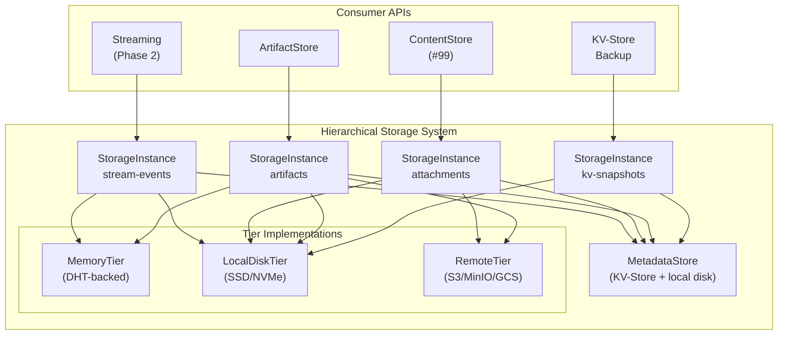

### 2.2 Storage Instance

Each consumer gets its own `StorageInstance` with independent configuration. Storage instances are isolated — they share tier implementations but maintain separate namespaces, budgets, and policies.

**TOML Configuration:**

```toml
[storage.stream-events]
chunk-size = "256KB"
compression = "lz4"
encryption = "aes-256-gcm"
tiers = ["memory", "local", "s3"]
memory.max-bytes = "512MB"
memory.eviction = "age"          # age, lfu, lru, size-pressure
local.path = "/data/aether/streams"
local.max-bytes = "10GB"
local.retention = "7d"
s3.bucket = "my-cluster-streams"
s3.prefix = "streams/"
s3.retention = "90d"
replication.memory = 3           # RF for hot tier (DHT quorum)
replication.local = 1            # node-local, no cross-node replication
replication.s3 = 1               # S3 handles its own durability
write-policy = "write-behind"    # write-through | write-behind
```

```toml
[storage.attachments]
chunk-size = "1MB"
compression = "zstd"
encryption = "aes-256-gcm"
tiers = ["local", "s3"]
local.path = "/data/aether/content"
local.max-bytes = "50GB"
local.retention = "30d"
s3.bucket = "my-cluster-content"
s3.prefix = "attachments/"
s3.retention = "365d"
replication.local = 1
replication.s3 = 1
write-policy = "write-through"
```

```toml
[storage.artifacts]
chunk-size = "64KB"
compression = "lz4"
tiers = ["memory", "local", "s3"]
memory.max-bytes = "256MB"
memory.eviction = "lfu"
local.path = "/data/aether/artifacts"
local.max-bytes = "20GB"
local.retention = "90d"
s3.bucket = "my-cluster-artifacts"
s3.prefix = "artifacts/"
replication.memory = 3
replication.local = 1
replication.s3 = 1
write-policy = "write-through"
```

```toml
[storage.kv-snapshots]
chunk-size = "1MB"
compression = "zstd"
tiers = ["local"]
local.path = "/data/aether/kv-snapshots"
local.max-bytes = "5GB"
local.retention = "30d"
replication.local = 1
write-policy = "write-through"
```

### 2.3 Content-Addressable Blocks

All data is stored as immutable, content-addressed blocks. The block ID is the SHA-256 hash of the raw content (before compression/encryption). This gives deduplication for free — storing the same bytes twice is a no-op.

Named references (stream offsets, content IDs, artifact coordinates) are thin metadata entries in the MetadataStore that point to block IDs.

### 2.4 Tier Abstraction

```java
/// Sealed interface for storage tier implementations.
/// Each tier provides async get/put/delete for content-addressed blocks.
public sealed interface StorageTier
        permits MemoryTier, LocalDiskTier, RemoteTier {

    /// Tier identity for configuration and metrics.
    TierType tierType();

    /// Retrieve a block by its content hash.
    Promise<Option<StorageBlock>> get(BlockId blockId);

    /// Store a block. Idempotent — storing the same block twice is a no-op.
    Promise<Unit> put(StorageBlock block);

    /// Delete a block. Returns true if the block existed and was deleted.
    Promise<Boolean> delete(BlockId blockId);

    /// Check if a block exists in this tier.
    Promise<Boolean> exists(BlockId blockId);

    /// Current utilization metrics for this tier.
    TierUtilization utilization();

    /// Shutdown and release resources.
    Promise<Unit> shutdown();
}
```

```java
/// Tier type enumeration.
public enum TierType {
    MEMORY,
    LOCAL_DISK,
    REMOTE_S3;

    /// Ordering by access latency (lower = faster).
    public int latencyOrder() {
        return ordinal();
    }
}
```

---

## 3. Storage Block Format & Lifecycle

### 3.1 Block Identity

```java
/// Content-addressed block identifier. SHA-256 hash of raw content.
///
/// @param hash 32-byte SHA-256 digest
@Codec
public record BlockId(byte[] hash) {
    /// Create a BlockId by hashing the given content.
    public static BlockId blockId(byte[] content) {
        return new BlockId(SHA256.hash(content));
    }

    /// Hex string representation for logging and storage paths.
    public String toHex() {
        return HexFormat.of().formatHex(hash);
    }

    /// First 2 hex chars for directory sharding on disk.
    public String shardPrefix() {
        return toHex().substring(0, 2);
    }

    /// Next 2 hex chars for second-level directory sharding.
    public String shardSuffix() {
        return toHex().substring(2, 4);
    }
}
```

### 3.2 Storage Block

```java
/// Immutable storage block. Content-addressed, optionally compressed and encrypted.
///
/// @param id block identity (SHA-256 of raw content)
/// @param data block payload (raw, compressed, or encrypted bytes depending on pipeline)
/// @param metadata block metadata
@Codec
public record StorageBlock(BlockId id,
                           byte[] data,
                           BlockMetadata metadata) {

    /// Factory method following JBCT naming convention.
    public static StorageBlock storageBlock(byte[] rawContent,
                                            ContentType contentType) {
        var id = BlockId.blockId(rawContent);
        var metadata = BlockMetadata.blockMetadata(
            rawContent.length,
            contentType,
            CompressionCodec.NONE,
            EncryptionParams.NONE
        );
        return new StorageBlock(id, rawContent, metadata);
    }
}

/// Block metadata. Immutable once created.
///
/// @param rawSize original content size before compression/encryption
/// @param contentType MIME type or application-defined type tag
/// @param createdAt creation timestamp (milliseconds since epoch)
/// @param compression compression codec applied to data
/// @param encryption encryption parameters applied to data
@Codec
public record BlockMetadata(long rawSize,
                            ContentType contentType,
                            long createdAt,
                            CompressionCodec compression,
                            EncryptionParams encryption) {

    public static BlockMetadata blockMetadata(long rawSize,
                                              ContentType contentType,
                                              CompressionCodec compression,
                                              EncryptionParams encryption) {
        return new BlockMetadata(rawSize, contentType, System.currentTimeMillis(),
                                 compression, encryption);
    }
}

/// Compression codecs supported by the storage system.
@Codec
public enum CompressionCodec {
    NONE,
    LZ4,
    ZSTD;
}

/// Encryption parameters for a stored block.
///
/// @param algorithm encryption algorithm (e.g., "AES-256-GCM")
/// @param iv initialization vector
/// @param keyId reference to the encryption key in SecretsProvider
@Codec
public record EncryptionParams(String algorithm,
                               byte[] iv,
                               String keyId) {
    public static final EncryptionParams NONE = new EncryptionParams("NONE", new byte[0], "");

    public boolean isEncrypted() {
        return !"NONE".equals(algorithm);
    }
}
```

### 3.3 Block Lifecycle State Machine

Blocks transition through tiers. The lifecycle is tracked in the MetadataStore.

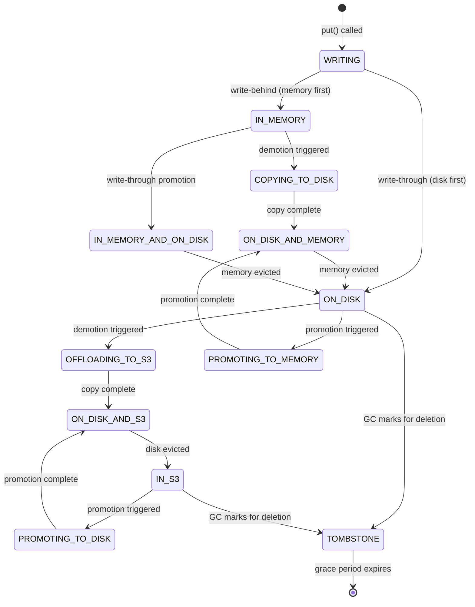

**Key invariant:** A block always exists in at least one tier until it reaches TOMBSTONE state. The state machine ensures no data loss during tier transitions — the block is written to the target tier before being removed from the source tier.

### 3.4 Block Lifecycle Record

```java
/// Tracks which tiers currently hold a given block.
/// Stored in MetadataStore.
///
/// @param blockId content-addressed block identity
/// @param instanceName storage instance that owns this block
/// @param tiers set of tiers currently holding the block
/// @param refCount number of named references pointing to this block
/// @param createdAt when the block was first stored
/// @param lastAccessedAt when the block was last read
/// @param accessCount total number of reads
/// @param tombstoneAt if set, when the block was marked for GC
@Codec
public record BlockLifecycle(BlockId blockId,
                             String instanceName,
                             EnumSet<TierType> tiers,
                             int refCount,
                             long createdAt,
                             long lastAccessedAt,
                             long accessCount,
                             Option<Long> tombstoneAt) {

    public static BlockLifecycle blockLifecycle(BlockId blockId,
                                                String instanceName,
                                                TierType initialTier) {
        return new BlockLifecycle(
            blockId, instanceName,
            EnumSet.of(initialTier),
            1, System.currentTimeMillis(),
            System.currentTimeMillis(), 0,
            Option.none()
        );
    }

    public BlockLifecycle withTierAdded(TierType tier) {
        var newTiers = EnumSet.copyOf(tiers);
        newTiers.add(tier);
        return new BlockLifecycle(blockId, instanceName, newTiers,
                                  refCount, createdAt, lastAccessedAt,
                                  accessCount, tombstoneAt);
    }

    public BlockLifecycle withTierRemoved(TierType tier) {
        var newTiers = EnumSet.copyOf(tiers);
        newTiers.remove(tier);
        return new BlockLifecycle(blockId, instanceName, newTiers,
                                  refCount, createdAt, lastAccessedAt,
                                  accessCount, tombstoneAt);
    }

    public BlockLifecycle withAccess() {
        return new BlockLifecycle(blockId, instanceName, tiers,
                                  refCount, createdAt,
                                  System.currentTimeMillis(),
                                  accessCount + 1, tombstoneAt);
    }

    public BlockLifecycle withRefCountDelta(int delta) {
        return new BlockLifecycle(blockId, instanceName, tiers,
                                  refCount + delta, createdAt,
                                  lastAccessedAt, accessCount,
                                  tombstoneAt);
    }

    public BlockLifecycle withTombstone() {
        return new BlockLifecycle(blockId, instanceName, tiers,
                                  refCount, createdAt, lastAccessedAt,
                                  accessCount, Option.some(System.currentTimeMillis()));
    }

    public boolean isTombstoned() {
        return tombstoneAt.isPresent();
    }
}
```

---

## 4. Read Path (Tier Waterfall)

### 4.1 Tier Waterfall

Reads try tiers in latency order. The first hit wins.

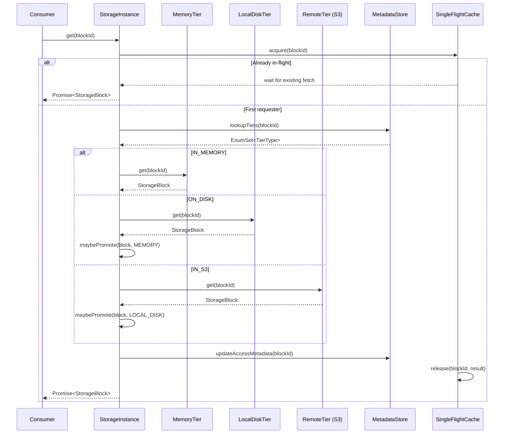

### 4.2 Single-Flight Fetching

When multiple threads request the same cold block, only one fetch occurs. Others wait on the same `Promise`.

```java
/// Single-flight cache prevents duplicate fetches for the same block.
/// Thread-safe. Lock-free for cache hits.
final class SingleFlightCache {
    private final ConcurrentHashMap<BlockId, Promise<Option<StorageBlock>>> inFlight =
        new ConcurrentHashMap<>();

    /// Execute the fetch function only if no in-flight request exists for this blockId.
    /// Returns the shared Promise for all callers requesting the same block.
    Promise<Option<StorageBlock>> deduplicate(BlockId blockId,
                                              Fn0<Promise<Option<StorageBlock>>> fetcher) {
        var existing = inFlight.get(blockId);
        if (existing != null) {
            return existing;
        }

        var promise = Promise.<Option<StorageBlock>>promise();
        var prev = inFlight.putIfAbsent(blockId, promise);

        if (prev != null) {
            return prev; // lost race, use winner's promise
        }

        fetcher.apply()
               .onComplete(result -> {
                   inFlight.remove(blockId);
                   promise.resolve(result);
               });

        return promise;
    }
}
```

### 4.3 Promotion Policy

When a block is read from a colder tier, it can optionally be promoted (copied) to a hotter tier. This is configurable per storage instance.

```java
/// Promotion policy determines when cold blocks are copied to hotter tiers.
@Codec
public enum PromotionPolicy {
    /// Always promote on read.
    ALWAYS,

    /// Promote only after the block has been accessed N times from the cold tier.
    FREQUENCY_THRESHOLD,

    /// Never promote. Reads always go to the tier where the block resides.
    NEVER;
}
```

**Configuration:**

```toml
[storage.artifacts]
promotion-policy = "frequency-threshold"
promotion-threshold = 3          # promote after 3 cold reads (for FREQUENCY_THRESHOLD)
```

### 4.4 Block Integrity Verification

Every read verifies block integrity by recomputing the SHA-256 hash and comparing to the `BlockId`. If the hash does not match, the block is treated as corrupt:

1. The corrupt copy is deleted from the tier where it was found.
2. The read falls through to the next tier.
3. A `CorruptBlock` error is emitted as a metric event.
4. If all tiers return corrupt or missing data, a `BlockNotFound` error is returned.

---

## 5. Write Path

### 5.1 Write Policies

Two write policies are supported, configurable per storage instance:

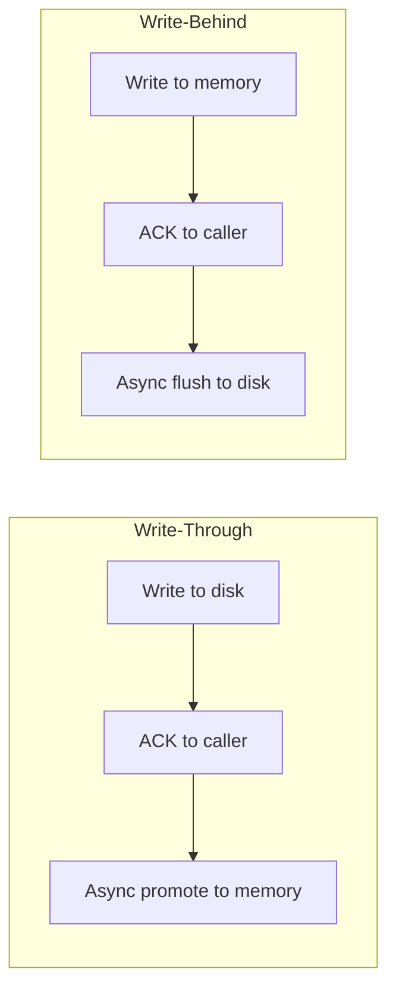

| Policy | First Write | ACK Point | Second Write | Risk Window | Use Case |
|--------|------------|-----------|--------------|-------------|----------|
| `write-through` | Local disk | After disk write | Async promote to memory | None (durable at ACK) | ContentStore, ArtifactStore |
| `write-behind` | Memory (DHT) | After memory write | Async flush to disk | Node crash before flush | Streaming (matches governor-append model) |

### 5.2 Write-Through Sequence

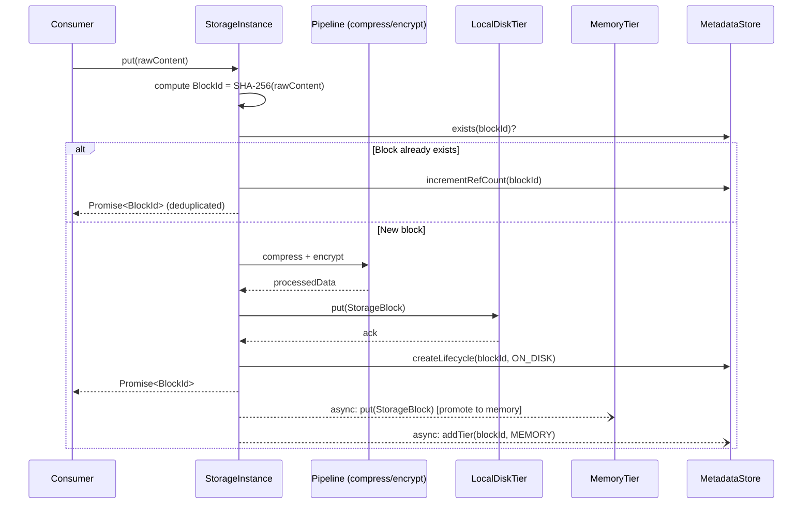

### 5.3 Write-Behind Sequence

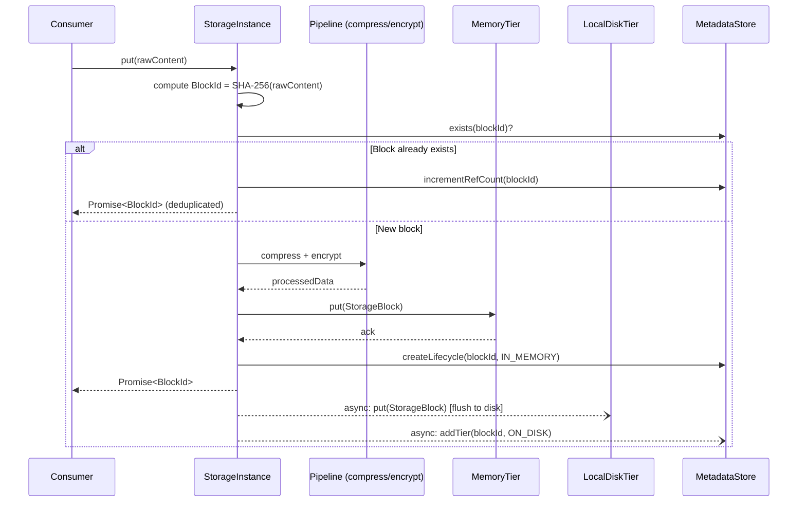

### 5.4 Compression Pipeline

Compression is applied before encryption, before storage. Decompression is applied after decryption, after retrieval.

```
Write: rawContent → compress → encrypt → store
Read:  stored → decrypt → decompress → rawContent
```

The `BlockMetadata` records which codec and encryption params were applied, so reads can reverse the pipeline without configuration lookup.

---

## 6. Demotion Policies

### 6.1 Overview

Demotion moves blocks from hotter tiers to colder tiers to free capacity. Demotion is always async and runs on a background virtual thread pool.

### 6.2 Eviction Strategies

```java
/// Eviction strategy for a storage tier.
@Codec
public enum EvictionStrategy {
    /// Evict oldest blocks first. Natural for streaming segments.
    AGE,

    /// Evict least-frequently-used blocks. Good for artifact caches.
    LFU,

    /// Evict least-recently-used blocks. General purpose.
    LRU,

    /// Evict largest blocks first when under size pressure.
    SIZE_PRESSURE;
}
```

| Strategy | Trigger | Selection | Best For |
|----------|---------|-----------|----------|
| `AGE` | Block age exceeds tier retention | Oldest first | Streaming segments, time-series |
| `LFU` | Tier capacity exceeded | Least accessed | Artifact caches |
| `LRU` | Tier capacity exceeded | Least recently accessed | General purpose |
| `SIZE_PRESSURE` | Tier capacity exceeded | Largest blocks first | Mixed-size content stores |

### 6.3 Demotion Process

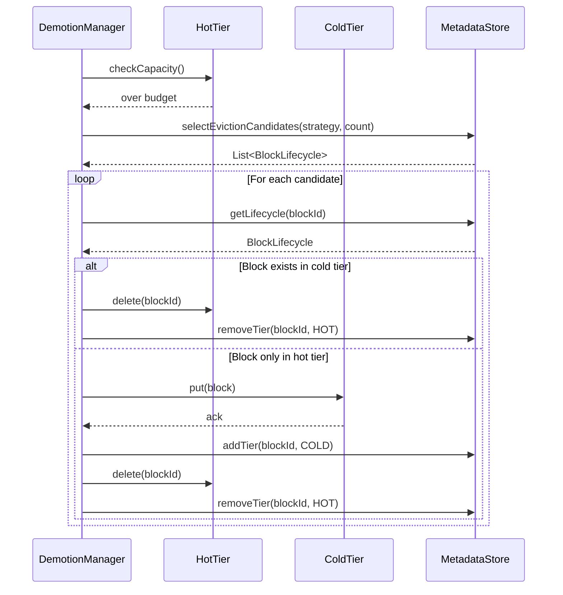

**Key invariant:** The block is written to the cold tier BEFORE it is deleted from the hot tier. The MetadataStore is updated atomically to reflect the tier change. If the process crashes mid-demotion, the block exists in both tiers (safe — deduplication handles this on the next cycle).

### 6.4 Demotion Scheduling

```java
/// DemotionManager runs periodic capacity checks and triggers evictions.
/// One instance per StorageInstance.
final class DemotionManager {
    private static final TimeSpan CHECK_INTERVAL = TimeSpan.timeSpan("10s");
    private static final int BATCH_SIZE = 100;

    private final StorageInstanceConfig config;
    private final List<StorageTier> tiers;
    private final MetadataStore metadataStore;

    /// Start the background demotion loop.
    /// Runs on a virtual thread. Non-blocking.
    Promise<Unit> start() {
        return Promise.runAsync(() -> {
            while (!Thread.currentThread().isInterrupted()) {
                for (var tier : tiers) {
                    checkAndDemote(tier);
                }
                Thread.sleep(CHECK_INTERVAL.toMillis());
            }
        });
    }

    private void checkAndDemote(StorageTier tier) {
        var util = tier.utilization();
        if (util.usedBytes() > util.budgetBytes() * 0.9) { // 90% threshold
            var candidates = metadataStore.selectEvictionCandidates(
                config.instanceName(),
                tier.tierType(),
                config.evictionStrategy(tier.tierType()),
                BATCH_SIZE
            );
            // ... demote each candidate to next tier
        }
    }
}
```

---

## 7. Metadata Management

**This is the most critical section of the specification.** The metadata store is the source of truth for block-to-tier mappings across all storage instances.

### 7.1 Architecture

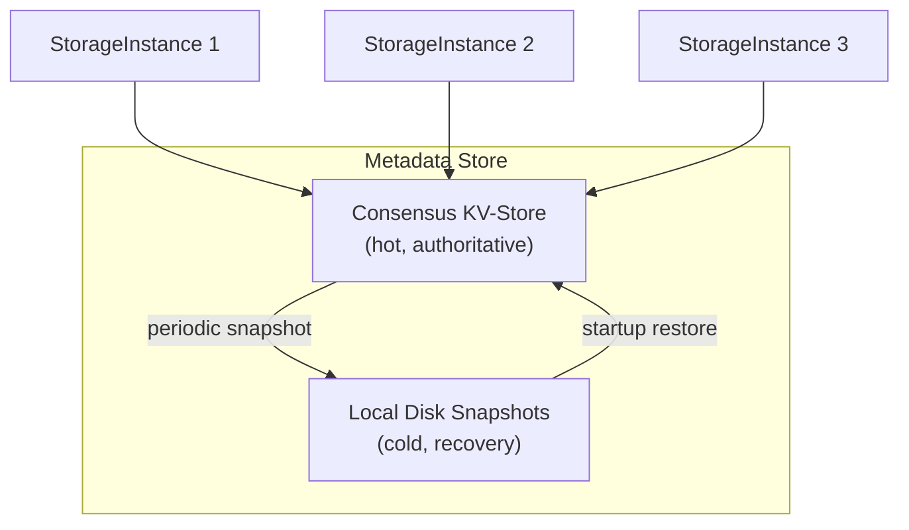

### 7.2 Bootstrap Problem

The metadata store tracks block-to-tier mappings for all storage instances. But the metadata store itself cannot use the hierarchical storage system (circular dependency). The solution:

- **Hot tier:** Consensus KV-Store (authoritative, survives with cluster).
- **Cold tier:** Local disk at a well-known path (no lookup needed).
- **NEVER S3:** Metadata must be available without external dependencies.

### 7.3 MetadataStore Interface

```java
/// Metadata store for block-to-tier mappings.
/// Hot path: consensus KV-Store. Cold path: local disk snapshots.
/// This is NOT a regular StorageInstance — it has its own bootstrap path.
public interface MetadataStore {

    /// Look up which tiers hold a block.
    Promise<Option<BlockLifecycle>> getLifecycle(String instanceName, BlockId blockId);

    /// Create a new lifecycle entry when a block is first stored.
    Promise<Unit> createLifecycle(BlockLifecycle lifecycle);

    /// Update lifecycle (tier added, tier removed, access metadata).
    Promise<Unit> updateLifecycle(BlockLifecycle lifecycle);

    /// Increment reference count for a block (deduplication hit).
    Promise<Unit> incrementRefCount(String instanceName, BlockId blockId);

    /// Decrement reference count. Returns updated lifecycle.
    Promise<BlockLifecycle> decrementRefCount(String instanceName, BlockId blockId);

    /// Select eviction candidates from a tier using the given strategy.
    Promise<List<BlockLifecycle>> selectEvictionCandidates(String instanceName,
                                                           TierType tier,
                                                           EvictionStrategy strategy,
                                                           int maxCount);

    /// List all block IDs in a storage instance (for GC, migration).
    Promise<List<BlockId>> listBlocks(String instanceName);

    /// Snapshot the entire metadata state to local disk.
    Promise<Unit> snapshot();

    /// Restore metadata from the latest local disk snapshot.
    Promise<Unit> restoreFromSnapshot();

    /// Current snapshot epoch (monotonically increasing).
    long currentEpoch();
}
```

### 7.4 KV-Store Key Schema

Metadata keys in the consensus KV-Store follow the existing `AetherKey` pattern:

```java
/// Block lifecycle key format:
/// ```
/// storage-block/{instanceName}/{blockIdHex}
/// ```
record StorageBlockKey(String instanceName,
                       BlockId blockId) implements AetherKey {
    private static final String PREFIX = "storage-block/";

    @Override
    public String asString() {
        return PREFIX + instanceName + "/" + blockId.toHex();
    }

    @SuppressWarnings("JBCT-VO-02")
    public static StorageBlockKey storageBlockKey(String instanceName,
                                                  BlockId blockId) {
        return new StorageBlockKey(instanceName, blockId);
    }

    public static Result<StorageBlockKey> storageBlockKey(String key) {
        if (!key.startsWith(PREFIX)) {
            return STORAGE_BLOCK_KEY_FORMAT_ERROR.apply(key).result();
        }
        var content = key.substring(PREFIX.length());
        var slashIndex = content.indexOf('/');
        if (slashIndex == -1 || slashIndex == 0 || slashIndex == content.length() - 1) {
            return STORAGE_BLOCK_KEY_FORMAT_ERROR.apply(key).result();
        }
        var instanceName = content.substring(0, slashIndex);
        var blockIdHex = content.substring(slashIndex + 1);
        return success(new StorageBlockKey(instanceName,
                                           new BlockId(HexFormat.of().parseHex(blockIdHex))));
    }
}

/// Named reference key format:
/// ```
/// storage-ref/{instanceName}/{referenceName}
/// ```
/// Maps a named reference (e.g., artifact coordinate, content ID) to a BlockId.
record StorageRefKey(String instanceName,
                     String referenceName) implements AetherKey {
    private static final String PREFIX = "storage-ref/";

    @Override
    public String asString() {
        return PREFIX + instanceName + "/" + referenceName;
    }

    @SuppressWarnings("JBCT-VO-02")
    public static StorageRefKey storageRefKey(String instanceName,
                                              String referenceName) {
        return new StorageRefKey(instanceName, referenceName);
    }
}

/// Error constants.
Fn1<Cause, String> STORAGE_BLOCK_KEY_FORMAT_ERROR =
    Causes.forOneValue("Invalid storage-block key format: %s");
```

### 7.5 Automatic Metadata Snapshotting — MANDATORY

**Problem:** The KV-Store is in-memory only. A full cluster restart loses all metadata, resulting in orphaned blobs on disk and S3 with no way to locate them.

**Solution:** Each node independently snapshots metadata to local disk.

#### 7.5.1 Snapshot Trigger Policy

Dual-condition trigger — snapshot when EITHER condition is true:

| Condition | Formula | Default |
|-----------|---------|---------|
| Mutation count | `(currentEpoch - lastSnapshotEpoch) > mutationThreshold` | 1000 mutations |
| Time elapsed | `(now - lastSnapshotTimestamp) > maxSnapshotInterval` | 60 seconds |

**Configuration:**

```toml
[storage.metadata]
snapshot-path = "/data/aether/metadata-snapshots"
snapshot-mutation-threshold = 1000
snapshot-max-interval = "60s"
snapshot-retention-count = 5      # keep last N snapshots
```

#### 7.5.2 Snapshot Format

The snapshot is itself a content-addressable block:

```java
/// Metadata snapshot. Serialized via @Codec, content-addressed for integrity.
///
/// @param epoch monotonically increasing snapshot sequence number
/// @param timestamp when the snapshot was taken
/// @param nodeId the node that created this snapshot
/// @param entries all block lifecycle entries at snapshot time
/// @param contentHash SHA-256 of the serialized entries (integrity check)
@Codec
public record MetadataSnapshot(long epoch,
                               long timestamp,
                               NodeId nodeId,
                               List<BlockLifecycle> entries,
                               byte[] contentHash) {

    public static MetadataSnapshot metadataSnapshot(long epoch,
                                                     NodeId nodeId,
                                                     List<BlockLifecycle> entries) {
        var serialized = CodecUtil.serialize(entries);
        var hash = SHA256.hash(serialized);
        return new MetadataSnapshot(epoch, System.currentTimeMillis(),
                                    nodeId, entries, hash);
    }

    /// Verify snapshot integrity.
    public boolean isValid() {
        var serialized = CodecUtil.serialize(entries);
        return MessageDigest.isEqual(SHA256.hash(serialized), contentHash);
    }
}
```

#### 7.5.3 Snapshot Storage on Disk

Snapshots are stored at the well-known path (no metadata lookup needed):

```
/data/aether/metadata-snapshots/
  snapshot-000042.bin    # epoch 42
  snapshot-000041.bin    # epoch 41
  snapshot-000040.bin    # epoch 40
  snapshot-000039.bin    # epoch 39
  snapshot-000038.bin    # epoch 38
  LATEST -> snapshot-000042.bin  # symlink to latest
```

Rolling window of last N snapshots for point-in-time recovery. Older snapshots are deleted.

#### 7.5.4 Snapshot Manager

```java
/// Manages automatic metadata snapshots.
/// Runs on each node independently.
final class SnapshotManager {
    private final MetadataStore metadataStore;
    private final Path snapshotPath;
    private final int mutationThreshold;
    private final TimeSpan maxInterval;
    private final int retentionCount;
    private final NodeId nodeId;

    private long lastSnapshotEpoch = 0;
    private long lastSnapshotTimestamp = 0;

    /// Check if a snapshot is needed and take one if so.
    /// Called after each metadata mutation.
    Promise<Unit> maybeSnapshot() {
        var currentEpoch = metadataStore.currentEpoch();
        var now = System.currentTimeMillis();

        var mutationTrigger = (currentEpoch - lastSnapshotEpoch) > mutationThreshold;
        var timeTrigger = (now - lastSnapshotTimestamp) > maxInterval.toMillis();

        if (mutationTrigger || timeTrigger) {
            return takeSnapshot(currentEpoch);
        }
        return Promise.resolved(Unit.unit());
    }

    private Promise<Unit> takeSnapshot(long epoch) {
        return metadataStore.listAllLifecycles()
            .flatMap(entries -> {
                var snapshot = MetadataSnapshot.metadataSnapshot(epoch, nodeId, entries);
                return writeSnapshotToDisk(snapshot)
                    .onSuccess(_ -> {
                        lastSnapshotEpoch = epoch;
                        lastSnapshotTimestamp = System.currentTimeMillis();
                        pruneOldSnapshots();
                    });
            });
    }
}
```

### 7.6 Startup Sequence / Readiness Gate

Node startup follows a strict sequence before accepting storage operations:

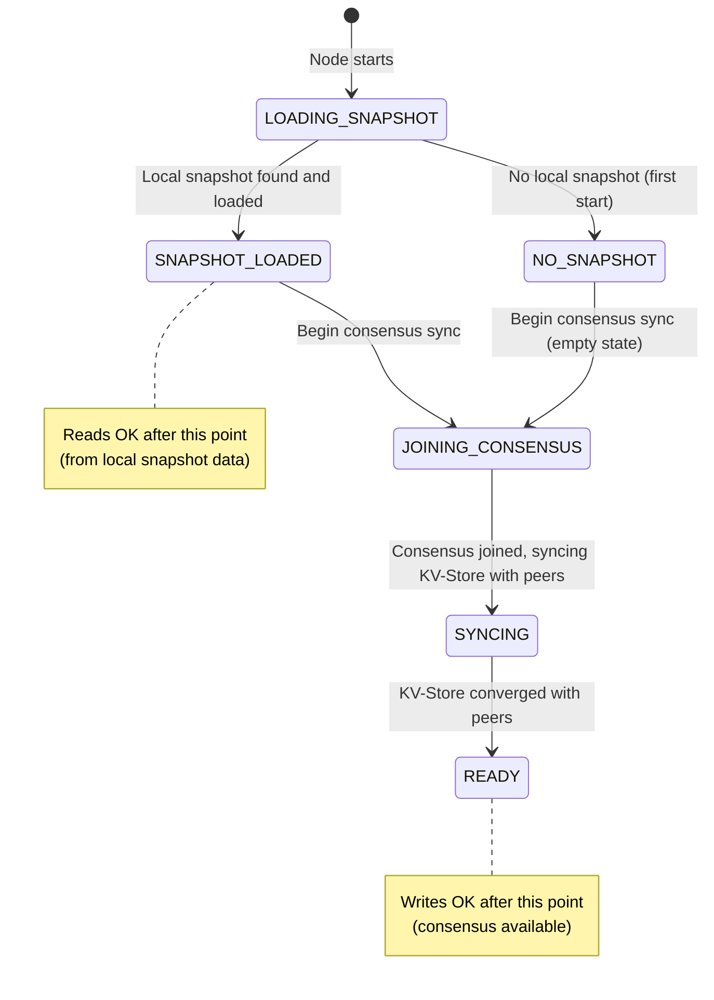

**Readiness gate sequence:**

1. **Load metadata snapshot from local disk.** Parse latest snapshot file. Populate in-memory metadata index. If no snapshot exists (first start), start with empty state.
2. **Join consensus, sync KV-Store with peers.** Connect to cluster. Participate in Rabia rounds. Receive and apply any metadata mutations that occurred while this node was down.
3. **Determine freshest snapshot (full cluster restart only).** Each node advertises its snapshot epoch via SWIM gossip. The node with the highest epoch has the freshest state. All nodes converge to the freshest snapshot.
4. **Accept storage operations.** Reads are allowed after step 1 (local snapshot provides enough data). Writes wait for step 2 (consensus must be available for metadata mutations).

**This is a readiness gate analogous to the existing CDM schema migration gate.** The node's `/health/ready` endpoint reflects storage readiness.

```java
/// Storage readiness gate. Blocks write operations until consensus is available.
/// Allows reads after local snapshot is loaded.
public interface StorageReadinessGate {

    /// True after local snapshot is loaded. Reads are safe.
    boolean isReadReady();

    /// True after consensus sync is complete. Writes are safe.
    boolean isWriteReady();

    /// Wait for read readiness.
    Promise<Unit> awaitReadReady();

    /// Wait for write readiness.
    Promise<Unit> awaitWriteReady();
}
```

### 7.7 Cardinality Analysis

| Storage Instance | Blocks (estimate) | KV Keys per block | Total KV Keys |
|-----------------|-------------------|-------------------|---------------|
| `stream-events` | 50,000 segments | 1 lifecycle + 1 ref | 100,000 |
| `attachments` | 10,000 files | 1 lifecycle + 1 ref | 20,000 |
| `artifacts` | 5,000 chunks | 1 lifecycle + 1 ref | 10,000 |
| `kv-snapshots` | 100 snapshots | 1 lifecycle + 1 ref | 200 |
| **Total** | | | **~130,000** |

This is within the consensus KV-Store budget. For clusters with significantly more blocks, the metadata store can be sharded by instance name across multiple KV-Store partitions (Phase 2 optimization).

---

## 8. Integration Points

### 8.1 Streaming (Phase 2)

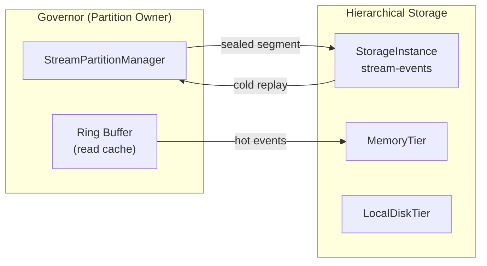

**Integration model:**

- The ring buffer remains the hot read cache for recent events.
- When a segment of the ring buffer is sealed (retention eviction), the sealed segment becomes an immutable block stored through the hierarchical storage instance `storage.stream-events`.
- Governor writes sealed segments to storage; workers read from storage for replay beyond the ring buffer window.
- Write policy is `write-behind` — matches the governor-append model where the ring buffer is the primary write target.
- Replaces the planned PostgreSQL data path for event persistence. PostgreSQL remains exclusively for transactional cursor commits (Phase 3 exactly-once semantics).

**Sealed segment block:**

```java
/// A sealed stream segment stored as a content-addressed block.
///
/// @param streamName the stream this segment belongs to
/// @param partitionIndex partition within the stream
/// @param startOffset first event offset in the segment (inclusive)
/// @param endOffset last event offset in the segment (inclusive)
/// @param eventCount number of events in the segment
/// @param events serialized event data
@Codec
public record SealedSegment(String streamName,
                            int partitionIndex,
                            long startOffset,
                            long endOffset,
                            int eventCount,
                            byte[] events) {}
```

The named reference for a sealed segment follows the pattern:
```
streams/{streamName}/{partitionIndex}/{startOffset}-{endOffset}
```

**Segment boundary policy:**

The ring buffer produces sealed segments based on a configurable `segment-size` threshold. A segment is sealed when either:
- The accumulated eviction candidates reach `segment-size` bytes (default: 1MB), or
- The accumulated eviction candidates reach `segment-max-events` count (default: 10,000 events), or
- A time-based flush interval fires (default: 30s) and there are pending eviction candidates

Whichever triggers first. This produces predictable block sizes for AHSE while handling both high-throughput (size/count trigger) and low-throughput (time trigger) streams.

```toml
[storage.stream-events]
segment-size = "1MB"
segment-max-events = 10000
segment-flush-interval = "30s"
```

### 8.2 ContentStore (#99)

Each `@ResourceQualifier(type = ContentStore.class, config = "storage.attachments")` maps to a storage instance.

```java
/// Content store API. Thin layer over hierarchical storage.
/// Injected as a resource via @ResourceQualifier.
public interface ContentStore {

    /// Store content. Returns a content ID (the BlockId hex).
    /// Small files: single block.
    /// Large files: chunked into blocks with a manifest block.
    Promise<ContentId> put(byte[] content, ContentType contentType);

    /// Store content from an InputStream (for large files).
    /// Automatically chunks into blocks of configured chunk-size.
    Promise<ContentId> put(InputStream content, ContentType contentType);

    /// Retrieve content by ID.
    Promise<Option<byte[]>> get(ContentId contentId);

    /// Get content metadata without retrieving the data.
    Promise<Option<ContentMetadata>> metadata(ContentId contentId);

    /// Delete content. Decrements ref count; actual deletion is via GC.
    Promise<Unit> delete(ContentId contentId);

    /// List all content IDs in this store.
    Promise<List<ContentId>> list();
}

/// Content identifier. Wraps a BlockId for single-block content,
/// or a manifest BlockId for chunked content.
@Codec
public record ContentId(String hex) {
    public static ContentId contentId(BlockId blockId) {
        return new ContentId(blockId.toHex());
    }
}

/// Content metadata.
@Codec
public record ContentMetadata(ContentId id,
                              long size,
                              ContentType contentType,
                              long createdAt,
                              boolean chunked,
                              int chunkCount) {}
```

**Chunking for large files:**

When content exceeds the configured `chunk-size`, it is split into chunks. Each chunk is stored as a separate content-addressed block. A manifest block records the chunk order:

```java
/// Manifest for chunked content. Stored as a content-addressed block itself.
/// The manifest's BlockId becomes the ContentId.
@Codec
public record ContentManifest(long totalSize,
                              ContentType contentType,
                              List<BlockId> chunks) {}
```

### 8.3 ArtifactStore Migration

**Current state:** Artifacts stored as 64KB chunks in DHT memory only (`StorageEngine`). Memory pressure from large/old artifacts. Periodic cleanup required.

**New state:** Artifacts flow through hierarchical storage:

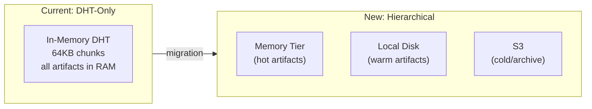

**Migration path:**

1. `ArtifactStore` is refactored to delegate to a `StorageInstance` named `storage.artifacts`.
2. Artifact coordinates (`groupId:artifactId:version`) become named references pointing to manifest blocks.
3. Each artifact's chunk list is stored as a `ContentManifest`.
4. Existing DHT put/get operations are replaced with `StorageInstance.put/get`.
5. The DHT's `StorageEngine` remains as the `MemoryTier` implementation — no data structure changes.

**Benefits:**

- Old/cold artifacts demote to disk and eventually S3 — no memory pressure.
- No periodic artifact repository cleanup needed.
- Deduplication across artifact versions sharing common classes.

### 8.4 KV-Store Backup

The existing `GitBackedPersistence` (git-based Rabia state persistence) can be augmented by hierarchical storage:

```java
/// KV-Store snapshots stored as content-addressed blocks.
/// Replaces or augments GitBackedPersistence.
final class StorageBackedPersistence<C extends Command> implements RabiaPersistence<C> {
    private final StorageInstance storageInstance;
    private final String snapshotRefPrefix;

    @Override
    public Result<Unit> saveState(SavedState<C> state) {
        var serialized = CodecUtil.serialize(state);
        return storageInstance.put(serialized, ContentType.BINARY)
            .flatMap(blockId -> storageInstance.createRef(
                snapshotRefPrefix + state.epoch(), blockId))
            .toResult();
    }

    @Override
    public Result<Option<SavedState<C>>> loadLatestState() {
        return storageInstance.listRefs(snapshotRefPrefix)
            .map(refs -> refs.stream()
                .max(Comparator.comparing(ref -> Long.parseLong(
                    ref.substring(snapshotRefPrefix.length()))))
                .flatMap(ref -> storageInstance.getByRef(ref).toOption()))
            .map(opt -> opt.map(block -> CodecUtil.deserialize(block.data())));
    }
}
```

---

## 9. Cross-Node Prefetching

### 9.1 Motivation

When governor topology changes (node join/leave, rebalancing), partitions may be reassigned to new governor nodes. If the new owner has no local copies of the blocks owned by that partition, every read becomes a cold-tier fetch (disk or S3). This creates a latency spike during rebalancing.

### 9.2 Prefetch Protocol

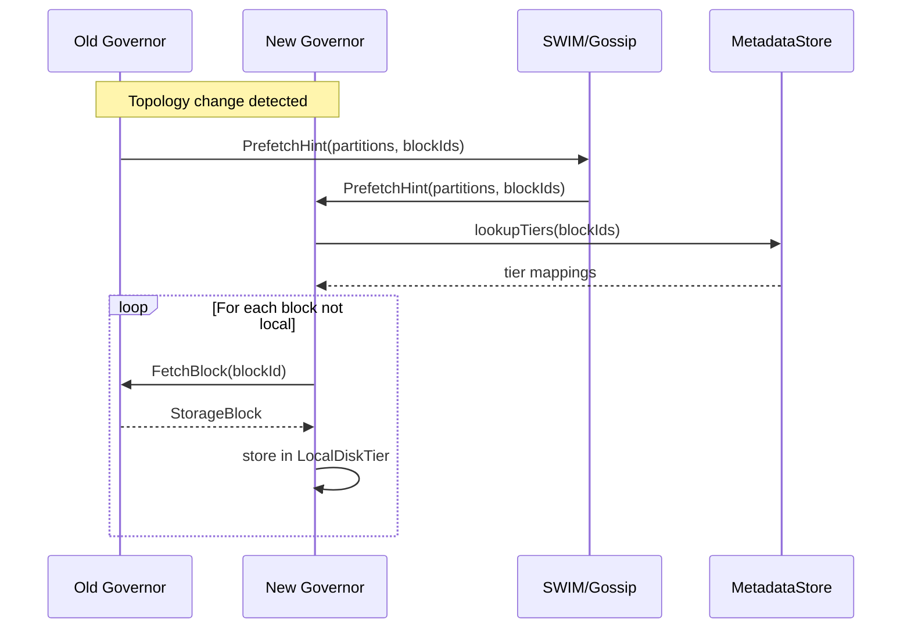

### 9.3 Prefetch Hints

Prefetch hints piggyback on existing SWIM gossip messages (similar to how membership changes piggyback on ping/ack). This avoids introducing a new communication channel.

```java
/// Prefetch hint sent via SWIM gossip when partition ownership changes.
@Codec
public record PrefetchHint(String instanceName,
                           List<Integer> partitions,
                           List<BlockId> blockIds,
                           NodeId sourceNode) {}
```

### 9.4 Prefetch Policies

| Policy | Behavior | Configuration |
|--------|----------|---------------|
| `EAGER` | Prefetch all blocks for reassigned partitions | `prefetch = "eager"` |
| `HOT_ONLY` | Prefetch only blocks accessed in last N minutes | `prefetch = "hot-only"` with `prefetch-window = "5m"` |
| `NONE` | No prefetching; rely on tier waterfall on demand | `prefetch = "none"` |

**Default:** `HOT_ONLY` with a 5-minute window. This balances prefetch bandwidth against cold-start latency.

### 9.5 Bandwidth Limiting

Prefetch traffic runs at background priority. It must not interfere with normal read/write traffic.

```toml
[storage.prefetch]
max-bandwidth = "50MB/s"         # per-node bandwidth cap for prefetch
max-concurrent = 4               # max concurrent prefetch transfers
priority = "background"          # background | normal
```

---

## 10. Observability

### 10.1 Per-Tier Metrics

| Metric | Type | Labels | Description |
|--------|------|--------|-------------|
| `storage.tier.get.count` | Counter | `instance`, `tier`, `result` | Total get operations (hit/miss) |
| `storage.tier.get.latency` | Timer | `instance`, `tier` | Get latency (P50/P95/P99) |
| `storage.tier.put.count` | Counter | `instance`, `tier` | Total put operations |
| `storage.tier.put.latency` | Timer | `instance`, `tier` | Put latency |
| `storage.tier.delete.count` | Counter | `instance`, `tier` | Total delete operations |
| `storage.tier.hit.rate` | Gauge | `instance`, `tier` | Hit rate (windowed) |
| `storage.tier.used.bytes` | Gauge | `instance`, `tier` | Current bytes used |
| `storage.tier.budget.bytes` | Gauge | `instance`, `tier` | Configured budget |
| `storage.tier.block.count` | Gauge | `instance`, `tier` | Number of blocks |

### 10.2 Promotion / Demotion Metrics

| Metric | Type | Labels | Description |
|--------|------|--------|-------------|
| `storage.promotion.count` | Counter | `instance`, `from_tier`, `to_tier` | Blocks promoted |
| `storage.promotion.latency` | Timer | `instance`, `from_tier`, `to_tier` | Promotion latency |
| `storage.demotion.count` | Counter | `instance`, `from_tier`, `to_tier` | Blocks demoted |
| `storage.demotion.latency` | Timer | `instance`, `from_tier`, `to_tier` | Demotion latency |
| `storage.demotion.queue.size` | Gauge | `instance` | Pending demotion queue depth |

### 10.3 Single-Flight Metrics

| Metric | Type | Labels | Description |
|--------|------|--------|-------------|
| `storage.singleflight.coalesced` | Counter | `instance` | Requests coalesced (saved fetches) |
| `storage.singleflight.inflight` | Gauge | `instance` | Current in-flight fetches |

### 10.4 Metadata & GC Metrics

| Metric | Type | Labels | Description |
|--------|------|--------|-------------|
| `storage.metadata.snapshot.count` | Counter | `node` | Snapshots taken |
| `storage.metadata.snapshot.latency` | Timer | `node` | Snapshot write latency |
| `storage.metadata.entries` | Gauge | `instance` | Total metadata entries |
| `storage.gc.collected.count` | Counter | `instance` | Blocks garbage collected |
| `storage.gc.collected.bytes` | Counter | `instance` | Bytes reclaimed by GC |
| `storage.gc.tombstone.count` | Gauge | `instance` | Blocks in tombstone state |

### 10.5 Integration

All metrics feed into the existing Aether metrics pipeline:

- Registered via Micrometer `MeterRegistry` (same as invocation metrics, JVM metrics).
- Exported via Prometheus endpoint (`/metrics`).
- Pushed to dashboard via existing WebSocket push (`/ws/status`).
- Per-storage-instance breakdown in the Management Dashboard.

---

## 11. Error Handling

### 11.1 StorageError Cause Hierarchy

All storage errors are modeled as a sealed `Cause` type hierarchy, following JBCT conventions. All operations return `Promise<T>` — never throw, never wrap in `Result` inside a `Promise`.

```java
/// Sealed error cause hierarchy for hierarchical storage operations.
/// Extends Cause for integration with Promise error handling.
@Codec
public sealed interface StorageError extends Cause {

    /// Block not found in any tier.
    record BlockNotFound(BlockId blockId,
                         String instanceName) implements StorageError {
        @Override
        public String message() {
            return "Block not found: " + blockId.toHex()
                   + " in instance " + instanceName;
        }
    }

    /// A storage tier is unavailable (disk full, S3 unreachable, etc.).
    record TierUnavailable(TierType tier,
                           String reason) implements StorageError {
        @Override
        public String message() {
            return "Tier " + tier + " unavailable: " + reason;
        }
    }

    /// Block data corruption detected (hash mismatch on read).
    record CorruptBlock(BlockId blockId,
                        TierType tier,
                        byte[] expectedHash,
                        byte[] actualHash) implements StorageError {
        @Override
        public String message() {
            return "Corrupt block " + blockId.toHex() + " in tier " + tier
                   + ": hash mismatch";
        }
    }

    /// Storage instance quota exceeded.
    record QuotaExceeded(String instanceName,
                         TierType tier,
                         long budgetBytes,
                         long usedBytes) implements StorageError {
        @Override
        public String message() {
            return "Quota exceeded for " + instanceName + " tier " + tier
                   + ": " + usedBytes + "/" + budgetBytes + " bytes";
        }
    }

    /// Write operation timed out.
    record WriteTimeout(BlockId blockId,
                        TierType tier,
                        TimeSpan timeout) implements StorageError {
        @Override
        public String message() {
            return "Write timeout for block " + blockId.toHex()
                   + " to tier " + tier + " after " + timeout;
        }
    }

    /// Failed to offload block from hot tier to cold tier.
    record OffloadFailed(BlockId blockId,
                         TierType sourceTier,
                         TierType targetTier,
                         Cause underlying) implements StorageError {
        @Override
        public String message() {
            return "Offload failed for block " + blockId.toHex()
                   + " from " + sourceTier + " to " + targetTier
                   + ": " + underlying.message();
        }
    }

    /// Metadata snapshot failed.
    record SnapshotFailed(long epoch,
                          Cause underlying) implements StorageError {
        @Override
        public String message() {
            return "Snapshot failed at epoch " + epoch
                   + ": " + underlying.message();
        }
    }

    /// Metadata store is corrupted or inconsistent.
    record MetadataCorrupted(String instanceName,
                             String detail) implements StorageError {
        @Override
        public String message() {
            return "Metadata corrupted for " + instanceName + ": " + detail;
        }
    }
}
```

### 11.2 Error Handling Patterns

```java
// All operations return Promise<T>, never throw.
// No nested error channels: Promise<Result<T>> is FORBIDDEN.

// Correct:
Promise<StorageBlock> block = storageInstance.get(blockId);

// Correct error handling:
storageInstance.get(blockId)
    .onFailure(cause -> {
        switch (cause) {
            case StorageError.BlockNotFound e -> log.warn("Block not found: {}", e.blockId());
            case StorageError.CorruptBlock e  -> log.error("Corrupt block: {}", e.blockId());
            case StorageError.TierUnavailable e -> log.warn("Tier down: {}", e.tier());
            default -> log.error("Storage error: {}", cause.message());
        }
    });

// FORBIDDEN — never do this:
// Promise<Result<StorageBlock>> — double error channel
// Promise<Option<Result<StorageBlock>>> — triple nesting
```

---

## 12. Configuration Model

### 12.1 Configuration Hierarchy

Storage configuration lives in the blueprint's `resources.toml` or in `aether.toml` for cluster-wide defaults.

```toml
# Cluster-wide defaults in aether.toml
[storage.defaults]
compression = "lz4"
chunk-size = "256KB"
local.base-path = "/data/aether"

# Per-instance overrides in blueprint resources.toml
[storage.stream-events]
compression = "zstd"             # overrides default
chunk-size = "512KB"             # overrides default
```

### 12.2 Environment-Aware Defaults

| Setting | LOCAL | DOCKER | KUBERNETES |
|---------|-------|--------|------------|
| `local.base-path` | `./data/aether` | `/data/aether` | `/data/aether` |
| `memory.max-bytes` | `128MB` | `256MB` | `512MB` |
| `local.max-bytes` | `5GB` | `10GB` | `50GB` |
| `s3.enabled` | `false` | `false` | `true` |
| `snapshot-max-interval` | `30s` | `60s` | `60s` |

### 12.3 Consumer-Type Presets

Sensible defaults for each consumer type:

```toml
# Streaming preset
[storage.presets.streaming]
chunk-size = "256KB"
compression = "lz4"
write-policy = "write-behind"
memory.eviction = "age"
promotion-policy = "never"       # streaming is append-only, no re-reads

# Content preset
[storage.presets.content]
chunk-size = "1MB"
compression = "zstd"
write-policy = "write-through"
memory.eviction = "lru"
promotion-policy = "frequency-threshold"
promotion-threshold = 3

# Artifact preset
[storage.presets.artifact]
chunk-size = "64KB"
compression = "lz4"
write-policy = "write-through"
memory.eviction = "lfu"
promotion-policy = "always"
```

Usage:

```toml
[storage.stream-events]
preset = "streaming"             # inherit streaming defaults
memory.max-bytes = "512MB"       # override specific values
```

### 12.4 Full Configuration Reference

| Property | Type | Default | Description |
|----------|------|---------|-------------|
| `chunk-size` | size string | `256KB` | Maximum block size for chunking |
| `compression` | string | `lz4` | Compression codec: `none`, `lz4`, `zstd` |
| `encryption` | string | `none` | Encryption: `none`, `aes-256-gcm` |
| `tiers` | string array | `["memory", "local"]` | Enabled tiers in priority order |
| `write-policy` | string | `write-through` | `write-through` or `write-behind` |
| `promotion-policy` | string | `always` | `always`, `frequency-threshold`, `never` |
| `promotion-threshold` | int | `3` | Access count before promotion (for `frequency-threshold`) |
| `memory.max-bytes` | size string | `256MB` | Memory tier budget |
| `memory.eviction` | string | `lru` | Eviction strategy: `age`, `lfu`, `lru`, `size-pressure` |
| `local.path` | string | `{base-path}/{instance}` | Local disk path |
| `local.max-bytes` | size string | `10GB` | Local disk budget |
| `local.retention` | duration | `30d` | Max age for blocks on local disk |
| `s3.bucket` | string | (required if s3 tier) | S3 bucket name |
| `s3.prefix` | string | `""` | Key prefix within the S3 bucket |
| `s3.region` | string | (from env) | AWS region |
| `s3.endpoint` | string | (AWS default) | Custom endpoint (MinIO, GCS) |
| `s3.retention` | duration | `365d` | Max age for blocks in S3 |
| `replication.memory` | int | `3` | Replication factor for memory tier (DHT quorum) |
| `replication.local` | int | `1` | Replication factor for local disk (1 = node-local) |
| `replication.s3` | int | `1` | Replication factor for S3 (1 = S3 handles durability) |

---

## 13. Security

### 13.1 Encryption

Per-instance encryption configuration. Encryption is applied after compression, before storage. The `EncryptionParams` record in `BlockMetadata` records the algorithm, IV, and key ID used.

```java
/// Encryption service for storage blocks.
/// Delegates to SecretsProvider for key material.
public interface StorageEncryption {

    /// Encrypt block data. Returns encrypted bytes and encryption params.
    Promise<EncryptedData> encrypt(byte[] data, String keyId);

    /// Decrypt block data using the encryption params from block metadata.
    Promise<byte[]> decrypt(byte[] encryptedData, EncryptionParams params);

    record EncryptedData(byte[] data, EncryptionParams params) {}
}
```

### 13.2 Key Management

Encryption keys are resolved via the existing `SecretsProvider` SPI:

```toml
[storage.attachments]
encryption = "aes-256-gcm"
encryption-key = "${secrets:storage/attachments/encryption-key}"
```

The `${secrets:...}` placeholder is resolved by `EnvironmentIntegration` at startup, supporting:

- AWS Secrets Manager (`AwsSecretsProvider`)
- GCP Secret Manager (`GcpSecretsProvider`)
- Azure Key Vault (`AzureSecretsProvider`)
- Environment variables (`EnvSecretsProvider`)
- File-based secrets (`FileSecretsProvider`)

### 13.3 S3 Credentials

S3 credentials follow the standard cloud provider chain:

- Environment variables (`AWS_ACCESS_KEY_ID`, `AWS_SECRET_ACCESS_KEY`)
- Instance metadata (EC2 IAM role, GKE workload identity)
- `${secrets:...}` placeholders in configuration

### 13.4 Block Integrity

Every read recomputes the SHA-256 hash of the decrypted, decompressed content and compares to the `BlockId`. This detects:

- Bit rot on disk
- Corruption in transit from S3
- Tampering (if encryption is enabled, tampering also fails decryption)

---

## 14. Garbage Collection

### 14.1 Reference Counting

The MetadataStore tracks the reference count for each block via `BlockLifecycle.refCount`. Named references (artifact coordinates, content IDs, stream segment offsets) increment the count when created and decrement when deleted.

### 14.2 GC Process

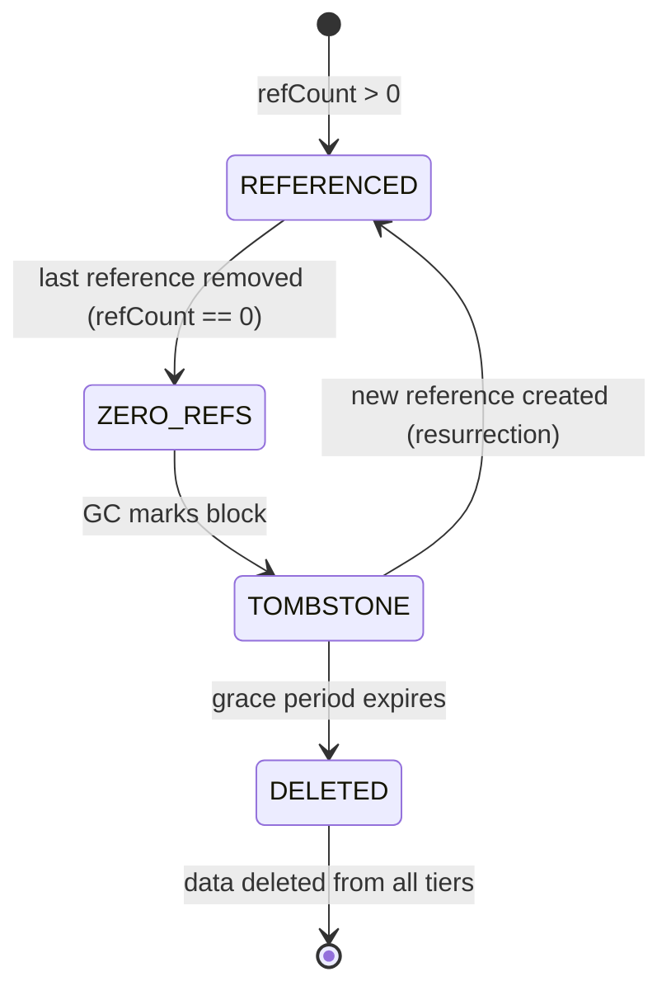

### 14.3 Tombstone Grace Period

When a block's reference count drops to zero, it is not immediately deleted. A tombstone is set with a configurable grace period. This prevents race conditions where:

1. Thread A decrements refCount to 0.
2. Thread B creates a new reference to the same block (deduplication hit).
3. GC deletes the block between steps 1 and 2.

**Configuration:**

```toml
[storage.gc]
grace-period = "1h"              # tombstone grace period before deletion
scan-interval = "5m"             # GC scan frequency
max-batch-size = 500             # max blocks deleted per GC cycle
```

### 14.4 GC Distribution

GC is distributed: each node handles blocks it owns (determined by DHT ring position for memory-tier blocks, or local disk for disk-tier blocks). S3 GC is coordinated — a single leader node runs S3 cleanup to avoid redundant LIST operations.

```java
/// Garbage collector for hierarchical storage.
/// Runs as a background scheduled task.
final class StorageGarbageCollector {

    /// Scan for tombstoned blocks with expired grace period.
    /// Delete from all tiers.
    Promise<GCResult> collectGarbage() {
        return metadataStore.listTombstoned(instanceName, gracePeriod)
            .flatMap(candidates -> {
                var deletions = candidates.stream()
                    .map(this::deleteFromAllTiers)
                    .toList();
                return Promise.all(deletions)
                    .map(results -> GCResult.gcResult(results.size(),
                        results.stream().mapToLong(BlockLifecycle::rawSize).sum()));
            });
    }

    private Promise<Unit> deleteFromAllTiers(BlockLifecycle lifecycle) {
        var tierDeletions = lifecycle.tiers().stream()
            .map(tier -> getTier(tier).delete(lifecycle.blockId()))
            .toList();
        return Promise.all(tierDeletions)
            .flatMap(_ -> metadataStore.deleteLifecycle(instanceName, lifecycle.blockId()));
    }

    @Codec
    record GCResult(int blocksCollected, long bytesReclaimed) {
        static GCResult gcResult(int blocks, long bytes) {
            return new GCResult(blocks, bytes);
        }
    }
}
```

---

## 15. API Design

### 15.1 StorageInstance (Primary API)

```java
/// A storage instance provides content-addressed block storage
/// with configurable tiering, compression, encryption, and lifecycle management.
///
/// Each consumer (streaming, ContentStore, ArtifactStore) gets its own instance
/// with independent configuration.
///
/// Factory naming follows JBCT conventions.
public interface StorageInstance {

    /// Create a storage instance from configuration.
    static StorageInstance storageInstance(StorageInstanceConfig config,
                                          MetadataStore metadataStore,
                                          List<StorageTier> tiers) {
        return new HierarchicalStorageInstance(config, metadataStore, tiers);
    }

    /// Store raw content. Returns the content-addressed BlockId.
    /// Content is compressed and encrypted per instance configuration.
    /// Idempotent: storing identical content returns the same BlockId
    /// and increments the reference count.
    Promise<BlockId> put(byte[] content, ContentType contentType);

    /// Retrieve a block by its content hash.
    /// Tries tiers in latency order (memory -> disk -> S3).
    /// Verifies content hash on read.
    Promise<StorageBlock> get(BlockId blockId);

    /// Check if a block exists in any tier.
    Promise<Boolean> exists(BlockId blockId);

    /// Create a named reference pointing to a block.
    /// Increments the block's reference count.
    Promise<Unit> createRef(String referenceName, BlockId blockId);

    /// Resolve a named reference to its BlockId.
    Promise<Option<BlockId>> resolveRef(String referenceName);

    /// Delete a named reference. Decrements the block's reference count.
    /// The block itself is deleted by GC when refCount reaches zero.
    Promise<Unit> deleteRef(String referenceName);

    /// List all named references in this instance.
    Promise<List<String>> listRefs();

    /// List named references matching a prefix.
    Promise<List<String>> listRefs(String prefix);

    /// Get a block by named reference (convenience: resolveRef + get).
    Promise<Option<StorageBlock>> getByRef(String referenceName);

    /// Storage instance name (from configuration).
    String instanceName();

    /// Current utilization across all tiers.
    StorageUtilization utilization();

    /// Shutdown the storage instance and release resources.
    Promise<Unit> shutdown();
}
```

### 15.2 Supporting Types

```java
/// Storage instance configuration. Parsed from TOML.
@Codec
public record StorageInstanceConfig(
    String instanceName,
    long chunkSize,
    CompressionCodec compression,
    String encryption,
    List<TierType> tiers,
    MemoryTierConfig memoryConfig,
    LocalDiskTierConfig localConfig,
    RemoteTierConfig s3Config,
    ReplicationConfig replication,
    WritePolicy writePolicy,
    PromotionPolicy promotionPolicy,
    int promotionThreshold
) {
    public static StorageInstanceConfig storageInstanceConfig(String instanceName,
                                                              ConfigurationProvider config) {
        // Parse from TOML section "storage.{instanceName}"
        // ...
    }
}

@Codec
public record MemoryTierConfig(long maxBytes,
                               EvictionStrategy eviction) {}

@Codec
public record LocalDiskTierConfig(Path path,
                                  long maxBytes,
                                  TimeSpan retention) {}

@Codec
public record RemoteTierConfig(String bucket,
                               String prefix,
                               String region,
                               Option<String> endpoint,
                               TimeSpan retention) {}

@Codec
public record ReplicationConfig(int memory,
                                int local,
                                int s3) {}

@Codec
public enum WritePolicy {
    WRITE_THROUGH,
    WRITE_BEHIND;
}

/// Aggregate utilization across all tiers.
@Codec
public record StorageUtilization(
    String instanceName,
    List<TierUtilization> tiers,
    long totalBlocks,
    long totalBytes
) {}

/// Per-tier utilization.
@Codec
public record TierUtilization(
    TierType tier,
    long usedBytes,
    long budgetBytes,
    long blockCount,
    double hitRate
) {}

/// Content type for stored blocks.
@Codec
public record ContentType(String mimeType) {
    public static final ContentType BINARY = new ContentType("application/octet-stream");
    public static final ContentType JAR = new ContentType("application/java-archive");
    public static final ContentType JSON = new ContentType("application/json");

    public static ContentType contentType(String mimeType) {
        return new ContentType(mimeType);
    }
}
```

### 15.3 Tier Implementations

```java
/// Memory tier backed by the existing DHT StorageEngine.
/// Reuses DHT infrastructure with zero new data structures.
public final class MemoryTier implements StorageTier {

    private final StorageEngine storageEngine;
    private final long maxBytes;
    private final EvictionStrategy evictionStrategy;

    public static MemoryTier memoryTier(StorageEngine storageEngine,
                                         MemoryTierConfig config) {
        return new MemoryTier(storageEngine, config.maxBytes(), config.eviction());
    }

    @Override
    public TierType tierType() { return TierType.MEMORY; }

    @Override
    public Promise<Option<StorageBlock>> get(BlockId blockId) {
        return storageEngine.get(blockId.hash())
            .map(opt -> opt.map(bytes -> CodecUtil.deserialize(bytes, StorageBlock.class)));
    }

    @Override
    public Promise<Unit> put(StorageBlock block) {
        var serialized = CodecUtil.serialize(block);
        return storageEngine.put(block.id().hash(), serialized);
    }

    @Override
    public Promise<Boolean> delete(BlockId blockId) {
        return storageEngine.remove(blockId.hash());
    }

    @Override
    public Promise<Boolean> exists(BlockId blockId) {
        return storageEngine.exists(blockId.hash());
    }

    // ... utilization, shutdown
}

/// Local disk tier. Stores blocks in a directory tree sharded by block ID prefix.
///
/// Directory layout:
///   {base-path}/{instance-name}/
///     ab/
///       cd/
///         abcdef0123456789...bin  (block data)
///
/// First 2 hex chars = first directory level.
/// Next 2 hex chars = second directory level.
/// Full hex = filename.
public final class LocalDiskTier implements StorageTier {

    private final Path basePath;
    private final long maxBytes;
    private final TimeSpan retention;

    public static LocalDiskTier localDiskTier(LocalDiskTierConfig config,
                                              String instanceName) {
        var basePath = config.path().resolve(instanceName);
        return new LocalDiskTier(basePath, config.maxBytes(), config.retention());
    }

    @Override
    public TierType tierType() { return TierType.LOCAL_DISK; }

    @Override
    public Promise<Option<StorageBlock>> get(BlockId blockId) {
        return Promise.runAsync(() -> {
            var path = blockPath(blockId);
            if (!Files.exists(path)) {
                return Option.<StorageBlock>none();
            }
            var bytes = Files.readAllBytes(path);
            return Option.some(CodecUtil.deserialize(bytes, StorageBlock.class));
        });
    }

    @Override
    public Promise<Unit> put(StorageBlock block) {
        return Promise.runAsync(() -> {
            var path = blockPath(block.id());
            Files.createDirectories(path.getParent());
            Files.write(path, CodecUtil.serialize(block));
            return Unit.unit();
        });
    }

    private Path blockPath(BlockId blockId) {
        var hex = blockId.toHex();
        return basePath.resolve(hex.substring(0, 2))
                       .resolve(hex.substring(2, 4))
                       .resolve(hex + ".bin");
    }

    // ... delete, exists, utilization, shutdown
}

/// Remote tier backed by S3-compatible object storage.
/// Uses async HTTP client for non-blocking operations.
public final class RemoteTier implements StorageTier {

    private final S3AsyncClient s3Client;
    private final String bucket;
    private final String prefix;
    private final TimeSpan retention;

    public static RemoteTier remoteTier(RemoteTierConfig config) {
        var clientBuilder = S3AsyncClient.builder()
            .region(Region.of(config.region()));
        config.endpoint().onPresent(ep ->
            clientBuilder.endpointOverride(URI.create(ep)));
        return new RemoteTier(clientBuilder.build(),
                              config.bucket(), config.prefix(),
                              config.retention());
    }

    @Override
    public TierType tierType() { return TierType.REMOTE_S3; }

    @Override
    public Promise<Option<StorageBlock>> get(BlockId blockId) {
        var key = s3Key(blockId);
        // ... async S3 GetObject
    }

    @Override
    public Promise<Unit> put(StorageBlock block) {
        var key = s3Key(block.id());
        // ... async S3 PutObject
    }

    private String s3Key(BlockId blockId) {
        var hex = blockId.toHex();
        return prefix + hex.substring(0, 2) + "/" + hex.substring(2, 4) + "/" + hex;
    }

    // ... delete, exists, utilization, shutdown
}
```

---

## 16. Phased Implementation Plan

### Phase 1: Foundation

**Target:** Core abstractions operational. Memory and disk tiers working. Metadata snapshotting. ArtifactStore migration.

| Item | Description | Effort |
|------|-------------|--------|
| `BlockId`, `StorageBlock`, `BlockMetadata` | Core value types with `@Codec` | S |
| `StorageTier` sealed interface | Tier abstraction | S |
| `MemoryTier` | Backed by existing `StorageEngine` | M |
| `LocalDiskTier` | File-system backed, sharded directory layout | M |
| `MetadataStore` | KV-Store backed, `BlockLifecycle` tracking | L |
| `SnapshotManager` | Automatic metadata snapshotting to local disk | M |
| `StorageReadinessGate` | Startup sequence / readiness integration | M |
| `StorageInstance` | Primary API, write-through policy only | L |
| `SingleFlightCache` | Deduplication of concurrent reads | S |
| `StorageError` | Sealed error hierarchy | S |
| `StorageInstanceConfig` | TOML parsing, environment-aware defaults | M |
| ArtifactStore migration | Delegate to `StorageInstance` | L |
| Unit + integration tests | Per-tier, waterfall, metadata snapshot | L |

**Milestone:** Artifacts flow through hierarchical storage. Old artifacts demote to disk. Metadata survives node restart via snapshots.

### Phase 2: Remote Tier & ContentStore

**Target:** S3 tier operational. ContentStore (#99) implemented. Demotion policies active. Cross-node prefetching.

| Item | Description | Effort |
|------|-------------|--------|
| `RemoteTier` | S3/MinIO/GCS async client | L |
| `ContentStore` | User-facing API with chunking and manifests | L |
| `DemotionManager` | Background demotion with all eviction strategies | M |
| `StorageGarbageCollector` | Reference counting, tombstone, distributed GC | L |
| Cross-node prefetching | SWIM-piggybacked prefetch hints | M |
| Write-behind policy | Memory-first write path | M |
| Integration tests | S3 tier (MinIO in Docker), GC correctness | L |

**Milestone:** ContentStore available for slice developers. Artifacts demote through all three tiers. GC prevents orphaned blobs.

### Phase 3: Streaming Integration & Security

**Target:** Streaming Phase 2 persistence path. Encryption. Compression pipeline.

| Item | Description | Effort |
|------|-------------|--------|
| Streaming integration | Sealed segments as storage blocks | L |
| `StorageEncryption` | AES-256-GCM with SecretsProvider | M |
| Compression pipeline | LZ4/ZSTD compress/decompress in write/read path | M |
| Promotion policies | `FREQUENCY_THRESHOLD`, access-count tracking | M |
| `StorageBackedPersistence` | KV-Store backup via hierarchical storage | M |
| E2E tests | Streaming persistence, encryption round-trip | L |

**Milestone:** Streaming events persist beyond ring buffer lifetime. Encryption protects data at rest.

### Phase 4: Observability & Polish

**Target:** Full metrics, dashboard integration, performance tuning.

| Item | Description | Effort |
|------|-------------|--------|
| Metrics registration | All metrics from Section 10 | M |
| Dashboard integration | Storage tab in Management Dashboard | L |
| Quota management | Hard limits with `QuotaExceeded` errors | M |
| Configuration presets | Streaming/content/artifact presets | S |
| Performance tuning | Benchmark, tune batch sizes, concurrency | L |
| Chaos tests | Kill nodes during offload, verify no data loss | L |

**Milestone:** Production-ready hierarchical storage with full observability.

---

## 17. Testing Strategy

### 17.1 Unit Tests

| Test | Description |
|------|-------------|
| `BlockIdTest` | SHA-256 computation, hex encoding, shard prefix extraction |
| `StorageBlockTest` | Construction, serialization round-trip via `@Codec` |
| `MemoryTierTest` | put/get/delete/exists against in-memory `StorageEngine` |
| `LocalDiskTierTest` | put/get/delete/exists against temp directory, directory sharding |
| `RemoteTierTest` | put/get/delete against MinIO in testcontainers |
| `SingleFlightCacheTest` | Concurrent access to same block, deduplication verification |
| `DemotionManagerTest` | Eviction candidate selection for each strategy (AGE, LFU, LRU, SIZE_PRESSURE) |
| `SnapshotManagerTest` | Mutation threshold trigger, time trigger, snapshot write/read, rolling window pruning |
| `StorageGarbageCollectorTest` | Tombstone lifecycle, grace period expiry, concurrent reference creation |
| `StorageEncryptionTest` | Encrypt/decrypt round-trip, key rotation |
| `CompressionPipelineTest` | Compress/decompress round-trip for each codec |

### 17.2 Integration Tests

| Test | Description |
|------|-------------|
| `TierWaterfallTest` | Block stored in cold tier, read triggers waterfall, promotion verified |
| `WriteThroughTest` | Write lands on disk first, then promoted to memory |
| `WriteBehindTest` | Write lands in memory first, async flush to disk verified |
| `PromotionPolicyTest` | `ALWAYS` vs `FREQUENCY_THRESHOLD` vs `NEVER` behavior |
| `DemotionIntegrationTest` | Capacity exceeded triggers demotion, block moves to colder tier |
| `MetadataSnapshotRecoveryTest` | Kill metadata store, restore from snapshot, verify block accessibility |
| `ContentStoreChunkingTest` | Large file chunked, manifest created, reassembled on read |
| `ArtifactStoreMigrationTest` | Existing artifact upload/download through hierarchical storage |
| `DeduplicationTest` | Same content stored twice, refCount incremented, single block stored |

### 17.3 E2E Tests

| Test | Description |
|------|-------------|
| `ClusterRestartRecoveryTest` | Full cluster shutdown, restart, metadata snapshots converge, blocks accessible |
| `StreamingPersistenceTest` | Stream events persist via sealed segments, replay beyond ring buffer window |
| `CrossNodePrefetchTest` | Governor topology change, prefetch hints sent, blocks transferred, no cold-start spike |
| `GCDistributedTest` | Multiple nodes run GC concurrently, no double-delete, orphaned blocks cleaned |

### 17.4 Property-Based Tests

| Property | Description |
|----------|-------------|
| Content-addressable invariant | `forAll content: put(content).flatMap(id -> get(id).map(block -> SHA256(block.data) == id.hash))` |
| Deduplication invariant | `forAll content: put(content); put(content) => blockCount unchanged, refCount == 2` |
| Tier waterfall invariant | `forAll block in any tier: get(block.id) succeeds` |
| Snapshot consistency | `forAll sequence of mutations: snapshot + restore => same metadata state` |

### 17.5 Chaos Tests

| Test | Description |
|------|-------------|
| Kill during demotion | Kill node while block is being copied to cold tier. Verify block exists in at least one tier. |
| Kill during GC | Kill node during garbage collection. Verify no premature deletion. |
| S3 outage simulation | Block S3 access. Verify reads fall back to local disk. Verify demotions queue and retry. |
| Disk full simulation | Fill local disk. Verify `QuotaExceeded` error. Verify memory tier continues working. |
| Corrupt block injection | Write corrupted bytes to local disk. Verify read detects corruption and falls through to next tier. |

---

## 18. Decision Log

### DD-1: Content Addressing vs. Location Addressing

**Context:** How are blocks identified?

| Option | Description | Pros | Cons |
|--------|-------------|------|------|
| **A: Content-addressed (SHA-256)** | Block ID = hash of content | Free deduplication. Immutable by definition. Integrity verification built-in. | Hash computation cost on every write. |
| **B: UUID/sequence-based** | Block ID = random UUID or monotonic sequence | Fast ID generation. No hash computation. | No deduplication. No integrity verification. Mutable blocks possible (complexity). |

**Decision: Option A.** Content addressing gives deduplication, integrity, and immutability as inherent properties. SHA-256 computation is ~500MB/s on modern hardware — negligible compared to disk/network I/O.

### DD-2: Metadata Store Location

**Context:** Where does the block-to-tier mapping live?

| Option | Description | Pros | Cons |
|--------|-------------|------|------|
| **A: Consensus KV-Store** | Metadata in Rabia KV-Store with local disk snapshots | Consistent across cluster. Survives node failures. Reuses existing infrastructure. | Consensus overhead for metadata mutations. Requires snapshotting for cluster restart. |
| **B: Dedicated embedded DB** | Metadata in RocksDB/LevelDB on each node | Fast local reads. No consensus overhead. | No cluster-wide consistency. Complex sync protocol needed. New dependency. |
| **C: Metadata in S3** | Metadata stored alongside data in S3 | Self-contained. No local state. | Circular dependency for S3 tier. Slow metadata reads. |

**Decision: Option A.** Reuses existing consensus infrastructure. Snapshotting solves the cluster restart problem. Metadata mutations are infrequent relative to data reads (block lifecycle changes are rare compared to block access). KV-Store cardinality is within budget (~130K keys for typical deployments).

### DD-3: Write Policy Flexibility

**Context:** Should write-through or write-behind be the default?

| Option | Description | Risk | Latency |
|--------|-------------|------|---------|
| **A: Write-through only** | All writes go to disk first | None (durable at ACK) | Higher |
| **B: Write-behind only** | All writes go to memory first | Data loss if node crashes before flush | Lower |
| **C: Configurable per instance** | Consumer chooses based on use case | None if configured correctly | Depends |

**Decision: Option C.** Different consumers have different durability/latency tradeoffs. Streaming benefits from write-behind (matches governor-append model). ContentStore needs write-through (user expects durability). Configuration per instance gives full flexibility.

### DD-4: Snapshot Trigger Policy

**Context:** How often should metadata be snapshotted?

| Option | Description | Pros | Cons |
|--------|-------------|------|------|
| **A: Mutation count only** | Snapshot every N mutations | Adapts to write rate | Long quiet periods with no snapshot |
| **B: Time interval only** | Snapshot every T seconds | Predictable | Unnecessary snapshots during low activity |
| **C: Dual condition (either triggers)** | Snapshot on N mutations OR T seconds | Adapts to write rate AND guarantees bounded staleness | Slightly more complex |

**Decision: Option C.** The dual condition ensures metadata is never more than T seconds stale (time trigger) while also capturing bursts of mutations (count trigger). This is the same approach used by Redis RDB persistence.

### DD-5: GC Tombstone Strategy

**Context:** How to handle race conditions between reference deletion and block creation?

| Option | Description | Pros | Cons |
|--------|-------------|------|------|
| **A: Immediate deletion** | Delete block when refCount hits zero | Simple | Race condition: concurrent put + delete can lose data |
| **B: Tombstone with grace period** | Mark for deletion, wait, then delete | Race-safe. Resurrection possible. | Delayed space reclamation. Tombstone storage overhead. |
| **C: Epoch-based reclamation** | Track reader epochs, delete when no readers | Zero delay. Precise. | Complex. Requires epoch tracking across cluster. |

**Decision: Option B.** Tombstone with configurable grace period (default 1 hour). Simple, proven approach (used by Cassandra, CockroachDB). Space overhead is minimal — tombstone metadata is small. One hour grace period is generous enough to prevent any realistic race condition.

### DD-6: Tier Implementation for Memory

**Context:** Should the memory tier use the existing DHT `StorageEngine` or a new data structure?

| Option | Description | Pros | Cons |
|--------|-------------|------|------|
| **A: Reuse `StorageEngine`** | Memory tier delegates to the existing DHT storage engine | Zero new data structures. DHT replication for free. Consistent with existing architecture. | StorageEngine is byte[]-keyed, not typed. Serialization overhead. |
| **B: New in-memory store** | Purpose-built ConcurrentHashMap-based store | Type-safe. No serialization for in-process reads. | New infrastructure to maintain. No DHT replication. Duplicates existing capability. |

**Decision: Option A.** Reusing `StorageEngine` means the memory tier inherits DHT replication (configurable RF), anti-entropy repair, and rebalancing. The serialization overhead is negligible compared to network I/O. This keeps the architecture simple — the DHT becomes the hot cache layer, which is exactly the design goal.

### DD-7: S3 Client Choice

**Context:** Which S3 client to use?

| Option | Description | Pros | Cons |
|--------|-------------|------|------|
| **A: AWS SDK v2 async** | `S3AsyncClient` from aws-sdk-java-v2 | Official. Feature-complete. Non-blocking. | Large dependency tree. AWS-centric. |
| **B: MinIO Java SDK** | MinIO's Java client | S3-compatible. Lighter weight. | Synchronous (wrapping needed). Less ecosystem support. |
| **C: Custom HTTP client** | Build S3 API calls on Netty HTTP | Minimal dependencies. Full control. | Significant effort. S3 signing is complex. |

**Decision: Option A.** AWS SDK v2 async client is the standard for production S3 access. It supports custom endpoints (MinIO, GCS in S3-compatible mode). The dependency tree is manageable with BOM imports. Non-blocking fits Aether's async model.

---

## References

### Internal
- [Streaming Implementation Spec](streaming-spec.md) — Phase 1 streaming implementation (this spec provides Phase 2 persistence path)
- [In-Memory Streams Design](in-memory-streams-spec.md) — Exploratory spec, Section 18 describes persistence path
- [DHT Storage Architecture](../architecture/09-storage.md) — Current DHT architecture being extended
- [StorageEngine Interface](../../../integrations/dht/src/main/java/org/pragmatica/dht/storage/StorageEngine.java) — Existing storage engine interface (becomes MemoryTier backend)
- [KVStore Implementation](../../../integrations/cluster/src/main/java/org/pragmatica/cluster/state/kvstore/KVStore.java) — Consensus KV-Store (MetadataStore backend)
- [AetherKey](../../../aether/slice/src/main/java/org/pragmatica/aether/slice/kvstore/AetherKey.java) — Structured key patterns (extended with storage keys)
- [AetherValue](../../../aether/slice/src/main/java/org/pragmatica/aether/slice/kvstore/AetherValue.java) — Structured value patterns
- [SecretsProvider](../../../aether/environment-integration/src/main/java/org/pragmatica/aether/environment/SecretsProvider.java) — SPI for encryption key management
- [GitBackedPersistence](../../../integrations/consensus/src/main/java/org/pragmatica/consensus/rabia/GitBackedPersistence.java) — Current consensus persistence (replaceable by StorageBackedPersistence)

### External
- [Content-Addressable Storage](https://en.wikipedia.org/wiki/Content-addressable_storage) — CAS design principles
- [AWS S3 SDK v2 Async](https://docs.aws.amazon.com/sdk-for-java/latest/developer-guide/asynchronous.html) — Async S3 client documentation
- [LZ4 Compression](https://lz4.org/) — Fast compression for real-time use
- [Zstandard (ZSTD)](https://facebook.github.io/zstd/) — High-ratio compression for cold storage
- [Redis RDB Persistence](https://redis.io/docs/management/persistence/) — Dual-trigger snapshot model (inspiration for Section 7.5)
