# Aether Architecture Diagrams

Visual diagrams for understanding Aether's distributed runtime architecture.

---

## 1. Runtime Topology (5-Node Cluster)

**Key Points:**
- **Leader node** runs active ClusterDeploymentManager, MetricsAggregator, and Cluster Controller
- **All nodes** run NodeDeploymentManager, MetricsCollector, EndpointRegistry
- **Consensus KV-Store** holds persistent state (blueprints, slice states, endpoints)
- **Metrics flow via MessageRouter** (dotted lines) - zero consensus I/O for metrics
- **Slices distributed** across nodes based on blueprint requirements

---

## 2. Request Flow

**Key Points:**
- **Any node** can receive external HTTP requests
- **EndpointRegistry** provides service discovery with load balancing
- **Local preference** - route to local slice if available
- **Transparent remoting** - caller doesn't know if slice is local or remote

---

## 3. Deployment & Scaling Flow

```mermaid
sequenceDiagram
    participant Op as Operator/AI
    participant API as Management API
    participant KV as Consensus KV-Store
    participant CDM as ClusterDeploymentManager<br/>(Leader)
    participant NDM as NodeDeploymentManager<br/>(Each Node)
    participant SS as SliceStore

    Op->>API: Deploy blueprint<br/>{slice: "order-service", instances: 3}
    API->>KV: Write blueprint<br/>blueprints/production
    KV-->>CDM: Blueprint change event

    CDM->>CDM: Allocation decision<br/>(round-robin across nodes)

    loop For each allocated node
        CDM->>KV: Write slice state<br/>slices/node-2/order-service → LOAD
        KV-->>NDM: Slice state change
        NDM->>SS: Load slice artifact
        SS-->>NDM: Loaded
        NDM->>KV: Update state → LOADED

        NDM->>KV: Request ACTIVATE
        KV-->>NDM: State change
        NDM->>SS: Activate slice
        SS-->>NDM: Active
        NDM->>KV: Update state → ACTIVE
        NDM->>KV: Register endpoints
    end

    CDM->>API: Deployment complete
    API-->>Op: Success
```

**Scaling Flow (AI-Driven):**

```mermaid
sequenceDiagram
    participant MC as MetricsCollector<br/>(All Nodes)
    participant MA as MetricsAggregator<br/>(Leader)
    participant CC as Cluster Controller<br/>(Leader)
    participant KV as Consensus KV-Store
    participant CDM as ClusterDeploymentManager

    loop Every 1 second
        MA->>MC: MetricsPing
        MC-->>MA: MetricsPong<br/>{cpu, calls, latency}
    end

    MA->>CC: Aggregated metrics snapshot

    CC->>CC: Evaluate patterns<br/>• CPU trending up<br/>• Latency increasing<br/>• Historical patterns

    CC->>KV: Update blueprint<br/>{instances: 3 → 5}

    KV-->>CDM: Blueprint change
    CDM->>CDM: Allocate 2 new instances
    Note over CDM: Normal deployment flow follows
```

**Key Points:**
- **Blueprint** is the desired state, **KV-Store** is the source of truth
- **ClusterDeploymentManager** (leader) allocates instances to nodes
- **NodeDeploymentManager** (each node) executes local slice lifecycle
- **Metrics flow continuously** without touching consensus
- **Controller evaluates** and can modify blueprints automatically

---

## 4. AI Autonomy Layers

**Escalation & Degradation:**

**Key Points:**
- **Layer 1 is mandatory** - cluster operates with decision tree alone
- **Higher layers are optional** - add intelligence, not dependency
- **Problems escalate up** - simple → complex → strategic → human
- **Decisions flow down** - strategic guidance → tactical execution → immediate action
- **Graceful degradation** - if any layer fails, lower layers continue

---

## 5. Slice Lifecycle State Machine

---

## Rendering These Diagrams

These Mermaid diagrams can be rendered using:

1. **GitHub** - Native Mermaid support in markdown files
2. **Mermaid Live Editor** - https://mermaid.live
3. **VS Code** - Mermaid preview extensions
4. **Export to PNG/SVG** - Via Mermaid CLI or live editor

For the architect call, recommend using Mermaid Live Editor to export high-quality PNGs.
