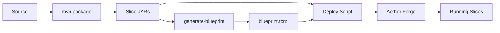

# Slice Deployment

Deploy slices to Aether environments using blueprints and deploy scripts.

## Deployment Architecture



## Blueprint Generation

### Automatic Generation

```bash
./generate-blueprint.sh
```

Or directly:
```bash
mvn package jbct:generate-blueprint -DskipTests
```

### What Blueprint Contains

```toml
# Generated by jbct:generate-blueprint
# Regenerate with: mvn jbct:generate-blueprint

id = "org.example:commerce:1.0.0"

[[slices]]
artifact = "org.example:inventory-service:1.0.0"
instances = 1
# transitive dependency

[[slices]]
artifact = "org.example:commerce-payment-service:1.0.0"
instances = 1

[[slices]]
artifact = "org.example:commerce-order-service:1.0.0"
instances = 1
```

### Topological Ordering

The blueprint lists slices in dependency order:
1. External dependencies first (transitive)
2. Local slices ordered by their internal dependencies
3. Dependents after their dependencies

This ensures Aether can start slices in the correct order.

### Custom Blueprint ID

```bash
mvn jbct:generate-blueprint -Djbct.blueprint.id="my-system:prod:2.0.0"
```

### Custom Output Location

```bash
mvn jbct:generate-blueprint -Djbct.blueprint.output=deploy/my-blueprint.toml
```

## Deploy Scripts

Generated by `jbct init --slice`:

| Script | Profile | Environment |
|--------|---------|-------------|
| `deploy-forge.sh` | `deploy-forge` | Local development Forge |
| `deploy-test.sh` | `deploy-test` | Test environment |
| `deploy-prod.sh` | `deploy-prod` | Production (with confirmation) |

### deploy-forge.sh

For local development:

```bash
#!/bin/bash
# Deploy to local Aether Forge
set -e

mvn clean package jbct:generate-blueprint -DskipTests
mvn deploy -P deploy-forge -DskipTests

echo "Deployed to Forge: http://localhost:8080"
```

### deploy-test.sh

For test environment:

```bash
#!/bin/bash
# Deploy to test environment
set -e

mvn clean verify jbct:generate-blueprint
mvn deploy -P deploy-test -DskipTests

echo "Deployed to test"
```

### deploy-prod.sh

For production (with safety confirmation):

```bash
#!/bin/bash
# Deploy to production
set -e

echo "WARNING: Deploying to PRODUCTION"
echo ""
read -p "Are you sure? (yes/no): " confirm

if [ "$confirm" != "yes" ]; then
    echo "Deployment cancelled"
    exit 1
fi

mvn clean verify jbct:generate-blueprint
mvn deploy -P deploy-prod -DskipTests

echo "Deployed to production"
```

## Environment Configuration

### POM Properties

Configure environment URLs in `pom.xml`:

```xml
<properties>
    <aether.forge.url>http://localhost:8080</aether.forge.url>
    <aether.test.url>http://test.aether.example.com:8080</aether.test.url>
    <aether.prod.url>http://prod.aether.example.com:8080</aether.prod.url>
</properties>
```

### Maven Profiles

The generated pom.xml includes profiles for each environment:

```xml
<profiles>
    <profile>
        <id>deploy-forge</id>
        <properties>
            <aether.deploy.url>${aether.forge.url}</aether.deploy.url>
        </properties>
        <distributionManagement>
            <repository>
                <id>aether-forge</id>
                <url>${aether.forge.url}/deploy</url>
            </repository>
        </distributionManagement>
    </profile>

    <profile>
        <id>deploy-test</id>
        <properties>
            <aether.deploy.url>${aether.test.url}</aether.deploy.url>
        </properties>
        <distributionManagement>
            <repository>
                <id>aether-test</id>
                <url>${aether.test.url}/deploy</url>
            </repository>
        </distributionManagement>
    </profile>

    <profile>
        <id>deploy-prod</id>
        <properties>
            <aether.deploy.url>${aether.prod.url}</aether.deploy.url>
        </properties>
        <distributionManagement>
            <repository>
                <id>aether-prod</id>
                <url>${aether.prod.url}/deploy</url>
            </repository>
        </distributionManagement>
    </profile>
</profiles>
```

## Aether Forge

### What is Forge?

Aether Forge is the local development environment for slices:
- Runs slices locally
- Provides hot-reload on code changes
- Simulates cluster behavior
- Includes debugging tools

### Starting Forge

```bash
aether-forge start
```

Default port: 8080

### Forge Dashboard

Access at `http://localhost:8080`:
- View running slices
- Monitor slice health
- View request/response logs
- Inspect dependency graph

### Development Workflow

```bash
# Terminal 1: Start Forge
aether-forge start

# Terminal 2: Build and deploy
mvn verify && ./deploy-forge.sh

# Make changes, then redeploy
mvn verify && ./deploy-forge.sh
```

## Multi-Module Deployment

For projects with multiple slice modules:

```
parent/
├── pom.xml
├── inventory/
│   └── pom.xml
├── payments/
│   └── pom.xml
└── orders/
    └── pom.xml
```

### Aggregator Blueprint

Create a blueprint that includes all modules:

```bash
# From parent directory
mvn package -DskipTests

# Generate combined blueprint
cat > target/system-blueprint.toml << EOF
id = "org.example:commerce-system:1.0.0"

[[slices]]
artifact = "org.example:inventory-service:1.0.0"
instances = 2

[[slices]]
artifact = "org.example:payment-service:1.0.0"
instances = 1

[[slices]]
artifact = "org.example:order-service:1.0.0"
instances = 3
EOF
```

### Instance Scaling

Modify `instances` in blueprint for different environments:

```toml
# Development
[[slices]]
artifact = "org.example:order-service:1.0.0"
instances = 1

# Production
[[slices]]
artifact = "org.example:order-service:1.0.0"
instances = 5
```

## Dependency Resolution

### How External Dependencies are Resolved

1. **Build time**: Annotation processor records external dependencies in manifest
2. **Blueprint generation**: Reads manifests, recursively resolves transitive deps
3. **Deployment**: Aether Forge/runtime fetches JARs from Maven repository

### Dependency Version Sources

Priority order:
1. Explicit version in `slice-deps.properties`
2. Version from Maven dependency resolution
3. Error if unresolved

### slice-deps.properties

Generated by `jbct:collect-slice-deps`:

```properties
# Escaped colons in property keys
org.example\:inventory-service\:api=1.0.0
org.example\:pricing-engine\:api=2.1.0
```

## Deployment Verification

### Check Deployed Slices

```bash
curl http://localhost:8080/slices
```

Response:
```json
{
  "slices": [
    {
      "artifact": "org.example:order-service:1.0.0",
      "status": "running",
      "instances": 1
    }
  ]
}
```

### Health Check

```bash
curl http://localhost:8080/health
```

### Test Slice Endpoint

```bash
curl -X POST http://localhost:8080/invoke \
  -H "Content-Type: application/json" \
  -d '{
    "slice": "org.example:order-service:1.0.0",
    "method": "placeOrder",
    "request": {"customerId": "CUST-123", "items": []}
  }'
```

## Rollback

### Forge (Development)

```bash
# Redeploy previous version
git checkout v1.0.0
mvn verify && ./deploy-forge.sh
```

### Production

1. Deploy previous version:
```bash
git checkout v1.0.0
mvn verify && ./deploy-prod.sh
```

2. Or use Aether's rollback feature:
```bash
aether rollback org.example:order-service --to v1.0.0
```

## CI/CD Integration

### GitHub Actions Example

```yaml
name: Deploy

on:
  push:
    branches: [main]

jobs:
  deploy-test:
    runs-on: ubuntu-latest
    steps:
      - uses: actions/checkout@v4

      - uses: actions/setup-java@v4
        with:
          java-version: '21'
          distribution: 'temurin'

      - name: Build and Test
        run: mvn verify

      - name: Generate Blueprint
        run: mvn jbct:generate-blueprint

      - name: Deploy to Test
        run: mvn deploy -P deploy-test -DskipTests
        env:
          AETHER_TEST_URL: ${{ secrets.AETHER_TEST_URL }}

  deploy-prod:
    needs: deploy-test
    runs-on: ubuntu-latest
    if: github.ref == 'refs/heads/main'
    environment: production
    steps:
      - uses: actions/checkout@v4

      - uses: actions/setup-java@v4
        with:
          java-version: '21'
          distribution: 'temurin'

      - name: Build
        run: mvn package -DskipTests

      - name: Generate Blueprint
        run: mvn jbct:generate-blueprint

      - name: Deploy to Production
        run: mvn deploy -P deploy-prod -DskipTests
        env:
          AETHER_PROD_URL: ${{ secrets.AETHER_PROD_URL }}
```

### Jenkins Pipeline

```groovy
pipeline {
    agent any

    stages {
        stage('Build') {
            steps {
                sh 'mvn verify'
            }
        }

        stage('Generate Blueprint') {
            steps {
                sh 'mvn jbct:generate-blueprint'
                archiveArtifacts artifacts: 'target/blueprint.toml'
            }
        }

        stage('Deploy Test') {
            steps {
                sh 'mvn deploy -P deploy-test -DskipTests'
            }
        }

        stage('Deploy Prod') {
            when {
                branch 'main'
            }
            input {
                message 'Deploy to production?'
            }
            steps {
                sh 'mvn deploy -P deploy-prod -DskipTests'
            }
        }
    }
}
```
